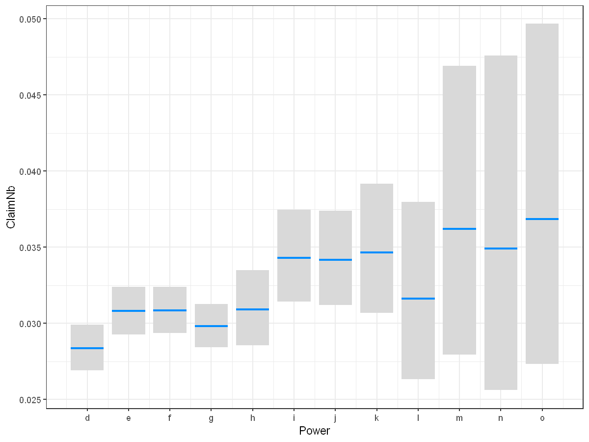
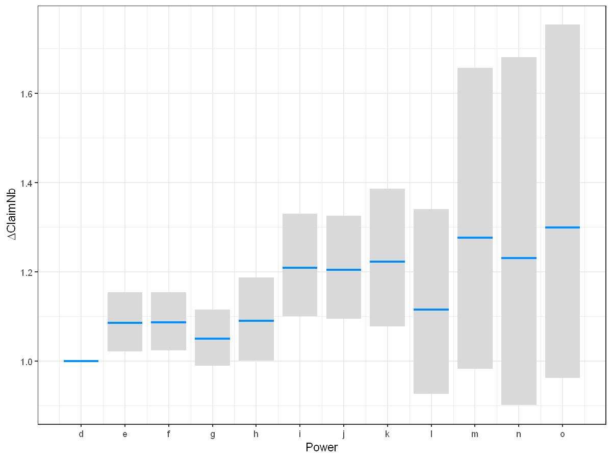
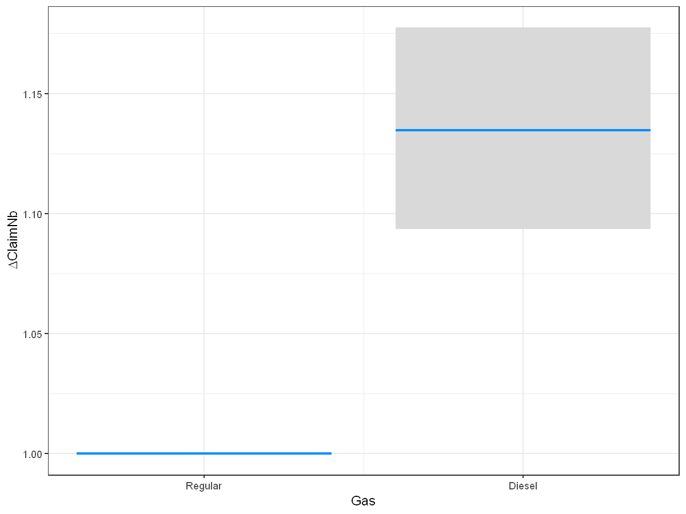
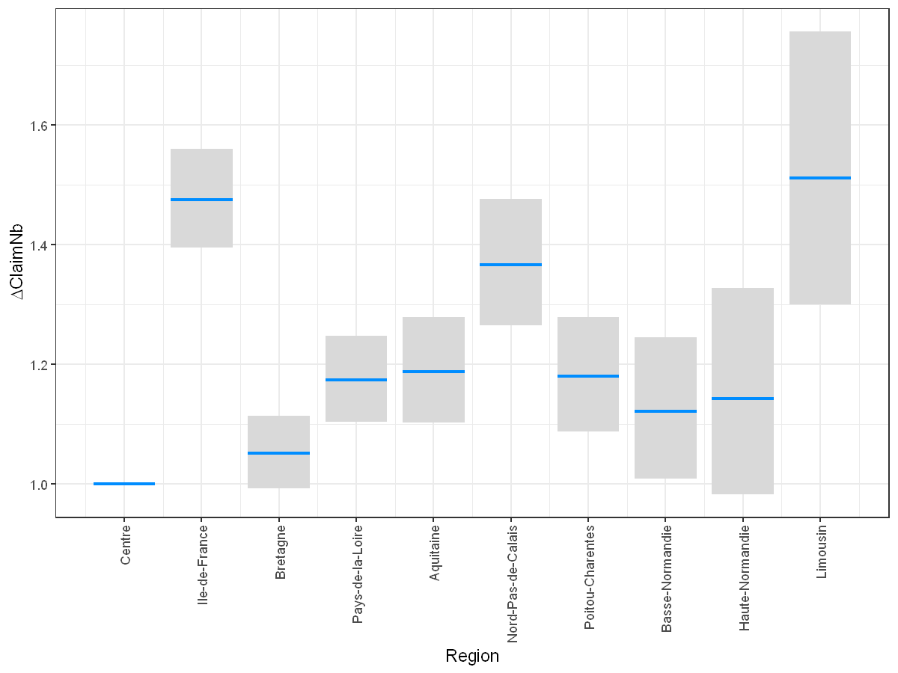
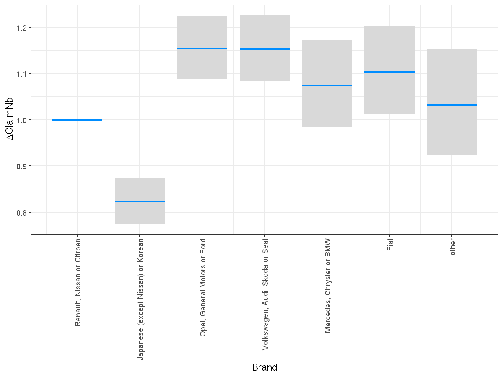
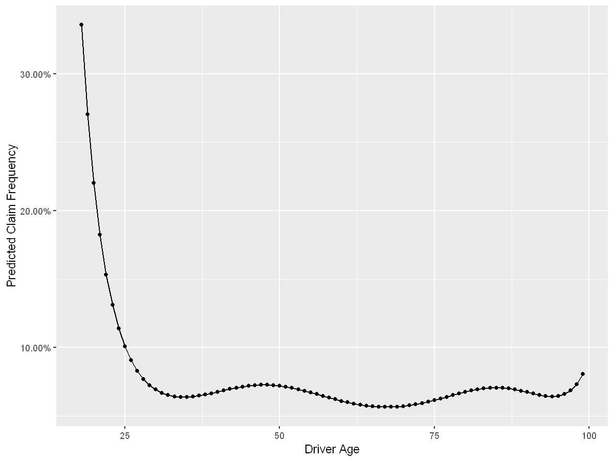
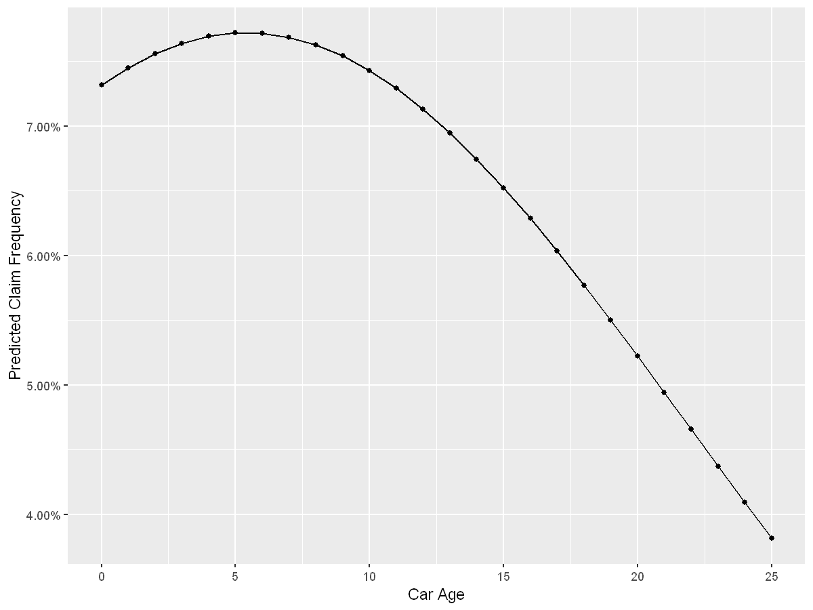

# Generalized Linear Models


```R
# The easiest way to get recipes is to install all of tidymodels:
# install.packages("tidymodels")
options(encoding = 'UTF-8')
#Loading all the necessary packages
if (!require("caret")) install.packages("caret")
if (!require("recipes")) install.packages("recipes")
if (!require("visreg")) install.packages("visreg")
if (!require("MASS")) install.packages("MASS")
if (!require("glmnet")) install.packages("glmnet")
if (!require("jtools")) install.packages("jtools")
if (!require("scales")) install.packages("scales")
if (!require("forcats")) install.packages("forcats")
if (!require("stringr")) install.packages("stringr")
if (!require("poissonreg")) install.packages("poissonreg")


require("caret")
require("recipes")
require("visreg")
require("MASS")
require("glmnet")
require("jtools")
require("scales")
require("forcats")
require("stringr")
require("arrow")
require("forcats")
require("yardstick")
require("parsnip")
require("workflows")
require("poissonreg")
require("rsample")
require("tune")
require("yardstick")

options(repr.plot.width = 8, repr.plot.height = 6, repr.plot.res = 150);
```

    Le chargement a nécessité le package : caret
    
    Le chargement a nécessité le package : ggplot2
    
    Le chargement a nécessité le package : lattice
    
    Le chargement a nécessité le package : recipes
    
    Le chargement a nécessité le package : dplyr
    
    
    Attachement du package : 'dplyr'
    
    
    Les objets suivants sont masqués depuis 'package:stats':
    
        filter, lag
    
    
    Les objets suivants sont masqués depuis 'package:base':
    
        intersect, setdiff, setequal, union
    
    
    
    Attachement du package : 'recipes'
    
    
    L'objet suivant est masqué depuis 'package:stats':
    
        step
    
    
    Le chargement a nécessité le package : visreg
    
    Le chargement a nécessité le package : MASS
    
    
    Attachement du package : 'MASS'
    
    
    L'objet suivant est masqué depuis 'package:dplyr':
    
        select
    
    
    Le chargement a nécessité le package : glmnet
    
    Le chargement a nécessité le package : Matrix
    
    Loaded glmnet 4.1-3
    
    Le chargement a nécessité le package : jtools
    
    Le chargement a nécessité le package : scales
    
    Le chargement a nécessité le package : forcats
    
    Le chargement a nécessité le package : stringr
    
    
    Attachement du package : 'stringr'
    
    
    L'objet suivant est masqué depuis 'package:recipes':
    
        fixed
    
    
    Le chargement a nécessité le package : poissonreg
    
    Le chargement a nécessité le package : parsnip
    
    Le chargement a nécessité le package : arrow
    
    
    Attachement du package : 'arrow'
    
    
    L'objet suivant est masqué depuis 'package:utils':
    
        timestamp
    
    
    Le chargement a nécessité le package : yardstick
    
    For binary classification, the first factor level is assumed to be the event.
    Use the argument `event_level = "second"` to alter this as needed.
    
    
    Attachement du package : 'yardstick'
    
    
    L'objet suivant est masqué depuis 'package:jtools':
    
        get_weights
    
    
    Les objets suivants sont masqués depuis 'package:caret':
    
        precision, recall, sensitivity, specificity
    
    
    Le chargement a nécessité le package : workflows
    
    Le chargement a nécessité le package : rsample
    
    Le chargement a nécessité le package : tune
    
    

We can also load the data (same as in the previous sessions).


```R
dataset = read_parquet(file = "../data/dataset.parquet")
```

## Data Preparation

For GLMs, we will need to prepare the data that we feed to the model. Indeed, we will have to provide the list of variables we wish to use and also supply the interactions terms. On top of that, we will *probably* need to bin some continuous variables into categorical ones. Let us re-take a look at some of the variables in the dataset.

An important preliminary step is always data preparation. In our simple dataset, we only have 10 variables. As a reminder, we have the following variables.


```R
str(dataset)
```

    'data.frame':	410864 obs. of  10 variables:
     $ PolicyID : Factor w/ 413169 levels "1","2","3","4",..: 1 2 3 4 5 6 7 8 9 10 ...
     $ ClaimNb  : int  0 0 0 0 0 0 0 0 0 0 ...
     $ Exposure : num  0.09 0.84 0.52 0.45 0.15 0.75 0.81 0.05 0.76 0.34 ...
     $ Power    : Factor w/ 12 levels "d","e","f","g",..: 4 4 3 3 4 4 1 1 1 6 ...
     $ CarAge   : int  0 0 2 2 0 0 1 0 9 0 ...
     $ DriverAge: int  46 46 38 38 41 41 27 27 23 44 ...
     $ Brand    : Factor w/ 7 levels "Fiat","Japanese (except Nissan) or Korean",..: 2 2 2 2 2 2 2 2 1 2 ...
     $ Gas      : Factor w/ 2 levels "Diesel","Regular": 1 1 2 2 1 1 2 2 2 2 ...
     $ Region   : Factor w/ 10 levels "Aquitaine","Basse-Normandie",..: 1 1 8 8 9 9 1 1 8 6 ...
     $ Density  : int  76 76 3003 3003 60 60 695 695 7887 27000 ...
    

As we see, some variables are considered as integers (int) and others are considered as factors. For factor variable, an important feature is the **reference level**. R automatically assigns the **first category/value** encountered as reference level. This can often be suboptimal, and it is preferable to have as reference level the category with the most observation (or largest exposure).

### Brand

We can see the different levels of a factor variable with the levels function. The first level is the **reference level**.


```R
levels(dataset$Brand)
```


<style>
.list-inline {list-style: none; margin:0; padding: 0}
.list-inline>li {display: inline-block}
.list-inline>li:not(:last-child)::after {content: "\00b7"; padding: 0 .5ex}
</style>
<ol class=list-inline><li>'Fiat'</li><li>'Japanese (except Nissan) or Korean'</li><li>'Mercedes, Chrysler or BMW'</li><li>'Opel, General Motors or Ford'</li><li>'other'</li><li>'Renault, Nissan or Citroen'</li><li>'Volkswagen, Audi, Skoda or Seat'</li></ol>


Using the function *fct_count* from package *forcats* we can easily compute the number of rows for each level of the factor variable.


```R
dataset$Brand %>% fct_count(sort=TRUE, prop=TRUE)
```


<table class="dataframe">
<caption>A tibble: 7 × 3</caption>
<thead>
	<tr><th scope=col>f</th><th scope=col>n</th><th scope=col>p</th></tr>
	<tr><th scope=col>&lt;fct&gt;</th><th scope=col>&lt;int&gt;</th><th scope=col>&lt;dbl&gt;</th></tr>
</thead>
<tbody>
	<tr><td>Renault, Nissan or Citroen        </td><td>216684</td><td>0.52738619</td></tr>
	<tr><td>Japanese (except Nissan) or Korean</td><td> 79031</td><td>0.19235319</td></tr>
	<tr><td>Opel, General Motors or Ford      </td><td> 37287</td><td>0.09075266</td></tr>
	<tr><td>Volkswagen, Audi, Skoda or Seat   </td><td> 32384</td><td>0.07881927</td></tr>
	<tr><td>Mercedes, Chrysler or BMW         </td><td> 19087</td><td>0.04645576</td></tr>
	<tr><td>Fiat                              </td><td> 16653</td><td>0.04053166</td></tr>
	<tr><td>other                             </td><td>  9738</td><td>0.02370127</td></tr>
</tbody>
</table>


*Renault, Nissan or Citroen* appears to be the most populated level of variable ‘Brand’. This is why we will set this level as reference level, using the function **relevel**, or we can directly use the relevant function from the forcats package that will determine the most populated level and set that level as the reference level.


```R
# dataset$Brand = relevel(x = dataset$Brand, ref= "Renault, Nissan or Citroen")
# Easier with forcats

dataset$Brand = dataset$Brand %>% fct_infreq()
levels(dataset$Brand)
```


<style>
.list-inline {list-style: none; margin:0; padding: 0}
.list-inline>li {display: inline-block}
.list-inline>li:not(:last-child)::after {content: "\00b7"; padding: 0 .5ex}
</style>
<ol class=list-inline><li>'Renault, Nissan or Citroen'</li><li>'Japanese (except Nissan) or Korean'</li><li>'Opel, General Motors or Ford'</li><li>'Volkswagen, Audi, Skoda or Seat'</li><li>'Mercedes, Chrysler or BMW'</li><li>'Fiat'</li><li>'other'</li></ol>


### Gas


```R
dataset$Gas %>% fct_count(sort=TRUE, prop=TRUE)
```


<table class="dataframe">
<caption>A tibble: 2 × 3</caption>
<thead>
	<tr><th scope=col>f</th><th scope=col>n</th><th scope=col>p</th></tr>
	<tr><th scope=col>&lt;fct&gt;</th><th scope=col>&lt;int&gt;</th><th scope=col>&lt;dbl&gt;</th></tr>
</thead>
<tbody>
	<tr><td>Regular</td><td>205565</td><td>0.5003237</td></tr>
	<tr><td>Diesel </td><td>205299</td><td>0.4996763</td></tr>
</tbody>
</table>


We will set Regular as reference level.


```R
dataset$Gas = dataset$Gas %>% fct_infreq()
levels(dataset$Gas)
```


<style>
.list-inline {list-style: none; margin:0; padding: 0}
.list-inline>li {display: inline-block}
.list-inline>li:not(:last-child)::after {content: "\00b7"; padding: 0 .5ex}
</style>
<ol class=list-inline><li>'Regular'</li><li>'Diesel'</li></ol>


### Region


```R
dataset$Region %>% fct_count(sort=TRUE, prop=TRUE)
```


<table class="dataframe">
<caption>A tibble: 10 × 3</caption>
<thead>
	<tr><th scope=col>f</th><th scope=col>n</th><th scope=col>p</th></tr>
	<tr><th scope=col>&lt;fct&gt;</th><th scope=col>&lt;int&gt;</th><th scope=col>&lt;dbl&gt;</th></tr>
</thead>
<tbody>
	<tr><td>Centre            </td><td>159426</td><td>0.38802621</td></tr>
	<tr><td>Ile-de-France     </td><td> 69576</td><td>0.16934071</td></tr>
	<tr><td>Bretagne          </td><td> 41986</td><td>0.10218953</td></tr>
	<tr><td>Pays-de-la-Loire  </td><td> 38541</td><td>0.09380476</td></tr>
	<tr><td>Aquitaine         </td><td> 31211</td><td>0.07596431</td></tr>
	<tr><td>Nord-Pas-de-Calais</td><td> 27111</td><td>0.06598534</td></tr>
	<tr><td>Poitou-Charentes  </td><td> 18900</td><td>0.04600062</td></tr>
	<tr><td>Basse-Normandie   </td><td> 10848</td><td>0.02640290</td></tr>
	<tr><td>Haute-Normandie   </td><td>  8726</td><td>0.02123817</td></tr>
	<tr><td>Limousin          </td><td>  4539</td><td>0.01104745</td></tr>
</tbody>
</table>


We will set Regular as reference level.


```R
dataset$Region = dataset$Region %>% fct_infreq()
levels(dataset$Region)
```


<style>
.list-inline {list-style: none; margin:0; padding: 0}
.list-inline>li {display: inline-block}
.list-inline>li:not(:last-child)::after {content: "\00b7"; padding: 0 .5ex}
</style>
<ol class=list-inline><li>'Centre'</li><li>'Ile-de-France'</li><li>'Bretagne'</li><li>'Pays-de-la-Loire'</li><li>'Aquitaine'</li><li>'Nord-Pas-de-Calais'</li><li>'Poitou-Charentes'</li><li>'Basse-Normandie'</li><li>'Haute-Normandie'</li><li>'Limousin'</li></ol>


### Power

Power is bit of a different factor variable. Indeed, there is some order between the levels (from lower power to higher power).


```R
dataset$Power %>% fct_count(sort=TRUE, prop=TRUE)
```


<table class="dataframe">
<caption>A tibble: 12 × 3</caption>
<thead>
	<tr><th scope=col>f</th><th scope=col>n</th><th scope=col>p</th></tr>
	<tr><th scope=col>&lt;fct&gt;</th><th scope=col>&lt;int&gt;</th><th scope=col>&lt;dbl&gt;</th></tr>
</thead>
<tbody>
	<tr><td>f</td><td>95432</td><td>0.232271506</td></tr>
	<tr><td>g</td><td>90663</td><td>0.220664259</td></tr>
	<tr><td>e</td><td>76784</td><td>0.186884224</td></tr>
	<tr><td>d</td><td>67660</td><td>0.164677363</td></tr>
	<tr><td>h</td><td>26558</td><td>0.064639394</td></tr>
	<tr><td>j</td><td>17978</td><td>0.043756572</td></tr>
	<tr><td>i</td><td>17398</td><td>0.042344912</td></tr>
	<tr><td>k</td><td> 9270</td><td>0.022562210</td></tr>
	<tr><td>l</td><td> 4593</td><td>0.011178882</td></tr>
	<tr><td>m</td><td> 1758</td><td>0.004278788</td></tr>
	<tr><td>o</td><td> 1494</td><td>0.003636240</td></tr>
	<tr><td>n</td><td> 1276</td><td>0.003105651</td></tr>
</tbody>
</table>


We will leave *d* as reference level, as it is highly populated and will allow us to keep it simple to interpret the regression coefficients (levels are ordered).


```R
dataset$Power = dataset$Power %>% fct_relevel(sort)
levels(dataset$Power)
```


<style>
.list-inline {list-style: none; margin:0; padding: 0}
.list-inline>li {display: inline-block}
.list-inline>li:not(:last-child)::after {content: "\00b7"; padding: 0 .5ex}
</style>
<ol class=list-inline><li>'d'</li><li>'e'</li><li>'f'</li><li>'g'</li><li>'h'</li><li>'i'</li><li>'j'</li><li>'k'</li><li>'l'</li><li>'m'</li><li>'n'</li><li>'o'</li></ol>


## Model

We are going to model the claim frequencies using a GLM. We will only consider the categorical variables in this part, as we will see later that other tools are available to treat the continuous variables without having to discretize them.

Let us first split out dataset in two parts: a training set and a testing set (this step requires the caret package).


```R
set.seed(21)  # For reproducibility
in_training = createDataPartition(dataset$ClaimNb, times = 1, p = 0.8, list = FALSE)
training_set = dataset[in_training, ]
testing_set = dataset[-in_training, ]
```

### Intercept

The main function is called *glm*. Let us run the function on our training set. We will need to provide the offset to account for the different Exposures.


```R
m0 = glm(ClaimNb ~ offset(log(Exposure)), 
         data = training_set, 
         family = poisson())
summary(m0)
```


    
    Call:
    glm(formula = ClaimNb ~ offset(log(Exposure)), family = poisson(), 
        data = training_set)
    
    Deviance Residuals: 
        Min       1Q   Median       3Q      Max  
    -0.3748  -0.3748  -0.2651  -0.1499   6.5399  
    
    Coefficients:
                 Estimate Std. Error z value Pr(>|z|)    
    (Intercept) -2.655615   0.008789  -302.1   <2e-16 ***
    ---
    Signif. codes:  0 '***' 0.001 '**' 0.01 '*' 0.05 '.' 0.1 ' ' 1
    
    (Dispersion parameter for poisson family taken to be 1)
    
        Null deviance: 84299  on 328691  degrees of freedom
    Residual deviance: 84299  on 328691  degrees of freedom
    AIC: 109308
    
    Number of Fisher Scoring iterations: 6
    


By default, the link function is the log (see help file ?poisson).

In a GLM without any variables, the exponential of the intercept $\exp\beta_0$ corresponds to the average claim frequency. 

Indeed, if we compare $\exp\beta_0$ with $\displaystyle\frac{\sum_i ClaimNB_i}{\sum_i Exposure_i}$, we obtain


```R
list(exp(m0$coef[1]), # m0$coef[1] is the Intercept
     with(training_set, sum(ClaimNb) / sum(Exposure)))
```


<ol>
	<li><strong>(Intercept):</strong> 0.0702556443457632</li>
	<li>0.0702556443159346</li>
</ol>


### Include Variables

First, we will only consider the discrete variables, namely Power, Brand, Gas and Region.

Let us include all these variables (without interactions) in the model.


```R
m1 = glm(ClaimNb ~ offset(log(Exposure)) + Power + Gas + Brand + Region, 
         data = training_set,
         family = poisson(link = log))
summary(m1)
```


    
    Call:
    glm(formula = ClaimNb ~ offset(log(Exposure)) + Power + Gas + 
        Brand + Region, family = poisson(link = log), data = training_set)
    
    Deviance Residuals: 
        Min       1Q   Median       3Q      Max  
    -0.5085  -0.3498  -0.2662  -0.1481   6.6335  
    
    Coefficients:
                                            Estimate Std. Error  z value Pr(>|z|)
    (Intercept)                             -2.92738    0.02686 -108.980  < 2e-16
    Powere                                   0.08199    0.03121    2.627 0.008622
    Powerf                                   0.08333    0.03058    2.725 0.006430
    Powerg                                   0.04901    0.03044    1.610 0.107353
    Powerh                                   0.08583    0.04350    1.973 0.048475
    Poweri                                   0.18977    0.04841    3.920 8.87e-05
    Powerj                                   0.18583    0.04873    3.814 0.000137
    Powerk                                   0.20036    0.06432    3.115 0.001839
    Powerl                                   0.10847    0.09418    1.152 0.249470
    Powerm                                   0.24356    0.13330    1.827 0.067683
    Powern                                   0.20713    0.15903    1.302 0.192752
    Powero                                   0.26127    0.15324    1.705 0.088208
    GasDiesel                                0.12636    0.01886    6.700 2.09e-11
    BrandJapanese (except Nissan) or Korean -0.19473    0.03059   -6.365 1.95e-10
    BrandOpel, General Motors or Ford        0.14284    0.02983    4.788 1.68e-06
    BrandVolkswagen, Audi, Skoda or Seat     0.14182    0.03169    4.476 7.62e-06
    BrandMercedes, Chrysler or BMW           0.07159    0.04424    1.618 0.105662
    BrandFiat                                0.09812    0.04380    2.240 0.025061
    Brandother                               0.03085    0.05674    0.544 0.586670
    RegionIle-de-France                      0.38849    0.02835   13.702  < 2e-16
    RegionBretagne                           0.04931    0.02954    1.670 0.095010
    RegionPays-de-la-Loire                   0.15946    0.03129    5.096 3.46e-07
    RegionAquitaine                          0.17098    0.03795    4.506 6.62e-06
    RegionNord-Pas-de-Calais                 0.31214    0.03946    7.910 2.58e-15
    RegionPoitou-Charentes                   0.16466    0.04142    3.975 7.03e-05
    RegionBasse-Normandie                    0.11350    0.05389    2.106 0.035185
    RegionHaute-Normandie                    0.13236    0.07685    1.722 0.085024
    RegionLimousin                           0.41227    0.07692    5.360 8.34e-08
                                               
    (Intercept)                             ***
    Powere                                  ** 
    Powerf                                  ** 
    Powerg                                     
    Powerh                                  *  
    Poweri                                  ***
    Powerj                                  ***
    Powerk                                  ** 
    Powerl                                     
    Powerm                                  .  
    Powern                                     
    Powero                                  .  
    GasDiesel                               ***
    BrandJapanese (except Nissan) or Korean ***
    BrandOpel, General Motors or Ford       ***
    BrandVolkswagen, Audi, Skoda or Seat    ***
    BrandMercedes, Chrysler or BMW             
    BrandFiat                               *  
    Brandother                                 
    RegionIle-de-France                     ***
    RegionBretagne                          .  
    RegionPays-de-la-Loire                  ***
    RegionAquitaine                         ***
    RegionNord-Pas-de-Calais                ***
    RegionPoitou-Charentes                  ***
    RegionBasse-Normandie                   *  
    RegionHaute-Normandie                   .  
    RegionLimousin                          ***
    ---
    Signif. codes:  0 '***' 0.001 '**' 0.01 '*' 0.05 '.' 0.1 ' ' 1
    
    (Dispersion parameter for poisson family taken to be 1)
    
        Null deviance: 84299  on 328691  degrees of freedom
    Residual deviance: 83916  on 328664  degrees of freedom
    AIC: 108979
    
    Number of Fisher Scoring iterations: 6
    


#### Visualize the model

For GLMs we don't need partial dependence plots, as the have a clear formula explaining the relationship between the features and the response variable.

We will use the function visreg from package **visreg** to plot the coefficients, along with their confidence interval. We can specify the **type** of plot we want:

From the documentation of *visreg*, we can read the following

The type of plot to be produced. The following options are supported:
- If **conditional** is selected, the plot returned shows the value of the variable on the x-axis and the change in response on the y-axis, holding all other variables constant (by default, median for numeric variables and most common category for factors).
- If **contrast** is selected, the plot returned shows the effect on the expected value of the response by moving the x variable away from a reference point on the x-axis (for numeric variables, this is taken to be the mean).


If we want to have the coefficients on the claim frequency scale, we can specify *scale = "response"*. Otherwise we can specify *scale = "linear"* to see the $\displaystyle\beta$s

#####  Power


```R
visreg(m1, "Power", type="conditional", scale="response", gg=TRUE, rug=FALSE, partial=FALSE) + theme_bw()
```


    

    


```R
visreg(m1, "Power", type="contrast", scale="response", gg=TRUE, rug=FALSE, partial=FALSE) + theme_bw()
```

    Warning message:
    "You are attempting to transform a contrast.  The resulting plot is not guaranteed to be meaningful."
    


    

    


##### Gas


```R
visreg(m1, "Gas", type="contrast", scale="response", gg=TRUE, rug=FALSE, partial=FALSE) + theme_bw()
```

    Warning message:
    "You are attempting to transform a contrast.  The resulting plot is not guaranteed to be meaningful."
    


    

    


##### Region 


```R
visreg(m1, "Region", type="contrast", scale="response", gg=TRUE, rug=FALSE, partial=FALSE) + theme_bw() + 
  theme(axis.text.x = element_text(angle = 90, vjust = 0.5, hjust=1))
```

    Warning message:
    "You are attempting to transform a contrast.  The resulting plot is not guaranteed to be meaningful."
    


    

    


##### Brand


```R
visreg(m1, "Brand", type="contrast", scale="response", gg=TRUE, rug=FALSE, partial=FALSE) + theme_bw() + 
  theme(axis.text.x = element_text(angle = 90, vjust = 0.5, hjust=1))
```

    Warning message:
    "You are attempting to transform a contrast.  The resulting plot is not guaranteed to be meaningful."
    


    

    


#### Comparing two models

We see some levels of some variables appear to be not significantly different from 0 (or 1 on the response scale). Moreover, it could be that some levels appear to be significantly different from 0, but are not significantly different from each other and could be merged.

If we wish to perform a likelihood ratio test between the full model $m_1$ and the model without any explanatory variables $m_0$


```R
anova(m0, m1, test = "Chisq")
```


<table class="dataframe">
<caption>A anova: 2 × 5</caption>
<thead>
	<tr><th></th><th scope=col>Resid. Df</th><th scope=col>Resid. Dev</th><th scope=col>Df</th><th scope=col>Deviance</th><th scope=col>Pr(&gt;Chi)</th></tr>
	<tr><th></th><th scope=col>&lt;dbl&gt;</th><th scope=col>&lt;dbl&gt;</th><th scope=col>&lt;dbl&gt;</th><th scope=col>&lt;dbl&gt;</th><th scope=col>&lt;dbl&gt;</th></tr>
</thead>
<tbody>
	<tr><th scope=row>1</th><td>328691</td><td>84298.99</td><td>NA</td><td>      NA</td><td>          NA</td></tr>
	<tr><th scope=row>2</th><td>328664</td><td>83916.25</td><td>27</td><td>382.7405</td><td>1.615938e-64</td></tr>
</tbody>
</table>


Note:

Null Deviance = 2(LL(Saturated Model) - LL(Null Model)) on df = df_Sat - df_Null

Residual Deviance = 2(LL(Saturated Model) - LL(Proposed Model)) df = df_Sat - df_Proposed

##### Predict claim frequencies

If we want to predict claim frequencies, we can directly use the predict function. We need to specify that the output needs to be of *type = "response"*, so that we obtain claim frequencies, rather than the linear predictor (on the "score" scale). For example, for the first four lines of the testing_set, we get:


```R
predict(m1, head(testing_set, 4), type="response")
```


<style>
.dl-inline {width: auto; margin:0; padding: 0}
.dl-inline>dt, .dl-inline>dd {float: none; width: auto; display: inline-block}
.dl-inline>dt::after {content: ":\0020"; padding-right: .5ex}
.dl-inline>dt:not(:first-of-type) {padding-left: .5ex}
</style><dl class=dl-inline><dt>1</dt><dd>0.00560718942087103</dd><dt>8</dt><dd>0.00261402852334389</dd><dt>9</dt><dd>0.0613261001210846</dd><dt>14</dt><dd>0.0134018381671268</dd></dl>


### Offset or weights ?

Let us compare the previous model with the following model, which, some call a "Poisson rate model")


```R
m2 = glm(ClaimNb/Exposure ~ Power + Gas + Brand + Region, 
         data = training_set,
         weight = training_set$Exposure,
         family = poisson(link = log))
summary(m2)
```

    Warning message in dpois(y, mu, log = TRUE):
    "non-integer x = 7.142857"
    Warning message in dpois(y, mu, log = TRUE):
    "non-integer x = 7.142857"
    Warning message in dpois(y, mu, log = TRUE):
    "non-integer x = 3.225806"
    Warning message in dpois(y, mu, log = TRUE):
    "non-integer x = 1.333333"
    Warning message in dpois(y, mu, log = TRUE):
    "non-integer x = 1.538462"
    Warning message in dpois(y, mu, log = TRUE):
    "non-integer x = 1.333333"
    Warning message in dpois(y, mu, log = TRUE):
    "non-integer x = 2.898551"
    Warning message in dpois(y, mu, log = TRUE):
    "non-integer x = 8.333333"
    Warning message in dpois(y, mu, log = TRUE):
    "non-integer x = 6.666667"
    Warning message in dpois(y, mu, log = TRUE):
    "non-integer x = 3.508772"
    Warning message in dpois(y, mu, log = TRUE):
    "non-integer x = 1.075269"
    Warning message in dpois(y, mu, log = TRUE):
    "non-integer x = 3.846154"
    Warning message in dpois(y, mu, log = TRUE):
    "non-integer x = 3.030303"
    Warning message in dpois(y, mu, log = TRUE):
    "non-integer x = 1.538462"
    Warning message in dpois(y, mu, log = TRUE):
    "non-integer x = 2.040816"
    Warning message in dpois(y, mu, log = TRUE):
    "non-integer x = 1.960784"
    Warning message in dpois(y, mu, log = TRUE):
    "non-integer x = 4.761905"
    Warning message in dpois(y, mu, log = TRUE):
    "non-integer x = 2.325581"
    Warning message in dpois(y, mu, log = TRUE):
    "non-integer x = 2.127660"
    Warning message in dpois(y, mu, log = TRUE):
    "non-integer x = 3.448276"
    Warning message in dpois(y, mu, log = TRUE):
    "non-integer x = 3.846154"
    Warning message in dpois(y, mu, log = TRUE):
    "non-integer x = 4.651163"
    Warning message in dpois(y, mu, log = TRUE):
    "non-integer x = 4.761905"
    Warning message in dpois(y, mu, log = TRUE):
    "non-integer x = 2.631579"
    Warning message in dpois(y, mu, log = TRUE):
    "non-integer x = 3.846154"
    Warning message in dpois(y, mu, log = TRUE):
    "non-integer x = 7.142857"
    Warning message in dpois(y, mu, log = TRUE):
    "non-integer x = 8.333333"
    Warning message in dpois(y, mu, log = TRUE):
    "non-integer x = 14.285714"
    Warning message in dpois(y, mu, log = TRUE):
    "non-integer x = 1.470588"
    Warning message in dpois(y, mu, log = TRUE):
    "non-integer x = 2.666667"
    Warning message in dpois(y, mu, log = TRUE):
    "non-integer x = 1.851852"
    Warning message in dpois(y, mu, log = TRUE):
    "non-integer x = 5.263158"
    Warning message in dpois(y, mu, log = TRUE):
    "non-integer x = 5.263158"
    Warning message in dpois(y, mu, log = TRUE):
    "non-integer x = 1.694915"
    Warning message in dpois(y, mu, log = TRUE):
    "non-integer x = 1.010101"
    Warning message in dpois(y, mu, log = TRUE):
    "non-integer x = 2.564103"
    Warning message in dpois(y, mu, log = TRUE):
    "non-integer x = 2.040816"
    Warning message in dpois(y, mu, log = TRUE):
    "non-integer x = 1.333333"
    Warning message in dpois(y, mu, log = TRUE):
    "non-integer x = 1.492537"
    Warning message in dpois(y, mu, log = TRUE):
    "non-integer x = 4.166667"
    Warning message in dpois(y, mu, log = TRUE):
    "non-integer x = 1.388889"
    Warning message in dpois(y, mu, log = TRUE):
    "non-integer x = 1.075269"
    Warning message in dpois(y, mu, log = TRUE):
    "non-integer x = 6.250000"
    Warning message in dpois(y, mu, log = TRUE):
    "non-integer x = 4.166667"
    Warning message in dpois(y, mu, log = TRUE):
    "non-integer x = 1.149425"
    Warning message in dpois(y, mu, log = TRUE):
    "non-integer x = 1.351351"
    Warning message in dpois(y, mu, log = TRUE):
    "non-integer x = 1.020408"
    Warning message in dpois(y, mu, log = TRUE):
    "non-integer x = 6.250000"
    Warning message in dpois(y, mu, log = TRUE):
    "non-integer x = 1.333333"
    Warning message in dpois(y, mu, log = TRUE):
    "non-integer x = 4.166667"
    Warning message in dpois(y, mu, log = TRUE):
    "non-integer x = 1.923077"
    Warning message in dpois(y, mu, log = TRUE):
    "non-integer x = 1.010101"
    Warning message in dpois(y, mu, log = TRUE):
    "non-integer x = 1.041667"
    Warning message in dpois(y, mu, log = TRUE):
    "non-integer x = 2.777778"
    Warning message in dpois(y, mu, log = TRUE):
    "non-integer x = 1.923077"
    Warning message in dpois(y, mu, log = TRUE):
    "non-integer x = 4.545455"
    Warning message in dpois(y, mu, log = TRUE):
    "non-integer x = 2.564103"
    Warning message in dpois(y, mu, log = TRUE):
    "non-integer x = 2.325581"
    Warning message in dpois(y, mu, log = TRUE):
    "non-integer x = 1.351351"
    Warning message in dpois(y, mu, log = TRUE):
    "non-integer x = 1.408451"
    Warning message in dpois(y, mu, log = TRUE):
    "non-integer x = 1.298701"
    Warning message in dpois(y, mu, log = TRUE):
    "non-integer x = 1.333333"
    Warning message in dpois(y, mu, log = TRUE):
    "non-integer x = 1.136364"
    Warning message in dpois(y, mu, log = TRUE):
    "non-integer x = 4.166667"
    Warning message in dpois(y, mu, log = TRUE):
    "non-integer x = 1.030928"
    Warning message in dpois(y, mu, log = TRUE):
    "non-integer x = 1.587302"
    Warning message in dpois(y, mu, log = TRUE):
    "non-integer x = 1.149425"
    Warning message in dpois(y, mu, log = TRUE):
    "non-integer x = 2.439024"
    Warning message in dpois(y, mu, log = TRUE):
    "non-integer x = 1.515152"
    Warning message in dpois(y, mu, log = TRUE):
    "non-integer x = 1.428571"
    Warning message in dpois(y, mu, log = TRUE):
    "non-integer x = 3.846154"
    Warning message in dpois(y, mu, log = TRUE):
    "non-integer x = 2.380952"
    Warning message in dpois(y, mu, log = TRUE):
    "non-integer x = 2.702703"
    Warning message in dpois(y, mu, log = TRUE):
    "non-integer x = 2.325581"
    Warning message in dpois(y, mu, log = TRUE):
    "non-integer x = 1.515152"
    Warning message in dpois(y, mu, log = TRUE):
    "non-integer x = 1.030928"
    Warning message in dpois(y, mu, log = TRUE):
    "non-integer x = 1.204819"
    Warning message in dpois(y, mu, log = TRUE):
    "non-integer x = 1.315789"
    Warning message in dpois(y, mu, log = TRUE):
    "non-integer x = 3.225806"
    Warning message in dpois(y, mu, log = TRUE):
    "non-integer x = 11.111111"
    Warning message in dpois(y, mu, log = TRUE):
    "non-integer x = 1.428571"
    Warning message in dpois(y, mu, log = TRUE):
    "non-integer x = 1.666667"
    Warning message in dpois(y, mu, log = TRUE):
    "non-integer x = 2.380952"
    Warning message in dpois(y, mu, log = TRUE):
    "non-integer x = 1.851852"
    Warning message in dpois(y, mu, log = TRUE):
    "non-integer x = 1.265823"
    Warning message in dpois(y, mu, log = TRUE):
    "non-integer x = 1.149425"
    Warning message in dpois(y, mu, log = TRUE):
    "non-integer x = 1.282051"
    Warning message in dpois(y, mu, log = TRUE):
    "non-integer x = 1.234568"
    Warning message in dpois(y, mu, log = TRUE):
    "non-integer x = 1.282051"
    Warning message in dpois(y, mu, log = TRUE):
    "non-integer x = 1.428571"
    Warning message in dpois(y, mu, log = TRUE):
    "non-integer x = 3.571429"
    Warning message in dpois(y, mu, log = TRUE):
    "non-integer x = 1.315789"
    Warning message in dpois(y, mu, log = TRUE):
    "non-integer x = 1.123596"
    Warning message in dpois(y, mu, log = TRUE):
    "non-integer x = 1.538462"
    Warning message in dpois(y, mu, log = TRUE):
    "non-integer x = 1.234568"
    Warning message in dpois(y, mu, log = TRUE):
    "non-integer x = 5.263158"
    Warning message in dpois(y, mu, log = TRUE):
    "non-integer x = 1.250000"
    Warning message in dpois(y, mu, log = TRUE):
    "non-integer x = 6.250000"
    Warning message in dpois(y, mu, log = TRUE):
    "non-integer x = 1.333333"
    Warning message in dpois(y, mu, log = TRUE):
    "non-integer x = 1.265823"
    Warning message in dpois(y, mu, log = TRUE):
    "non-integer x = 2.380952"
    Warning message in dpois(y, mu, log = TRUE):
    "non-integer x = 1.204819"
    Warning message in dpois(y, mu, log = TRUE):
    "non-integer x = 1.449275"
    Warning message in dpois(y, mu, log = TRUE):
    "non-integer x = 1.408451"
    Warning message in dpois(y, mu, log = TRUE):
    "non-integer x = 1.041667"
    Warning message in dpois(y, mu, log = TRUE):
    "non-integer x = 1.123596"
    Warning message in dpois(y, mu, log = TRUE):
    "non-integer x = 1.754386"
    Warning message in dpois(y, mu, log = TRUE):
    "non-integer x = 2.173913"
    Warning message in dpois(y, mu, log = TRUE):
    "non-integer x = 2.941176"
    Warning message in dpois(y, mu, log = TRUE):
    "non-integer x = 2.325581"
    Warning message in dpois(y, mu, log = TRUE):
    "non-integer x = 16.666667"
    Warning message in dpois(y, mu, log = TRUE):
    "non-integer x = 1.149425"
    Warning message in dpois(y, mu, log = TRUE):
    "non-integer x = 2.127660"
    Warning message in dpois(y, mu, log = TRUE):
    "non-integer x = 3.333333"
    Warning message in dpois(y, mu, log = TRUE):
    "non-integer x = 1.724138"
    Warning message in dpois(y, mu, log = TRUE):
    "non-integer x = 1.960784"
    Warning message in dpois(y, mu, log = TRUE):
    "non-integer x = 12.500000"
    Warning message in dpois(y, mu, log = TRUE):
    "non-integer x = 12.500000"
    Warning message in dpois(y, mu, log = TRUE):
    "non-integer x = 11.111111"
    Warning message in dpois(y, mu, log = TRUE):
    "non-integer x = 1.149425"
    Warning message in dpois(y, mu, log = TRUE):
    "non-integer x = 3.225806"
    Warning message in dpois(y, mu, log = TRUE):
    "non-integer x = 1.351351"
    Warning message in dpois(y, mu, log = TRUE):
    "non-integer x = 5.263158"
    Warning message in dpois(y, mu, log = TRUE):
    "non-integer x = 1.111111"
    Warning message in dpois(y, mu, log = TRUE):
    "non-integer x = 1.612903"
    Warning message in dpois(y, mu, log = TRUE):
    "non-integer x = 1.515152"
    Warning message in dpois(y, mu, log = TRUE):
    "non-integer x = 16.666667"
    Warning message in dpois(y, mu, log = TRUE):
    "non-integer x = 1.639344"
    Warning message in dpois(y, mu, log = TRUE):
    "non-integer x = 16.666667"
    Warning message in dpois(y, mu, log = TRUE):
    "non-integer x = 1.098901"
    Warning message in dpois(y, mu, log = TRUE):
    "non-integer x = 2.222222"
    Warning message in dpois(y, mu, log = TRUE):
    "non-integer x = 3.030303"
    Warning message in dpois(y, mu, log = TRUE):
    "non-integer x = 1.724138"
    Warning message in dpois(y, mu, log = TRUE):
    "non-integer x = 1.333333"
    Warning message in dpois(y, mu, log = TRUE):
    "non-integer x = 1.234568"
    Warning message in dpois(y, mu, log = TRUE):
    "non-integer x = 1.086957"
    Warning message in dpois(y, mu, log = TRUE):
    "non-integer x = 1.111111"
    Warning message in dpois(y, mu, log = TRUE):
    "non-integer x = 1.052632"
    Warning message in dpois(y, mu, log = TRUE):
    "non-integer x = 1.020408"
    Warning message in dpois(y, mu, log = TRUE):
    "non-integer x = 1.612903"
    Warning message in dpois(y, mu, log = TRUE):
    "non-integer x = 1.333333"
    Warning message in dpois(y, mu, log = TRUE):
    "non-integer x = 14.285714"
    Warning message in dpois(y, mu, log = TRUE):
    "non-integer x = 1.075269"
    Warning message in dpois(y, mu, log = TRUE):
    "non-integer x = 1.923077"
    Warning message in dpois(y, mu, log = TRUE):
    "non-integer x = 1.086957"
    Warning message in dpois(y, mu, log = TRUE):
    "non-integer x = 1.754386"
    Warning message in dpois(y, mu, log = TRUE):
    "non-integer x = 9.090909"
    Warning message in dpois(y, mu, log = TRUE):
    "non-integer x = 1.250000"
    Warning message in dpois(y, mu, log = TRUE):
    "non-integer x = 5.263158"
    Warning message in dpois(y, mu, log = TRUE):
    "non-integer x = 3.448276"
    Warning message in dpois(y, mu, log = TRUE):
    "non-integer x = 1.515152"
    Warning message in dpois(y, mu, log = TRUE):
    "non-integer x = 1.219512"
    Warning message in dpois(y, mu, log = TRUE):
    "non-integer x = 12.500000"
    Warning message in dpois(y, mu, log = TRUE):
    "non-integer x = 1.111111"
    Warning message in dpois(y, mu, log = TRUE):
    "non-integer x = 1.333333"
    Warning message in dpois(y, mu, log = TRUE):
    "non-integer x = 3.030303"
    Warning message in dpois(y, mu, log = TRUE):
    "non-integer x = 1.492537"
    Warning message in dpois(y, mu, log = TRUE):
    "non-integer x = 2.127660"
    Warning message in dpois(y, mu, log = TRUE):
    "non-integer x = 2.222222"
    Warning message in dpois(y, mu, log = TRUE):
    "non-integer x = 3.846154"
    Warning message in dpois(y, mu, log = TRUE):
    "non-integer x = 1.190476"
    Warning message in dpois(y, mu, log = TRUE):
    "non-integer x = 2.439024"
    Warning message in dpois(y, mu, log = TRUE):
    "non-integer x = 1.851852"
    Warning message in dpois(y, mu, log = TRUE):
    "non-integer x = 1.020408"
    Warning message in dpois(y, mu, log = TRUE):
    "non-integer x = 1.086957"
    Warning message in dpois(y, mu, log = TRUE):
    "non-integer x = 2.857143"
    Warning message in dpois(y, mu, log = TRUE):
    "non-integer x = 1.265823"
    Warning message in dpois(y, mu, log = TRUE):
    "non-integer x = 1.250000"
    Warning message in dpois(y, mu, log = TRUE):
    "non-integer x = 1.333333"
    Warning message in dpois(y, mu, log = TRUE):
    "non-integer x = 2.222222"
    Warning message in dpois(y, mu, log = TRUE):
    "non-integer x = 1.538462"
    Warning message in dpois(y, mu, log = TRUE):
    "non-integer x = 1.063830"
    Warning message in dpois(y, mu, log = TRUE):
    "non-integer x = 1.388889"
    Warning message in dpois(y, mu, log = TRUE):
    "non-integer x = 3.225806"
    Warning message in dpois(y, mu, log = TRUE):
    "non-integer x = 3.448276"
    Warning message in dpois(y, mu, log = TRUE):
    "non-integer x = 1.818182"
    Warning message in dpois(y, mu, log = TRUE):
    "non-integer x = 6.250000"
    Warning message in dpois(y, mu, log = TRUE):
    "non-integer x = 1.754386"
    Warning message in dpois(y, mu, log = TRUE):
    "non-integer x = 1.204819"
    Warning message in dpois(y, mu, log = TRUE):
    "non-integer x = 1.785714"
    Warning message in dpois(y, mu, log = TRUE):
    "non-integer x = 6.250000"
    Warning message in dpois(y, mu, log = TRUE):
    "non-integer x = 2.777778"
    Warning message in dpois(y, mu, log = TRUE):
    "non-integer x = 1.754386"
    Warning message in dpois(y, mu, log = TRUE):
    "non-integer x = 1.136364"
    Warning message in dpois(y, mu, log = TRUE):
    "non-integer x = 1.351351"
    Warning message in dpois(y, mu, log = TRUE):
    "non-integer x = 2.083333"
    Warning message in dpois(y, mu, log = TRUE):
    "non-integer x = 1.587302"
    Warning message in dpois(y, mu, log = TRUE):
    "non-integer x = 2.380952"
    Warning message in dpois(y, mu, log = TRUE):
    "non-integer x = 2.439024"
    Warning message in dpois(y, mu, log = TRUE):
    "non-integer x = 2.222222"
    Warning message in dpois(y, mu, log = TRUE):
    "non-integer x = 1.351351"
    Warning message in dpois(y, mu, log = TRUE):
    "non-integer x = 3.333333"
    Warning message in dpois(y, mu, log = TRUE):
    "non-integer x = 12.500000"
    Warning message in dpois(y, mu, log = TRUE):
    "non-integer x = 6.250000"
    Warning message in dpois(y, mu, log = TRUE):
    "non-integer x = 1.010101"
    Warning message in dpois(y, mu, log = TRUE):
    "non-integer x = 3.448276"
    Warning message in dpois(y, mu, log = TRUE):
    "non-integer x = 5.263158"
    Warning message in dpois(y, mu, log = TRUE):
    "non-integer x = 1.333333"
    Warning message in dpois(y, mu, log = TRUE):
    "non-integer x = 1.204819"
    Warning message in dpois(y, mu, log = TRUE):
    "non-integer x = 11.111111"
    Warning message in dpois(y, mu, log = TRUE):
    "non-integer x = 1.075269"
    Warning message in dpois(y, mu, log = TRUE):
    "non-integer x = 1.785714"
    Warning message in dpois(y, mu, log = TRUE):
    "non-integer x = 1.204819"
    Warning message in dpois(y, mu, log = TRUE):
    "non-integer x = 2.127660"
    Warning message in dpois(y, mu, log = TRUE):
    "non-integer x = 1.639344"
    Warning message in dpois(y, mu, log = TRUE):
    "non-integer x = 1.724138"
    Warning message in dpois(y, mu, log = TRUE):
    "non-integer x = 4.166667"
    Warning message in dpois(y, mu, log = TRUE):
    "non-integer x = 4.761905"
    Warning message in dpois(y, mu, log = TRUE):
    "non-integer x = 1.333333"
    Warning message in dpois(y, mu, log = TRUE):
    "non-integer x = 3.225806"
    Warning message in dpois(y, mu, log = TRUE):
    "non-integer x = 1.886792"
    Warning message in dpois(y, mu, log = TRUE):
    "non-integer x = 8.333333"
    Warning message in dpois(y, mu, log = TRUE):
    "non-integer x = 2.439024"
    Warning message in dpois(y, mu, log = TRUE):
    "non-integer x = 1.724138"
    Warning message in dpois(y, mu, log = TRUE):
    "non-integer x = 1.282051"
    Warning message in dpois(y, mu, log = TRUE):
    "non-integer x = 1.111111"
    Warning message in dpois(y, mu, log = TRUE):
    "non-integer x = 2.173913"
    Warning message in dpois(y, mu, log = TRUE):
    "non-integer x = 2.857143"
    Warning message in dpois(y, mu, log = TRUE):
    "non-integer x = 11.111111"
    Warning message in dpois(y, mu, log = TRUE):
    "non-integer x = 2.857143"
    Warning message in dpois(y, mu, log = TRUE):
    "non-integer x = 1.123596"
    Warning message in dpois(y, mu, log = TRUE):
    "non-integer x = 1.351351"
    Warning message in dpois(y, mu, log = TRUE):
    "non-integer x = 1.149425"
    Warning message in dpois(y, mu, log = TRUE):
    "non-integer x = 4.166667"
    Warning message in dpois(y, mu, log = TRUE):
    "non-integer x = 2.272727"
    Warning message in dpois(y, mu, log = TRUE):
    "non-integer x = 3.448276"
    Warning message in dpois(y, mu, log = TRUE):
    "non-integer x = 1.694915"
    Warning message in dpois(y, mu, log = TRUE):
    "non-integer x = 2.083333"
    Warning message in dpois(y, mu, log = TRUE):
    "non-integer x = 1.075269"
    Warning message in dpois(y, mu, log = TRUE):
    "non-integer x = 1.282051"
    Warning message in dpois(y, mu, log = TRUE):
    "non-integer x = 1.408451"
    Warning message in dpois(y, mu, log = TRUE):
    "non-integer x = 4.347826"
    Warning message in dpois(y, mu, log = TRUE):
    "non-integer x = 4.545455"
    Warning message in dpois(y, mu, log = TRUE):
    "non-integer x = 1.449275"
    Warning message in dpois(y, mu, log = TRUE):
    "non-integer x = 1.923077"
    Warning message in dpois(y, mu, log = TRUE):
    "non-integer x = 8.333333"
    Warning message in dpois(y, mu, log = TRUE):
    "non-integer x = 1.086957"
    Warning message in dpois(y, mu, log = TRUE):
    "non-integer x = 1.785714"
    Warning message in dpois(y, mu, log = TRUE):
    "non-integer x = 3.921569"
    Warning message in dpois(y, mu, log = TRUE):
    "non-integer x = 1.333333"
    Warning message in dpois(y, mu, log = TRUE):
    "non-integer x = 2.040816"
    Warning message in dpois(y, mu, log = TRUE):
    "non-integer x = 3.125000"
    Warning message in dpois(y, mu, log = TRUE):
    "non-integer x = 2.702703"
    Warning message in dpois(y, mu, log = TRUE):
    "non-integer x = 1.041667"
    Warning message in dpois(y, mu, log = TRUE):
    "non-integer x = 1.010101"
    Warning message in dpois(y, mu, log = TRUE):
    "non-integer x = 1.470588"
    Warning message in dpois(y, mu, log = TRUE):
    "non-integer x = 1.098901"
    Warning message in dpois(y, mu, log = TRUE):
    "non-integer x = 1.388889"
    Warning message in dpois(y, mu, log = TRUE):
    "non-integer x = 2.127660"
    Warning message in dpois(y, mu, log = TRUE):
    "non-integer x = 4.166667"
    Warning message in dpois(y, mu, log = TRUE):
    "non-integer x = 2.777778"
    Warning message in dpois(y, mu, log = TRUE):
    "non-integer x = 1.886792"
    Warning message in dpois(y, mu, log = TRUE):
    "non-integer x = 1.282051"
    Warning message in dpois(y, mu, log = TRUE):
    "non-integer x = 1.470588"
    Warning message in dpois(y, mu, log = TRUE):
    "non-integer x = 3.846154"
    Warning message in dpois(y, mu, log = TRUE):
    "non-integer x = 1.428571"
    Warning message in dpois(y, mu, log = TRUE):
    "non-integer x = 2.173913"
    Warning message in dpois(y, mu, log = TRUE):
    "non-integer x = 1.098901"
    Warning message in dpois(y, mu, log = TRUE):
    "non-integer x = 1.515152"
    Warning message in dpois(y, mu, log = TRUE):
    "non-integer x = 3.030303"
    Warning message in dpois(y, mu, log = TRUE):
    "non-integer x = 2.941176"
    Warning message in dpois(y, mu, log = TRUE):
    "non-integer x = 14.285714"
    Warning message in dpois(y, mu, log = TRUE):
    "non-integer x = 1.265823"
    Warning message in dpois(y, mu, log = TRUE):
    "non-integer x = 1.020408"
    Warning message in dpois(y, mu, log = TRUE):
    "non-integer x = 1.063830"
    Warning message in dpois(y, mu, log = TRUE):
    "non-integer x = 1.408451"
    Warning message in dpois(y, mu, log = TRUE):
    "non-integer x = 1.250000"
    Warning message in dpois(y, mu, log = TRUE):
    "non-integer x = 1.204819"
    Warning message in dpois(y, mu, log = TRUE):
    "non-integer x = 5.555556"
    Warning message in dpois(y, mu, log = TRUE):
    "non-integer x = 3.846154"
    Warning message in dpois(y, mu, log = TRUE):
    "non-integer x = 1.694915"
    Warning message in dpois(y, mu, log = TRUE):
    "non-integer x = 1.111111"
    Warning message in dpois(y, mu, log = TRUE):
    "non-integer x = 1.538462"
    Warning message in dpois(y, mu, log = TRUE):
    "non-integer x = 1.020408"
    Warning message in dpois(y, mu, log = TRUE):
    "non-integer x = 4.347826"
    Warning message in dpois(y, mu, log = TRUE):
    "non-integer x = 1.923077"
    Warning message in dpois(y, mu, log = TRUE):
    "non-integer x = 1.149425"
    Warning message in dpois(y, mu, log = TRUE):
    "non-integer x = 3.846154"
    Warning message in dpois(y, mu, log = TRUE):
    "non-integer x = 1.333333"
    Warning message in dpois(y, mu, log = TRUE):
    "non-integer x = 1.063830"
    Warning message in dpois(y, mu, log = TRUE):
    "non-integer x = 6.250000"
    Warning message in dpois(y, mu, log = TRUE):
    "non-integer x = 1.408451"
    Warning message in dpois(y, mu, log = TRUE):
    "non-integer x = 1.562500"
    Warning message in dpois(y, mu, log = TRUE):
    "non-integer x = 4.761905"
    Warning message in dpois(y, mu, log = TRUE):
    "non-integer x = 2.272727"
    Warning message in dpois(y, mu, log = TRUE):
    "non-integer x = 2.040816"
    Warning message in dpois(y, mu, log = TRUE):
    "non-integer x = 3.846154"
    Warning message in dpois(y, mu, log = TRUE):
    "non-integer x = 3.703704"
    Warning message in dpois(y, mu, log = TRUE):
    "non-integer x = 4.166667"
    Warning message in dpois(y, mu, log = TRUE):
    "non-integer x = 1.428571"
    Warning message in dpois(y, mu, log = TRUE):
    "non-integer x = 2.439024"
    Warning message in dpois(y, mu, log = TRUE):
    "non-integer x = 11.111111"
    Warning message in dpois(y, mu, log = TRUE):
    "non-integer x = 1.754386"
    Warning message in dpois(y, mu, log = TRUE):
    "non-integer x = 3.333333"
    Warning message in dpois(y, mu, log = TRUE):
    "non-integer x = 1.333333"
    Warning message in dpois(y, mu, log = TRUE):
    "non-integer x = 1.041667"
    Warning message in dpois(y, mu, log = TRUE):
    "non-integer x = 2.500000"
    Warning message in dpois(y, mu, log = TRUE):
    "non-integer x = 7.692308"
    Warning message in dpois(y, mu, log = TRUE):
    "non-integer x = 3.703704"
    Warning message in dpois(y, mu, log = TRUE):
    "non-integer x = 3.125000"
    Warning message in dpois(y, mu, log = TRUE):
    "non-integer x = 3.030303"
    Warning message in dpois(y, mu, log = TRUE):
    "non-integer x = 1.724138"
    Warning message in dpois(y, mu, log = TRUE):
    "non-integer x = 1.754386"
    Warning message in dpois(y, mu, log = TRUE):
    "non-integer x = 1.234568"
    Warning message in dpois(y, mu, log = TRUE):
    "non-integer x = 2.127660"
    Warning message in dpois(y, mu, log = TRUE):
    "non-integer x = 1.562500"
    Warning message in dpois(y, mu, log = TRUE):
    "non-integer x = 2.702703"
    Warning message in dpois(y, mu, log = TRUE):
    "non-integer x = 5.882353"
    Warning message in dpois(y, mu, log = TRUE):
    "non-integer x = 1.515152"
    Warning message in dpois(y, mu, log = TRUE):
    "non-integer x = 2.631579"
    Warning message in dpois(y, mu, log = TRUE):
    "non-integer x = 1.515152"
    Warning message in dpois(y, mu, log = TRUE):
    "non-integer x = 1.149425"
    Warning message in dpois(y, mu, log = TRUE):
    "non-integer x = 2.500000"
    Warning message in dpois(y, mu, log = TRUE):
    "non-integer x = 8.333333"
    Warning message in dpois(y, mu, log = TRUE):
    "non-integer x = 1.098901"
    Warning message in dpois(y, mu, log = TRUE):
    "non-integer x = 1.282051"
    Warning message in dpois(y, mu, log = TRUE):
    "non-integer x = 1.515152"
    Warning message in dpois(y, mu, log = TRUE):
    "non-integer x = 1.298701"
    Warning message in dpois(y, mu, log = TRUE):
    "non-integer x = 4.545455"
    Warning message in dpois(y, mu, log = TRUE):
    "non-integer x = 1.639344"
    Warning message in dpois(y, mu, log = TRUE):
    "non-integer x = 1.369863"
    Warning message in dpois(y, mu, log = TRUE):
    "non-integer x = 16.666667"
    Warning message in dpois(y, mu, log = TRUE):
    "non-integer x = 1.020408"
    Warning message in dpois(y, mu, log = TRUE):
    "non-integer x = 1.098901"
    Warning message in dpois(y, mu, log = TRUE):
    "non-integer x = 3.333333"
    Warning message in dpois(y, mu, log = TRUE):
    "non-integer x = 2.380952"
    Warning message in dpois(y, mu, log = TRUE):
    "non-integer x = 1.818182"
    Warning message in dpois(y, mu, log = TRUE):
    "non-integer x = 2.777778"
    Warning message in dpois(y, mu, log = TRUE):
    "non-integer x = 1.123596"
    Warning message in dpois(y, mu, log = TRUE):
    "non-integer x = 1.351351"
    Warning message in dpois(y, mu, log = TRUE):
    "non-integer x = 1.538462"
    Warning message in dpois(y, mu, log = TRUE):
    "non-integer x = 1.063830"
    Warning message in dpois(y, mu, log = TRUE):
    "non-integer x = 2.564103"
    Warning message in dpois(y, mu, log = TRUE):
    "non-integer x = 1.333333"
    Warning message in dpois(y, mu, log = TRUE):
    "non-integer x = 2.040816"
    Warning message in dpois(y, mu, log = TRUE):
    "non-integer x = 5.263158"
    Warning message in dpois(y, mu, log = TRUE):
    "non-integer x = 1.250000"
    Warning message in dpois(y, mu, log = TRUE):
    "non-integer x = 1.298701"
    Warning message in dpois(y, mu, log = TRUE):
    "non-integer x = 2.816901"
    Warning message in dpois(y, mu, log = TRUE):
    "non-integer x = 1.562500"
    Warning message in dpois(y, mu, log = TRUE):
    "non-integer x = 1.538462"
    Warning message in dpois(y, mu, log = TRUE):
    "non-integer x = 2.941176"
    Warning message in dpois(y, mu, log = TRUE):
    "non-integer x = 14.285714"
    Warning message in dpois(y, mu, log = TRUE):
    "non-integer x = 4.166667"
    Warning message in dpois(y, mu, log = TRUE):
    "non-integer x = 1.408451"
    Warning message in dpois(y, mu, log = TRUE):
    "non-integer x = 1.136364"
    Warning message in dpois(y, mu, log = TRUE):
    "non-integer x = 1.111111"
    Warning message in dpois(y, mu, log = TRUE):
    "non-integer x = 1.666667"
    Warning message in dpois(y, mu, log = TRUE):
    "non-integer x = 1.470588"
    Warning message in dpois(y, mu, log = TRUE):
    "non-integer x = 1.041667"
    Warning message in dpois(y, mu, log = TRUE):
    "non-integer x = 1.538462"
    Warning message in dpois(y, mu, log = TRUE):
    "non-integer x = 1.351351"
    Warning message in dpois(y, mu, log = TRUE):
    "non-integer x = 1.449275"
    Warning message in dpois(y, mu, log = TRUE):
    "non-integer x = 1.204819"
    Warning message in dpois(y, mu, log = TRUE):
    "non-integer x = 2.040816"
    Warning message in dpois(y, mu, log = TRUE):
    "non-integer x = 7.692308"
    Warning message in dpois(y, mu, log = TRUE):
    "non-integer x = 1.030928"
    Warning message in dpois(y, mu, log = TRUE):
    "non-integer x = 5.555556"
    Warning message in dpois(y, mu, log = TRUE):
    "non-integer x = 1.388889"
    Warning message in dpois(y, mu, log = TRUE):
    "non-integer x = 1.204819"
    Warning message in dpois(y, mu, log = TRUE):
    "non-integer x = 2.941176"
    Warning message in dpois(y, mu, log = TRUE):
    "non-integer x = 5.882353"
    Warning message in dpois(y, mu, log = TRUE):
    "non-integer x = 14.285714"
    Warning message in dpois(y, mu, log = TRUE):
    "non-integer x = 1.428571"
    Warning message in dpois(y, mu, log = TRUE):
    "non-integer x = 1.219512"
    Warning message in dpois(y, mu, log = TRUE):
    "non-integer x = 2.500000"
    Warning message in dpois(y, mu, log = TRUE):
    "non-integer x = 5.263158"
    Warning message in dpois(y, mu, log = TRUE):
    "non-integer x = 1.754386"
    Warning message in dpois(y, mu, log = TRUE):
    "non-integer x = 1.123596"
    Warning message in dpois(y, mu, log = TRUE):
    "non-integer x = 1.162791"
    Warning message in dpois(y, mu, log = TRUE):
    "non-integer x = 3.225806"
    Warning message in dpois(y, mu, log = TRUE):
    "non-integer x = 1.515152"
    Warning message in dpois(y, mu, log = TRUE):
    "non-integer x = 1.234568"
    Warning message in dpois(y, mu, log = TRUE):
    "non-integer x = 2.439024"
    Warning message in dpois(y, mu, log = TRUE):
    "non-integer x = 5.263158"
    Warning message in dpois(y, mu, log = TRUE):
    "non-integer x = 7.142857"
    Warning message in dpois(y, mu, log = TRUE):
    "non-integer x = 1.538462"
    Warning message in dpois(y, mu, log = TRUE):
    "non-integer x = 16.666667"
    Warning message in dpois(y, mu, log = TRUE):
    "non-integer x = 1.694915"
    Warning message in dpois(y, mu, log = TRUE):
    "non-integer x = 1.111111"
    Warning message in dpois(y, mu, log = TRUE):
    "non-integer x = 1.204819"
    Warning message in dpois(y, mu, log = TRUE):
    "non-integer x = 1.515152"
    Warning message in dpois(y, mu, log = TRUE):
    "non-integer x = 3.571429"
    Warning message in dpois(y, mu, log = TRUE):
    "non-integer x = 12.500000"
    Warning message in dpois(y, mu, log = TRUE):
    "non-integer x = 5.555556"
    Warning message in dpois(y, mu, log = TRUE):
    "non-integer x = 7.142857"
    Warning message in dpois(y, mu, log = TRUE):
    "non-integer x = 2.222222"
    Warning message in dpois(y, mu, log = TRUE):
    "non-integer x = 2.941176"
    Warning message in dpois(y, mu, log = TRUE):
    "non-integer x = 4.166667"
    Warning message in dpois(y, mu, log = TRUE):
    "non-integer x = 1.351351"
    Warning message in dpois(y, mu, log = TRUE):
    "non-integer x = 2.500000"
    Warning message in dpois(y, mu, log = TRUE):
    "non-integer x = 3.333333"
    Warning message in dpois(y, mu, log = TRUE):
    "non-integer x = 4.761905"
    Warning message in dpois(y, mu, log = TRUE):
    "non-integer x = 1.282051"
    Warning message in dpois(y, mu, log = TRUE):
    "non-integer x = 4.761905"
    Warning message in dpois(y, mu, log = TRUE):
    "non-integer x = 3.448276"
    Warning message in dpois(y, mu, log = TRUE):
    "non-integer x = 2.564103"
    Warning message in dpois(y, mu, log = TRUE):
    "non-integer x = 1.408451"
    Warning message in dpois(y, mu, log = TRUE):
    "non-integer x = 1.785714"
    Warning message in dpois(y, mu, log = TRUE):
    "non-integer x = 4.761905"
    Warning message in dpois(y, mu, log = TRUE):
    "non-integer x = 9.090909"
    Warning message in dpois(y, mu, log = TRUE):
    "non-integer x = 1.282051"
    Warning message in dpois(y, mu, log = TRUE):
    "non-integer x = 1.149425"
    Warning message in dpois(y, mu, log = TRUE):
    "non-integer x = 3.448276"
    Warning message in dpois(y, mu, log = TRUE):
    "non-integer x = 1.408451"
    Warning message in dpois(y, mu, log = TRUE):
    "non-integer x = 1.086957"
    Warning message in dpois(y, mu, log = TRUE):
    "non-integer x = 1.724138"
    Warning message in dpois(y, mu, log = TRUE):
    "non-integer x = 1.063830"
    Warning message in dpois(y, mu, log = TRUE):
    "non-integer x = 5.555556"
    Warning message in dpois(y, mu, log = TRUE):
    "non-integer x = 1.470588"
    Warning message in dpois(y, mu, log = TRUE):
    "non-integer x = 1.666667"
    Warning message in dpois(y, mu, log = TRUE):
    "non-integer x = 1.250000"
    Warning message in dpois(y, mu, log = TRUE):
    "non-integer x = 1.408451"
    Warning message in dpois(y, mu, log = TRUE):
    "non-integer x = 3.225806"
    Warning message in dpois(y, mu, log = TRUE):
    "non-integer x = 8.333333"
    Warning message in dpois(y, mu, log = TRUE):
    "non-integer x = 1.538462"
    Warning message in dpois(y, mu, log = TRUE):
    "non-integer x = 1.754386"
    Warning message in dpois(y, mu, log = TRUE):
    "non-integer x = 1.250000"
    Warning message in dpois(y, mu, log = TRUE):
    "non-integer x = 1.234568"
    Warning message in dpois(y, mu, log = TRUE):
    "non-integer x = 2.040816"
    Warning message in dpois(y, mu, log = TRUE):
    "non-integer x = 7.692308"
    Warning message in dpois(y, mu, log = TRUE):
    "non-integer x = 1.204819"
    Warning message in dpois(y, mu, log = TRUE):
    "non-integer x = 1.428571"
    Warning message in dpois(y, mu, log = TRUE):
    "non-integer x = 1.428571"
    Warning message in dpois(y, mu, log = TRUE):
    "non-integer x = 4.347826"
    Warning message in dpois(y, mu, log = TRUE):
    "non-integer x = 1.190476"
    Warning message in dpois(y, mu, log = TRUE):
    "non-integer x = 5.882353"
    Warning message in dpois(y, mu, log = TRUE):
    "non-integer x = 2.702703"
    Warning message in dpois(y, mu, log = TRUE):
    "non-integer x = 1.052632"
    Warning message in dpois(y, mu, log = TRUE):
    "non-integer x = 2.040816"
    Warning message in dpois(y, mu, log = TRUE):
    "non-integer x = 1.282051"
    Warning message in dpois(y, mu, log = TRUE):
    "non-integer x = 2.083333"
    Warning message in dpois(y, mu, log = TRUE):
    "non-integer x = 1.694915"
    Warning message in dpois(y, mu, log = TRUE):
    "non-integer x = 1.075269"
    Warning message in dpois(y, mu, log = TRUE):
    "non-integer x = 1.960784"
    Warning message in dpois(y, mu, log = TRUE):
    "non-integer x = 1.923077"
    Warning message in dpois(y, mu, log = TRUE):
    "non-integer x = 1.162791"
    Warning message in dpois(y, mu, log = TRUE):
    "non-integer x = 2.631579"
    Warning message in dpois(y, mu, log = TRUE):
    "non-integer x = 1.063830"
    Warning message in dpois(y, mu, log = TRUE):
    "non-integer x = 1.265823"
    Warning message in dpois(y, mu, log = TRUE):
    "non-integer x = 1.612903"
    Warning message in dpois(y, mu, log = TRUE):
    "non-integer x = 8.333333"
    Warning message in dpois(y, mu, log = TRUE):
    "non-integer x = 1.010101"
    Warning message in dpois(y, mu, log = TRUE):
    "non-integer x = 1.010101"
    Warning message in dpois(y, mu, log = TRUE):
    "non-integer x = 1.351351"
    Warning message in dpois(y, mu, log = TRUE):
    "non-integer x = 1.298701"
    Warning message in dpois(y, mu, log = TRUE):
    "non-integer x = 1.123596"
    Warning message in dpois(y, mu, log = TRUE):
    "non-integer x = 2.380952"
    Warning message in dpois(y, mu, log = TRUE):
    "non-integer x = 1.111111"
    Warning message in dpois(y, mu, log = TRUE):
    "non-integer x = 3.448276"
    Warning message in dpois(y, mu, log = TRUE):
    "non-integer x = 3.030303"
    Warning message in dpois(y, mu, log = TRUE):
    "non-integer x = 2.173913"
    Warning message in dpois(y, mu, log = TRUE):
    "non-integer x = 1.265823"
    Warning message in dpois(y, mu, log = TRUE):
    "non-integer x = 3.225806"
    Warning message in dpois(y, mu, log = TRUE):
    "non-integer x = 1.086957"
    Warning message in dpois(y, mu, log = TRUE):
    "non-integer x = 5.882353"
    Warning message in dpois(y, mu, log = TRUE):
    "non-integer x = 3.125000"
    Warning message in dpois(y, mu, log = TRUE):
    "non-integer x = 1.204819"
    Warning message in dpois(y, mu, log = TRUE):
    "non-integer x = 1.369863"
    Warning message in dpois(y, mu, log = TRUE):
    "non-integer x = 1.470588"
    Warning message in dpois(y, mu, log = TRUE):
    "non-integer x = 2.564103"
    Warning message in dpois(y, mu, log = TRUE):
    "non-integer x = 3.333333"
    Warning message in dpois(y, mu, log = TRUE):
    "non-integer x = 2.777778"
    Warning message in dpois(y, mu, log = TRUE):
    "non-integer x = 1.724138"
    Warning message in dpois(y, mu, log = TRUE):
    "non-integer x = 8.333333"
    Warning message in dpois(y, mu, log = TRUE):
    "non-integer x = 3.225806"
    Warning message in dpois(y, mu, log = TRUE):
    "non-integer x = 1.369863"
    Warning message in dpois(y, mu, log = TRUE):
    "non-integer x = 5.882353"
    Warning message in dpois(y, mu, log = TRUE):
    "non-integer x = 5.714286"
    Warning message in dpois(y, mu, log = TRUE):
    "non-integer x = 1.149425"
    Warning message in dpois(y, mu, log = TRUE):
    "non-integer x = 1.030928"
    Warning message in dpois(y, mu, log = TRUE):
    "non-integer x = 1.282051"
    Warning message in dpois(y, mu, log = TRUE):
    "non-integer x = 1.030928"
    Warning message in dpois(y, mu, log = TRUE):
    "non-integer x = 1.204819"
    Warning message in dpois(y, mu, log = TRUE):
    "non-integer x = 1.063830"
    Warning message in dpois(y, mu, log = TRUE):
    "non-integer x = 1.315789"
    Warning message in dpois(y, mu, log = TRUE):
    "non-integer x = 1.204819"
    Warning message in dpois(y, mu, log = TRUE):
    "non-integer x = 11.111111"
    Warning message in dpois(y, mu, log = TRUE):
    "non-integer x = 1.960784"
    Warning message in dpois(y, mu, log = TRUE):
    "non-integer x = 4.166667"
    Warning message in dpois(y, mu, log = TRUE):
    "non-integer x = 1.470588"
    Warning message in dpois(y, mu, log = TRUE):
    "non-integer x = 1.351351"
    Warning message in dpois(y, mu, log = TRUE):
    "non-integer x = 1.785714"
    Warning message in dpois(y, mu, log = TRUE):
    "non-integer x = 1.388889"
    Warning message in dpois(y, mu, log = TRUE):
    "non-integer x = 2.631579"
    Warning message in dpois(y, mu, log = TRUE):
    "non-integer x = 1.666667"
    Warning message in dpois(y, mu, log = TRUE):
    "non-integer x = 2.941176"
    Warning message in dpois(y, mu, log = TRUE):
    "non-integer x = 3.846154"
    Warning message in dpois(y, mu, log = TRUE):
    "non-integer x = 2.173913"
    Warning message in dpois(y, mu, log = TRUE):
    "non-integer x = 2.941176"
    Warning message in dpois(y, mu, log = TRUE):
    "non-integer x = 1.612903"
    Warning message in dpois(y, mu, log = TRUE):
    "non-integer x = 7.142857"
    Warning message in dpois(y, mu, log = TRUE):
    "non-integer x = 1.111111"
    Warning message in dpois(y, mu, log = TRUE):
    "non-integer x = 1.639344"
    Warning message in dpois(y, mu, log = TRUE):
    "non-integer x = 2.040816"
    Warning message in dpois(y, mu, log = TRUE):
    "non-integer x = 2.127660"
    Warning message in dpois(y, mu, log = TRUE):
    "non-integer x = 1.250000"
    Warning message in dpois(y, mu, log = TRUE):
    "non-integer x = 2.500000"
    Warning message in dpois(y, mu, log = TRUE):
    "non-integer x = 1.388889"
    Warning message in dpois(y, mu, log = TRUE):
    "non-integer x = 1.562500"
    Warning message in dpois(y, mu, log = TRUE):
    "non-integer x = 10.526316"
    Warning message in dpois(y, mu, log = TRUE):
    "non-integer x = 4.166667"
    Warning message in dpois(y, mu, log = TRUE):
    "non-integer x = 1.149425"
    Warning message in dpois(y, mu, log = TRUE):
    "non-integer x = 2.564103"
    Warning message in dpois(y, mu, log = TRUE):
    "non-integer x = 1.515152"
    Warning message in dpois(y, mu, log = TRUE):
    "non-integer x = 1.408451"
    Warning message in dpois(y, mu, log = TRUE):
    "non-integer x = 2.702703"
    Warning message in dpois(y, mu, log = TRUE):
    "non-integer x = 3.389831"
    Warning message in dpois(y, mu, log = TRUE):
    "non-integer x = 2.127660"
    Warning message in dpois(y, mu, log = TRUE):
    "non-integer x = 5.128205"
    Warning message in dpois(y, mu, log = TRUE):
    "non-integer x = 2.127660"
    Warning message in dpois(y, mu, log = TRUE):
    "non-integer x = 2.631579"
    Warning message in dpois(y, mu, log = TRUE):
    "non-integer x = 4.166667"
    Warning message in dpois(y, mu, log = TRUE):
    "non-integer x = 1.075269"
    Warning message in dpois(y, mu, log = TRUE):
    "non-integer x = 1.886792"
    Warning message in dpois(y, mu, log = TRUE):
    "non-integer x = 1.250000"
    Warning message in dpois(y, mu, log = TRUE):
    "non-integer x = 2.702703"
    Warning message in dpois(y, mu, log = TRUE):
    "non-integer x = 2.439024"
    Warning message in dpois(y, mu, log = TRUE):
    "non-integer x = 1.098901"
    Warning message in dpois(y, mu, log = TRUE):
    "non-integer x = 33.333333"
    Warning message in dpois(y, mu, log = TRUE):
    "non-integer x = 1.851852"
    Warning message in dpois(y, mu, log = TRUE):
    "non-integer x = 8.333333"
    Warning message in dpois(y, mu, log = TRUE):
    "non-integer x = 3.030303"
    Warning message in dpois(y, mu, log = TRUE):
    "non-integer x = 1.960784"
    Warning message in dpois(y, mu, log = TRUE):
    "non-integer x = 2.325581"
    Warning message in dpois(y, mu, log = TRUE):
    "non-integer x = 1.052632"
    Warning message in dpois(y, mu, log = TRUE):
    "non-integer x = 1.086957"
    Warning message in dpois(y, mu, log = TRUE):
    "non-integer x = 1.754386"
    Warning message in dpois(y, mu, log = TRUE):
    "non-integer x = 1.075269"
    Warning message in dpois(y, mu, log = TRUE):
    "non-integer x = 1.333333"
    Warning message in dpois(y, mu, log = TRUE):
    "non-integer x = 2.409639"
    Warning message in dpois(y, mu, log = TRUE):
    "non-integer x = 33.333333"
    Warning message in dpois(y, mu, log = TRUE):
    "non-integer x = 2.298851"
    Warning message in dpois(y, mu, log = TRUE):
    "non-integer x = 1.282051"
    Warning message in dpois(y, mu, log = TRUE):
    "non-integer x = 4.761905"
    Warning message in dpois(y, mu, log = TRUE):
    "non-integer x = 1.351351"
    Warning message in dpois(y, mu, log = TRUE):
    "non-integer x = 2.380952"
    Warning message in dpois(y, mu, log = TRUE):
    "non-integer x = 2.439024"
    Warning message in dpois(y, mu, log = TRUE):
    "non-integer x = 1.851852"
    Warning message in dpois(y, mu, log = TRUE):
    "non-integer x = 5.263158"
    Warning message in dpois(y, mu, log = TRUE):
    "non-integer x = 1.923077"
    Warning message in dpois(y, mu, log = TRUE):
    "non-integer x = 3.030303"
    Warning message in dpois(y, mu, log = TRUE):
    "non-integer x = 2.857143"
    Warning message in dpois(y, mu, log = TRUE):
    "non-integer x = 1.204819"
    Warning message in dpois(y, mu, log = TRUE):
    "non-integer x = 3.896104"
    Warning message in dpois(y, mu, log = TRUE):
    "non-integer x = 1.298701"
    Warning message in dpois(y, mu, log = TRUE):
    "non-integer x = 2.325581"
    Warning message in dpois(y, mu, log = TRUE):
    "non-integer x = 1.250000"
    Warning message in dpois(y, mu, log = TRUE):
    "non-integer x = 1.136364"
    Warning message in dpois(y, mu, log = TRUE):
    "non-integer x = 2.439024"
    Warning message in dpois(y, mu, log = TRUE):
    "non-integer x = 12.500000"
    Warning message in dpois(y, mu, log = TRUE):
    "non-integer x = 2.500000"
    Warning message in dpois(y, mu, log = TRUE):
    "non-integer x = 3.571429"
    Warning message in dpois(y, mu, log = TRUE):
    "non-integer x = 1.724138"
    Warning message in dpois(y, mu, log = TRUE):
    "non-integer x = 1.960784"
    Warning message in dpois(y, mu, log = TRUE):
    "non-integer x = 5.555556"
    Warning message in dpois(y, mu, log = TRUE):
    "non-integer x = 3.030303"
    Warning message in dpois(y, mu, log = TRUE):
    "non-integer x = 1.369863"
    Warning message in dpois(y, mu, log = TRUE):
    "non-integer x = 2.040816"
    Warning message in dpois(y, mu, log = TRUE):
    "non-integer x = 1.428571"
    Warning message in dpois(y, mu, log = TRUE):
    "non-integer x = 3.225806"
    Warning message in dpois(y, mu, log = TRUE):
    "non-integer x = 1.063830"
    Warning message in dpois(y, mu, log = TRUE):
    "non-integer x = 28.571429"
    Warning message in dpois(y, mu, log = TRUE):
    "non-integer x = 3.846154"
    Warning message in dpois(y, mu, log = TRUE):
    "non-integer x = 1.086957"
    Warning message in dpois(y, mu, log = TRUE):
    "non-integer x = 1.785714"
    Warning message in dpois(y, mu, log = TRUE):
    "non-integer x = 3.571429"
    Warning message in dpois(y, mu, log = TRUE):
    "non-integer x = 1.587302"
    Warning message in dpois(y, mu, log = TRUE):
    "non-integer x = 5.555556"
    Warning message in dpois(y, mu, log = TRUE):
    "non-integer x = 1.515152"
    Warning message in dpois(y, mu, log = TRUE):
    "non-integer x = 1.098901"
    Warning message in dpois(y, mu, log = TRUE):
    "non-integer x = 1.470588"
    Warning message in dpois(y, mu, log = TRUE):
    "non-integer x = 1.052632"
    Warning message in dpois(y, mu, log = TRUE):
    "non-integer x = 1.428571"
    Warning message in dpois(y, mu, log = TRUE):
    "non-integer x = 3.846154"
    Warning message in dpois(y, mu, log = TRUE):
    "non-integer x = 1.369863"
    Warning message in dpois(y, mu, log = TRUE):
    "non-integer x = 2.325581"
    Warning message in dpois(y, mu, log = TRUE):
    "non-integer x = 33.333333"
    Warning message in dpois(y, mu, log = TRUE):
    "non-integer x = 1.149425"
    Warning message in dpois(y, mu, log = TRUE):
    "non-integer x = 1.149425"
    Warning message in dpois(y, mu, log = TRUE):
    "non-integer x = 3.571429"
    Warning message in dpois(y, mu, log = TRUE):
    "non-integer x = 1.851852"
    Warning message in dpois(y, mu, log = TRUE):
    "non-integer x = 1.369863"
    Warning message in dpois(y, mu, log = TRUE):
    "non-integer x = 1.234568"
    Warning message in dpois(y, mu, log = TRUE):
    "non-integer x = 1.111111"
    Warning message in dpois(y, mu, log = TRUE):
    "non-integer x = 1.250000"
    Warning message in dpois(y, mu, log = TRUE):
    "non-integer x = 1.030928"
    Warning message in dpois(y, mu, log = TRUE):
    "non-integer x = 2.500000"
    Warning message in dpois(y, mu, log = TRUE):
    "non-integer x = 5.263158"
    Warning message in dpois(y, mu, log = TRUE):
    "non-integer x = 2.702703"
    Warning message in dpois(y, mu, log = TRUE):
    "non-integer x = 1.666667"
    Warning message in dpois(y, mu, log = TRUE):
    "non-integer x = 1.282051"
    Warning message in dpois(y, mu, log = TRUE):
    "non-integer x = 3.076923"
    Warning message in dpois(y, mu, log = TRUE):
    "non-integer x = 1.538462"
    Warning message in dpois(y, mu, log = TRUE):
    "non-integer x = 1.204819"
    Warning message in dpois(y, mu, log = TRUE):
    "non-integer x = 2.222222"
    Warning message in dpois(y, mu, log = TRUE):
    "non-integer x = 1.785714"
    Warning message in dpois(y, mu, log = TRUE):
    "non-integer x = 3.125000"
    Warning message in dpois(y, mu, log = TRUE):
    "non-integer x = 1.030928"
    Warning message in dpois(y, mu, log = TRUE):
    "non-integer x = 3.030303"
    Warning message in dpois(y, mu, log = TRUE):
    "non-integer x = 4.545455"
    Warning message in dpois(y, mu, log = TRUE):
    "non-integer x = 4.545455"
    Warning message in dpois(y, mu, log = TRUE):
    "non-integer x = 1.234568"
    Warning message in dpois(y, mu, log = TRUE):
    "non-integer x = 1.204819"
    Warning message in dpois(y, mu, log = TRUE):
    "non-integer x = 1.449275"
    Warning message in dpois(y, mu, log = TRUE):
    "non-integer x = 4.761905"
    Warning message in dpois(y, mu, log = TRUE):
    "non-integer x = 1.204819"
    Warning message in dpois(y, mu, log = TRUE):
    "non-integer x = 1.515152"
    Warning message in dpois(y, mu, log = TRUE):
    "non-integer x = 3.030303"
    Warning message in dpois(y, mu, log = TRUE):
    "non-integer x = 1.063830"
    Warning message in dpois(y, mu, log = TRUE):
    "non-integer x = 1.098901"
    Warning message in dpois(y, mu, log = TRUE):
    "non-integer x = 1.204819"
    Warning message in dpois(y, mu, log = TRUE):
    "non-integer x = 1.123596"
    Warning message in dpois(y, mu, log = TRUE):
    "non-integer x = 1.234568"
    Warning message in dpois(y, mu, log = TRUE):
    "non-integer x = 1.098901"
    Warning message in dpois(y, mu, log = TRUE):
    "non-integer x = 1.333333"
    Warning message in dpois(y, mu, log = TRUE):
    "non-integer x = 1.515152"
    Warning message in dpois(y, mu, log = TRUE):
    "non-integer x = 1.219512"
    Warning message in dpois(y, mu, log = TRUE):
    "non-integer x = 33.333333"
    Warning message in dpois(y, mu, log = TRUE):
    "non-integer x = 1.694915"
    Warning message in dpois(y, mu, log = TRUE):
    "non-integer x = 1.587302"
    Warning message in dpois(y, mu, log = TRUE):
    "non-integer x = 6.666667"
    Warning message in dpois(y, mu, log = TRUE):
    "non-integer x = 1.612903"
    Warning message in dpois(y, mu, log = TRUE):
    "non-integer x = 1.111111"
    Warning message in dpois(y, mu, log = TRUE):
    "non-integer x = 1.587302"
    Warning message in dpois(y, mu, log = TRUE):
    "non-integer x = 7.692308"
    Warning message in dpois(y, mu, log = TRUE):
    "non-integer x = 1.020408"
    Warning message in dpois(y, mu, log = TRUE):
    "non-integer x = 1.369863"
    Warning message in dpois(y, mu, log = TRUE):
    "non-integer x = 7.142857"
    Warning message in dpois(y, mu, log = TRUE):
    "non-integer x = 1.333333"
    Warning message in dpois(y, mu, log = TRUE):
    "non-integer x = 2.040816"
    Warning message in dpois(y, mu, log = TRUE):
    "non-integer x = 1.041667"
    Warning message in dpois(y, mu, log = TRUE):
    "non-integer x = 2.941176"
    Warning message in dpois(y, mu, log = TRUE):
    "non-integer x = 4.545455"
    Warning message in dpois(y, mu, log = TRUE):
    "non-integer x = 4.166667"
    Warning message in dpois(y, mu, log = TRUE):
    "non-integer x = 3.030303"
    Warning message in dpois(y, mu, log = TRUE):
    "non-integer x = 3.333333"
    Warning message in dpois(y, mu, log = TRUE):
    "non-integer x = 4.761905"
    Warning message in dpois(y, mu, log = TRUE):
    "non-integer x = 2.702703"
    Warning message in dpois(y, mu, log = TRUE):
    "non-integer x = 14.285714"
    Warning message in dpois(y, mu, log = TRUE):
    "non-integer x = 1.204819"
    Warning message in dpois(y, mu, log = TRUE):
    "non-integer x = 2.083333"
    Warning message in dpois(y, mu, log = TRUE):
    "non-integer x = 3.125000"
    Warning message in dpois(y, mu, log = TRUE):
    "non-integer x = 1.234568"
    Warning message in dpois(y, mu, log = TRUE):
    "non-integer x = 11.111111"
    Warning message in dpois(y, mu, log = TRUE):
    "non-integer x = 1.041667"
    Warning message in dpois(y, mu, log = TRUE):
    "non-integer x = 1.492537"
    Warning message in dpois(y, mu, log = TRUE):
    "non-integer x = 1.851852"
    Warning message in dpois(y, mu, log = TRUE):
    "non-integer x = 1.298701"
    Warning message in dpois(y, mu, log = TRUE):
    "non-integer x = 2.631579"
    Warning message in dpois(y, mu, log = TRUE):
    "non-integer x = 6.896552"
    Warning message in dpois(y, mu, log = TRUE):
    "non-integer x = 11.111111"
    Warning message in dpois(y, mu, log = TRUE):
    "non-integer x = 3.703704"
    Warning message in dpois(y, mu, log = TRUE):
    "non-integer x = 11.111111"
    Warning message in dpois(y, mu, log = TRUE):
    "non-integer x = 1.886792"
    Warning message in dpois(y, mu, log = TRUE):
    "non-integer x = 2.941176"
    Warning message in dpois(y, mu, log = TRUE):
    "non-integer x = 2.380952"
    Warning message in dpois(y, mu, log = TRUE):
    "non-integer x = 1.052632"
    Warning message in dpois(y, mu, log = TRUE):
    "non-integer x = 3.030303"
    Warning message in dpois(y, mu, log = TRUE):
    "non-integer x = 1.265823"
    Warning message in dpois(y, mu, log = TRUE):
    "non-integer x = 2.631579"
    Warning message in dpois(y, mu, log = TRUE):
    "non-integer x = 5.882353"
    Warning message in dpois(y, mu, log = TRUE):
    "non-integer x = 1.075269"
    Warning message in dpois(y, mu, log = TRUE):
    "non-integer x = 1.388889"
    Warning message in dpois(y, mu, log = TRUE):
    "non-integer x = 1.538462"
    Warning message in dpois(y, mu, log = TRUE):
    "non-integer x = 2.941176"
    Warning message in dpois(y, mu, log = TRUE):
    "non-integer x = 1.785714"
    Warning message in dpois(y, mu, log = TRUE):
    "non-integer x = 1.851852"
    Warning message in dpois(y, mu, log = TRUE):
    "non-integer x = 4.347826"
    Warning message in dpois(y, mu, log = TRUE):
    "non-integer x = 4.166667"
    Warning message in dpois(y, mu, log = TRUE):
    "non-integer x = 3.448276"
    Warning message in dpois(y, mu, log = TRUE):
    "non-integer x = 1.515152"
    Warning message in dpois(y, mu, log = TRUE):
    "non-integer x = 2.173913"
    Warning message in dpois(y, mu, log = TRUE):
    "non-integer x = 3.333333"
    Warning message in dpois(y, mu, log = TRUE):
    "non-integer x = 2.222222"
    Warning message in dpois(y, mu, log = TRUE):
    "non-integer x = 1.587302"
    Warning message in dpois(y, mu, log = TRUE):
    "non-integer x = 7.692308"
    Warning message in dpois(y, mu, log = TRUE):
    "non-integer x = 6.250000"
    Warning message in dpois(y, mu, log = TRUE):
    "non-integer x = 2.409639"
    Warning message in dpois(y, mu, log = TRUE):
    "non-integer x = 1.204819"
    Warning message in dpois(y, mu, log = TRUE):
    "non-integer x = 1.818182"
    Warning message in dpois(y, mu, log = TRUE):
    "non-integer x = 2.272727"
    Warning message in dpois(y, mu, log = TRUE):
    "non-integer x = 1.515152"
    Warning message in dpois(y, mu, log = TRUE):
    "non-integer x = 2.222222"
    Warning message in dpois(y, mu, log = TRUE):
    "non-integer x = 2.702703"
    Warning message in dpois(y, mu, log = TRUE):
    "non-integer x = 2.222222"
    Warning message in dpois(y, mu, log = TRUE):
    "non-integer x = 1.250000"
    Warning message in dpois(y, mu, log = TRUE):
    "non-integer x = 5.882353"
    Warning message in dpois(y, mu, log = TRUE):
    "non-integer x = 2.380952"
    Warning message in dpois(y, mu, log = TRUE):
    "non-integer x = 1.333333"
    Warning message in dpois(y, mu, log = TRUE):
    "non-integer x = 2.564103"
    Warning message in dpois(y, mu, log = TRUE):
    "non-integer x = 1.886792"
    Warning message in dpois(y, mu, log = TRUE):
    "non-integer x = 2.222222"
    Warning message in dpois(y, mu, log = TRUE):
    "non-integer x = 1.176471"
    Warning message in dpois(y, mu, log = TRUE):
    "non-integer x = 4.761905"
    Warning message in dpois(y, mu, log = TRUE):
    "non-integer x = 1.960784"
    Warning message in dpois(y, mu, log = TRUE):
    "non-integer x = 1.333333"
    Warning message in dpois(y, mu, log = TRUE):
    "non-integer x = 3.225806"
    Warning message in dpois(y, mu, log = TRUE):
    "non-integer x = 1.388889"
    Warning message in dpois(y, mu, log = TRUE):
    "non-integer x = 4.347826"
    Warning message in dpois(y, mu, log = TRUE):
    "non-integer x = 1.754386"
    Warning message in dpois(y, mu, log = TRUE):
    "non-integer x = 1.219512"
    Warning message in dpois(y, mu, log = TRUE):
    "non-integer x = 1.960784"
    Warning message in dpois(y, mu, log = TRUE):
    "non-integer x = 1.388889"
    Warning message in dpois(y, mu, log = TRUE):
    "non-integer x = 1.098901"
    Warning message in dpois(y, mu, log = TRUE):
    "non-integer x = 1.388889"
    Warning message in dpois(y, mu, log = TRUE):
    "non-integer x = 4.761905"
    Warning message in dpois(y, mu, log = TRUE):
    "non-integer x = 2.083333"
    Warning message in dpois(y, mu, log = TRUE):
    "non-integer x = 1.639344"
    Warning message in dpois(y, mu, log = TRUE):
    "non-integer x = 7.692308"
    Warning message in dpois(y, mu, log = TRUE):
    "non-integer x = 1.724138"
    Warning message in dpois(y, mu, log = TRUE):
    "non-integer x = 1.851852"
    Warning message in dpois(y, mu, log = TRUE):
    "non-integer x = 5.555556"
    Warning message in dpois(y, mu, log = TRUE):
    "non-integer x = 3.030303"
    Warning message in dpois(y, mu, log = TRUE):
    "non-integer x = 2.380952"
    Warning message in dpois(y, mu, log = TRUE):
    "non-integer x = 5.555556"
    Warning message in dpois(y, mu, log = TRUE):
    "non-integer x = 5.263158"
    Warning message in dpois(y, mu, log = TRUE):
    "non-integer x = 1.250000"
    Warning message in dpois(y, mu, log = TRUE):
    "non-integer x = 1.333333"
    Warning message in dpois(y, mu, log = TRUE):
    "non-integer x = 1.136364"
    Warning message in dpois(y, mu, log = TRUE):
    "non-integer x = 1.190476"
    Warning message in dpois(y, mu, log = TRUE):
    "non-integer x = 1.204819"
    Warning message in dpois(y, mu, log = TRUE):
    "non-integer x = 1.265823"
    Warning message in dpois(y, mu, log = TRUE):
    "non-integer x = 1.538462"
    Warning message in dpois(y, mu, log = TRUE):
    "non-integer x = 1.724138"
    Warning message in dpois(y, mu, log = TRUE):
    "non-integer x = 1.851852"
    Warning message in dpois(y, mu, log = TRUE):
    "non-integer x = 14.285714"
    Warning message in dpois(y, mu, log = TRUE):
    "non-integer x = 9.090909"
    Warning message in dpois(y, mu, log = TRUE):
    "non-integer x = 2.702703"
    Warning message in dpois(y, mu, log = TRUE):
    "non-integer x = 1.538462"
    Warning message in dpois(y, mu, log = TRUE):
    "non-integer x = 2.272727"
    Warning message in dpois(y, mu, log = TRUE):
    "non-integer x = 8.333333"
    Warning message in dpois(y, mu, log = TRUE):
    "non-integer x = 2.439024"
    Warning message in dpois(y, mu, log = TRUE):
    "non-integer x = 1.123596"
    Warning message in dpois(y, mu, log = TRUE):
    "non-integer x = 1.123596"
    Warning message in dpois(y, mu, log = TRUE):
    "non-integer x = 2.173913"
    Warning message in dpois(y, mu, log = TRUE):
    "non-integer x = 33.333333"
    Warning message in dpois(y, mu, log = TRUE):
    "non-integer x = 2.857143"
    Warning message in dpois(y, mu, log = TRUE):
    "non-integer x = 7.692308"
    Warning message in dpois(y, mu, log = TRUE):
    "non-integer x = 5.555556"
    Warning message in dpois(y, mu, log = TRUE):
    "non-integer x = 2.777778"
    Warning message in dpois(y, mu, log = TRUE):
    "non-integer x = 4.347826"
    Warning message in dpois(y, mu, log = TRUE):
    "non-integer x = 2.631579"
    Warning message in dpois(y, mu, log = TRUE):
    "non-integer x = 1.136364"
    Warning message in dpois(y, mu, log = TRUE):
    "non-integer x = 4.761905"
    Warning message in dpois(y, mu, log = TRUE):
    "non-integer x = 3.125000"
    Warning message in dpois(y, mu, log = TRUE):
    "non-integer x = 2.500000"
    Warning message in dpois(y, mu, log = TRUE):
    "non-integer x = 1.010101"
    Warning message in dpois(y, mu, log = TRUE):
    "non-integer x = 3.030303"
    Warning message in dpois(y, mu, log = TRUE):
    "non-integer x = 2.325581"
    Warning message in dpois(y, mu, log = TRUE):
    "non-integer x = 16.666667"
    Warning message in dpois(y, mu, log = TRUE):
    "non-integer x = 2.666667"
    Warning message in dpois(y, mu, log = TRUE):
    "non-integer x = 1.333333"
    Warning message in dpois(y, mu, log = TRUE):
    "non-integer x = 12.500000"
    Warning message in dpois(y, mu, log = TRUE):
    "non-integer x = 8.333333"
    Warning message in dpois(y, mu, log = TRUE):
    "non-integer x = 2.127660"
    Warning message in dpois(y, mu, log = TRUE):
    "non-integer x = 1.298701"
    Warning message in dpois(y, mu, log = TRUE):
    "non-integer x = 1.562500"
    Warning message in dpois(y, mu, log = TRUE):
    "non-integer x = 2.127660"
    Warning message in dpois(y, mu, log = TRUE):
    "non-integer x = 1.724138"
    Warning message in dpois(y, mu, log = TRUE):
    "non-integer x = 1.923077"
    Warning message in dpois(y, mu, log = TRUE):
    "non-integer x = 3.846154"
    Warning message in dpois(y, mu, log = TRUE):
    "non-integer x = 3.225806"
    Warning message in dpois(y, mu, log = TRUE):
    "non-integer x = 1.298701"
    Warning message in dpois(y, mu, log = TRUE):
    "non-integer x = 3.225806"
    Warning message in dpois(y, mu, log = TRUE):
    "non-integer x = 1.162791"
    Warning message in dpois(y, mu, log = TRUE):
    "non-integer x = 14.285714"
    Warning message in dpois(y, mu, log = TRUE):
    "non-integer x = 1.234568"
    Warning message in dpois(y, mu, log = TRUE):
    "non-integer x = 1.298701"
    Warning message in dpois(y, mu, log = TRUE):
    "non-integer x = 2.857143"
    Warning message in dpois(y, mu, log = TRUE):
    "non-integer x = 1.052632"
    Warning message in dpois(y, mu, log = TRUE):
    "non-integer x = 2.325581"
    Warning message in dpois(y, mu, log = TRUE):
    "non-integer x = 2.702703"
    Warning message in dpois(y, mu, log = TRUE):
    "non-integer x = 1.136364"
    Warning message in dpois(y, mu, log = TRUE):
    "non-integer x = 3.333333"
    Warning message in dpois(y, mu, log = TRUE):
    "non-integer x = 2.857143"
    Warning message in dpois(y, mu, log = TRUE):
    "non-integer x = 5.555556"
    Warning message in dpois(y, mu, log = TRUE):
    "non-integer x = 2.702703"
    Warning message in dpois(y, mu, log = TRUE):
    "non-integer x = 2.173913"
    Warning message in dpois(y, mu, log = TRUE):
    "non-integer x = 1.041667"
    Warning message in dpois(y, mu, log = TRUE):
    "non-integer x = 1.612903"
    Warning message in dpois(y, mu, log = TRUE):
    "non-integer x = 1.086957"
    Warning message in dpois(y, mu, log = TRUE):
    "non-integer x = 1.886792"
    Warning message in dpois(y, mu, log = TRUE):
    "non-integer x = 1.587302"
    Warning message in dpois(y, mu, log = TRUE):
    "non-integer x = 4.545455"
    Warning message in dpois(y, mu, log = TRUE):
    "non-integer x = 1.086957"
    Warning message in dpois(y, mu, log = TRUE):
    "non-integer x = 4.761905"
    Warning message in dpois(y, mu, log = TRUE):
    "non-integer x = 1.149425"
    Warning message in dpois(y, mu, log = TRUE):
    "non-integer x = 1.694915"
    Warning message in dpois(y, mu, log = TRUE):
    "non-integer x = 16.666667"
    Warning message in dpois(y, mu, log = TRUE):
    "non-integer x = 2.597403"
    Warning message in dpois(y, mu, log = TRUE):
    "non-integer x = 1.408451"
    Warning message in dpois(y, mu, log = TRUE):
    "non-integer x = 1.063830"
    Warning message in dpois(y, mu, log = TRUE):
    "non-integer x = 1.351351"
    Warning message in dpois(y, mu, log = TRUE):
    "non-integer x = 4.545455"
    Warning message in dpois(y, mu, log = TRUE):
    "non-integer x = 1.515152"
    Warning message in dpois(y, mu, log = TRUE):
    "non-integer x = 3.703704"
    Warning message in dpois(y, mu, log = TRUE):
    "non-integer x = 2.083333"
    Warning message in dpois(y, mu, log = TRUE):
    "non-integer x = 5.882353"
    Warning message in dpois(y, mu, log = TRUE):
    "non-integer x = 2.857143"
    Warning message in dpois(y, mu, log = TRUE):
    "non-integer x = 1.666667"
    Warning message in dpois(y, mu, log = TRUE):
    "non-integer x = 1.785714"
    Warning message in dpois(y, mu, log = TRUE):
    "non-integer x = 5.555556"
    Warning message in dpois(y, mu, log = TRUE):
    "non-integer x = 1.369863"
    Warning message in dpois(y, mu, log = TRUE):
    "non-integer x = 1.886792"
    Warning message in dpois(y, mu, log = TRUE):
    "non-integer x = 2.083333"
    Warning message in dpois(y, mu, log = TRUE):
    "non-integer x = 2.272727"
    Warning message in dpois(y, mu, log = TRUE):
    "non-integer x = 8.333333"
    Warning message in dpois(y, mu, log = TRUE):
    "non-integer x = 4.545455"
    Warning message in dpois(y, mu, log = TRUE):
    "non-integer x = 2.777778"
    Warning message in dpois(y, mu, log = TRUE):
    "non-integer x = 2.325581"
    Warning message in dpois(y, mu, log = TRUE):
    "non-integer x = 4.545455"
    Warning message in dpois(y, mu, log = TRUE):
    "non-integer x = 1.923077"
    Warning message in dpois(y, mu, log = TRUE):
    "non-integer x = 4.761905"
    Warning message in dpois(y, mu, log = TRUE):
    "non-integer x = 1.754386"
    Warning message in dpois(y, mu, log = TRUE):
    "non-integer x = 4.347826"
    Warning message in dpois(y, mu, log = TRUE):
    "non-integer x = 2.083333"
    Warning message in dpois(y, mu, log = TRUE):
    "non-integer x = 7.692308"
    Warning message in dpois(y, mu, log = TRUE):
    "non-integer x = 1.136364"
    Warning message in dpois(y, mu, log = TRUE):
    "non-integer x = 1.204819"
    Warning message in dpois(y, mu, log = TRUE):
    "non-integer x = 1.612903"
    Warning message in dpois(y, mu, log = TRUE):
    "non-integer x = 2.564103"
    Warning message in dpois(y, mu, log = TRUE):
    "non-integer x = 14.285714"
    Warning message in dpois(y, mu, log = TRUE):
    "non-integer x = 1.851852"
    Warning message in dpois(y, mu, log = TRUE):
    "non-integer x = 1.123596"
    Warning message in dpois(y, mu, log = TRUE):
    "non-integer x = 2.127660"
    Warning message in dpois(y, mu, log = TRUE):
    "non-integer x = 2.380952"
    Warning message in dpois(y, mu, log = TRUE):
    "non-integer x = 1.351351"
    Warning message in dpois(y, mu, log = TRUE):
    "non-integer x = 1.250000"
    Warning message in dpois(y, mu, log = TRUE):
    "non-integer x = 1.886792"
    Warning message in dpois(y, mu, log = TRUE):
    "non-integer x = 2.564103"
    Warning message in dpois(y, mu, log = TRUE):
    "non-integer x = 1.851852"
    Warning message in dpois(y, mu, log = TRUE):
    "non-integer x = 3.448276"
    Warning message in dpois(y, mu, log = TRUE):
    "non-integer x = 1.250000"
    Warning message in dpois(y, mu, log = TRUE):
    "non-integer x = 1.063830"
    Warning message in dpois(y, mu, log = TRUE):
    "non-integer x = 2.380952"
    Warning message in dpois(y, mu, log = TRUE):
    "non-integer x = 12.500000"
    Warning message in dpois(y, mu, log = TRUE):
    "non-integer x = 1.234568"
    Warning message in dpois(y, mu, log = TRUE):
    "non-integer x = 1.470588"
    Warning message in dpois(y, mu, log = TRUE):
    "non-integer x = 1.515152"
    Warning message in dpois(y, mu, log = TRUE):
    "non-integer x = 1.785714"
    Warning message in dpois(y, mu, log = TRUE):
    "non-integer x = 1.960784"
    Warning message in dpois(y, mu, log = TRUE):
    "non-integer x = 1.098901"
    Warning message in dpois(y, mu, log = TRUE):
    "non-integer x = 4.347826"
    Warning message in dpois(y, mu, log = TRUE):
    "non-integer x = 4.166667"
    Warning message in dpois(y, mu, log = TRUE):
    "non-integer x = 1.333333"
    Warning message in dpois(y, mu, log = TRUE):
    "non-integer x = 1.492537"
    Warning message in dpois(y, mu, log = TRUE):
    "non-integer x = 1.666667"
    Warning message in dpois(y, mu, log = TRUE):
    "non-integer x = 1.886792"
    Warning message in dpois(y, mu, log = TRUE):
    "non-integer x = 3.030303"
    Warning message in dpois(y, mu, log = TRUE):
    "non-integer x = 2.325581"
    Warning message in dpois(y, mu, log = TRUE):
    "non-integer x = 2.702703"
    Warning message in dpois(y, mu, log = TRUE):
    "non-integer x = 3.125000"
    Warning message in dpois(y, mu, log = TRUE):
    "non-integer x = 7.142857"
    Warning message in dpois(y, mu, log = TRUE):
    "non-integer x = 5.882353"
    Warning message in dpois(y, mu, log = TRUE):
    "non-integer x = 2.272727"
    Warning message in dpois(y, mu, log = TRUE):
    "non-integer x = 3.333333"
    Warning message in dpois(y, mu, log = TRUE):
    "non-integer x = 2.631579"
    Warning message in dpois(y, mu, log = TRUE):
    "non-integer x = 2.941176"
    Warning message in dpois(y, mu, log = TRUE):
    "non-integer x = 2.173913"
    Warning message in dpois(y, mu, log = TRUE):
    "non-integer x = 2.380952"
    Warning message in dpois(y, mu, log = TRUE):
    "non-integer x = 16.666667"
    Warning message in dpois(y, mu, log = TRUE):
    "non-integer x = 6.666667"
    Warning message in dpois(y, mu, log = TRUE):
    "non-integer x = 8.333333"
    Warning message in dpois(y, mu, log = TRUE):
    "non-integer x = 3.030303"
    Warning message in dpois(y, mu, log = TRUE):
    "non-integer x = 6.666667"
    Warning message in dpois(y, mu, log = TRUE):
    "non-integer x = 7.692308"
    Warning message in dpois(y, mu, log = TRUE):
    "non-integer x = 4.347826"
    Warning message in dpois(y, mu, log = TRUE):
    "non-integer x = 3.225806"
    Warning message in dpois(y, mu, log = TRUE):
    "non-integer x = 11.111111"
    Warning message in dpois(y, mu, log = TRUE):
    "non-integer x = 33.333333"
    Warning message in dpois(y, mu, log = TRUE):
    "non-integer x = 3.703704"
    Warning message in dpois(y, mu, log = TRUE):
    "non-integer x = 4.347826"
    Warning message in dpois(y, mu, log = TRUE):
    "non-integer x = 3.030303"
    Warning message in dpois(y, mu, log = TRUE):
    "non-integer x = 14.285714"
    Warning message in dpois(y, mu, log = TRUE):
    "non-integer x = 2.272727"
    Warning message in dpois(y, mu, log = TRUE):
    "non-integer x = 1.369863"
    Warning message in dpois(y, mu, log = TRUE):
    "non-integer x = 1.724138"
    Warning message in dpois(y, mu, log = TRUE):
    "non-integer x = 2.702703"
    Warning message in dpois(y, mu, log = TRUE):
    "non-integer x = 16.666667"
    Warning message in dpois(y, mu, log = TRUE):
    "non-integer x = 1.075269"
    Warning message in dpois(y, mu, log = TRUE):
    "non-integer x = 2.127660"
    Warning message in dpois(y, mu, log = TRUE):
    "non-integer x = 1.234568"
    Warning message in dpois(y, mu, log = TRUE):
    "non-integer x = 1.333333"
    Warning message in dpois(y, mu, log = TRUE):
    "non-integer x = 2.439024"
    Warning message in dpois(y, mu, log = TRUE):
    "non-integer x = 1.694915"
    Warning message in dpois(y, mu, log = TRUE):
    "non-integer x = 1.149425"
    Warning message in dpois(y, mu, log = TRUE):
    "non-integer x = 2.409639"
    Warning message in dpois(y, mu, log = TRUE):
    "non-integer x = 1.515152"
    Warning message in dpois(y, mu, log = TRUE):
    "non-integer x = 5.882353"
    Warning message in dpois(y, mu, log = TRUE):
    "non-integer x = 3.846154"
    Warning message in dpois(y, mu, log = TRUE):
    "non-integer x = 33.333333"
    Warning message in dpois(y, mu, log = TRUE):
    "non-integer x = 3.448276"
    Warning message in dpois(y, mu, log = TRUE):
    "non-integer x = 11.111111"
    Warning message in dpois(y, mu, log = TRUE):
    "non-integer x = 1.162791"
    Warning message in dpois(y, mu, log = TRUE):
    "non-integer x = 3.846154"
    Warning message in dpois(y, mu, log = TRUE):
    "non-integer x = 3.846154"
    Warning message in dpois(y, mu, log = TRUE):
    "non-integer x = 1.923077"
    Warning message in dpois(y, mu, log = TRUE):
    "non-integer x = 2.083333"
    Warning message in dpois(y, mu, log = TRUE):
    "non-integer x = 1.612903"
    Warning message in dpois(y, mu, log = TRUE):
    "non-integer x = 1.515152"
    Warning message in dpois(y, mu, log = TRUE):
    "non-integer x = 4.761905"
    Warning message in dpois(y, mu, log = TRUE):
    "non-integer x = 1.162791"
    Warning message in dpois(y, mu, log = TRUE):
    "non-integer x = 1.408451"
    Warning message in dpois(y, mu, log = TRUE):
    "non-integer x = 11.111111"
    Warning message in dpois(y, mu, log = TRUE):
    "non-integer x = 2.083333"
    Warning message in dpois(y, mu, log = TRUE):
    "non-integer x = 1.075269"
    Warning message in dpois(y, mu, log = TRUE):
    "non-integer x = 8.333333"
    Warning message in dpois(y, mu, log = TRUE):
    "non-integer x = 1.754386"
    Warning message in dpois(y, mu, log = TRUE):
    "non-integer x = 1.351351"
    Warning message in dpois(y, mu, log = TRUE):
    "non-integer x = 1.587302"
    Warning message in dpois(y, mu, log = TRUE):
    "non-integer x = 1.265823"
    Warning message in dpois(y, mu, log = TRUE):
    "non-integer x = 1.149425"
    Warning message in dpois(y, mu, log = TRUE):
    "non-integer x = 1.190476"
    Warning message in dpois(y, mu, log = TRUE):
    "non-integer x = 1.886792"
    Warning message in dpois(y, mu, log = TRUE):
    "non-integer x = 3.030303"
    Warning message in dpois(y, mu, log = TRUE):
    "non-integer x = 1.063830"
    Warning message in dpois(y, mu, log = TRUE):
    "non-integer x = 1.351351"
    Warning message in dpois(y, mu, log = TRUE):
    "non-integer x = 4.166667"
    Warning message in dpois(y, mu, log = TRUE):
    "non-integer x = 1.204819"
    Warning message in dpois(y, mu, log = TRUE):
    "non-integer x = 2.439024"
    Warning message in dpois(y, mu, log = TRUE):
    "non-integer x = 1.010101"
    Warning message in dpois(y, mu, log = TRUE):
    "non-integer x = 1.333333"
    Warning message in dpois(y, mu, log = TRUE):
    "non-integer x = 1.694915"
    Warning message in dpois(y, mu, log = TRUE):
    "non-integer x = 1.052632"
    Warning message in dpois(y, mu, log = TRUE):
    "non-integer x = 1.923077"
    Warning message in dpois(y, mu, log = TRUE):
    "non-integer x = 1.587302"
    Warning message in dpois(y, mu, log = TRUE):
    "non-integer x = 6.250000"
    Warning message in dpois(y, mu, log = TRUE):
    "non-integer x = 3.333333"
    Warning message in dpois(y, mu, log = TRUE):
    "non-integer x = 1.351351"
    Warning message in dpois(y, mu, log = TRUE):
    "non-integer x = 1.694915"
    Warning message in dpois(y, mu, log = TRUE):
    "non-integer x = 1.041667"
    Warning message in dpois(y, mu, log = TRUE):
    "non-integer x = 1.298701"
    Warning message in dpois(y, mu, log = TRUE):
    "non-integer x = 1.515152"
    Warning message in dpois(y, mu, log = TRUE):
    "non-integer x = 1.250000"
    Warning message in dpois(y, mu, log = TRUE):
    "non-integer x = 2.439024"
    Warning message in dpois(y, mu, log = TRUE):
    "non-integer x = 11.111111"
    Warning message in dpois(y, mu, log = TRUE):
    "non-integer x = 1.010101"
    Warning message in dpois(y, mu, log = TRUE):
    "non-integer x = 1.265823"
    Warning message in dpois(y, mu, log = TRUE):
    "non-integer x = 6.666667"
    Warning message in dpois(y, mu, log = TRUE):
    "non-integer x = 1.234568"
    Warning message in dpois(y, mu, log = TRUE):
    "non-integer x = 3.333333"
    Warning message in dpois(y, mu, log = TRUE):
    "non-integer x = 1.612903"
    Warning message in dpois(y, mu, log = TRUE):
    "non-integer x = 1.754386"
    Warning message in dpois(y, mu, log = TRUE):
    "non-integer x = 1.785714"
    Warning message in dpois(y, mu, log = TRUE):
    "non-integer x = 1.333333"
    Warning message in dpois(y, mu, log = TRUE):
    "non-integer x = 1.639344"
    Warning message in dpois(y, mu, log = TRUE):
    "non-integer x = 1.369863"
    Warning message in dpois(y, mu, log = TRUE):
    "non-integer x = 1.470588"
    Warning message in dpois(y, mu, log = TRUE):
    "non-integer x = 3.225806"
    Warning message in dpois(y, mu, log = TRUE):
    "non-integer x = 1.075269"
    Warning message in dpois(y, mu, log = TRUE):
    "non-integer x = 1.470588"
    Warning message in dpois(y, mu, log = TRUE):
    "non-integer x = 1.724138"
    Warning message in dpois(y, mu, log = TRUE):
    "non-integer x = 1.754386"
    Warning message in dpois(y, mu, log = TRUE):
    "non-integer x = 1.282051"
    Warning message in dpois(y, mu, log = TRUE):
    "non-integer x = 2.040816"
    Warning message in dpois(y, mu, log = TRUE):
    "non-integer x = 3.030303"
    Warning message in dpois(y, mu, log = TRUE):
    "non-integer x = 1.204819"
    Warning message in dpois(y, mu, log = TRUE):
    "non-integer x = 9.090909"
    Warning message in dpois(y, mu, log = TRUE):
    "non-integer x = 1.219512"
    Warning message in dpois(y, mu, log = TRUE):
    "non-integer x = 1.388889"
    Warning message in dpois(y, mu, log = TRUE):
    "non-integer x = 2.040816"
    Warning message in dpois(y, mu, log = TRUE):
    "non-integer x = 2.325581"
    Warning message in dpois(y, mu, log = TRUE):
    "non-integer x = 1.351351"
    Warning message in dpois(y, mu, log = TRUE):
    "non-integer x = 1.204819"
    Warning message in dpois(y, mu, log = TRUE):
    "non-integer x = 1.123596"
    Warning message in dpois(y, mu, log = TRUE):
    "non-integer x = 5.263158"
    Warning message in dpois(y, mu, log = TRUE):
    "non-integer x = 1.315789"
    Warning message in dpois(y, mu, log = TRUE):
    "non-integer x = 4.761905"
    Warning message in dpois(y, mu, log = TRUE):
    "non-integer x = 1.960784"
    Warning message in dpois(y, mu, log = TRUE):
    "non-integer x = 4.545455"
    Warning message in dpois(y, mu, log = TRUE):
    "non-integer x = 2.325581"
    Warning message in dpois(y, mu, log = TRUE):
    "non-integer x = 2.941176"
    Warning message in dpois(y, mu, log = TRUE):
    "non-integer x = 1.515152"
    Warning message in dpois(y, mu, log = TRUE):
    "non-integer x = 2.439024"
    Warning message in dpois(y, mu, log = TRUE):
    "non-integer x = 2.439024"
    Warning message in dpois(y, mu, log = TRUE):
    "non-integer x = 1.234568"
    Warning message in dpois(y, mu, log = TRUE):
    "non-integer x = 1.562500"
    Warning message in dpois(y, mu, log = TRUE):
    "non-integer x = 1.282051"
    Warning message in dpois(y, mu, log = TRUE):
    "non-integer x = 1.960784"
    Warning message in dpois(y, mu, log = TRUE):
    "non-integer x = 1.282051"
    Warning message in dpois(y, mu, log = TRUE):
    "non-integer x = 3.846154"
    Warning message in dpois(y, mu, log = TRUE):
    "non-integer x = 3.030303"
    Warning message in dpois(y, mu, log = TRUE):
    "non-integer x = 7.692308"
    Warning message in dpois(y, mu, log = TRUE):
    "non-integer x = 1.515152"
    Warning message in dpois(y, mu, log = TRUE):
    "non-integer x = 1.190476"
    Warning message in dpois(y, mu, log = TRUE):
    "non-integer x = 1.149425"
    Warning message in dpois(y, mu, log = TRUE):
    "non-integer x = 1.098901"
    Warning message in dpois(y, mu, log = TRUE):
    "non-integer x = 1.075269"
    Warning message in dpois(y, mu, log = TRUE):
    "non-integer x = 33.333333"
    Warning message in dpois(y, mu, log = TRUE):
    "non-integer x = 1.250000"
    Warning message in dpois(y, mu, log = TRUE):
    "non-integer x = 1.298701"
    Warning message in dpois(y, mu, log = TRUE):
    "non-integer x = 1.149425"
    Warning message in dpois(y, mu, log = TRUE):
    "non-integer x = 1.162791"
    Warning message in dpois(y, mu, log = TRUE):
    "non-integer x = 1.041667"
    Warning message in dpois(y, mu, log = TRUE):
    "non-integer x = 1.515152"
    Warning message in dpois(y, mu, log = TRUE):
    "non-integer x = 4.347826"
    Warning message in dpois(y, mu, log = TRUE):
    "non-integer x = 1.234568"
    Warning message in dpois(y, mu, log = TRUE):
    "non-integer x = 1.562500"
    Warning message in dpois(y, mu, log = TRUE):
    "non-integer x = 1.020408"
    Warning message in dpois(y, mu, log = TRUE):
    "non-integer x = 1.149425"
    Warning message in dpois(y, mu, log = TRUE):
    "non-integer x = 1.470588"
    Warning message in dpois(y, mu, log = TRUE):
    "non-integer x = 3.125000"
    Warning message in dpois(y, mu, log = TRUE):
    "non-integer x = 1.098901"
    Warning message in dpois(y, mu, log = TRUE):
    "non-integer x = 2.127660"
    Warning message in dpois(y, mu, log = TRUE):
    "non-integer x = 3.571429"
    Warning message in dpois(y, mu, log = TRUE):
    "non-integer x = 2.564103"
    Warning message in dpois(y, mu, log = TRUE):
    "non-integer x = 1.351351"
    Warning message in dpois(y, mu, log = TRUE):
    "non-integer x = 1.408451"
    Warning message in dpois(y, mu, log = TRUE):
    "non-integer x = 1.075269"
    Warning message in dpois(y, mu, log = TRUE):
    "non-integer x = 1.754386"
    Warning message in dpois(y, mu, log = TRUE):
    "non-integer x = 2.040816"
    Warning message in dpois(y, mu, log = TRUE):
    "non-integer x = 1.136364"
    Warning message in dpois(y, mu, log = TRUE):
    "non-integer x = 4.166667"
    Warning message in dpois(y, mu, log = TRUE):
    "non-integer x = 16.666667"
    Warning message in dpois(y, mu, log = TRUE):
    "non-integer x = 2.702703"
    Warning message in dpois(y, mu, log = TRUE):
    "non-integer x = 1.333333"
    Warning message in dpois(y, mu, log = TRUE):
    "non-integer x = 3.225806"
    Warning message in dpois(y, mu, log = TRUE):
    "non-integer x = 1.250000"
    Warning message in dpois(y, mu, log = TRUE):
    "non-integer x = 3.448276"
    Warning message in dpois(y, mu, log = TRUE):
    "non-integer x = 1.176471"
    Warning message in dpois(y, mu, log = TRUE):
    "non-integer x = 2.631579"
    Warning message in dpois(y, mu, log = TRUE):
    "non-integer x = 1.351351"
    Warning message in dpois(y, mu, log = TRUE):
    "non-integer x = 1.492537"
    Warning message in dpois(y, mu, log = TRUE):
    "non-integer x = 1.111111"
    Warning message in dpois(y, mu, log = TRUE):
    "non-integer x = 1.041667"
    Warning message in dpois(y, mu, log = TRUE):
    "non-integer x = 5.882353"
    Warning message in dpois(y, mu, log = TRUE):
    "non-integer x = 1.298701"
    Warning message in dpois(y, mu, log = TRUE):
    "non-integer x = 9.090909"
    Warning message in dpois(y, mu, log = TRUE):
    "non-integer x = 12.500000"
    Warning message in dpois(y, mu, log = TRUE):
    "non-integer x = 6.666667"
    Warning message in dpois(y, mu, log = TRUE):
    "non-integer x = 1.149425"
    Warning message in dpois(y, mu, log = TRUE):
    "non-integer x = 4.761905"
    Warning message in dpois(y, mu, log = TRUE):
    "non-integer x = 2.500000"
    Warning message in dpois(y, mu, log = TRUE):
    "non-integer x = 1.449275"
    Warning message in dpois(y, mu, log = TRUE):
    "non-integer x = 3.333333"
    Warning message in dpois(y, mu, log = TRUE):
    "non-integer x = 1.098901"
    Warning message in dpois(y, mu, log = TRUE):
    "non-integer x = 1.388889"
    Warning message in dpois(y, mu, log = TRUE):
    "non-integer x = 1.724138"
    Warning message in dpois(y, mu, log = TRUE):
    "non-integer x = 1.204819"
    Warning message in dpois(y, mu, log = TRUE):
    "non-integer x = 2.325581"
    Warning message in dpois(y, mu, log = TRUE):
    "non-integer x = 1.265823"
    Warning message in dpois(y, mu, log = TRUE):
    "non-integer x = 4.347826"
    Warning message in dpois(y, mu, log = TRUE):
    "non-integer x = 8.333333"
    Warning message in dpois(y, mu, log = TRUE):
    "non-integer x = 1.265823"
    Warning message in dpois(y, mu, log = TRUE):
    "non-integer x = 1.111111"
    Warning message in dpois(y, mu, log = TRUE):
    "non-integer x = 1.724138"
    Warning message in dpois(y, mu, log = TRUE):
    "non-integer x = 14.285714"
    Warning message in dpois(y, mu, log = TRUE):
    "non-integer x = 1.176471"
    Warning message in dpois(y, mu, log = TRUE):
    "non-integer x = 2.702703"
    Warning message in dpois(y, mu, log = TRUE):
    "non-integer x = 1.388889"
    Warning message in dpois(y, mu, log = TRUE):
    "non-integer x = 1.204819"
    Warning message in dpois(y, mu, log = TRUE):
    "non-integer x = 1.111111"
    Warning message in dpois(y, mu, log = TRUE):
    "non-integer x = 2.941176"
    Warning message in dpois(y, mu, log = TRUE):
    "non-integer x = 1.587302"
    Warning message in dpois(y, mu, log = TRUE):
    "non-integer x = 1.754386"
    Warning message in dpois(y, mu, log = TRUE):
    "non-integer x = 2.222222"
    Warning message in dpois(y, mu, log = TRUE):
    "non-integer x = 1.298701"
    Warning message in dpois(y, mu, log = TRUE):
    "non-integer x = 2.439024"
    Warning message in dpois(y, mu, log = TRUE):
    "non-integer x = 1.428571"
    Warning message in dpois(y, mu, log = TRUE):
    "non-integer x = 1.351351"
    Warning message in dpois(y, mu, log = TRUE):
    "non-integer x = 1.282051"
    Warning message in dpois(y, mu, log = TRUE):
    "non-integer x = 4.761905"
    Warning message in dpois(y, mu, log = TRUE):
    "non-integer x = 3.571429"
    Warning message in dpois(y, mu, log = TRUE):
    "non-integer x = 3.846154"
    Warning message in dpois(y, mu, log = TRUE):
    "non-integer x = 8.695652"
    Warning message in dpois(y, mu, log = TRUE):
    "non-integer x = 2.083333"
    Warning message in dpois(y, mu, log = TRUE):
    "non-integer x = 1.351351"
    Warning message in dpois(y, mu, log = TRUE):
    "non-integer x = 1.020408"
    Warning message in dpois(y, mu, log = TRUE):
    "non-integer x = 1.851852"
    Warning message in dpois(y, mu, log = TRUE):
    "non-integer x = 1.587302"
    Warning message in dpois(y, mu, log = TRUE):
    "non-integer x = 1.923077"
    Warning message in dpois(y, mu, log = TRUE):
    "non-integer x = 7.142857"
    Warning message in dpois(y, mu, log = TRUE):
    "non-integer x = 1.041667"
    Warning message in dpois(y, mu, log = TRUE):
    "non-integer x = 1.149425"
    Warning message in dpois(y, mu, log = TRUE):
    "non-integer x = 1.315789"
    Warning message in dpois(y, mu, log = TRUE):
    "non-integer x = 1.063830"
    Warning message in dpois(y, mu, log = TRUE):
    "non-integer x = 1.785714"
    Warning message in dpois(y, mu, log = TRUE):
    "non-integer x = 2.325581"
    Warning message in dpois(y, mu, log = TRUE):
    "non-integer x = 2.222222"
    Warning message in dpois(y, mu, log = TRUE):
    "non-integer x = 8.333333"
    Warning message in dpois(y, mu, log = TRUE):
    "non-integer x = 2.040816"
    Warning message in dpois(y, mu, log = TRUE):
    "non-integer x = 1.098901"
    Warning message in dpois(y, mu, log = TRUE):
    "non-integer x = 3.333333"
    Warning message in dpois(y, mu, log = TRUE):
    "non-integer x = 1.219512"
    Warning message in dpois(y, mu, log = TRUE):
    "non-integer x = 1.470588"
    Warning message in dpois(y, mu, log = TRUE):
    "non-integer x = 2.040816"
    Warning message in dpois(y, mu, log = TRUE):
    "non-integer x = 7.142857"
    Warning message in dpois(y, mu, log = TRUE):
    "non-integer x = 3.225806"
    Warning message in dpois(y, mu, log = TRUE):
    "non-integer x = 1.351351"
    Warning message in dpois(y, mu, log = TRUE):
    "non-integer x = 1.492537"
    Warning message in dpois(y, mu, log = TRUE):
    "non-integer x = 1.041667"
    Warning message in dpois(y, mu, log = TRUE):
    "non-integer x = 1.923077"
    Warning message in dpois(y, mu, log = TRUE):
    "non-integer x = 3.125000"
    Warning message in dpois(y, mu, log = TRUE):
    "non-integer x = 2.500000"
    Warning message in dpois(y, mu, log = TRUE):
    "non-integer x = 1.851852"
    Warning message in dpois(y, mu, log = TRUE):
    "non-integer x = 1.886792"
    Warning message in dpois(y, mu, log = TRUE):
    "non-integer x = 1.694915"
    Warning message in dpois(y, mu, log = TRUE):
    "non-integer x = 1.587302"
    Warning message in dpois(y, mu, log = TRUE):
    "non-integer x = 2.469136"
    Warning message in dpois(y, mu, log = TRUE):
    "non-integer x = 2.083333"
    Warning message in dpois(y, mu, log = TRUE):
    "non-integer x = 1.886792"
    Warning message in dpois(y, mu, log = TRUE):
    "non-integer x = 1.388889"
    Warning message in dpois(y, mu, log = TRUE):
    "non-integer x = 2.500000"
    Warning message in dpois(y, mu, log = TRUE):
    "non-integer x = 1.190476"
    Warning message in dpois(y, mu, log = TRUE):
    "non-integer x = 16.666667"
    Warning message in dpois(y, mu, log = TRUE):
    "non-integer x = 1.298701"
    Warning message in dpois(y, mu, log = TRUE):
    "non-integer x = 1.086957"
    Warning message in dpois(y, mu, log = TRUE):
    "non-integer x = 1.204819"
    Warning message in dpois(y, mu, log = TRUE):
    "non-integer x = 1.176471"
    Warning message in dpois(y, mu, log = TRUE):
    "non-integer x = 1.052632"
    Warning message in dpois(y, mu, log = TRUE):
    "non-integer x = 1.785714"
    Warning message in dpois(y, mu, log = TRUE):
    "non-integer x = 1.250000"
    Warning message in dpois(y, mu, log = TRUE):
    "non-integer x = 1.666667"
    Warning message in dpois(y, mu, log = TRUE):
    "non-integer x = 1.470588"
    Warning message in dpois(y, mu, log = TRUE):
    "non-integer x = 11.111111"
    Warning message in dpois(y, mu, log = TRUE):
    "non-integer x = 4.166667"
    Warning message in dpois(y, mu, log = TRUE):
    "non-integer x = 1.388889"
    Warning message in dpois(y, mu, log = TRUE):
    "non-integer x = 5.263158"
    Warning message in dpois(y, mu, log = TRUE):
    "non-integer x = 2.222222"
    Warning message in dpois(y, mu, log = TRUE):
    "non-integer x = 1.333333"
    Warning message in dpois(y, mu, log = TRUE):
    "non-integer x = 1.449275"
    Warning message in dpois(y, mu, log = TRUE):
    "non-integer x = 1.515152"
    Warning message in dpois(y, mu, log = TRUE):
    "non-integer x = 1.351351"
    Warning message in dpois(y, mu, log = TRUE):
    "non-integer x = 1.923077"
    Warning message in dpois(y, mu, log = TRUE):
    "non-integer x = 3.571429"
    Warning message in dpois(y, mu, log = TRUE):
    "non-integer x = 1.010101"
    Warning message in dpois(y, mu, log = TRUE):
    "non-integer x = 3.448276"
    Warning message in dpois(y, mu, log = TRUE):
    "non-integer x = 3.448276"
    Warning message in dpois(y, mu, log = TRUE):
    "non-integer x = 1.562500"
    Warning message in dpois(y, mu, log = TRUE):
    "non-integer x = 2.127660"
    Warning message in dpois(y, mu, log = TRUE):
    "non-integer x = 14.285714"
    Warning message in dpois(y, mu, log = TRUE):
    "non-integer x = 1.333333"
    Warning message in dpois(y, mu, log = TRUE):
    "non-integer x = 2.631579"
    Warning message in dpois(y, mu, log = TRUE):
    "non-integer x = 3.278689"
    Warning message in dpois(y, mu, log = TRUE):
    "non-integer x = 1.587302"
    Warning message in dpois(y, mu, log = TRUE):
    "non-integer x = 1.886792"
    Warning message in dpois(y, mu, log = TRUE):
    "non-integer x = 2.439024"
    Warning message in dpois(y, mu, log = TRUE):
    "non-integer x = 3.448276"
    Warning message in dpois(y, mu, log = TRUE):
    "non-integer x = 1.204819"
    Warning message in dpois(y, mu, log = TRUE):
    "non-integer x = 1.515152"
    Warning message in dpois(y, mu, log = TRUE):
    "non-integer x = 2.439024"
    Warning message in dpois(y, mu, log = TRUE):
    "non-integer x = 1.333333"
    Warning message in dpois(y, mu, log = TRUE):
    "non-integer x = 1.298701"
    Warning message in dpois(y, mu, log = TRUE):
    "non-integer x = 11.111111"
    Warning message in dpois(y, mu, log = TRUE):
    "non-integer x = 4.761905"
    Warning message in dpois(y, mu, log = TRUE):
    "non-integer x = 2.531646"
    Warning message in dpois(y, mu, log = TRUE):
    "non-integer x = 2.173913"
    Warning message in dpois(y, mu, log = TRUE):
    "non-integer x = 1.190476"
    Warning message in dpois(y, mu, log = TRUE):
    "non-integer x = 1.470588"
    Warning message in dpois(y, mu, log = TRUE):
    "non-integer x = 1.030928"
    Warning message in dpois(y, mu, log = TRUE):
    "non-integer x = 1.492537"
    Warning message in dpois(y, mu, log = TRUE):
    "non-integer x = 1.123596"
    Warning message in dpois(y, mu, log = TRUE):
    "non-integer x = 1.041667"
    Warning message in dpois(y, mu, log = TRUE):
    "non-integer x = 8.333333"
    Warning message in dpois(y, mu, log = TRUE):
    "non-integer x = 3.846154"
    Warning message in dpois(y, mu, log = TRUE):
    "non-integer x = 3.846154"
    Warning message in dpois(y, mu, log = TRUE):
    "non-integer x = 1.470588"
    Warning message in dpois(y, mu, log = TRUE):
    "non-integer x = 1.538462"
    Warning message in dpois(y, mu, log = TRUE):
    "non-integer x = 1.219512"
    Warning message in dpois(y, mu, log = TRUE):
    "non-integer x = 7.692308"
    Warning message in dpois(y, mu, log = TRUE):
    "non-integer x = 1.041667"
    Warning message in dpois(y, mu, log = TRUE):
    "non-integer x = 6.666667"
    Warning message in dpois(y, mu, log = TRUE):
    "non-integer x = 1.666667"
    Warning message in dpois(y, mu, log = TRUE):
    "non-integer x = 1.149425"
    Warning message in dpois(y, mu, log = TRUE):
    "non-integer x = 1.388889"
    Warning message in dpois(y, mu, log = TRUE):
    "non-integer x = 2.702703"
    Warning message in dpois(y, mu, log = TRUE):
    "non-integer x = 1.190476"
    Warning message in dpois(y, mu, log = TRUE):
    "non-integer x = 1.250000"
    Warning message in dpois(y, mu, log = TRUE):
    "non-integer x = 1.428571"
    Warning message in dpois(y, mu, log = TRUE):
    "non-integer x = 5.263158"
    Warning message in dpois(y, mu, log = TRUE):
    "non-integer x = 4.761905"
    Warning message in dpois(y, mu, log = TRUE):
    "non-integer x = 4.347826"
    Warning message in dpois(y, mu, log = TRUE):
    "non-integer x = 1.587302"
    Warning message in dpois(y, mu, log = TRUE):
    "non-integer x = 6.666667"
    Warning message in dpois(y, mu, log = TRUE):
    "non-integer x = 2.325581"
    Warning message in dpois(y, mu, log = TRUE):
    "non-integer x = 1.408451"
    Warning message in dpois(y, mu, log = TRUE):
    "non-integer x = 1.470588"
    Warning message in dpois(y, mu, log = TRUE):
    "non-integer x = 2.777778"
    Warning message in dpois(y, mu, log = TRUE):
    "non-integer x = 3.030303"
    Warning message in dpois(y, mu, log = TRUE):
    "non-integer x = 1.923077"
    Warning message in dpois(y, mu, log = TRUE):
    "non-integer x = 4.347826"
    Warning message in dpois(y, mu, log = TRUE):
    "non-integer x = 1.785714"
    Warning message in dpois(y, mu, log = TRUE):
    "non-integer x = 1.666667"
    Warning message in dpois(y, mu, log = TRUE):
    "non-integer x = 1.052632"
    Warning message in dpois(y, mu, log = TRUE):
    "non-integer x = 3.225806"
    Warning message in dpois(y, mu, log = TRUE):
    "non-integer x = 1.075269"
    Warning message in dpois(y, mu, log = TRUE):
    "non-integer x = 2.500000"
    Warning message in dpois(y, mu, log = TRUE):
    "non-integer x = 1.075269"
    Warning message in dpois(y, mu, log = TRUE):
    "non-integer x = 3.448276"
    Warning message in dpois(y, mu, log = TRUE):
    "non-integer x = 2.040816"
    Warning message in dpois(y, mu, log = TRUE):
    "non-integer x = 1.562500"
    Warning message in dpois(y, mu, log = TRUE):
    "non-integer x = 3.703704"
    Warning message in dpois(y, mu, log = TRUE):
    "non-integer x = 1.960784"
    Warning message in dpois(y, mu, log = TRUE):
    "non-integer x = 1.333333"
    Warning message in dpois(y, mu, log = TRUE):
    "non-integer x = 1.265823"
    Warning message in dpois(y, mu, log = TRUE):
    "non-integer x = 1.234568"
    Warning message in dpois(y, mu, log = TRUE):
    "non-integer x = 1.562500"
    Warning message in dpois(y, mu, log = TRUE):
    "non-integer x = 2.222222"
    Warning message in dpois(y, mu, log = TRUE):
    "non-integer x = 1.149425"
    Warning message in dpois(y, mu, log = TRUE):
    "non-integer x = 1.098901"
    Warning message in dpois(y, mu, log = TRUE):
    "non-integer x = 1.282051"
    Warning message in dpois(y, mu, log = TRUE):
    "non-integer x = 1.123596"
    Warning message in dpois(y, mu, log = TRUE):
    "non-integer x = 4.761905"
    Warning message in dpois(y, mu, log = TRUE):
    "non-integer x = 7.692308"
    Warning message in dpois(y, mu, log = TRUE):
    "non-integer x = 1.315789"
    Warning message in dpois(y, mu, log = TRUE):
    "non-integer x = 1.149425"
    Warning message in dpois(y, mu, log = TRUE):
    "non-integer x = 1.515152"
    Warning message in dpois(y, mu, log = TRUE):
    "non-integer x = 1.960784"
    Warning message in dpois(y, mu, log = TRUE):
    "non-integer x = 1.851852"
    Warning message in dpois(y, mu, log = TRUE):
    "non-integer x = 6.250000"
    Warning message in dpois(y, mu, log = TRUE):
    "non-integer x = 1.492537"
    Warning message in dpois(y, mu, log = TRUE):
    "non-integer x = 1.754386"
    Warning message in dpois(y, mu, log = TRUE):
    "non-integer x = 1.639344"
    Warning message in dpois(y, mu, log = TRUE):
    "non-integer x = 2.777778"
    Warning message in dpois(y, mu, log = TRUE):
    "non-integer x = 1.666667"
    Warning message in dpois(y, mu, log = TRUE):
    "non-integer x = 1.538462"
    Warning message in dpois(y, mu, log = TRUE):
    "non-integer x = 3.030303"
    Warning message in dpois(y, mu, log = TRUE):
    "non-integer x = 2.173913"
    Warning message in dpois(y, mu, log = TRUE):
    "non-integer x = 1.470588"
    Warning message in dpois(y, mu, log = TRUE):
    "non-integer x = 1.219512"
    Warning message in dpois(y, mu, log = TRUE):
    "non-integer x = 7.692308"
    Warning message in dpois(y, mu, log = TRUE):
    "non-integer x = 1.960784"
    Warning message in dpois(y, mu, log = TRUE):
    "non-integer x = 1.754386"
    Warning message in dpois(y, mu, log = TRUE):
    "non-integer x = 3.333333"
    Warning message in dpois(y, mu, log = TRUE):
    "non-integer x = 2.439024"
    Warning message in dpois(y, mu, log = TRUE):
    "non-integer x = 1.818182"
    Warning message in dpois(y, mu, log = TRUE):
    "non-integer x = 1.204819"
    Warning message in dpois(y, mu, log = TRUE):
    "non-integer x = 1.428571"
    Warning message in dpois(y, mu, log = TRUE):
    "non-integer x = 1.538462"
    Warning message in dpois(y, mu, log = TRUE):
    "non-integer x = 1.666667"
    Warning message in dpois(y, mu, log = TRUE):
    "non-integer x = 2.941176"
    Warning message in dpois(y, mu, log = TRUE):
    "non-integer x = 1.162791"
    Warning message in dpois(y, mu, log = TRUE):
    "non-integer x = 1.960784"
    Warning message in dpois(y, mu, log = TRUE):
    "non-integer x = 12.500000"
    Warning message in dpois(y, mu, log = TRUE):
    "non-integer x = 1.052632"
    Warning message in dpois(y, mu, log = TRUE):
    "non-integer x = 1.470588"
    Warning message in dpois(y, mu, log = TRUE):
    "non-integer x = 1.162791"
    Warning message in dpois(y, mu, log = TRUE):
    "non-integer x = 2.777778"
    Warning message in dpois(y, mu, log = TRUE):
    "non-integer x = 1.960784"
    Warning message in dpois(y, mu, log = TRUE):
    "non-integer x = 1.333333"
    Warning message in dpois(y, mu, log = TRUE):
    "non-integer x = 2.222222"
    Warning message in dpois(y, mu, log = TRUE):
    "non-integer x = 1.123596"
    Warning message in dpois(y, mu, log = TRUE):
    "non-integer x = 3.225806"
    Warning message in dpois(y, mu, log = TRUE):
    "non-integer x = 1.351351"
    Warning message in dpois(y, mu, log = TRUE):
    "non-integer x = 1.851852"
    Warning message in dpois(y, mu, log = TRUE):
    "non-integer x = 1.562500"
    Warning message in dpois(y, mu, log = TRUE):
    "non-integer x = 3.571429"
    Warning message in dpois(y, mu, log = TRUE):
    "non-integer x = 2.409639"
    Warning message in dpois(y, mu, log = TRUE):
    "non-integer x = 2.272727"
    Warning message in dpois(y, mu, log = TRUE):
    "non-integer x = 11.111111"
    Warning message in dpois(y, mu, log = TRUE):
    "non-integer x = 3.703704"
    Warning message in dpois(y, mu, log = TRUE):
    "non-integer x = 3.030303"
    Warning message in dpois(y, mu, log = TRUE):
    "non-integer x = 1.754386"
    Warning message in dpois(y, mu, log = TRUE):
    "non-integer x = 1.351351"
    Warning message in dpois(y, mu, log = TRUE):
    "non-integer x = 1.041667"
    Warning message in dpois(y, mu, log = TRUE):
    "non-integer x = 3.508772"
    Warning message in dpois(y, mu, log = TRUE):
    "non-integer x = 2.439024"
    Warning message in dpois(y, mu, log = TRUE):
    "non-integer x = 16.666667"
    Warning message in dpois(y, mu, log = TRUE):
    "non-integer x = 3.333333"
    Warning message in dpois(y, mu, log = TRUE):
    "non-integer x = 2.702703"
    Warning message in dpois(y, mu, log = TRUE):
    "non-integer x = 9.090909"
    Warning message in dpois(y, mu, log = TRUE):
    "non-integer x = 3.703704"
    Warning message in dpois(y, mu, log = TRUE):
    "non-integer x = 2.857143"
    Warning message in dpois(y, mu, log = TRUE):
    "non-integer x = 1.724138"
    Warning message in dpois(y, mu, log = TRUE):
    "non-integer x = 1.538462"
    Warning message in dpois(y, mu, log = TRUE):
    "non-integer x = 1.612903"
    Warning message in dpois(y, mu, log = TRUE):
    "non-integer x = 7.142857"
    Warning message in dpois(y, mu, log = TRUE):
    "non-integer x = 1.408451"
    Warning message in dpois(y, mu, log = TRUE):
    "non-integer x = 2.127660"
    Warning message in dpois(y, mu, log = TRUE):
    "non-integer x = 1.282051"
    Warning message in dpois(y, mu, log = TRUE):
    "non-integer x = 3.030303"
    Warning message in dpois(y, mu, log = TRUE):
    "non-integer x = 1.052632"
    Warning message in dpois(y, mu, log = TRUE):
    "non-integer x = 1.030928"
    Warning message in dpois(y, mu, log = TRUE):
    "non-integer x = 1.428571"
    Warning message in dpois(y, mu, log = TRUE):
    "non-integer x = 2.325581"
    Warning message in dpois(y, mu, log = TRUE):
    "non-integer x = 2.500000"
    Warning message in dpois(y, mu, log = TRUE):
    "non-integer x = 1.041667"
    Warning message in dpois(y, mu, log = TRUE):
    "non-integer x = 1.052632"
    Warning message in dpois(y, mu, log = TRUE):
    "non-integer x = 1.075269"
    Warning message in dpois(y, mu, log = TRUE):
    "non-integer x = 14.285714"
    Warning message in dpois(y, mu, log = TRUE):
    "non-integer x = 1.098901"
    Warning message in dpois(y, mu, log = TRUE):
    "non-integer x = 1.052632"
    Warning message in dpois(y, mu, log = TRUE):
    "non-integer x = 1.098901"
    Warning message in dpois(y, mu, log = TRUE):
    "non-integer x = 1.538462"
    Warning message in dpois(y, mu, log = TRUE):
    "non-integer x = 4.166667"
    Warning message in dpois(y, mu, log = TRUE):
    "non-integer x = 2.222222"
    Warning message in dpois(y, mu, log = TRUE):
    "non-integer x = 1.333333"
    Warning message in dpois(y, mu, log = TRUE):
    "non-integer x = 1.388889"
    Warning message in dpois(y, mu, log = TRUE):
    "non-integer x = 1.265823"
    Warning message in dpois(y, mu, log = TRUE):
    "non-integer x = 1.408451"
    Warning message in dpois(y, mu, log = TRUE):
    "non-integer x = 3.333333"
    Warning message in dpois(y, mu, log = TRUE):
    "non-integer x = 1.694915"
    Warning message in dpois(y, mu, log = TRUE):
    "non-integer x = 1.724138"
    Warning message in dpois(y, mu, log = TRUE):
    "non-integer x = 1.960784"
    Warning message in dpois(y, mu, log = TRUE):
    "non-integer x = 3.225806"
    Warning message in dpois(y, mu, log = TRUE):
    "non-integer x = 6.250000"
    Warning message in dpois(y, mu, log = TRUE):
    "non-integer x = 1.388889"
    Warning message in dpois(y, mu, log = TRUE):
    "non-integer x = 10.526316"
    Warning message in dpois(y, mu, log = TRUE):
    "non-integer x = 1.250000"
    Warning message in dpois(y, mu, log = TRUE):
    "non-integer x = 1.351351"
    Warning message in dpois(y, mu, log = TRUE):
    "non-integer x = 11.111111"
    Warning message in dpois(y, mu, log = TRUE):
    "non-integer x = 1.111111"
    Warning message in dpois(y, mu, log = TRUE):
    "non-integer x = 1.408451"
    Warning message in dpois(y, mu, log = TRUE):
    "non-integer x = 1.886792"
    Warning message in dpois(y, mu, log = TRUE):
    "non-integer x = 16.666667"
    Warning message in dpois(y, mu, log = TRUE):
    "non-integer x = 1.408451"
    Warning message in dpois(y, mu, log = TRUE):
    "non-integer x = 3.571429"
    Warning message in dpois(y, mu, log = TRUE):
    "non-integer x = 2.500000"
    Warning message in dpois(y, mu, log = TRUE):
    "non-integer x = 1.612903"
    Warning message in dpois(y, mu, log = TRUE):
    "non-integer x = 2.500000"
    Warning message in dpois(y, mu, log = TRUE):
    "non-integer x = 4.166667"
    Warning message in dpois(y, mu, log = TRUE):
    "non-integer x = 1.408451"
    Warning message in dpois(y, mu, log = TRUE):
    "non-integer x = 2.777778"
    Warning message in dpois(y, mu, log = TRUE):
    "non-integer x = 1.754386"
    Warning message in dpois(y, mu, log = TRUE):
    "non-integer x = 2.439024"
    Warning message in dpois(y, mu, log = TRUE):
    "non-integer x = 2.857143"
    Warning message in dpois(y, mu, log = TRUE):
    "non-integer x = 1.562500"
    Warning message in dpois(y, mu, log = TRUE):
    "non-integer x = 16.666667"
    Warning message in dpois(y, mu, log = TRUE):
    "non-integer x = 1.587302"
    Warning message in dpois(y, mu, log = TRUE):
    "non-integer x = 1.851852"
    Warning message in dpois(y, mu, log = TRUE):
    "non-integer x = 4.444444"
    Warning message in dpois(y, mu, log = TRUE):
    "non-integer x = 1.851852"
    Warning message in dpois(y, mu, log = TRUE):
    "non-integer x = 1.851852"
    Warning message in dpois(y, mu, log = TRUE):
    "non-integer x = 2.272727"
    Warning message in dpois(y, mu, log = TRUE):
    "non-integer x = 2.222222"
    Warning message in dpois(y, mu, log = TRUE):
    "non-integer x = 1.886792"
    Warning message in dpois(y, mu, log = TRUE):
    "non-integer x = 1.886792"
    Warning message in dpois(y, mu, log = TRUE):
    "non-integer x = 4.761905"
    Warning message in dpois(y, mu, log = TRUE):
    "non-integer x = 2.173913"
    Warning message in dpois(y, mu, log = TRUE):
    "non-integer x = 1.886792"
    Warning message in dpois(y, mu, log = TRUE):
    "non-integer x = 1.639344"
    Warning message in dpois(y, mu, log = TRUE):
    "non-integer x = 1.886792"
    Warning message in dpois(y, mu, log = TRUE):
    "non-integer x = 1.639344"
    Warning message in dpois(y, mu, log = TRUE):
    "non-integer x = 1.428571"
    Warning message in dpois(y, mu, log = TRUE):
    "non-integer x = 3.571429"
    Warning message in dpois(y, mu, log = TRUE):
    "non-integer x = 1.428571"
    Warning message in dpois(y, mu, log = TRUE):
    "non-integer x = 1.282051"
    Warning message in dpois(y, mu, log = TRUE):
    "non-integer x = 4.761905"
    Warning message in dpois(y, mu, log = TRUE):
    "non-integer x = 4.545455"
    Warning message in dpois(y, mu, log = TRUE):
    "non-integer x = 2.272727"
    Warning message in dpois(y, mu, log = TRUE):
    "non-integer x = 1.282051"
    Warning message in dpois(y, mu, log = TRUE):
    "non-integer x = 5.555556"
    Warning message in dpois(y, mu, log = TRUE):
    "non-integer x = 1.149425"
    Warning message in dpois(y, mu, log = TRUE):
    "non-integer x = 7.692308"
    Warning message in dpois(y, mu, log = TRUE):
    "non-integer x = 1.149425"
    Warning message in dpois(y, mu, log = TRUE):
    "non-integer x = 1.162791"
    Warning message in dpois(y, mu, log = TRUE):
    "non-integer x = 1.162791"
    Warning message in dpois(y, mu, log = TRUE):
    "non-integer x = 1.149425"
    Warning message in dpois(y, mu, log = TRUE):
    "non-integer x = 2.325581"
    Warning message in dpois(y, mu, log = TRUE):
    "non-integer x = 1.052632"
    Warning message in dpois(y, mu, log = TRUE):
    "non-integer x = 1.052632"
    Warning message in dpois(y, mu, log = TRUE):
    "non-integer x = 1.162791"
    Warning message in dpois(y, mu, log = TRUE):
    "non-integer x = 1.052632"
    Warning message in dpois(y, mu, log = TRUE):
    "non-integer x = 1.052632"
    Warning message in dpois(y, mu, log = TRUE):
    "non-integer x = 1.052632"
    Warning message in dpois(y, mu, log = TRUE):
    "non-integer x = 16.666667"
    Warning message in dpois(y, mu, log = TRUE):
    "non-integer x = 1.818182"
    Warning message in dpois(y, mu, log = TRUE):
    "non-integer x = 3.571429"
    Warning message in dpois(y, mu, log = TRUE):
    "non-integer x = 1.010101"
    Warning message in dpois(y, mu, log = TRUE):
    "non-integer x = 1.282051"
    Warning message in dpois(y, mu, log = TRUE):
    "non-integer x = 3.225806"
    Warning message in dpois(y, mu, log = TRUE):
    "non-integer x = 1.098901"
    Warning message in dpois(y, mu, log = TRUE):
    "non-integer x = 1.123596"
    Warning message in dpois(y, mu, log = TRUE):
    "non-integer x = 1.149425"
    Warning message in dpois(y, mu, log = TRUE):
    "non-integer x = 1.298701"
    Warning message in dpois(y, mu, log = TRUE):
    "non-integer x = 1.176471"
    Warning message in dpois(y, mu, log = TRUE):
    "non-integer x = 1.315789"
    Warning message in dpois(y, mu, log = TRUE):
    "non-integer x = 5.555556"
    Warning message in dpois(y, mu, log = TRUE):
    "non-integer x = 2.439024"
    Warning message in dpois(y, mu, log = TRUE):
    "non-integer x = 1.470588"
    Warning message in dpois(y, mu, log = TRUE):
    "non-integer x = 1.428571"
    Warning message in dpois(y, mu, log = TRUE):
    "non-integer x = 1.449275"
    Warning message in dpois(y, mu, log = TRUE):
    "non-integer x = 1.562500"
    Warning message in dpois(y, mu, log = TRUE):
    "non-integer x = 6.896552"
    Warning message in dpois(y, mu, log = TRUE):
    "non-integer x = 1.587302"
    Warning message in dpois(y, mu, log = TRUE):
    "non-integer x = 1.492537"
    Warning message in dpois(y, mu, log = TRUE):
    "non-integer x = 1.388889"
    Warning message in dpois(y, mu, log = TRUE):
    "non-integer x = 1.785714"
    Warning message in dpois(y, mu, log = TRUE):
    "non-integer x = 1.428571"
    Warning message in dpois(y, mu, log = TRUE):
    "non-integer x = 1.587302"
    Warning message in dpois(y, mu, log = TRUE):
    "non-integer x = 1.587302"
    Warning message in dpois(y, mu, log = TRUE):
    "non-integer x = 1.449275"
    Warning message in dpois(y, mu, log = TRUE):
    "non-integer x = 1.470588"
    Warning message in dpois(y, mu, log = TRUE):
    "non-integer x = 1.587302"
    Warning message in dpois(y, mu, log = TRUE):
    "non-integer x = 2.272727"
    Warning message in dpois(y, mu, log = TRUE):
    "non-integer x = 1.515152"
    Warning message in dpois(y, mu, log = TRUE):
    "non-integer x = 1.612903"
    Warning message in dpois(y, mu, log = TRUE):
    "non-integer x = 1.612903"
    Warning message in dpois(y, mu, log = TRUE):
    "non-integer x = 1.818182"
    Warning message in dpois(y, mu, log = TRUE):
    "non-integer x = 4.761905"
    Warning message in dpois(y, mu, log = TRUE):
    "non-integer x = 2.222222"
    Warning message in dpois(y, mu, log = TRUE):
    "non-integer x = 1.960784"
    Warning message in dpois(y, mu, log = TRUE):
    "non-integer x = 9.090909"
    Warning message in dpois(y, mu, log = TRUE):
    "non-integer x = 2.222222"
    Warning message in dpois(y, mu, log = TRUE):
    "non-integer x = 2.040816"
    Warning message in dpois(y, mu, log = TRUE):
    "non-integer x = 4.081633"
    Warning message in dpois(y, mu, log = TRUE):
    "non-integer x = 2.777778"
    Warning message in dpois(y, mu, log = TRUE):
    "non-integer x = 3.333333"
    Warning message in dpois(y, mu, log = TRUE):
    "non-integer x = 2.439024"
    Warning message in dpois(y, mu, log = TRUE):
    "non-integer x = 2.857143"
    Warning message in dpois(y, mu, log = TRUE):
    "non-integer x = 3.030303"
    Warning message in dpois(y, mu, log = TRUE):
    "non-integer x = 4.166667"
    Warning message in dpois(y, mu, log = TRUE):
    "non-integer x = 9.090909"
    Warning message in dpois(y, mu, log = TRUE):
    "non-integer x = 12.500000"
    Warning message in dpois(y, mu, log = TRUE):
    "non-integer x = 1.149425"
    Warning message in dpois(y, mu, log = TRUE):
    "non-integer x = 2.631579"
    Warning message in dpois(y, mu, log = TRUE):
    "non-integer x = 3.846154"
    Warning message in dpois(y, mu, log = TRUE):
    "non-integer x = 2.439024"
    Warning message in dpois(y, mu, log = TRUE):
    "non-integer x = 1.724138"
    Warning message in dpois(y, mu, log = TRUE):
    "non-integer x = 1.298701"
    Warning message in dpois(y, mu, log = TRUE):
    "non-integer x = 1.123596"
    Warning message in dpois(y, mu, log = TRUE):
    "non-integer x = 2.127660"
    Warning message in dpois(y, mu, log = TRUE):
    "non-integer x = 7.142857"
    Warning message in dpois(y, mu, log = TRUE):
    "non-integer x = 1.030928"
    Warning message in dpois(y, mu, log = TRUE):
    "non-integer x = 2.777778"
    Warning message in dpois(y, mu, log = TRUE):
    "non-integer x = 1.587302"
    Warning message in dpois(y, mu, log = TRUE):
    "non-integer x = 8.333333"
    Warning message in dpois(y, mu, log = TRUE):
    "non-integer x = 3.333333"
    Warning message in dpois(y, mu, log = TRUE):
    "non-integer x = 2.702703"
    Warning message in dpois(y, mu, log = TRUE):
    "non-integer x = 1.785714"
    Warning message in dpois(y, mu, log = TRUE):
    "non-integer x = 2.040816"
    Warning message in dpois(y, mu, log = TRUE):
    "non-integer x = 9.090909"
    Warning message in dpois(y, mu, log = TRUE):
    "non-integer x = 2.127660"
    Warning message in dpois(y, mu, log = TRUE):
    "non-integer x = 3.703704"
    Warning message in dpois(y, mu, log = TRUE):
    "non-integer x = 1.333333"
    Warning message in dpois(y, mu, log = TRUE):
    "non-integer x = 1.515152"
    Warning message in dpois(y, mu, log = TRUE):
    "non-integer x = 4.761905"
    Warning message in dpois(y, mu, log = TRUE):
    "non-integer x = 4.761905"
    Warning message in dpois(y, mu, log = TRUE):
    "non-integer x = 1.351351"
    Warning message in dpois(y, mu, log = TRUE):
    "non-integer x = 2.631579"
    Warning message in dpois(y, mu, log = TRUE):
    "non-integer x = 1.492537"
    Warning message in dpois(y, mu, log = TRUE):
    "non-integer x = 1.123596"
    Warning message in dpois(y, mu, log = TRUE):
    "non-integer x = 1.075269"
    Warning message in dpois(y, mu, log = TRUE):
    "non-integer x = 1.754386"
    Warning message in dpois(y, mu, log = TRUE):
    "non-integer x = 1.219512"
    Warning message in dpois(y, mu, log = TRUE):
    "non-integer x = 2.127660"
    Warning message in dpois(y, mu, log = TRUE):
    "non-integer x = 1.315789"
    Warning message in dpois(y, mu, log = TRUE):
    "non-integer x = 1.010101"
    Warning message in dpois(y, mu, log = TRUE):
    "non-integer x = 1.515152"
    Warning message in dpois(y, mu, log = TRUE):
    "non-integer x = 1.176471"
    Warning message in dpois(y, mu, log = TRUE):
    "non-integer x = 2.222222"
    Warning message in dpois(y, mu, log = TRUE):
    "non-integer x = 1.694915"
    Warning message in dpois(y, mu, log = TRUE):
    "non-integer x = 1.282051"
    Warning message in dpois(y, mu, log = TRUE):
    "non-integer x = 1.265823"
    Warning message in dpois(y, mu, log = TRUE):
    "non-integer x = 6.666667"
    Warning message in dpois(y, mu, log = TRUE):
    "non-integer x = 3.030303"
    Warning message in dpois(y, mu, log = TRUE):
    "non-integer x = 1.250000"
    Warning message in dpois(y, mu, log = TRUE):
    "non-integer x = 1.052632"
    Warning message in dpois(y, mu, log = TRUE):
    "non-integer x = 1.219512"
    Warning message in dpois(y, mu, log = TRUE):
    "non-integer x = 1.098901"
    Warning message in dpois(y, mu, log = TRUE):
    "non-integer x = 1.428571"
    Warning message in dpois(y, mu, log = TRUE):
    "non-integer x = 1.333333"
    Warning message in dpois(y, mu, log = TRUE):
    "non-integer x = 2.083333"
    Warning message in dpois(y, mu, log = TRUE):
    "non-integer x = 4.761905"
    Warning message in dpois(y, mu, log = TRUE):
    "non-integer x = 1.052632"
    Warning message in dpois(y, mu, log = TRUE):
    "non-integer x = 1.176471"
    Warning message in dpois(y, mu, log = TRUE):
    "non-integer x = 1.333333"
    Warning message in dpois(y, mu, log = TRUE):
    "non-integer x = 1.265823"
    Warning message in dpois(y, mu, log = TRUE):
    "non-integer x = 1.149425"
    Warning message in dpois(y, mu, log = TRUE):
    "non-integer x = 1.388889"
    Warning message in dpois(y, mu, log = TRUE):
    "non-integer x = 4.545455"
    Warning message in dpois(y, mu, log = TRUE):
    "non-integer x = 2.040816"
    Warning message in dpois(y, mu, log = TRUE):
    "non-integer x = 2.083333"
    Warning message in dpois(y, mu, log = TRUE):
    "non-integer x = 1.020408"
    Warning message in dpois(y, mu, log = TRUE):
    "non-integer x = 1.086957"
    Warning message in dpois(y, mu, log = TRUE):
    "non-integer x = 5.263158"
    Warning message in dpois(y, mu, log = TRUE):
    "non-integer x = 1.724138"
    Warning message in dpois(y, mu, log = TRUE):
    "non-integer x = 1.265823"
    Warning message in dpois(y, mu, log = TRUE):
    "non-integer x = 1.041667"
    Warning message in dpois(y, mu, log = TRUE):
    "non-integer x = 1.612903"
    Warning message in dpois(y, mu, log = TRUE):
    "non-integer x = 5.263158"
    Warning message in dpois(y, mu, log = TRUE):
    "non-integer x = 1.098901"
    Warning message in dpois(y, mu, log = TRUE):
    "non-integer x = 4.166667"
    Warning message in dpois(y, mu, log = TRUE):
    "non-integer x = 1.333333"
    Warning message in dpois(y, mu, log = TRUE):
    "non-integer x = 1.190476"
    Warning message in dpois(y, mu, log = TRUE):
    "non-integer x = 182.500000"
    Warning message in dpois(y, mu, log = TRUE):
    "non-integer x = 1.666667"
    Warning message in dpois(y, mu, log = TRUE):
    "non-integer x = 6.666667"
    Warning message in dpois(y, mu, log = TRUE):
    "non-integer x = 4.347826"
    Warning message in dpois(y, mu, log = TRUE):
    "non-integer x = 3.030303"
    Warning message in dpois(y, mu, log = TRUE):
    "non-integer x = 2.380952"
    Warning message in dpois(y, mu, log = TRUE):
    "non-integer x = 5.263158"
    Warning message in dpois(y, mu, log = TRUE):
    "non-integer x = 2.040816"
    Warning message in dpois(y, mu, log = TRUE):
    "non-integer x = 6.666667"
    Warning message in dpois(y, mu, log = TRUE):
    "non-integer x = 1.408451"
    Warning message in dpois(y, mu, log = TRUE):
    "non-integer x = 1.785714"
    Warning message in dpois(y, mu, log = TRUE):
    "non-integer x = 1.250000"
    Warning message in dpois(y, mu, log = TRUE):
    "non-integer x = 11.111111"
    Warning message in dpois(y, mu, log = TRUE):
    "non-integer x = 2.380952"
    Warning message in dpois(y, mu, log = TRUE):
    "non-integer x = 1.333333"
    Warning message in dpois(y, mu, log = TRUE):
    "non-integer x = 3.448276"
    Warning message in dpois(y, mu, log = TRUE):
    "non-integer x = 1.282051"
    Warning message in dpois(y, mu, log = TRUE):
    "non-integer x = 2.380952"
    Warning message in dpois(y, mu, log = TRUE):
    "non-integer x = 1.562500"
    Warning message in dpois(y, mu, log = TRUE):
    "non-integer x = 2.040816"
    Warning message in dpois(y, mu, log = TRUE):
    "non-integer x = 1.515152"
    Warning message in dpois(y, mu, log = TRUE):
    "non-integer x = 1.041667"
    Warning message in dpois(y, mu, log = TRUE):
    "non-integer x = 1.333333"
    Warning message in dpois(y, mu, log = TRUE):
    "non-integer x = 1.111111"
    Warning message in dpois(y, mu, log = TRUE):
    "non-integer x = 1.724138"
    Warning message in dpois(y, mu, log = TRUE):
    "non-integer x = 2.325581"
    Warning message in dpois(y, mu, log = TRUE):
    "non-integer x = 3.125000"
    Warning message in dpois(y, mu, log = TRUE):
    "non-integer x = 11.111111"
    Warning message in dpois(y, mu, log = TRUE):
    "non-integer x = 7.142857"
    Warning message in dpois(y, mu, log = TRUE):
    "non-integer x = 1.020408"
    Warning message in dpois(y, mu, log = TRUE):
    "non-integer x = 1.204819"
    Warning message in dpois(y, mu, log = TRUE):
    "non-integer x = 1.666667"
    Warning message in dpois(y, mu, log = TRUE):
    "non-integer x = 1.408451"
    Warning message in dpois(y, mu, log = TRUE):
    "non-integer x = 1.612903"
    Warning message in dpois(y, mu, log = TRUE):
    "non-integer x = 2.439024"
    Warning message in dpois(y, mu, log = TRUE):
    "non-integer x = 3.125000"
    Warning message in dpois(y, mu, log = TRUE):
    "non-integer x = 1.492537"
    Warning message in dpois(y, mu, log = TRUE):
    "non-integer x = 1.098901"
    Warning message in dpois(y, mu, log = TRUE):
    "non-integer x = 1.515152"
    Warning message in dpois(y, mu, log = TRUE):
    "non-integer x = 2.857143"
    Warning message in dpois(y, mu, log = TRUE):
    "non-integer x = 1.562500"
    Warning message in dpois(y, mu, log = TRUE):
    "non-integer x = 2.173913"
    Warning message in dpois(y, mu, log = TRUE):
    "non-integer x = 2.040816"
    Warning message in dpois(y, mu, log = TRUE):
    "non-integer x = 6.666667"
    Warning message in dpois(y, mu, log = TRUE):
    "non-integer x = 5.882353"
    Warning message in dpois(y, mu, log = TRUE):
    "non-integer x = 2.173913"
    Warning message in dpois(y, mu, log = TRUE):
    "non-integer x = 1.449275"
    Warning message in dpois(y, mu, log = TRUE):
    "non-integer x = 6.666667"
    Warning message in dpois(y, mu, log = TRUE):
    "non-integer x = 1.408451"
    Warning message in dpois(y, mu, log = TRUE):
    "non-integer x = 1.204819"
    Warning message in dpois(y, mu, log = TRUE):
    "non-integer x = 1.136364"
    Warning message in dpois(y, mu, log = TRUE):
    "non-integer x = 1.818182"
    Warning message in dpois(y, mu, log = TRUE):
    "non-integer x = 1.315789"
    Warning message in dpois(y, mu, log = TRUE):
    "non-integer x = 2.500000"
    Warning message in dpois(y, mu, log = TRUE):
    "non-integer x = 4.545455"
    Warning message in dpois(y, mu, log = TRUE):
    "non-integer x = 2.272727"
    Warning message in dpois(y, mu, log = TRUE):
    "non-integer x = 3.448276"
    Warning message in dpois(y, mu, log = TRUE):
    "non-integer x = 4.761905"
    Warning message in dpois(y, mu, log = TRUE):
    "non-integer x = 1.052632"
    Warning message in dpois(y, mu, log = TRUE):
    "non-integer x = 1.428571"
    Warning message in dpois(y, mu, log = TRUE):
    "non-integer x = 1.960784"
    Warning message in dpois(y, mu, log = TRUE):
    "non-integer x = 4.545455"
    Warning message in dpois(y, mu, log = TRUE):
    "non-integer x = 1.010101"
    Warning message in dpois(y, mu, log = TRUE):
    "non-integer x = 1.219512"
    Warning message in dpois(y, mu, log = TRUE):
    "non-integer x = 2.439024"
    Warning message in dpois(y, mu, log = TRUE):
    "non-integer x = 1.388889"
    Warning message in dpois(y, mu, log = TRUE):
    "non-integer x = 1.351351"
    Warning message in dpois(y, mu, log = TRUE):
    "non-integer x = 6.250000"
    Warning message in dpois(y, mu, log = TRUE):
    "non-integer x = 1.754386"
    Warning message in dpois(y, mu, log = TRUE):
    "non-integer x = 1.123596"
    Warning message in dpois(y, mu, log = TRUE):
    "non-integer x = 2.127660"
    Warning message in dpois(y, mu, log = TRUE):
    "non-integer x = 1.052632"
    Warning message in dpois(y, mu, log = TRUE):
    "non-integer x = 2.040816"
    Warning message in dpois(y, mu, log = TRUE):
    "non-integer x = 1.515152"
    Warning message in dpois(y, mu, log = TRUE):
    "non-integer x = 1.851852"
    Warning message in dpois(y, mu, log = TRUE):
    "non-integer x = 1.886792"
    Warning message in dpois(y, mu, log = TRUE):
    "non-integer x = 5.263158"
    Warning message in dpois(y, mu, log = TRUE):
    "non-integer x = 6.250000"
    Warning message in dpois(y, mu, log = TRUE):
    "non-integer x = 1.315789"
    Warning message in dpois(y, mu, log = TRUE):
    "non-integer x = 1.190476"
    Warning message in dpois(y, mu, log = TRUE):
    "non-integer x = 1.333333"
    Warning message in dpois(y, mu, log = TRUE):
    "non-integer x = 4.166667"
    Warning message in dpois(y, mu, log = TRUE):
    "non-integer x = 1.075269"
    Warning message in dpois(y, mu, log = TRUE):
    "non-integer x = 3.846154"
    Warning message in dpois(y, mu, log = TRUE):
    "non-integer x = 4.761905"
    Warning message in dpois(y, mu, log = TRUE):
    "non-integer x = 2.857143"
    Warning message in dpois(y, mu, log = TRUE):
    "non-integer x = 4.761905"
    Warning message in dpois(y, mu, log = TRUE):
    "non-integer x = 2.325581"
    Warning message in dpois(y, mu, log = TRUE):
    "non-integer x = 3.225806"
    Warning message in dpois(y, mu, log = TRUE):
    "non-integer x = 2.173913"
    Warning message in dpois(y, mu, log = TRUE):
    "non-integer x = 2.272727"
    Warning message in dpois(y, mu, log = TRUE):
    "non-integer x = 2.500000"
    Warning message in dpois(y, mu, log = TRUE):
    "non-integer x = 1.369863"
    Warning message in dpois(y, mu, log = TRUE):
    "non-integer x = 1.234568"
    Warning message in dpois(y, mu, log = TRUE):
    "non-integer x = 3.333333"
    Warning message in dpois(y, mu, log = TRUE):
    "non-integer x = 1.149425"
    Warning message in dpois(y, mu, log = TRUE):
    "non-integer x = 1.219512"
    Warning message in dpois(y, mu, log = TRUE):
    "non-integer x = 1.204819"
    Warning message in dpois(y, mu, log = TRUE):
    "non-integer x = 1.515152"
    Warning message in dpois(y, mu, log = TRUE):
    "non-integer x = 2.325581"
    Warning message in dpois(y, mu, log = TRUE):
    "non-integer x = 2.272727"
    Warning message in dpois(y, mu, log = TRUE):
    "non-integer x = 1.639344"
    Warning message in dpois(y, mu, log = TRUE):
    "non-integer x = 3.125000"
    Warning message in dpois(y, mu, log = TRUE):
    "non-integer x = 1.298701"
    Warning message in dpois(y, mu, log = TRUE):
    "non-integer x = 1.190476"
    Warning message in dpois(y, mu, log = TRUE):
    "non-integer x = 1.351351"
    Warning message in dpois(y, mu, log = TRUE):
    "non-integer x = 4.166667"
    Warning message in dpois(y, mu, log = TRUE):
    "non-integer x = 1.086957"
    Warning message in dpois(y, mu, log = TRUE):
    "non-integer x = 2.083333"
    Warning message in dpois(y, mu, log = TRUE):
    "non-integer x = 4.166667"
    Warning message in dpois(y, mu, log = TRUE):
    "non-integer x = 4.347826"
    Warning message in dpois(y, mu, log = TRUE):
    "non-integer x = 2.702703"
    Warning message in dpois(y, mu, log = TRUE):
    "non-integer x = 4.166667"
    Warning message in dpois(y, mu, log = TRUE):
    "non-integer x = 1.960784"
    Warning message in dpois(y, mu, log = TRUE):
    "non-integer x = 1.250000"
    Warning message in dpois(y, mu, log = TRUE):
    "non-integer x = 1.219512"
    Warning message in dpois(y, mu, log = TRUE):
    "non-integer x = 1.515152"
    Warning message in dpois(y, mu, log = TRUE):
    "non-integer x = 28.571429"
    Warning message in dpois(y, mu, log = TRUE):
    "non-integer x = 2.040816"
    Warning message in dpois(y, mu, log = TRUE):
    "non-integer x = 1.075269"
    Warning message in dpois(y, mu, log = TRUE):
    "non-integer x = 2.040816"
    Warning message in dpois(y, mu, log = TRUE):
    "non-integer x = 2.325581"
    Warning message in dpois(y, mu, log = TRUE):
    "non-integer x = 2.325581"
    Warning message in dpois(y, mu, log = TRUE):
    "non-integer x = 1.030928"
    Warning message in dpois(y, mu, log = TRUE):
    "non-integer x = 1.851852"
    Warning message in dpois(y, mu, log = TRUE):
    "non-integer x = 1.449275"
    Warning message in dpois(y, mu, log = TRUE):
    "non-integer x = 1.886792"
    Warning message in dpois(y, mu, log = TRUE):
    "non-integer x = 5.555556"
    Warning message in dpois(y, mu, log = TRUE):
    "non-integer x = 1.176471"
    Warning message in dpois(y, mu, log = TRUE):
    "non-integer x = 1.234568"
    Warning message in dpois(y, mu, log = TRUE):
    "non-integer x = 2.325581"
    Warning message in dpois(y, mu, log = TRUE):
    "non-integer x = 1.694915"
    Warning message in dpois(y, mu, log = TRUE):
    "non-integer x = 1.639344"
    Warning message in dpois(y, mu, log = TRUE):
    "non-integer x = 1.162791"
    Warning message in dpois(y, mu, log = TRUE):
    "non-integer x = 1.149425"
    Warning message in dpois(y, mu, log = TRUE):
    "non-integer x = 2.564103"
    Warning message in dpois(y, mu, log = TRUE):
    "non-integer x = 1.587302"
    Warning message in dpois(y, mu, log = TRUE):
    "non-integer x = 1.098901"
    Warning message in dpois(y, mu, log = TRUE):
    "non-integer x = 1.250000"
    Warning message in dpois(y, mu, log = TRUE):
    "non-integer x = 1.176471"
    Warning message in dpois(y, mu, log = TRUE):
    "non-integer x = 12.500000"
    Warning message in dpois(y, mu, log = TRUE):
    "non-integer x = 2.105263"
    Warning message in dpois(y, mu, log = TRUE):
    "non-integer x = 8.333333"
    Warning message in dpois(y, mu, log = TRUE):
    "non-integer x = 3.125000"
    Warning message in dpois(y, mu, log = TRUE):
    "non-integer x = 1.388889"
    Warning message in dpois(y, mu, log = TRUE):
    "non-integer x = 11.111111"
    Warning message in dpois(y, mu, log = TRUE):
    "non-integer x = 9.090909"
    Warning message in dpois(y, mu, log = TRUE):
    "non-integer x = 1.639344"
    Warning message in dpois(y, mu, log = TRUE):
    "non-integer x = 3.333333"
    Warning message in dpois(y, mu, log = TRUE):
    "non-integer x = 1.960784"
    Warning message in dpois(y, mu, log = TRUE):
    "non-integer x = 1.923077"
    Warning message in dpois(y, mu, log = TRUE):
    "non-integer x = 5.882353"
    Warning message in dpois(y, mu, log = TRUE):
    "non-integer x = 1.250000"
    Warning message in dpois(y, mu, log = TRUE):
    "non-integer x = 3.571429"
    Warning message in dpois(y, mu, log = TRUE):
    "non-integer x = 1.176471"
    Warning message in dpois(y, mu, log = TRUE):
    "non-integer x = 11.111111"
    Warning message in dpois(y, mu, log = TRUE):
    "non-integer x = 4.761905"
    Warning message in dpois(y, mu, log = TRUE):
    "non-integer x = 1.515152"
    Warning message in dpois(y, mu, log = TRUE):
    "non-integer x = 2.857143"
    Warning message in dpois(y, mu, log = TRUE):
    "non-integer x = 1.612903"
    Warning message in dpois(y, mu, log = TRUE):
    "non-integer x = 2.777778"
    Warning message in dpois(y, mu, log = TRUE):
    "non-integer x = 1.315789"
    Warning message in dpois(y, mu, log = TRUE):
    "non-integer x = 2.272727"
    Warning message in dpois(y, mu, log = TRUE):
    "non-integer x = 1.098901"
    Warning message in dpois(y, mu, log = TRUE):
    "non-integer x = 14.285714"
    Warning message in dpois(y, mu, log = TRUE):
    "non-integer x = 1.250000"
    Warning message in dpois(y, mu, log = TRUE):
    "non-integer x = 4.545455"
    Warning message in dpois(y, mu, log = TRUE):
    "non-integer x = 1.515152"
    Warning message in dpois(y, mu, log = TRUE):
    "non-integer x = 1.098901"
    Warning message in dpois(y, mu, log = TRUE):
    "non-integer x = 4.761905"
    Warning message in dpois(y, mu, log = TRUE):
    "non-integer x = 1.298701"
    Warning message in dpois(y, mu, log = TRUE):
    "non-integer x = 1.724138"
    Warning message in dpois(y, mu, log = TRUE):
    "non-integer x = 2.127660"
    Warning message in dpois(y, mu, log = TRUE):
    "non-integer x = 1.086957"
    Warning message in dpois(y, mu, log = TRUE):
    "non-integer x = 1.041667"
    Warning message in dpois(y, mu, log = TRUE):
    "non-integer x = 2.040816"
    Warning message in dpois(y, mu, log = TRUE):
    "non-integer x = 1.408451"
    Warning message in dpois(y, mu, log = TRUE):
    "non-integer x = 1.250000"
    Warning message in dpois(y, mu, log = TRUE):
    "non-integer x = 3.333333"
    Warning message in dpois(y, mu, log = TRUE):
    "non-integer x = 1.960784"
    Warning message in dpois(y, mu, log = TRUE):
    "non-integer x = 1.123596"
    Warning message in dpois(y, mu, log = TRUE):
    "non-integer x = 1.041667"
    Warning message in dpois(y, mu, log = TRUE):
    "non-integer x = 5.882353"
    Warning message in dpois(y, mu, log = TRUE):
    "non-integer x = 3.846154"
    Warning message in dpois(y, mu, log = TRUE):
    "non-integer x = 1.052632"
    Warning message in dpois(y, mu, log = TRUE):
    "non-integer x = 3.125000"
    Warning message in dpois(y, mu, log = TRUE):
    "non-integer x = 5.263158"
    Warning message in dpois(y, mu, log = TRUE):
    "non-integer x = 1.265823"
    Warning message in dpois(y, mu, log = TRUE):
    "non-integer x = 12.500000"
    Warning message in dpois(y, mu, log = TRUE):
    "non-integer x = 1.149425"
    Warning message in dpois(y, mu, log = TRUE):
    "non-integer x = 1.063830"
    Warning message in dpois(y, mu, log = TRUE):
    "non-integer x = 1.098901"
    Warning message in dpois(y, mu, log = TRUE):
    "non-integer x = 1.408451"
    Warning message in dpois(y, mu, log = TRUE):
    "non-integer x = 1.886792"
    Warning message in dpois(y, mu, log = TRUE):
    "non-integer x = 1.694915"
    Warning message in dpois(y, mu, log = TRUE):
    "non-integer x = 1.204819"
    Warning message in dpois(y, mu, log = TRUE):
    "non-integer x = 3.658537"
    Warning message in dpois(y, mu, log = TRUE):
    "non-integer x = 1.785714"
    Warning message in dpois(y, mu, log = TRUE):
    "non-integer x = 1.449275"
    Warning message in dpois(y, mu, log = TRUE):
    "non-integer x = 4.347826"
    Warning message in dpois(y, mu, log = TRUE):
    "non-integer x = 1.176471"
    Warning message in dpois(y, mu, log = TRUE):
    "non-integer x = 1.562500"
    Warning message in dpois(y, mu, log = TRUE):
    "non-integer x = 2.272727"
    Warning message in dpois(y, mu, log = TRUE):
    "non-integer x = 1.149425"
    Warning message in dpois(y, mu, log = TRUE):
    "non-integer x = 2.325581"
    Warning message in dpois(y, mu, log = TRUE):
    "non-integer x = 1.724138"
    Warning message in dpois(y, mu, log = TRUE):
    "non-integer x = 5.882353"
    Warning message in dpois(y, mu, log = TRUE):
    "non-integer x = 2.040816"
    Warning message in dpois(y, mu, log = TRUE):
    "non-integer x = 1.063830"
    Warning message in dpois(y, mu, log = TRUE):
    "non-integer x = 2.631579"
    Warning message in dpois(y, mu, log = TRUE):
    "non-integer x = 1.190476"
    Warning message in dpois(y, mu, log = TRUE):
    "non-integer x = 1.886792"
    Warning message in dpois(y, mu, log = TRUE):
    "non-integer x = 1.388889"
    Warning message in dpois(y, mu, log = TRUE):
    "non-integer x = 1.250000"
    Warning message in dpois(y, mu, log = TRUE):
    "non-integer x = 1.449275"
    Warning message in dpois(y, mu, log = TRUE):
    "non-integer x = 4.761905"
    Warning message in dpois(y, mu, log = TRUE):
    "non-integer x = 2.173913"
    Warning message in dpois(y, mu, log = TRUE):
    "non-integer x = 1.694915"
    Warning message in dpois(y, mu, log = TRUE):
    "non-integer x = 10.526316"
    Warning message in dpois(y, mu, log = TRUE):
    "non-integer x = 11.111111"
    Warning message in dpois(y, mu, log = TRUE):
    "non-integer x = 3.846154"
    Warning message in dpois(y, mu, log = TRUE):
    "non-integer x = 1.234568"
    Warning message in dpois(y, mu, log = TRUE):
    "non-integer x = 2.941176"
    Warning message in dpois(y, mu, log = TRUE):
    "non-integer x = 1.886792"
    Warning message in dpois(y, mu, log = TRUE):
    "non-integer x = 1.111111"
    Warning message in dpois(y, mu, log = TRUE):
    "non-integer x = 11.111111"
    Warning message in dpois(y, mu, log = TRUE):
    "non-integer x = 3.125000"
    Warning message in dpois(y, mu, log = TRUE):
    "non-integer x = 1.315789"
    Warning message in dpois(y, mu, log = TRUE):
    "non-integer x = 5.263158"
    Warning message in dpois(y, mu, log = TRUE):
    "non-integer x = 1.136364"
    Warning message in dpois(y, mu, log = TRUE):
    "non-integer x = 2.409639"
    Warning message in dpois(y, mu, log = TRUE):
    "non-integer x = 1.063830"
    Warning message in dpois(y, mu, log = TRUE):
    "non-integer x = 3.508772"
    Warning message in dpois(y, mu, log = TRUE):
    "non-integer x = 1.052632"
    Warning message in dpois(y, mu, log = TRUE):
    "non-integer x = 2.040816"
    Warning message in dpois(y, mu, log = TRUE):
    "non-integer x = 1.149425"
    Warning message in dpois(y, mu, log = TRUE):
    "non-integer x = 1.612903"
    Warning message in dpois(y, mu, log = TRUE):
    "non-integer x = 3.225806"
    Warning message in dpois(y, mu, log = TRUE):
    "non-integer x = 1.075269"
    Warning message in dpois(y, mu, log = TRUE):
    "non-integer x = 1.315789"
    Warning message in dpois(y, mu, log = TRUE):
    "non-integer x = 1.333333"
    Warning message in dpois(y, mu, log = TRUE):
    "non-integer x = 2.083333"
    Warning message in dpois(y, mu, log = TRUE):
    "non-integer x = 1.492537"
    Warning message in dpois(y, mu, log = TRUE):
    "non-integer x = 2.272727"
    Warning message in dpois(y, mu, log = TRUE):
    "non-integer x = 2.380952"
    Warning message in dpois(y, mu, log = TRUE):
    "non-integer x = 4.166667"
    Warning message in dpois(y, mu, log = TRUE):
    "non-integer x = 2.272727"
    Warning message in dpois(y, mu, log = TRUE):
    "non-integer x = 14.285714"
    Warning message in dpois(y, mu, log = TRUE):
    "non-integer x = 1.351351"
    Warning message in dpois(y, mu, log = TRUE):
    "non-integer x = 3.846154"
    Warning message in dpois(y, mu, log = TRUE):
    "non-integer x = 9.090909"
    Warning message in dpois(y, mu, log = TRUE):
    "non-integer x = 1.666667"
    Warning message in dpois(y, mu, log = TRUE):
    "non-integer x = 1.075269"
    Warning message in dpois(y, mu, log = TRUE):
    "non-integer x = 1.351351"
    Warning message in dpois(y, mu, log = TRUE):
    "non-integer x = 1.449275"
    Warning message in dpois(y, mu, log = TRUE):
    "non-integer x = 1.162791"
    Warning message in dpois(y, mu, log = TRUE):
    "non-integer x = 1.086957"
    Warning message in dpois(y, mu, log = TRUE):
    "non-integer x = 6.666667"
    Warning message in dpois(y, mu, log = TRUE):
    "non-integer x = 1.333333"
    Warning message in dpois(y, mu, log = TRUE):
    "non-integer x = 16.666667"
    Warning message in dpois(y, mu, log = TRUE):
    "non-integer x = 1.204819"
    Warning message in dpois(y, mu, log = TRUE):
    "non-integer x = 1.010101"
    Warning message in dpois(y, mu, log = TRUE):
    "non-integer x = 7.142857"
    Warning message in dpois(y, mu, log = TRUE):
    "non-integer x = 3.225806"
    Warning message in dpois(y, mu, log = TRUE):
    "non-integer x = 1.724138"
    Warning message in dpois(y, mu, log = TRUE):
    "non-integer x = 1.136364"
    Warning message in dpois(y, mu, log = TRUE):
    "non-integer x = 1.282051"
    Warning message in dpois(y, mu, log = TRUE):
    "non-integer x = 7.142857"
    Warning message in dpois(y, mu, log = TRUE):
    "non-integer x = 1.666667"
    Warning message in dpois(y, mu, log = TRUE):
    "non-integer x = 1.315789"
    Warning message in dpois(y, mu, log = TRUE):
    "non-integer x = 1.785714"
    Warning message in dpois(y, mu, log = TRUE):
    "non-integer x = 33.333333"
    Warning message in dpois(y, mu, log = TRUE):
    "non-integer x = 1.369863"
    Warning message in dpois(y, mu, log = TRUE):
    "non-integer x = 2.127660"
    Warning message in dpois(y, mu, log = TRUE):
    "non-integer x = 5.555556"
    Warning message in dpois(y, mu, log = TRUE):
    "non-integer x = 2.500000"
    Warning message in dpois(y, mu, log = TRUE):
    "non-integer x = 1.754386"
    Warning message in dpois(y, mu, log = TRUE):
    "non-integer x = 1.408451"
    Warning message in dpois(y, mu, log = TRUE):
    "non-integer x = 3.448276"
    Warning message in dpois(y, mu, log = TRUE):
    "non-integer x = 1.265823"
    Warning message in dpois(y, mu, log = TRUE):
    "non-integer x = 3.030303"
    Warning message in dpois(y, mu, log = TRUE):
    "non-integer x = 1.063830"
    Warning message in dpois(y, mu, log = TRUE):
    "non-integer x = 1.010101"
    Warning message in dpois(y, mu, log = TRUE):
    "non-integer x = 4.761905"
    Warning message in dpois(y, mu, log = TRUE):
    "non-integer x = 1.333333"
    Warning message in dpois(y, mu, log = TRUE):
    "non-integer x = 1.818182"
    Warning message in dpois(y, mu, log = TRUE):
    "non-integer x = 1.754386"
    Warning message in dpois(y, mu, log = TRUE):
    "non-integer x = 1.562500"
    Warning message in dpois(y, mu, log = TRUE):
    "non-integer x = 1.204819"
    Warning message in dpois(y, mu, log = TRUE):
    "non-integer x = 3.030303"
    Warning message in dpois(y, mu, log = TRUE):
    "non-integer x = 12.500000"
    Warning message in dpois(y, mu, log = TRUE):
    "non-integer x = 1.960784"
    Warning message in dpois(y, mu, log = TRUE):
    "non-integer x = 1.098901"
    Warning message in dpois(y, mu, log = TRUE):
    "non-integer x = 3.703704"
    Warning message in dpois(y, mu, log = TRUE):
    "non-integer x = 1.020408"
    Warning message in dpois(y, mu, log = TRUE):
    "non-integer x = 2.083333"
    Warning message in dpois(y, mu, log = TRUE):
    "non-integer x = 7.692308"
    Warning message in dpois(y, mu, log = TRUE):
    "non-integer x = 2.222222"
    Warning message in dpois(y, mu, log = TRUE):
    "non-integer x = 1.851852"
    Warning message in dpois(y, mu, log = TRUE):
    "non-integer x = 3.846154"
    Warning message in dpois(y, mu, log = TRUE):
    "non-integer x = 2.702703"
    Warning message in dpois(y, mu, log = TRUE):
    "non-integer x = 4.081633"
    Warning message in dpois(y, mu, log = TRUE):
    "non-integer x = 1.030928"
    Warning message in dpois(y, mu, log = TRUE):
    "non-integer x = 1.351351"
    Warning message in dpois(y, mu, log = TRUE):
    "non-integer x = 1.694915"
    Warning message in dpois(y, mu, log = TRUE):
    "non-integer x = 5.555556"
    Warning message in dpois(y, mu, log = TRUE):
    "non-integer x = 1.492537"
    Warning message in dpois(y, mu, log = TRUE):
    "non-integer x = 1.562500"
    Warning message in dpois(y, mu, log = TRUE):
    "non-integer x = 1.388889"
    Warning message in dpois(y, mu, log = TRUE):
    "non-integer x = 6.250000"
    Warning message in dpois(y, mu, log = TRUE):
    "non-integer x = 2.325581"
    Warning message in dpois(y, mu, log = TRUE):
    "non-integer x = 4.545455"
    Warning message in dpois(y, mu, log = TRUE):
    "non-integer x = 1.041667"
    Warning message in dpois(y, mu, log = TRUE):
    "non-integer x = 1.351351"
    Warning message in dpois(y, mu, log = TRUE):
    "non-integer x = 1.298701"
    Warning message in dpois(y, mu, log = TRUE):
    "non-integer x = 1.724138"
    Warning message in dpois(y, mu, log = TRUE):
    "non-integer x = 1.428571"
    Warning message in dpois(y, mu, log = TRUE):
    "non-integer x = 3.448276"
    Warning message in dpois(y, mu, log = TRUE):
    "non-integer x = 1.282051"
    Warning message in dpois(y, mu, log = TRUE):
    "non-integer x = 1.250000"
    Warning message in dpois(y, mu, log = TRUE):
    "non-integer x = 6.250000"
    Warning message in dpois(y, mu, log = TRUE):
    "non-integer x = 4.166667"
    Warning message in dpois(y, mu, log = TRUE):
    "non-integer x = 2.325581"
    Warning message in dpois(y, mu, log = TRUE):
    "non-integer x = 3.125000"
    Warning message in dpois(y, mu, log = TRUE):
    "non-integer x = 3.846154"
    Warning message in dpois(y, mu, log = TRUE):
    "non-integer x = 1.369863"
    Warning message in dpois(y, mu, log = TRUE):
    "non-integer x = 1.612903"
    Warning message in dpois(y, mu, log = TRUE):
    "non-integer x = 1.123596"
    Warning message in dpois(y, mu, log = TRUE):
    "non-integer x = 1.282051"
    Warning message in dpois(y, mu, log = TRUE):
    "non-integer x = 1.041667"
    Warning message in dpois(y, mu, log = TRUE):
    "non-integer x = 2.702703"
    Warning message in dpois(y, mu, log = TRUE):
    "non-integer x = 3.703704"
    Warning message in dpois(y, mu, log = TRUE):
    "non-integer x = 2.222222"
    Warning message in dpois(y, mu, log = TRUE):
    "non-integer x = 1.754386"
    Warning message in dpois(y, mu, log = TRUE):
    "non-integer x = 1.010101"
    Warning message in dpois(y, mu, log = TRUE):
    "non-integer x = 4.166667"
    Warning message in dpois(y, mu, log = TRUE):
    "non-integer x = 2.127660"
    Warning message in dpois(y, mu, log = TRUE):
    "non-integer x = 1.492537"
    Warning message in dpois(y, mu, log = TRUE):
    "non-integer x = 1.470588"
    Warning message in dpois(y, mu, log = TRUE):
    "non-integer x = 7.692308"
    Warning message in dpois(y, mu, log = TRUE):
    "non-integer x = 3.333333"
    Warning message in dpois(y, mu, log = TRUE):
    "non-integer x = 1.449275"
    Warning message in dpois(y, mu, log = TRUE):
    "non-integer x = 1.123596"
    Warning message in dpois(y, mu, log = TRUE):
    "non-integer x = 1.234568"
    Warning message in dpois(y, mu, log = TRUE):
    "non-integer x = 3.448276"
    Warning message in dpois(y, mu, log = TRUE):
    "non-integer x = 1.333333"
    Warning message in dpois(y, mu, log = TRUE):
    "non-integer x = 2.173913"
    Warning message in dpois(y, mu, log = TRUE):
    "non-integer x = 16.666667"
    Warning message in dpois(y, mu, log = TRUE):
    "non-integer x = 11.111111"
    Warning message in dpois(y, mu, log = TRUE):
    "non-integer x = 2.564103"
    Warning message in dpois(y, mu, log = TRUE):
    "non-integer x = 2.985075"
    Warning message in dpois(y, mu, log = TRUE):
    "non-integer x = 1.250000"
    Warning message in dpois(y, mu, log = TRUE):
    "non-integer x = 2.222222"
    Warning message in dpois(y, mu, log = TRUE):
    "non-integer x = 5.555556"
    Warning message in dpois(y, mu, log = TRUE):
    "non-integer x = 6.666667"
    Warning message in dpois(y, mu, log = TRUE):
    "non-integer x = 7.692308"
    Warning message in dpois(y, mu, log = TRUE):
    "non-integer x = 1.282051"
    Warning message in dpois(y, mu, log = TRUE):
    "non-integer x = 2.564103"
    Warning message in dpois(y, mu, log = TRUE):
    "non-integer x = 16.666667"
    Warning message in dpois(y, mu, log = TRUE):
    "non-integer x = 1.010101"
    Warning message in dpois(y, mu, log = TRUE):
    "non-integer x = 1.111111"
    Warning message in dpois(y, mu, log = TRUE):
    "non-integer x = 1.030928"
    Warning message in dpois(y, mu, log = TRUE):
    "non-integer x = 1.851852"
    Warning message in dpois(y, mu, log = TRUE):
    "non-integer x = 2.127660"
    Warning message in dpois(y, mu, log = TRUE):
    "non-integer x = 1.724138"
    Warning message in dpois(y, mu, log = TRUE):
    "non-integer x = 2.272727"
    Warning message in dpois(y, mu, log = TRUE):
    "non-integer x = 1.754386"
    Warning message in dpois(y, mu, log = TRUE):
    "non-integer x = 1.123596"
    Warning message in dpois(y, mu, log = TRUE):
    "non-integer x = 1.612903"
    Warning message in dpois(y, mu, log = TRUE):
    "non-integer x = 2.173913"
    Warning message in dpois(y, mu, log = TRUE):
    "non-integer x = 2.631579"
    Warning message in dpois(y, mu, log = TRUE):
    "non-integer x = 2.325581"
    Warning message in dpois(y, mu, log = TRUE):
    "non-integer x = 1.818182"
    Warning message in dpois(y, mu, log = TRUE):
    "non-integer x = 1.219512"
    Warning message in dpois(y, mu, log = TRUE):
    "non-integer x = 2.777778"
    Warning message in dpois(y, mu, log = TRUE):
    "non-integer x = 1.315789"
    Warning message in dpois(y, mu, log = TRUE):
    "non-integer x = 1.587302"
    Warning message in dpois(y, mu, log = TRUE):
    "non-integer x = 6.666667"
    Warning message in dpois(y, mu, log = TRUE):
    "non-integer x = 1.190476"
    Warning message in dpois(y, mu, log = TRUE):
    "non-integer x = 2.040816"
    Warning message in dpois(y, mu, log = TRUE):
    "non-integer x = 1.333333"
    Warning message in dpois(y, mu, log = TRUE):
    "non-integer x = 1.333333"
    Warning message in dpois(y, mu, log = TRUE):
    "non-integer x = 1.428571"
    Warning message in dpois(y, mu, log = TRUE):
    "non-integer x = 2.247191"
    Warning message in dpois(y, mu, log = TRUE):
    "non-integer x = 3.846154"
    Warning message in dpois(y, mu, log = TRUE):
    "non-integer x = 4.166667"
    Warning message in dpois(y, mu, log = TRUE):
    "non-integer x = 1.041667"
    Warning message in dpois(y, mu, log = TRUE):
    "non-integer x = 4.761905"
    Warning message in dpois(y, mu, log = TRUE):
    "non-integer x = 1.562500"
    Warning message in dpois(y, mu, log = TRUE):
    "non-integer x = 1.162791"
    Warning message in dpois(y, mu, log = TRUE):
    "non-integer x = 3.125000"
    Warning message in dpois(y, mu, log = TRUE):
    "non-integer x = 1.010101"
    Warning message in dpois(y, mu, log = TRUE):
    "non-integer x = 8.333333"
    Warning message in dpois(y, mu, log = TRUE):
    "non-integer x = 4.761905"
    Warning message in dpois(y, mu, log = TRUE):
    "non-integer x = 1.639344"
    Warning message in dpois(y, mu, log = TRUE):
    "non-integer x = 1.111111"
    Warning message in dpois(y, mu, log = TRUE):
    "non-integer x = 33.333333"
    Warning message in dpois(y, mu, log = TRUE):
    "non-integer x = 1.204819"
    Warning message in dpois(y, mu, log = TRUE):
    "non-integer x = 3.278689"
    Warning message in dpois(y, mu, log = TRUE):
    "non-integer x = 3.125000"
    Warning message in dpois(y, mu, log = TRUE):
    "non-integer x = 1.449275"
    Warning message in dpois(y, mu, log = TRUE):
    "non-integer x = 1.724138"
    Warning message in dpois(y, mu, log = TRUE):
    "non-integer x = 1.010101"
    Warning message in dpois(y, mu, log = TRUE):
    "non-integer x = 2.173913"
    Warning message in dpois(y, mu, log = TRUE):
    "non-integer x = 1.075269"
    Warning message in dpois(y, mu, log = TRUE):
    "non-integer x = 1.449275"
    Warning message in dpois(y, mu, log = TRUE):
    "non-integer x = 1.030928"
    Warning message in dpois(y, mu, log = TRUE):
    "non-integer x = 1.010101"
    Warning message in dpois(y, mu, log = TRUE):
    "non-integer x = 1.333333"
    Warning message in dpois(y, mu, log = TRUE):
    "non-integer x = 1.162791"
    Warning message in dpois(y, mu, log = TRUE):
    "non-integer x = 2.702703"
    Warning message in dpois(y, mu, log = TRUE):
    "non-integer x = 3.448276"
    Warning message in dpois(y, mu, log = TRUE):
    "non-integer x = 3.703704"
    Warning message in dpois(y, mu, log = TRUE):
    "non-integer x = 2.898551"
    Warning message in dpois(y, mu, log = TRUE):
    "non-integer x = 12.500000"
    Warning message in dpois(y, mu, log = TRUE):
    "non-integer x = 2.597403"
    Warning message in dpois(y, mu, log = TRUE):
    "non-integer x = 1.063830"
    Warning message in dpois(y, mu, log = TRUE):
    "non-integer x = 2.222222"
    Warning message in dpois(y, mu, log = TRUE):
    "non-integer x = 4.347826"
    Warning message in dpois(y, mu, log = TRUE):
    "non-integer x = 1.818182"
    Warning message in dpois(y, mu, log = TRUE):
    "non-integer x = 1.818182"
    Warning message in dpois(y, mu, log = TRUE):
    "non-integer x = 1.351351"
    Warning message in dpois(y, mu, log = TRUE):
    "non-integer x = 5.882353"
    Warning message in dpois(y, mu, log = TRUE):
    "non-integer x = 1.098901"
    Warning message in dpois(y, mu, log = TRUE):
    "non-integer x = 1.204819"
    Warning message in dpois(y, mu, log = TRUE):
    "non-integer x = 1.515152"
    Warning message in dpois(y, mu, log = TRUE):
    "non-integer x = 4.761905"
    Warning message in dpois(y, mu, log = TRUE):
    "non-integer x = 1.587302"
    Warning message in dpois(y, mu, log = TRUE):
    "non-integer x = 12.500000"
    Warning message in dpois(y, mu, log = TRUE):
    "non-integer x = 3.030303"
    Warning message in dpois(y, mu, log = TRUE):
    "non-integer x = 2.777778"
    Warning message in dpois(y, mu, log = TRUE):
    "non-integer x = 1.694915"
    Warning message in dpois(y, mu, log = TRUE):
    "non-integer x = 1.250000"
    Warning message in dpois(y, mu, log = TRUE):
    "non-integer x = 1.369863"
    Warning message in dpois(y, mu, log = TRUE):
    "non-integer x = 3.333333"
    Warning message in dpois(y, mu, log = TRUE):
    "non-integer x = 1.562500"
    Warning message in dpois(y, mu, log = TRUE):
    "non-integer x = 4.761905"
    Warning message in dpois(y, mu, log = TRUE):
    "non-integer x = 1.388889"
    Warning message in dpois(y, mu, log = TRUE):
    "non-integer x = 2.564103"
    Warning message in dpois(y, mu, log = TRUE):
    "non-integer x = 1.515152"
    Warning message in dpois(y, mu, log = TRUE):
    "non-integer x = 1.923077"
    Warning message in dpois(y, mu, log = TRUE):
    "non-integer x = 12.500000"
    Warning message in dpois(y, mu, log = TRUE):
    "non-integer x = 1.492537"
    Warning message in dpois(y, mu, log = TRUE):
    "non-integer x = 1.190476"
    Warning message in dpois(y, mu, log = TRUE):
    "non-integer x = 2.222222"
    Warning message in dpois(y, mu, log = TRUE):
    "non-integer x = 1.351351"
    Warning message in dpois(y, mu, log = TRUE):
    "non-integer x = 1.724138"
    Warning message in dpois(y, mu, log = TRUE):
    "non-integer x = 2.173913"
    Warning message in dpois(y, mu, log = TRUE):
    "non-integer x = 1.724138"
    Warning message in dpois(y, mu, log = TRUE):
    "non-integer x = 1.587302"
    Warning message in dpois(y, mu, log = TRUE):
    "non-integer x = 2.777778"
    Warning message in dpois(y, mu, log = TRUE):
    "non-integer x = 2.439024"
    Warning message in dpois(y, mu, log = TRUE):
    "non-integer x = 1.923077"
    Warning message in dpois(y, mu, log = TRUE):
    "non-integer x = 1.162791"
    Warning message in dpois(y, mu, log = TRUE):
    "non-integer x = 1.098901"
    Warning message in dpois(y, mu, log = TRUE):
    "non-integer x = 2.702703"
    Warning message in dpois(y, mu, log = TRUE):
    "non-integer x = 1.030928"
    Warning message in dpois(y, mu, log = TRUE):
    "non-integer x = 1.492537"
    Warning message in dpois(y, mu, log = TRUE):
    "non-integer x = 1.219512"
    Warning message in dpois(y, mu, log = TRUE):
    "non-integer x = 1.666667"
    Warning message in dpois(y, mu, log = TRUE):
    "non-integer x = 1.234568"
    Warning message in dpois(y, mu, log = TRUE):
    "non-integer x = 2.173913"
    Warning message in dpois(y, mu, log = TRUE):
    "non-integer x = 1.492537"
    Warning message in dpois(y, mu, log = TRUE):
    "non-integer x = 4.687500"
    Warning message in dpois(y, mu, log = TRUE):
    "non-integer x = 1.333333"
    Warning message in dpois(y, mu, log = TRUE):
    "non-integer x = 1.075269"
    Warning message in dpois(y, mu, log = TRUE):
    "non-integer x = 2.040816"
    Warning message in dpois(y, mu, log = TRUE):
    "non-integer x = 1.063830"
    Warning message in dpois(y, mu, log = TRUE):
    "non-integer x = 1.136364"
    Warning message in dpois(y, mu, log = TRUE):
    "non-integer x = 2.040816"
    Warning message in dpois(y, mu, log = TRUE):
    "non-integer x = 12.500000"
    Warning message in dpois(y, mu, log = TRUE):
    "non-integer x = 1.449275"
    Warning message in dpois(y, mu, log = TRUE):
    "non-integer x = 2.197802"
    Warning message in dpois(y, mu, log = TRUE):
    "non-integer x = 1.052632"
    Warning message in dpois(y, mu, log = TRUE):
    "non-integer x = 9.090909"
    Warning message in dpois(y, mu, log = TRUE):
    "non-integer x = 2.272727"
    Warning message in dpois(y, mu, log = TRUE):
    "non-integer x = 1.111111"
    Warning message in dpois(y, mu, log = TRUE):
    "non-integer x = 1.204819"
    Warning message in dpois(y, mu, log = TRUE):
    "non-integer x = 1.010101"
    Warning message in dpois(y, mu, log = TRUE):
    "non-integer x = 5.405405"
    Warning message in dpois(y, mu, log = TRUE):
    "non-integer x = 9.090909"
    Warning message in dpois(y, mu, log = TRUE):
    "non-integer x = 5.263158"
    Warning message in dpois(y, mu, log = TRUE):
    "non-integer x = 2.040816"
    Warning message in dpois(y, mu, log = TRUE):
    "non-integer x = 2.040816"
    Warning message in dpois(y, mu, log = TRUE):
    "non-integer x = 3.125000"
    Warning message in dpois(y, mu, log = TRUE):
    "non-integer x = 1.136364"
    Warning message in dpois(y, mu, log = TRUE):
    "non-integer x = 2.631579"
    Warning message in dpois(y, mu, log = TRUE):
    "non-integer x = 1.818182"
    Warning message in dpois(y, mu, log = TRUE):
    "non-integer x = 1.724138"
    Warning message in dpois(y, mu, log = TRUE):
    "non-integer x = 4.761905"
    Warning message in dpois(y, mu, log = TRUE):
    "non-integer x = 14.285714"
    Warning message in dpois(y, mu, log = TRUE):
    "non-integer x = 1.639344"
    Warning message in dpois(y, mu, log = TRUE):
    "non-integer x = 1.250000"
    Warning message in dpois(y, mu, log = TRUE):
    "non-integer x = 1.960784"
    Warning message in dpois(y, mu, log = TRUE):
    "non-integer x = 2.500000"
    Warning message in dpois(y, mu, log = TRUE):
    "non-integer x = 1.515152"
    Warning message in dpois(y, mu, log = TRUE):
    "non-integer x = 2.040816"
    Warning message in dpois(y, mu, log = TRUE):
    "non-integer x = 2.380952"
    Warning message in dpois(y, mu, log = TRUE):
    "non-integer x = 1.176471"
    Warning message in dpois(y, mu, log = TRUE):
    "non-integer x = 1.204819"
    Warning message in dpois(y, mu, log = TRUE):
    "non-integer x = 1.428571"
    Warning message in dpois(y, mu, log = TRUE):
    "non-integer x = 2.380952"
    Warning message in dpois(y, mu, log = TRUE):
    "non-integer x = 5.555556"
    Warning message in dpois(y, mu, log = TRUE):
    "non-integer x = 1.298701"
    Warning message in dpois(y, mu, log = TRUE):
    "non-integer x = 1.219512"
    Warning message in dpois(y, mu, log = TRUE):
    "non-integer x = 2.857143"
    Warning message in dpois(y, mu, log = TRUE):
    "non-integer x = 12.500000"
    Warning message in dpois(y, mu, log = TRUE):
    "non-integer x = 2.040816"
    Warning message in dpois(y, mu, log = TRUE):
    "non-integer x = 1.492537"
    Warning message in dpois(y, mu, log = TRUE):
    "non-integer x = 1.639344"
    Warning message in dpois(y, mu, log = TRUE):
    "non-integer x = 1.428571"
    Warning message in dpois(y, mu, log = TRUE):
    "non-integer x = 1.086957"
    Warning message in dpois(y, mu, log = TRUE):
    "non-integer x = 1.176471"
    Warning message in dpois(y, mu, log = TRUE):
    "non-integer x = 3.030303"
    Warning message in dpois(y, mu, log = TRUE):
    "non-integer x = 1.298701"
    Warning message in dpois(y, mu, log = TRUE):
    "non-integer x = 12.500000"
    Warning message in dpois(y, mu, log = TRUE):
    "non-integer x = 1.666667"
    Warning message in dpois(y, mu, log = TRUE):
    "non-integer x = 5.555556"
    Warning message in dpois(y, mu, log = TRUE):
    "non-integer x = 1.333333"
    Warning message in dpois(y, mu, log = TRUE):
    "non-integer x = 1.369863"
    Warning message in dpois(y, mu, log = TRUE):
    "non-integer x = 1.030928"
    Warning message in dpois(y, mu, log = TRUE):
    "non-integer x = 5.555556"
    Warning message in dpois(y, mu, log = TRUE):
    "non-integer x = 1.041667"
    Warning message in dpois(y, mu, log = TRUE):
    "non-integer x = 1.587302"
    Warning message in dpois(y, mu, log = TRUE):
    "non-integer x = 1.785714"
    Warning message in dpois(y, mu, log = TRUE):
    "non-integer x = 1.960784"
    Warning message in dpois(y, mu, log = TRUE):
    "non-integer x = 4.545455"
    Warning message in dpois(y, mu, log = TRUE):
    "non-integer x = 2.247191"
    Warning message in dpois(y, mu, log = TRUE):
    "non-integer x = 1.041667"
    Warning message in dpois(y, mu, log = TRUE):
    "non-integer x = 1.818182"
    Warning message in dpois(y, mu, log = TRUE):
    "non-integer x = 2.857143"
    Warning message in dpois(y, mu, log = TRUE):
    "non-integer x = 2.631579"
    Warning message in dpois(y, mu, log = TRUE):
    "non-integer x = 1.639344"
    Warning message in dpois(y, mu, log = TRUE):
    "non-integer x = 2.083333"
    Warning message in dpois(y, mu, log = TRUE):
    "non-integer x = 2.127660"
    Warning message in dpois(y, mu, log = TRUE):
    "non-integer x = 5.263158"
    Warning message in dpois(y, mu, log = TRUE):
    "non-integer x = 11.111111"
    Warning message in dpois(y, mu, log = TRUE):
    "non-integer x = 1.111111"
    Warning message in dpois(y, mu, log = TRUE):
    "non-integer x = 2.439024"
    Warning message in dpois(y, mu, log = TRUE):
    "non-integer x = 1.470588"
    Warning message in dpois(y, mu, log = TRUE):
    "non-integer x = 1.428571"
    Warning message in dpois(y, mu, log = TRUE):
    "non-integer x = 1.315789"
    Warning message in dpois(y, mu, log = TRUE):
    "non-integer x = 2.083333"
    Warning message in dpois(y, mu, log = TRUE):
    "non-integer x = 1.030928"
    Warning message in dpois(y, mu, log = TRUE):
    "non-integer x = 1.666667"
    Warning message in dpois(y, mu, log = TRUE):
    "non-integer x = 1.204819"
    Warning message in dpois(y, mu, log = TRUE):
    "non-integer x = 1.041667"
    Warning message in dpois(y, mu, log = TRUE):
    "non-integer x = 1.333333"
    Warning message in dpois(y, mu, log = TRUE):
    "non-integer x = 3.636364"
    Warning message in dpois(y, mu, log = TRUE):
    "non-integer x = 14.285714"
    Warning message in dpois(y, mu, log = TRUE):
    "non-integer x = 7.692308"
    Warning message in dpois(y, mu, log = TRUE):
    "non-integer x = 1.333333"
    Warning message in dpois(y, mu, log = TRUE):
    "non-integer x = 2.040816"
    Warning message in dpois(y, mu, log = TRUE):
    "non-integer x = 2.040816"
    Warning message in dpois(y, mu, log = TRUE):
    "non-integer x = 9.523810"
    Warning message in dpois(y, mu, log = TRUE):
    "non-integer x = 1.333333"
    Warning message in dpois(y, mu, log = TRUE):
    "non-integer x = 1.086957"
    Warning message in dpois(y, mu, log = TRUE):
    "non-integer x = 1.369863"
    Warning message in dpois(y, mu, log = TRUE):
    "non-integer x = 7.692308"
    Warning message in dpois(y, mu, log = TRUE):
    "non-integer x = 1.724138"
    Warning message in dpois(y, mu, log = TRUE):
    "non-integer x = 3.448276"
    Warning message in dpois(y, mu, log = TRUE):
    "non-integer x = 1.298701"
    Warning message in dpois(y, mu, log = TRUE):
    "non-integer x = 1.923077"
    Warning message in dpois(y, mu, log = TRUE):
    "non-integer x = 14.285714"
    Warning message in dpois(y, mu, log = TRUE):
    "non-integer x = 1.204819"
    Warning message in dpois(y, mu, log = TRUE):
    "non-integer x = 1.176471"
    Warning message in dpois(y, mu, log = TRUE):
    "non-integer x = 9.090909"
    Warning message in dpois(y, mu, log = TRUE):
    "non-integer x = 2.857143"
    Warning message in dpois(y, mu, log = TRUE):
    "non-integer x = 1.136364"
    Warning message in dpois(y, mu, log = TRUE):
    "non-integer x = 1.204819"
    Warning message in dpois(y, mu, log = TRUE):
    "non-integer x = 1.298701"
    Warning message in dpois(y, mu, log = TRUE):
    "non-integer x = 1.612903"
    Warning message in dpois(y, mu, log = TRUE):
    "non-integer x = 1.923077"
    Warning message in dpois(y, mu, log = TRUE):
    "non-integer x = 1.149425"
    Warning message in dpois(y, mu, log = TRUE):
    "non-integer x = 2.631579"
    Warning message in dpois(y, mu, log = TRUE):
    "non-integer x = 1.388889"
    Warning message in dpois(y, mu, log = TRUE):
    "non-integer x = 2.500000"
    Warning message in dpois(y, mu, log = TRUE):
    "non-integer x = 1.176471"
    Warning message in dpois(y, mu, log = TRUE):
    "non-integer x = 5.882353"
    Warning message in dpois(y, mu, log = TRUE):
    "non-integer x = 1.098901"
    Warning message in dpois(y, mu, log = TRUE):
    "non-integer x = 1.052632"
    Warning message in dpois(y, mu, log = TRUE):
    "non-integer x = 1.086957"
    Warning message in dpois(y, mu, log = TRUE):
    "non-integer x = 1.282051"
    Warning message in dpois(y, mu, log = TRUE):
    "non-integer x = 1.428571"
    Warning message in dpois(y, mu, log = TRUE):
    "non-integer x = 1.470588"
    Warning message in dpois(y, mu, log = TRUE):
    "non-integer x = 2.439024"
    Warning message in dpois(y, mu, log = TRUE):
    "non-integer x = 3.389831"
    Warning message in dpois(y, mu, log = TRUE):
    "non-integer x = 14.285714"
    Warning message in dpois(y, mu, log = TRUE):
    "non-integer x = 2.325581"
    Warning message in dpois(y, mu, log = TRUE):
    "non-integer x = 7.692308"
    Warning message in dpois(y, mu, log = TRUE):
    "non-integer x = 5.882353"
    Warning message in dpois(y, mu, log = TRUE):
    "non-integer x = 3.773585"
    Warning message in dpois(y, mu, log = TRUE):
    "non-integer x = 5.882353"
    Warning message in dpois(y, mu, log = TRUE):
    "non-integer x = 2.941176"
    Warning message in dpois(y, mu, log = TRUE):
    "non-integer x = 2.857143"
    Warning message in dpois(y, mu, log = TRUE):
    "non-integer x = 1.923077"
    Warning message in dpois(y, mu, log = TRUE):
    "non-integer x = 1.587302"
    Warning message in dpois(y, mu, log = TRUE):
    "non-integer x = 1.234568"
    Warning message in dpois(y, mu, log = TRUE):
    "non-integer x = 2.898551"
    Warning message in dpois(y, mu, log = TRUE):
    "non-integer x = 6.250000"
    Warning message in dpois(y, mu, log = TRUE):
    "non-integer x = 2.173913"
    Warning message in dpois(y, mu, log = TRUE):
    "non-integer x = 2.325581"
    Warning message in dpois(y, mu, log = TRUE):
    "non-integer x = 3.225806"
    Warning message in dpois(y, mu, log = TRUE):
    "non-integer x = 1.204819"
    Warning message in dpois(y, mu, log = TRUE):
    "non-integer x = 2.702703"
    Warning message in dpois(y, mu, log = TRUE):
    "non-integer x = 1.886792"
    Warning message in dpois(y, mu, log = TRUE):
    "non-integer x = 2.083333"
    Warning message in dpois(y, mu, log = TRUE):
    "non-integer x = 1.098901"
    Warning message in dpois(y, mu, log = TRUE):
    "non-integer x = 8.333333"
    Warning message in dpois(y, mu, log = TRUE):
    "non-integer x = 1.162791"
    Warning message in dpois(y, mu, log = TRUE):
    "non-integer x = 1.176471"
    Warning message in dpois(y, mu, log = TRUE):
    "non-integer x = 1.369863"
    Warning message in dpois(y, mu, log = TRUE):
    "non-integer x = 1.562500"
    Warning message in dpois(y, mu, log = TRUE):
    "non-integer x = 3.846154"
    Warning message in dpois(y, mu, log = TRUE):
    "non-integer x = 1.176471"
    Warning message in dpois(y, mu, log = TRUE):
    "non-integer x = 4.878049"
    Warning message in dpois(y, mu, log = TRUE):
    "non-integer x = 2.857143"
    Warning message in dpois(y, mu, log = TRUE):
    "non-integer x = 1.041667"
    Warning message in dpois(y, mu, log = TRUE):
    "non-integer x = 1.250000"
    Warning message in dpois(y, mu, log = TRUE):
    "non-integer x = 1.515152"
    Warning message in dpois(y, mu, log = TRUE):
    "non-integer x = 1.470588"
    Warning message in dpois(y, mu, log = TRUE):
    "non-integer x = 1.562500"
    Warning message in dpois(y, mu, log = TRUE):
    "non-integer x = 1.149425"
    Warning message in dpois(y, mu, log = TRUE):
    "non-integer x = 3.571429"
    Warning message in dpois(y, mu, log = TRUE):
    "non-integer x = 3.846154"
    Warning message in dpois(y, mu, log = TRUE):
    "non-integer x = 1.724138"
    Warning message in dpois(y, mu, log = TRUE):
    "non-integer x = 1.369863"
    Warning message in dpois(y, mu, log = TRUE):
    "non-integer x = 1.470588"
    Warning message in dpois(y, mu, log = TRUE):
    "non-integer x = 2.197802"
    Warning message in dpois(y, mu, log = TRUE):
    "non-integer x = 1.724138"
    Warning message in dpois(y, mu, log = TRUE):
    "non-integer x = 1.265823"
    Warning message in dpois(y, mu, log = TRUE):
    "non-integer x = 1.333333"
    Warning message in dpois(y, mu, log = TRUE):
    "non-integer x = 1.515152"
    Warning message in dpois(y, mu, log = TRUE):
    "non-integer x = 3.333333"
    Warning message in dpois(y, mu, log = TRUE):
    "non-integer x = 2.272727"
    Warning message in dpois(y, mu, log = TRUE):
    "non-integer x = 3.846154"
    Warning message in dpois(y, mu, log = TRUE):
    "non-integer x = 1.204819"
    Warning message in dpois(y, mu, log = TRUE):
    "non-integer x = 1.333333"
    Warning message in dpois(y, mu, log = TRUE):
    "non-integer x = 1.388889"
    Warning message in dpois(y, mu, log = TRUE):
    "non-integer x = 9.090909"
    Warning message in dpois(y, mu, log = TRUE):
    "non-integer x = 1.333333"
    Warning message in dpois(y, mu, log = TRUE):
    "non-integer x = 1.724138"
    Warning message in dpois(y, mu, log = TRUE):
    "non-integer x = 2.702703"
    Warning message in dpois(y, mu, log = TRUE):
    "non-integer x = 3.125000"
    Warning message in dpois(y, mu, log = TRUE):
    "non-integer x = 1.298701"
    Warning message in dpois(y, mu, log = TRUE):
    "non-integer x = 1.123596"
    Warning message in dpois(y, mu, log = TRUE):
    "non-integer x = 16.666667"
    Warning message in dpois(y, mu, log = TRUE):
    "non-integer x = 1.492537"
    Warning message in dpois(y, mu, log = TRUE):
    "non-integer x = 2.272727"
    Warning message in dpois(y, mu, log = TRUE):
    "non-integer x = 2.857143"
    Warning message in dpois(y, mu, log = TRUE):
    "non-integer x = 3.333333"
    Warning message in dpois(y, mu, log = TRUE):
    "non-integer x = 3.225806"
    Warning message in dpois(y, mu, log = TRUE):
    "non-integer x = 2.380952"
    Warning message in dpois(y, mu, log = TRUE):
    "non-integer x = 2.500000"
    Warning message in dpois(y, mu, log = TRUE):
    "non-integer x = 1.282051"
    Warning message in dpois(y, mu, log = TRUE):
    "non-integer x = 2.083333"
    Warning message in dpois(y, mu, log = TRUE):
    "non-integer x = 1.785714"
    Warning message in dpois(y, mu, log = TRUE):
    "non-integer x = 2.439024"
    Warning message in dpois(y, mu, log = TRUE):
    "non-integer x = 8.333333"
    Warning message in dpois(y, mu, log = TRUE):
    "non-integer x = 1.639344"
    Warning message in dpois(y, mu, log = TRUE):
    "non-integer x = 1.754386"
    Warning message in dpois(y, mu, log = TRUE):
    "non-integer x = 1.265823"
    Warning message in dpois(y, mu, log = TRUE):
    "non-integer x = 1.250000"
    Warning message in dpois(y, mu, log = TRUE):
    "non-integer x = 2.739726"
    Warning message in dpois(y, mu, log = TRUE):
    "non-integer x = 1.086957"
    Warning message in dpois(y, mu, log = TRUE):
    "non-integer x = 4.347826"
    Warning message in dpois(y, mu, log = TRUE):
    "non-integer x = 1.694915"
    Warning message in dpois(y, mu, log = TRUE):
    "non-integer x = 2.380952"
    Warning message in dpois(y, mu, log = TRUE):
    "non-integer x = 3.125000"
    Warning message in dpois(y, mu, log = TRUE):
    "non-integer x = 2.500000"
    Warning message in dpois(y, mu, log = TRUE):
    "non-integer x = 1.960784"
    Warning message in dpois(y, mu, log = TRUE):
    "non-integer x = 14.285714"
    Warning message in dpois(y, mu, log = TRUE):
    "non-integer x = 2.222222"
    Warning message in dpois(y, mu, log = TRUE):
    "non-integer x = 4.761905"
    Warning message in dpois(y, mu, log = TRUE):
    "non-integer x = 4.166667"
    Warning message in dpois(y, mu, log = TRUE):
    "non-integer x = 3.225806"
    Warning message in dpois(y, mu, log = TRUE):
    "non-integer x = 9.090909"
    Warning message in dpois(y, mu, log = TRUE):
    "non-integer x = 7.692308"
    Warning message in dpois(y, mu, log = TRUE):
    "non-integer x = 8.333333"
    Warning message in dpois(y, mu, log = TRUE):
    "non-integer x = 4.166667"
    Warning message in dpois(y, mu, log = TRUE):
    "non-integer x = 3.448276"
    Warning message in dpois(y, mu, log = TRUE):
    "non-integer x = 3.846154"
    Warning message in dpois(y, mu, log = TRUE):
    "non-integer x = 1.785714"
    Warning message in dpois(y, mu, log = TRUE):
    "non-integer x = 2.857143"
    Warning message in dpois(y, mu, log = TRUE):
    "non-integer x = 3.125000"
    Warning message in dpois(y, mu, log = TRUE):
    "non-integer x = 5.263158"
    Warning message in dpois(y, mu, log = TRUE):
    "non-integer x = 3.125000"
    Warning message in dpois(y, mu, log = TRUE):
    "non-integer x = 1.694915"
    Warning message in dpois(y, mu, log = TRUE):
    "non-integer x = 4.761905"
    Warning message in dpois(y, mu, log = TRUE):
    "non-integer x = 2.500000"
    Warning message in dpois(y, mu, log = TRUE):
    "non-integer x = 1.515152"
    Warning message in dpois(y, mu, log = TRUE):
    "non-integer x = 1.851852"
    Warning message in dpois(y, mu, log = TRUE):
    "non-integer x = 3.846154"
    Warning message in dpois(y, mu, log = TRUE):
    "non-integer x = 9.090909"
    Warning message in dpois(y, mu, log = TRUE):
    "non-integer x = 1.075269"
    Warning message in dpois(y, mu, log = TRUE):
    "non-integer x = 1.587302"
    Warning message in dpois(y, mu, log = TRUE):
    "non-integer x = 1.234568"
    Warning message in dpois(y, mu, log = TRUE):
    "non-integer x = 2.040816"
    Warning message in dpois(y, mu, log = TRUE):
    "non-integer x = 1.075269"
    Warning message in dpois(y, mu, log = TRUE):
    "non-integer x = 2.127660"
    Warning message in dpois(y, mu, log = TRUE):
    "non-integer x = 5.555556"
    Warning message in dpois(y, mu, log = TRUE):
    "non-integer x = 2.941176"
    Warning message in dpois(y, mu, log = TRUE):
    "non-integer x = 1.351351"
    Warning message in dpois(y, mu, log = TRUE):
    "non-integer x = 5.263158"
    Warning message in dpois(y, mu, log = TRUE):
    "non-integer x = 2.631579"
    Warning message in dpois(y, mu, log = TRUE):
    "non-integer x = 2.272727"
    Warning message in dpois(y, mu, log = TRUE):
    "non-integer x = 1.470588"
    Warning message in dpois(y, mu, log = TRUE):
    "non-integer x = 2.352941"
    Warning message in dpois(y, mu, log = TRUE):
    "non-integer x = 1.754386"
    Warning message in dpois(y, mu, log = TRUE):
    "non-integer x = 1.176471"
    Warning message in dpois(y, mu, log = TRUE):
    "non-integer x = 2.127660"
    Warning message in dpois(y, mu, log = TRUE):
    "non-integer x = 1.149425"
    Warning message in dpois(y, mu, log = TRUE):
    "non-integer x = 1.724138"
    Warning message in dpois(y, mu, log = TRUE):
    "non-integer x = 1.639344"
    Warning message in dpois(y, mu, log = TRUE):
    "non-integer x = 2.777778"
    Warning message in dpois(y, mu, log = TRUE):
    "non-integer x = 1.030928"
    Warning message in dpois(y, mu, log = TRUE):
    "non-integer x = 1.136364"
    Warning message in dpois(y, mu, log = TRUE):
    "non-integer x = 2.127660"
    Warning message in dpois(y, mu, log = TRUE):
    "non-integer x = 1.515152"
    Warning message in dpois(y, mu, log = TRUE):
    "non-integer x = 1.234568"
    Warning message in dpois(y, mu, log = TRUE):
    "non-integer x = 1.190476"
    Warning message in dpois(y, mu, log = TRUE):
    "non-integer x = 1.351351"
    Warning message in dpois(y, mu, log = TRUE):
    "non-integer x = 3.225806"
    Warning message in dpois(y, mu, log = TRUE):
    "non-integer x = 1.754386"
    Warning message in dpois(y, mu, log = TRUE):
    "non-integer x = 33.333333"
    Warning message in dpois(y, mu, log = TRUE):
    "non-integer x = 1.086957"
    Warning message in dpois(y, mu, log = TRUE):
    "non-integer x = 9.090909"
    Warning message in dpois(y, mu, log = TRUE):
    "non-integer x = 4.347826"
    Warning message in dpois(y, mu, log = TRUE):
    "non-integer x = 1.351351"
    Warning message in dpois(y, mu, log = TRUE):
    "non-integer x = 1.960784"
    Warning message in dpois(y, mu, log = TRUE):
    "non-integer x = 2.083333"
    Warning message in dpois(y, mu, log = TRUE):
    "non-integer x = 1.562500"
    Warning message in dpois(y, mu, log = TRUE):
    "non-integer x = 4.545455"
    Warning message in dpois(y, mu, log = TRUE):
    "non-integer x = 1.818182"
    Warning message in dpois(y, mu, log = TRUE):
    "non-integer x = 1.923077"
    Warning message in dpois(y, mu, log = TRUE):
    "non-integer x = 1.086957"
    Warning message in dpois(y, mu, log = TRUE):
    "non-integer x = 1.666667"
    Warning message in dpois(y, mu, log = TRUE):
    "non-integer x = 1.562500"
    Warning message in dpois(y, mu, log = TRUE):
    "non-integer x = 1.724138"
    Warning message in dpois(y, mu, log = TRUE):
    "non-integer x = 1.234568"
    Warning message in dpois(y, mu, log = TRUE):
    "non-integer x = 2.272727"
    Warning message in dpois(y, mu, log = TRUE):
    "non-integer x = 2.702703"
    Warning message in dpois(y, mu, log = TRUE):
    "non-integer x = 1.369863"
    Warning message in dpois(y, mu, log = TRUE):
    "non-integer x = 1.492537"
    Warning message in dpois(y, mu, log = TRUE):
    "non-integer x = 2.173913"
    Warning message in dpois(y, mu, log = TRUE):
    "non-integer x = 1.923077"
    Warning message in dpois(y, mu, log = TRUE):
    "non-integer x = 1.176471"
    Warning message in dpois(y, mu, log = TRUE):
    "non-integer x = 2.941176"
    Warning message in dpois(y, mu, log = TRUE):
    "non-integer x = 1.562500"
    Warning message in dpois(y, mu, log = TRUE):
    "non-integer x = 1.515152"
    Warning message in dpois(y, mu, log = TRUE):
    "non-integer x = 16.666667"
    Warning message in dpois(y, mu, log = TRUE):
    "non-integer x = 1.111111"
    Warning message in dpois(y, mu, log = TRUE):
    "non-integer x = 33.333333"
    Warning message in dpois(y, mu, log = TRUE):
    "non-integer x = 6.666667"
    Warning message in dpois(y, mu, log = TRUE):
    "non-integer x = 2.439024"
    Warning message in dpois(y, mu, log = TRUE):
    "non-integer x = 1.923077"
    Warning message in dpois(y, mu, log = TRUE):
    "non-integer x = 1.176471"
    Warning message in dpois(y, mu, log = TRUE):
    "non-integer x = 1.449275"
    Warning message in dpois(y, mu, log = TRUE):
    "non-integer x = 1.282051"
    Warning message in dpois(y, mu, log = TRUE):
    "non-integer x = 1.333333"
    Warning message in dpois(y, mu, log = TRUE):
    "non-integer x = 1.250000"
    Warning message in dpois(y, mu, log = TRUE):
    "non-integer x = 1.123596"
    Warning message in dpois(y, mu, log = TRUE):
    "non-integer x = 2.040816"
    Warning message in dpois(y, mu, log = TRUE):
    "non-integer x = 3.846154"
    Warning message in dpois(y, mu, log = TRUE):
    "non-integer x = 1.041667"
    Warning message in dpois(y, mu, log = TRUE):
    "non-integer x = 1.052632"
    Warning message in dpois(y, mu, log = TRUE):
    "non-integer x = 1.052632"
    Warning message in dpois(y, mu, log = TRUE):
    "non-integer x = 1.333333"
    Warning message in dpois(y, mu, log = TRUE):
    "non-integer x = 1.123596"
    Warning message in dpois(y, mu, log = TRUE):
    "non-integer x = 1.960784"
    Warning message in dpois(y, mu, log = TRUE):
    "non-integer x = 1.408451"
    Warning message in dpois(y, mu, log = TRUE):
    "non-integer x = 1.694915"
    Warning message in dpois(y, mu, log = TRUE):
    "non-integer x = 1.562500"
    Warning message in dpois(y, mu, log = TRUE):
    "non-integer x = 1.470588"
    Warning message in dpois(y, mu, log = TRUE):
    "non-integer x = 2.083333"
    Warning message in dpois(y, mu, log = TRUE):
    "non-integer x = 2.439024"
    Warning message in dpois(y, mu, log = TRUE):
    "non-integer x = 1.333333"
    Warning message in dpois(y, mu, log = TRUE):
    "non-integer x = 1.176471"
    Warning message in dpois(y, mu, log = TRUE):
    "non-integer x = 1.298701"
    Warning message in dpois(y, mu, log = TRUE):
    "non-integer x = 1.333333"
    Warning message in dpois(y, mu, log = TRUE):
    "non-integer x = 1.388889"
    Warning message in dpois(y, mu, log = TRUE):
    "non-integer x = 1.562500"
    Warning message in dpois(y, mu, log = TRUE):
    "non-integer x = 1.098901"
    Warning message in dpois(y, mu, log = TRUE):
    "non-integer x = 16.666667"
    Warning message in dpois(y, mu, log = TRUE):
    "non-integer x = 1.639344"
    Warning message in dpois(y, mu, log = TRUE):
    "non-integer x = 1.612903"
    Warning message in dpois(y, mu, log = TRUE):
    "non-integer x = 6.250000"
    Warning message in dpois(y, mu, log = TRUE):
    "non-integer x = 1.515152"
    Warning message in dpois(y, mu, log = TRUE):
    "non-integer x = 8.333333"
    Warning message in dpois(y, mu, log = TRUE):
    "non-integer x = 4.255319"
    Warning message in dpois(y, mu, log = TRUE):
    "non-integer x = 1.470588"
    Warning message in dpois(y, mu, log = TRUE):
    "non-integer x = 2.739726"
    Warning message in dpois(y, mu, log = TRUE):
    "non-integer x = 1.041667"
    Warning message in dpois(y, mu, log = TRUE):
    "non-integer x = 1.282051"
    Warning message in dpois(y, mu, log = TRUE):
    "non-integer x = 1.204819"
    Warning message in dpois(y, mu, log = TRUE):
    "non-integer x = 1.098901"
    Warning message in dpois(y, mu, log = TRUE):
    "non-integer x = 7.692308"
    Warning message in dpois(y, mu, log = TRUE):
    "non-integer x = 1.369863"
    Warning message in dpois(y, mu, log = TRUE):
    "non-integer x = 3.333333"
    Warning message in dpois(y, mu, log = TRUE):
    "non-integer x = 1.315789"
    Warning message in dpois(y, mu, log = TRUE):
    "non-integer x = 2.173913"
    Warning message in dpois(y, mu, log = TRUE):
    "non-integer x = 4.651163"
    Warning message in dpois(y, mu, log = TRUE):
    "non-integer x = 6.250000"
    Warning message in dpois(y, mu, log = TRUE):
    "non-integer x = 3.030303"
    Warning message in dpois(y, mu, log = TRUE):
    "non-integer x = 1.470588"
    Warning message in dpois(y, mu, log = TRUE):
    "non-integer x = 1.351351"
    Warning message in dpois(y, mu, log = TRUE):
    "non-integer x = 1.923077"
    Warning message in dpois(y, mu, log = TRUE):
    "non-integer x = 1.694915"
    Warning message in dpois(y, mu, log = TRUE):
    "non-integer x = 1.315789"
    Warning message in dpois(y, mu, log = TRUE):
    "non-integer x = 4.347826"
    Warning message in dpois(y, mu, log = TRUE):
    "non-integer x = 2.272727"
    Warning message in dpois(y, mu, log = TRUE):
    "non-integer x = 1.234568"
    Warning message in dpois(y, mu, log = TRUE):
    "non-integer x = 1.098901"
    Warning message in dpois(y, mu, log = TRUE):
    "non-integer x = 1.851852"
    Warning message in dpois(y, mu, log = TRUE):
    "non-integer x = 1.724138"
    Warning message in dpois(y, mu, log = TRUE):
    "non-integer x = 16.666667"
    Warning message in dpois(y, mu, log = TRUE):
    "non-integer x = 2.857143"
    Warning message in dpois(y, mu, log = TRUE):
    "non-integer x = 1.492537"
    Warning message in dpois(y, mu, log = TRUE):
    "non-integer x = 1.123596"
    Warning message in dpois(y, mu, log = TRUE):
    "non-integer x = 1.333333"
    Warning message in dpois(y, mu, log = TRUE):
    "non-integer x = 2.127660"
    Warning message in dpois(y, mu, log = TRUE):
    "non-integer x = 3.125000"
    Warning message in dpois(y, mu, log = TRUE):
    "non-integer x = 2.380952"
    Warning message in dpois(y, mu, log = TRUE):
    "non-integer x = 1.754386"
    Warning message in dpois(y, mu, log = TRUE):
    "non-integer x = 3.225806"
    Warning message in dpois(y, mu, log = TRUE):
    "non-integer x = 3.125000"
    Warning message in dpois(y, mu, log = TRUE):
    "non-integer x = 2.325581"
    Warning message in dpois(y, mu, log = TRUE):
    "non-integer x = 1.587302"
    Warning message in dpois(y, mu, log = TRUE):
    "non-integer x = 1.010101"
    Warning message in dpois(y, mu, log = TRUE):
    "non-integer x = 1.136364"
    Warning message in dpois(y, mu, log = TRUE):
    "non-integer x = 1.351351"
    Warning message in dpois(y, mu, log = TRUE):
    "non-integer x = 1.234568"
    Warning message in dpois(y, mu, log = TRUE):
    "non-integer x = 1.041667"
    Warning message in dpois(y, mu, log = TRUE):
    "non-integer x = 1.724138"
    Warning message in dpois(y, mu, log = TRUE):
    "non-integer x = 1.428571"
    Warning message in dpois(y, mu, log = TRUE):
    "non-integer x = 2.222222"
    Warning message in dpois(y, mu, log = TRUE):
    "non-integer x = 2.127660"
    Warning message in dpois(y, mu, log = TRUE):
    "non-integer x = 1.123596"
    Warning message in dpois(y, mu, log = TRUE):
    "non-integer x = 1.098901"
    Warning message in dpois(y, mu, log = TRUE):
    "non-integer x = 2.702703"
    Warning message in dpois(y, mu, log = TRUE):
    "non-integer x = 10.526316"
    Warning message in dpois(y, mu, log = TRUE):
    "non-integer x = 1.250000"
    Warning message in dpois(y, mu, log = TRUE):
    "non-integer x = 5.263158"
    Warning message in dpois(y, mu, log = TRUE):
    "non-integer x = 2.173913"
    Warning message in dpois(y, mu, log = TRUE):
    "non-integer x = 1.265823"
    Warning message in dpois(y, mu, log = TRUE):
    "non-integer x = 2.631579"
    Warning message in dpois(y, mu, log = TRUE):
    "non-integer x = 1.075269"
    Warning message in dpois(y, mu, log = TRUE):
    "non-integer x = 5.263158"
    Warning message in dpois(y, mu, log = TRUE):
    "non-integer x = 1.666667"
    Warning message in dpois(y, mu, log = TRUE):
    "non-integer x = 8.333333"
    Warning message in dpois(y, mu, log = TRUE):
    "non-integer x = 1.923077"
    Warning message in dpois(y, mu, log = TRUE):
    "non-integer x = 1.492537"
    Warning message in dpois(y, mu, log = TRUE):
    "non-integer x = 1.754386"
    Warning message in dpois(y, mu, log = TRUE):
    "non-integer x = 5.882353"
    Warning message in dpois(y, mu, log = TRUE):
    "non-integer x = 4.761905"
    Warning message in dpois(y, mu, log = TRUE):
    "non-integer x = 3.703704"
    Warning message in dpois(y, mu, log = TRUE):
    "non-integer x = 1.041667"
    Warning message in dpois(y, mu, log = TRUE):
    "non-integer x = 1.333333"
    Warning message in dpois(y, mu, log = TRUE):
    "non-integer x = 1.851852"
    Warning message in dpois(y, mu, log = TRUE):
    "non-integer x = 1.190476"
    Warning message in dpois(y, mu, log = TRUE):
    "non-integer x = 1.086957"
    Warning message in dpois(y, mu, log = TRUE):
    "non-integer x = 1.123596"
    Warning message in dpois(y, mu, log = TRUE):
    "non-integer x = 2.222222"
    Warning message in dpois(y, mu, log = TRUE):
    "non-integer x = 1.190476"
    Warning message in dpois(y, mu, log = TRUE):
    "non-integer x = 5.128205"
    Warning message in dpois(y, mu, log = TRUE):
    "non-integer x = 2.222222"
    Warning message in dpois(y, mu, log = TRUE):
    "non-integer x = 2.083333"
    Warning message in dpois(y, mu, log = TRUE):
    "non-integer x = 1.075269"
    Warning message in dpois(y, mu, log = TRUE):
    "non-integer x = 1.111111"
    Warning message in dpois(y, mu, log = TRUE):
    "non-integer x = 1.818182"
    Warning message in dpois(y, mu, log = TRUE):
    "non-integer x = 1.041667"
    Warning message in dpois(y, mu, log = TRUE):
    "non-integer x = 2.173913"
    Warning message in dpois(y, mu, log = TRUE):
    "non-integer x = 1.639344"
    Warning message in dpois(y, mu, log = TRUE):
    "non-integer x = 1.234568"
    Warning message in dpois(y, mu, log = TRUE):
    "non-integer x = 1.818182"
    Warning message in dpois(y, mu, log = TRUE):
    "non-integer x = 1.162791"
    Warning message in dpois(y, mu, log = TRUE):
    "non-integer x = 1.960784"
    Warning message in dpois(y, mu, log = TRUE):
    "non-integer x = 1.388889"
    Warning message in dpois(y, mu, log = TRUE):
    "non-integer x = 1.724138"
    Warning message in dpois(y, mu, log = TRUE):
    "non-integer x = 12.500000"
    Warning message in dpois(y, mu, log = TRUE):
    "non-integer x = 3.921569"
    Warning message in dpois(y, mu, log = TRUE):
    "non-integer x = 2.631579"
    Warning message in dpois(y, mu, log = TRUE):
    "non-integer x = 1.162791"
    Warning message in dpois(y, mu, log = TRUE):
    "non-integer x = 2.325581"
    Warning message in dpois(y, mu, log = TRUE):
    "non-integer x = 1.098901"
    Warning message in dpois(y, mu, log = TRUE):
    "non-integer x = 7.692308"
    Warning message in dpois(y, mu, log = TRUE):
    "non-integer x = 1.176471"
    Warning message in dpois(y, mu, log = TRUE):
    "non-integer x = 4.347826"
    Warning message in dpois(y, mu, log = TRUE):
    "non-integer x = 4.166667"
    Warning message in dpois(y, mu, log = TRUE):
    "non-integer x = 9.090909"
    Warning message in dpois(y, mu, log = TRUE):
    "non-integer x = 1.612903"
    Warning message in dpois(y, mu, log = TRUE):
    "non-integer x = 2.857143"
    Warning message in dpois(y, mu, log = TRUE):
    "non-integer x = 1.111111"
    Warning message in dpois(y, mu, log = TRUE):
    "non-integer x = 12.500000"
    Warning message in dpois(y, mu, log = TRUE):
    "non-integer x = 2.500000"
    Warning message in dpois(y, mu, log = TRUE):
    "non-integer x = 1.492537"
    Warning message in dpois(y, mu, log = TRUE):
    "non-integer x = 2.857143"
    Warning message in dpois(y, mu, log = TRUE):
    "non-integer x = 2.272727"
    Warning message in dpois(y, mu, log = TRUE):
    "non-integer x = 2.325581"
    Warning message in dpois(y, mu, log = TRUE):
    "non-integer x = 1.162791"
    Warning message in dpois(y, mu, log = TRUE):
    "non-integer x = 1.960784"
    Warning message in dpois(y, mu, log = TRUE):
    "non-integer x = 2.564103"
    Warning message in dpois(y, mu, log = TRUE):
    "non-integer x = 1.612903"
    Warning message in dpois(y, mu, log = TRUE):
    "non-integer x = 1.098901"
    Warning message in dpois(y, mu, log = TRUE):
    "non-integer x = 1.315789"
    Warning message in dpois(y, mu, log = TRUE):
    "non-integer x = 1.515152"
    Warning message in dpois(y, mu, log = TRUE):
    "non-integer x = 1.818182"
    Warning message in dpois(y, mu, log = TRUE):
    "non-integer x = 3.703704"
    Warning message in dpois(y, mu, log = TRUE):
    "non-integer x = 4.347826"
    Warning message in dpois(y, mu, log = TRUE):
    "non-integer x = 2.777778"
    Warning message in dpois(y, mu, log = TRUE):
    "non-integer x = 2.040816"
    Warning message in dpois(y, mu, log = TRUE):
    "non-integer x = 1.234568"
    Warning message in dpois(y, mu, log = TRUE):
    "non-integer x = 1.562500"
    Warning message in dpois(y, mu, log = TRUE):
    "non-integer x = 1.388889"
    Warning message in dpois(y, mu, log = TRUE):
    "non-integer x = 1.694915"
    Warning message in dpois(y, mu, log = TRUE):
    "non-integer x = 1.052632"
    Warning message in dpois(y, mu, log = TRUE):
    "non-integer x = 3.846154"
    Warning message in dpois(y, mu, log = TRUE):
    "non-integer x = 1.886792"
    Warning message in dpois(y, mu, log = TRUE):
    "non-integer x = 1.408451"
    Warning message in dpois(y, mu, log = TRUE):
    "non-integer x = 1.351351"
    Warning message in dpois(y, mu, log = TRUE):
    "non-integer x = 2.325581"
    Warning message in dpois(y, mu, log = TRUE):
    "non-integer x = 1.333333"
    Warning message in dpois(y, mu, log = TRUE):
    "non-integer x = 1.886792"
    Warning message in dpois(y, mu, log = TRUE):
    "non-integer x = 1.408451"
    Warning message in dpois(y, mu, log = TRUE):
    "non-integer x = 2.040816"
    Warning message in dpois(y, mu, log = TRUE):
    "non-integer x = 1.123596"
    Warning message in dpois(y, mu, log = TRUE):
    "non-integer x = 1.250000"
    Warning message in dpois(y, mu, log = TRUE):
    "non-integer x = 1.204819"
    Warning message in dpois(y, mu, log = TRUE):
    "non-integer x = 1.351351"
    Warning message in dpois(y, mu, log = TRUE):
    "non-integer x = 1.123596"
    Warning message in dpois(y, mu, log = TRUE):
    "non-integer x = 1.428571"
    Warning message in dpois(y, mu, log = TRUE):
    "non-integer x = 1.351351"
    Warning message in dpois(y, mu, log = TRUE):
    "non-integer x = 1.123596"
    Warning message in dpois(y, mu, log = TRUE):
    "non-integer x = 1.818182"
    Warning message in dpois(y, mu, log = TRUE):
    "non-integer x = 1.282051"
    Warning message in dpois(y, mu, log = TRUE):
    "non-integer x = 4.166667"
    Warning message in dpois(y, mu, log = TRUE):
    "non-integer x = 6.250000"
    Warning message in dpois(y, mu, log = TRUE):
    "non-integer x = 1.562500"
    Warning message in dpois(y, mu, log = TRUE):
    "non-integer x = 1.351351"
    Warning message in dpois(y, mu, log = TRUE):
    "non-integer x = 1.298701"
    Warning message in dpois(y, mu, log = TRUE):
    "non-integer x = 1.960784"
    Warning message in dpois(y, mu, log = TRUE):
    "non-integer x = 5.263158"
    Warning message in dpois(y, mu, log = TRUE):
    "non-integer x = 4.761905"
    Warning message in dpois(y, mu, log = TRUE):
    "non-integer x = 7.142857"
    Warning message in dpois(y, mu, log = TRUE):
    "non-integer x = 8.333333"
    Warning message in dpois(y, mu, log = TRUE):
    "non-integer x = 1.515152"
    Warning message in dpois(y, mu, log = TRUE):
    "non-integer x = 4.166667"
    Warning message in dpois(y, mu, log = TRUE):
    "non-integer x = 2.083333"
    Warning message in dpois(y, mu, log = TRUE):
    "non-integer x = 2.040816"
    Warning message in dpois(y, mu, log = TRUE):
    "non-integer x = 1.785714"
    Warning message in dpois(y, mu, log = TRUE):
    "non-integer x = 1.369863"
    Warning message in dpois(y, mu, log = TRUE):
    "non-integer x = 3.333333"
    Warning message in dpois(y, mu, log = TRUE):
    "non-integer x = 4.545455"
    Warning message in dpois(y, mu, log = TRUE):
    "non-integer x = 2.702703"
    Warning message in dpois(y, mu, log = TRUE):
    "non-integer x = 1.123596"
    Warning message in dpois(y, mu, log = TRUE):
    "non-integer x = 1.162791"
    Warning message in dpois(y, mu, log = TRUE):
    "non-integer x = 1.162791"
    Warning message in dpois(y, mu, log = TRUE):
    "non-integer x = 1.515152"
    Warning message in dpois(y, mu, log = TRUE):
    "non-integer x = 1.515152"
    Warning message in dpois(y, mu, log = TRUE):
    "non-integer x = 1.369863"
    Warning message in dpois(y, mu, log = TRUE):
    "non-integer x = 1.111111"
    Warning message in dpois(y, mu, log = TRUE):
    "non-integer x = 1.538462"
    Warning message in dpois(y, mu, log = TRUE):
    "non-integer x = 1.388889"
    Warning message in dpois(y, mu, log = TRUE):
    "non-integer x = 12.500000"
    Warning message in dpois(y, mu, log = TRUE):
    "non-integer x = 2.469136"
    Warning message in dpois(y, mu, log = TRUE):
    "non-integer x = 2.631579"
    Warning message in dpois(y, mu, log = TRUE):
    "non-integer x = 1.351351"
    Warning message in dpois(y, mu, log = TRUE):
    "non-integer x = 3.448276"
    Warning message in dpois(y, mu, log = TRUE):
    "non-integer x = 2.040816"
    Warning message in dpois(y, mu, log = TRUE):
    "non-integer x = 1.149425"
    Warning message in dpois(y, mu, log = TRUE):
    "non-integer x = 1.075269"
    Warning message in dpois(y, mu, log = TRUE):
    "non-integer x = 2.040816"
    Warning message in dpois(y, mu, log = TRUE):
    "non-integer x = 1.492537"
    Warning message in dpois(y, mu, log = TRUE):
    "non-integer x = 4.761905"
    Warning message in dpois(y, mu, log = TRUE):
    "non-integer x = 1.666667"
    Warning message in dpois(y, mu, log = TRUE):
    "non-integer x = 1.639344"
    Warning message in dpois(y, mu, log = TRUE):
    "non-integer x = 1.204819"
    Warning message in dpois(y, mu, log = TRUE):
    "non-integer x = 1.724138"
    Warning message in dpois(y, mu, log = TRUE):
    "non-integer x = 1.639344"
    Warning message in dpois(y, mu, log = TRUE):
    "non-integer x = 3.125000"
    Warning message in dpois(y, mu, log = TRUE):
    "non-integer x = 1.369863"
    Warning message in dpois(y, mu, log = TRUE):
    "non-integer x = 2.777778"
    Warning message in dpois(y, mu, log = TRUE):
    "non-integer x = 1.030928"
    Warning message in dpois(y, mu, log = TRUE):
    "non-integer x = 1.030928"
    Warning message in dpois(y, mu, log = TRUE):
    "non-integer x = 2.040816"
    Warning message in dpois(y, mu, log = TRUE):
    "non-integer x = 1.041667"
    Warning message in dpois(y, mu, log = TRUE):
    "non-integer x = 2.040816"
    Warning message in dpois(y, mu, log = TRUE):
    "non-integer x = 3.225806"
    Warning message in dpois(y, mu, log = TRUE):
    "non-integer x = 2.777778"
    Warning message in dpois(y, mu, log = TRUE):
    "non-integer x = 33.333333"
    Warning message in dpois(y, mu, log = TRUE):
    "non-integer x = 1.282051"
    Warning message in dpois(y, mu, log = TRUE):
    "non-integer x = 5.882353"
    Warning message in dpois(y, mu, log = TRUE):
    "non-integer x = 1.176471"
    Warning message in dpois(y, mu, log = TRUE):
    "non-integer x = 1.075269"
    Warning message in dpois(y, mu, log = TRUE):
    "non-integer x = 1.754386"
    Warning message in dpois(y, mu, log = TRUE):
    "non-integer x = 4.761905"
    Warning message in dpois(y, mu, log = TRUE):
    "non-integer x = 7.692308"
    Warning message in dpois(y, mu, log = TRUE):
    "non-integer x = 2.631579"
    Warning message in dpois(y, mu, log = TRUE):
    "non-integer x = 1.960784"
    Warning message in dpois(y, mu, log = TRUE):
    "non-integer x = 3.703704"
    Warning message in dpois(y, mu, log = TRUE):
    "non-integer x = 1.818182"
    Warning message in dpois(y, mu, log = TRUE):
    "non-integer x = 2.702703"
    Warning message in dpois(y, mu, log = TRUE):
    "non-integer x = 4.347826"
    Warning message in dpois(y, mu, log = TRUE):
    "non-integer x = 5.555556"
    Warning message in dpois(y, mu, log = TRUE):
    "non-integer x = 8.333333"
    Warning message in dpois(y, mu, log = TRUE):
    "non-integer x = 1.408451"
    Warning message in dpois(y, mu, log = TRUE):
    "non-integer x = 12.500000"
    Warning message in dpois(y, mu, log = TRUE):
    "non-integer x = 2.127660"
    Warning message in dpois(y, mu, log = TRUE):
    "non-integer x = 1.075269"
    Warning message in dpois(y, mu, log = TRUE):
    "non-integer x = 2.040816"
    Warning message in dpois(y, mu, log = TRUE):
    "non-integer x = 1.449275"
    Warning message in dpois(y, mu, log = TRUE):
    "non-integer x = 2.083333"
    Warning message in dpois(y, mu, log = TRUE):
    "non-integer x = 2.083333"
    Warning message in dpois(y, mu, log = TRUE):
    "non-integer x = 2.083333"
    Warning message in dpois(y, mu, log = TRUE):
    "non-integer x = 1.515152"
    Warning message in dpois(y, mu, log = TRUE):
    "non-integer x = 2.083333"
    Warning message in dpois(y, mu, log = TRUE):
    "non-integer x = 2.040816"
    Warning message in dpois(y, mu, log = TRUE):
    "non-integer x = 2.040816"
    Warning message in dpois(y, mu, log = TRUE):
    "non-integer x = 1.612903"
    Warning message in dpois(y, mu, log = TRUE):
    "non-integer x = 2.040816"
    Warning message in dpois(y, mu, log = TRUE):
    "non-integer x = 2.325581"
    Warning message in dpois(y, mu, log = TRUE):
    "non-integer x = 1.020408"
    Warning message in dpois(y, mu, log = TRUE):
    "non-integer x = 4.166667"
    Warning message in dpois(y, mu, log = TRUE):
    "non-integer x = 1.075269"
    Warning message in dpois(y, mu, log = TRUE):
    "non-integer x = 1.052632"
    Warning message in dpois(y, mu, log = TRUE):
    "non-integer x = 1.086957"
    Warning message in dpois(y, mu, log = TRUE):
    "non-integer x = 1.075269"
    Warning message in dpois(y, mu, log = TRUE):
    "non-integer x = 2.325581"
    Warning message in dpois(y, mu, log = TRUE):
    "non-integer x = 2.040816"
    Warning message in dpois(y, mu, log = TRUE):
    "non-integer x = 1.388889"
    Warning message in dpois(y, mu, log = TRUE):
    "non-integer x = 1.694915"
    Warning message in dpois(y, mu, log = TRUE):
    "non-integer x = 1.123596"
    Warning message in dpois(y, mu, log = TRUE):
    "non-integer x = 2.173913"
    Warning message in dpois(y, mu, log = TRUE):
    "non-integer x = 3.225806"
    Warning message in dpois(y, mu, log = TRUE):
    "non-integer x = 1.923077"
    Warning message in dpois(y, mu, log = TRUE):
    "non-integer x = 2.083333"
    Warning message in dpois(y, mu, log = TRUE):
    "non-integer x = 2.173913"
    Warning message in dpois(y, mu, log = TRUE):
    "non-integer x = 5.263158"
    Warning message in dpois(y, mu, log = TRUE):
    "non-integer x = 1.075269"
    Warning message in dpois(y, mu, log = TRUE):
    "non-integer x = 5.882353"
    Warning message in dpois(y, mu, log = TRUE):
    "non-integer x = 1.818182"
    Warning message in dpois(y, mu, log = TRUE):
    "non-integer x = 3.571429"
    Warning message in dpois(y, mu, log = TRUE):
    "non-integer x = 1.785714"
    Warning message in dpois(y, mu, log = TRUE):
    "non-integer x = 2.083333"
    Warning message in dpois(y, mu, log = TRUE):
    "non-integer x = 1.010101"
    Warning message in dpois(y, mu, log = TRUE):
    "non-integer x = 3.333333"
    Warning message in dpois(y, mu, log = TRUE):
    "non-integer x = 2.298851"
    Warning message in dpois(y, mu, log = TRUE):
    "non-integer x = 2.040816"
    Warning message in dpois(y, mu, log = TRUE):
    "non-integer x = 12.500000"
    Warning message in dpois(y, mu, log = TRUE):
    "non-integer x = 1.010101"
    Warning message in dpois(y, mu, log = TRUE):
    "non-integer x = 1.886792"
    Warning message in dpois(y, mu, log = TRUE):
    "non-integer x = 2.040816"
    Warning message in dpois(y, mu, log = TRUE):
    "non-integer x = 2.040816"
    Warning message in dpois(y, mu, log = TRUE):
    "non-integer x = 2.040816"
    Warning message in dpois(y, mu, log = TRUE):
    "non-integer x = 2.040816"
    Warning message in dpois(y, mu, log = TRUE):
    "non-integer x = 2.040816"
    Warning message in dpois(y, mu, log = TRUE):
    "non-integer x = 1.041667"
    Warning message in dpois(y, mu, log = TRUE):
    "non-integer x = 3.225806"
    Warning message in dpois(y, mu, log = TRUE):
    "non-integer x = 2.272727"
    Warning message in dpois(y, mu, log = TRUE):
    "non-integer x = 1.234568"
    Warning message in dpois(y, mu, log = TRUE):
    "non-integer x = 1.075269"
    Warning message in dpois(y, mu, log = TRUE):
    "non-integer x = 3.030303"
    Warning message in dpois(y, mu, log = TRUE):
    "non-integer x = 2.040816"
    Warning message in dpois(y, mu, log = TRUE):
    "non-integer x = 2.040816"
    Warning message in dpois(y, mu, log = TRUE):
    "non-integer x = 2.040816"
    Warning message in dpois(y, mu, log = TRUE):
    "non-integer x = 2.040816"
    Warning message in dpois(y, mu, log = TRUE):
    "non-integer x = 2.040816"
    Warning message in dpois(y, mu, log = TRUE):
    "non-integer x = 2.564103"
    Warning message in dpois(y, mu, log = TRUE):
    "non-integer x = 1.587302"
    Warning message in dpois(y, mu, log = TRUE):
    "non-integer x = 3.846154"
    Warning message in dpois(y, mu, log = TRUE):
    "non-integer x = 2.083333"
    Warning message in dpois(y, mu, log = TRUE):
    "non-integer x = 2.500000"
    Warning message in dpois(y, mu, log = TRUE):
    "non-integer x = 1.010101"
    Warning message in dpois(y, mu, log = TRUE):
    "non-integer x = 12.500000"
    Warning message in dpois(y, mu, log = TRUE):
    "non-integer x = 12.500000"
    Warning message in dpois(y, mu, log = TRUE):
    "non-integer x = 2.222222"
    Warning message in dpois(y, mu, log = TRUE):
    "non-integer x = 1.041667"
    Warning message in dpois(y, mu, log = TRUE):
    "non-integer x = 2.040816"
    Warning message in dpois(y, mu, log = TRUE):
    "non-integer x = 2.040816"
    Warning message in dpois(y, mu, log = TRUE):
    "non-integer x = 2.040816"
    Warning message in dpois(y, mu, log = TRUE):
    "non-integer x = 2.040816"
    Warning message in dpois(y, mu, log = TRUE):
    "non-integer x = 2.040816"
    Warning message in dpois(y, mu, log = TRUE):
    "non-integer x = 2.040816"
    Warning message in dpois(y, mu, log = TRUE):
    "non-integer x = 2.040816"
    Warning message in dpois(y, mu, log = TRUE):
    "non-integer x = 4.081633"
    Warning message in dpois(y, mu, log = TRUE):
    "non-integer x = 2.040816"
    Warning message in dpois(y, mu, log = TRUE):
    "non-integer x = 2.941176"
    Warning message in dpois(y, mu, log = TRUE):
    "non-integer x = 2.777778"
    Warning message in dpois(y, mu, log = TRUE):
    "non-integer x = 4.761905"
    Warning message in dpois(y, mu, log = TRUE):
    "non-integer x = 12.500000"
    Warning message in dpois(y, mu, log = TRUE):
    "non-integer x = 1.923077"
    Warning message in dpois(y, mu, log = TRUE):
    "non-integer x = 4.166667"
    Warning message in dpois(y, mu, log = TRUE):
    "non-integer x = 3.846154"
    Warning message in dpois(y, mu, log = TRUE):
    "non-integer x = 1.666667"
    Warning message in dpois(y, mu, log = TRUE):
    "non-integer x = 2.173913"
    Warning message in dpois(y, mu, log = TRUE):
    "non-integer x = 2.127660"
    Warning message in dpois(y, mu, log = TRUE):
    "non-integer x = 6.382979"
    Warning message in dpois(y, mu, log = TRUE):
    "non-integer x = 1.010101"
    Warning message in dpois(y, mu, log = TRUE):
    "non-integer x = 3.448276"
    Warning message in dpois(y, mu, log = TRUE):
    "non-integer x = 1.724138"
    Warning message in dpois(y, mu, log = TRUE):
    "non-integer x = 2.105263"
    Warning message in dpois(y, mu, log = TRUE):
    "non-integer x = 2.040816"
    Warning message in dpois(y, mu, log = TRUE):
    "non-integer x = 1.724138"
    Warning message in dpois(y, mu, log = TRUE):
    "non-integer x = 1.428571"
    Warning message in dpois(y, mu, log = TRUE):
    "non-integer x = 2.631579"
    Warning message in dpois(y, mu, log = TRUE):
    "non-integer x = 2.500000"
    Warning message in dpois(y, mu, log = TRUE):
    "non-integer x = 2.173913"
    Warning message in dpois(y, mu, log = TRUE):
    "non-integer x = 4.081633"
    Warning message in dpois(y, mu, log = TRUE):
    "non-integer x = 2.500000"
    Warning message in dpois(y, mu, log = TRUE):
    "non-integer x = 1.041667"
    Warning message in dpois(y, mu, log = TRUE):
    "non-integer x = 2.222222"
    Warning message in dpois(y, mu, log = TRUE):
    "non-integer x = 1.639344"
    Warning message in dpois(y, mu, log = TRUE):
    "non-integer x = 2.040816"
    Warning message in dpois(y, mu, log = TRUE):
    "non-integer x = 2.380952"
    Warning message in dpois(y, mu, log = TRUE):
    "non-integer x = 1.315789"
    Warning message in dpois(y, mu, log = TRUE):
    "non-integer x = 1.818182"
    Warning message in dpois(y, mu, log = TRUE):
    "non-integer x = 1.020408"
    Warning message in dpois(y, mu, log = TRUE):
    "non-integer x = 1.041667"
    Warning message in dpois(y, mu, log = TRUE):
    "non-integer x = 2.173913"
    Warning message in dpois(y, mu, log = TRUE):
    "non-integer x = 3.571429"
    Warning message in dpois(y, mu, log = TRUE):
    "non-integer x = 1.265823"
    Warning message in dpois(y, mu, log = TRUE):
    "non-integer x = 1.010101"
    Warning message in dpois(y, mu, log = TRUE):
    "non-integer x = 1.041667"
    Warning message in dpois(y, mu, log = TRUE):
    "non-integer x = 2.380952"
    Warning message in dpois(y, mu, log = TRUE):
    "non-integer x = 1.149425"
    Warning message in dpois(y, mu, log = TRUE):
    "non-integer x = 1.041667"
    Warning message in dpois(y, mu, log = TRUE):
    "non-integer x = 1.149425"
    Warning message in dpois(y, mu, log = TRUE):
    "non-integer x = 1.149425"
    Warning message in dpois(y, mu, log = TRUE):
    "non-integer x = 1.428571"
    Warning message in dpois(y, mu, log = TRUE):
    "non-integer x = 1.149425"
    Warning message in dpois(y, mu, log = TRUE):
    "non-integer x = 1.149425"
    Warning message in dpois(y, mu, log = TRUE):
    "non-integer x = 2.298851"
    Warning message in dpois(y, mu, log = TRUE):
    "non-integer x = 3.846154"
    Warning message in dpois(y, mu, log = TRUE):
    "non-integer x = 1.204819"
    Warning message in dpois(y, mu, log = TRUE):
    "non-integer x = 1.250000"
    Warning message in dpois(y, mu, log = TRUE):
    "non-integer x = 3.571429"
    Warning message in dpois(y, mu, log = TRUE):
    "non-integer x = 2.739726"
    Warning message in dpois(y, mu, log = TRUE):
    "non-integer x = 3.571429"
    Warning message in dpois(y, mu, log = TRUE):
    "non-integer x = 1.587302"
    Warning message in dpois(y, mu, log = TRUE):
    "non-integer x = 2.777778"
    Warning message in dpois(y, mu, log = TRUE):
    "non-integer x = 2.777778"
    Warning message in dpois(y, mu, log = TRUE):
    "non-integer x = 3.174603"
    Warning message in dpois(y, mu, log = TRUE):
    "non-integer x = 2.777778"
    Warning message in dpois(y, mu, log = TRUE):
    "non-integer x = 2.500000"
    Warning message in dpois(y, mu, log = TRUE):
    "non-integer x = 6.666667"
    Warning message in dpois(y, mu, log = TRUE):
    "non-integer x = 1.851852"
    Warning message in dpois(y, mu, log = TRUE):
    "non-integer x = 1.851852"
    Warning message in dpois(y, mu, log = TRUE):
    "non-integer x = 2.222222"
    Warning message in dpois(y, mu, log = TRUE):
    "non-integer x = 3.703704"
    Warning message in dpois(y, mu, log = TRUE):
    "non-integer x = 2.222222"
    Warning message in dpois(y, mu, log = TRUE):
    "non-integer x = 1.886792"
    Warning message in dpois(y, mu, log = TRUE):
    "non-integer x = 1.428571"
    Warning message in dpois(y, mu, log = TRUE):
    "non-integer x = 1.639344"
    Warning message in dpois(y, mu, log = TRUE):
    "non-integer x = 1.428571"
    Warning message in dpois(y, mu, log = TRUE):
    "non-integer x = 1.428571"
    Warning message in dpois(y, mu, log = TRUE):
    "non-integer x = 1.428571"
    Warning message in dpois(y, mu, log = TRUE):
    "non-integer x = 4.166667"
    Warning message in dpois(y, mu, log = TRUE):
    "non-integer x = 1.428571"
    Warning message in dpois(y, mu, log = TRUE):
    "non-integer x = 1.428571"
    Warning message in dpois(y, mu, log = TRUE):
    "non-integer x = 1.428571"
    Warning message in dpois(y, mu, log = TRUE):
    "non-integer x = 3.448276"
    Warning message in dpois(y, mu, log = TRUE):
    "non-integer x = 4.761905"
    Warning message in dpois(y, mu, log = TRUE):
    "non-integer x = 1.282051"
    Warning message in dpois(y, mu, log = TRUE):
    "non-integer x = 1.149425"
    Warning message in dpois(y, mu, log = TRUE):
    "non-integer x = 1.149425"
    Warning message in dpois(y, mu, log = TRUE):
    "non-integer x = 1.149425"
    Warning message in dpois(y, mu, log = TRUE):
    "non-integer x = 1.149425"
    Warning message in dpois(y, mu, log = TRUE):
    "non-integer x = 1.052632"
    Warning message in dpois(y, mu, log = TRUE):
    "non-integer x = 2.105263"
    Warning message in dpois(y, mu, log = TRUE):
    "non-integer x = 1.052632"
    Warning message in dpois(y, mu, log = TRUE):
    "non-integer x = 1.408451"
    Warning message in dpois(y, mu, log = TRUE):
    "non-integer x = 2.105263"
    Warning message in dpois(y, mu, log = TRUE):
    "non-integer x = 1.052632"
    Warning message in dpois(y, mu, log = TRUE):
    "non-integer x = 3.846154"
    Warning message in dpois(y, mu, log = TRUE):
    "non-integer x = 1.052632"
    Warning message in dpois(y, mu, log = TRUE):
    "non-integer x = 33.333333"
    Warning message in dpois(y, mu, log = TRUE):
    "non-integer x = 1.041667"
    Warning message in dpois(y, mu, log = TRUE):
    "non-integer x = 1.041667"
    Warning message in dpois(y, mu, log = TRUE):
    "non-integer x = 1.136364"
    Warning message in dpois(y, mu, log = TRUE):
    "non-integer x = 1.041667"
    Warning message in dpois(y, mu, log = TRUE):
    "non-integer x = 1.562500"
    Warning message in dpois(y, mu, log = TRUE):
    "non-integer x = 3.225806"
    Warning message in dpois(y, mu, log = TRUE):
    "non-integer x = 4.761905"
    Warning message in dpois(y, mu, log = TRUE):
    "non-integer x = 1.149425"
    Warning message in dpois(y, mu, log = TRUE):
    "non-integer x = 1.149425"
    Warning message in dpois(y, mu, log = TRUE):
    "non-integer x = 1.818182"
    Warning message in dpois(y, mu, log = TRUE):
    "non-integer x = 1.250000"
    Warning message in dpois(y, mu, log = TRUE):
    "non-integer x = 1.149425"
    Warning message in dpois(y, mu, log = TRUE):
    "non-integer x = 5.555556"
    Warning message in dpois(y, mu, log = TRUE):
    "non-integer x = 3.571429"
    Warning message in dpois(y, mu, log = TRUE):
    "non-integer x = 2.777778"
    Warning message in dpois(y, mu, log = TRUE):
    "non-integer x = 1.408451"
    Warning message in dpois(y, mu, log = TRUE):
    "non-integer x = 1.408451"
    Warning message in dpois(y, mu, log = TRUE):
    "non-integer x = 11.111111"
    Warning message in dpois(y, mu, log = TRUE):
    "non-integer x = 2.777778"
    Warning message in dpois(y, mu, log = TRUE):
    "non-integer x = 1.587302"
    Warning message in dpois(y, mu, log = TRUE):
    "non-integer x = 2.777778"
    Warning message in dpois(y, mu, log = TRUE):
    "non-integer x = 2.325581"
    Warning message in dpois(y, mu, log = TRUE):
    "non-integer x = 1.587302"
    Warning message in dpois(y, mu, log = TRUE):
    "non-integer x = 8.333333"
    Warning message in dpois(y, mu, log = TRUE):
    "non-integer x = 1.851852"
    Warning message in dpois(y, mu, log = TRUE):
    "non-integer x = 1.851852"
    Warning message in dpois(y, mu, log = TRUE):
    "non-integer x = 1.851852"
    Warning message in dpois(y, mu, log = TRUE):
    "non-integer x = 1.587302"
    Warning message in dpois(y, mu, log = TRUE):
    "non-integer x = 2.222222"
    Warning message in dpois(y, mu, log = TRUE):
    "non-integer x = 2.222222"
    Warning message in dpois(y, mu, log = TRUE):
    "non-integer x = 6.666667"
    Warning message in dpois(y, mu, log = TRUE):
    "non-integer x = 3.030303"
    Warning message in dpois(y, mu, log = TRUE):
    "non-integer x = 1.886792"
    Warning message in dpois(y, mu, log = TRUE):
    "non-integer x = 1.886792"
    Warning message in dpois(y, mu, log = TRUE):
    "non-integer x = 1.886792"
    Warning message in dpois(y, mu, log = TRUE):
    "non-integer x = 1.639344"
    Warning message in dpois(y, mu, log = TRUE):
    "non-integer x = 2.173913"
    Warning message in dpois(y, mu, log = TRUE):
    "non-integer x = 1.818182"
    Warning message in dpois(y, mu, log = TRUE):
    "non-integer x = 1.639344"
    Warning message in dpois(y, mu, log = TRUE):
    "non-integer x = 1.639344"
    Warning message in dpois(y, mu, log = TRUE):
    "non-integer x = 1.428571"
    Warning message in dpois(y, mu, log = TRUE):
    "non-integer x = 1.428571"
    Warning message in dpois(y, mu, log = TRUE):
    "non-integer x = 1.639344"
    Warning message in dpois(y, mu, log = TRUE):
    "non-integer x = 11.111111"
    Warning message in dpois(y, mu, log = TRUE):
    "non-integer x = 1.428571"
    Warning message in dpois(y, mu, log = TRUE):
    "non-integer x = 2.564103"
    Warning message in dpois(y, mu, log = TRUE):
    "non-integer x = 1.282051"
    Warning message in dpois(y, mu, log = TRUE):
    "non-integer x = 3.846154"
    Warning message in dpois(y, mu, log = TRUE):
    "non-integer x = 5.555556"
    Warning message in dpois(y, mu, log = TRUE):
    "non-integer x = 1.282051"
    Warning message in dpois(y, mu, log = TRUE):
    "non-integer x = 1.428571"
    Warning message in dpois(y, mu, log = TRUE):
    "non-integer x = 4.761905"
    Warning message in dpois(y, mu, log = TRUE):
    "non-integer x = 1.149425"
    Warning message in dpois(y, mu, log = TRUE):
    "non-integer x = 1.282051"
    Warning message in dpois(y, mu, log = TRUE):
    "non-integer x = 6.666667"
    Warning message in dpois(y, mu, log = TRUE):
    "non-integer x = 1.176471"
    Warning message in dpois(y, mu, log = TRUE):
    "non-integer x = 14.285714"
    Warning message in dpois(y, mu, log = TRUE):
    "non-integer x = 1.204819"
    Warning message in dpois(y, mu, log = TRUE):
    "non-integer x = 1.136364"
    Warning message in dpois(y, mu, log = TRUE):
    "non-integer x = 1.052632"
    Warning message in dpois(y, mu, log = TRUE):
    "non-integer x = 15.384615"
    Warning message in dpois(y, mu, log = TRUE):
    "non-integer x = 1.063830"
    Warning message in dpois(y, mu, log = TRUE):
    "non-integer x = 2.702703"
    Warning message in dpois(y, mu, log = TRUE):
    "non-integer x = 1.369863"
    Warning message in dpois(y, mu, log = TRUE):
    "non-integer x = 3.157895"
    Warning message in dpois(y, mu, log = TRUE):
    "non-integer x = 1.176471"
    Warning message in dpois(y, mu, log = TRUE):
    "non-integer x = 1.123596"
    Warning message in dpois(y, mu, log = TRUE):
    "non-integer x = 1.190476"
    Warning message in dpois(y, mu, log = TRUE):
    "non-integer x = 1.250000"
    Warning message in dpois(y, mu, log = TRUE):
    "non-integer x = 1.298701"
    Warning message in dpois(y, mu, log = TRUE):
    "non-integer x = 1.315789"
    Warning message in dpois(y, mu, log = TRUE):
    "non-integer x = 1.234568"
    Warning message in dpois(y, mu, log = TRUE):
    "non-integer x = 2.173913"
    Warning message in dpois(y, mu, log = TRUE):
    "non-integer x = 1.515152"
    Warning message in dpois(y, mu, log = TRUE):
    "non-integer x = 7.142857"
    Warning message in dpois(y, mu, log = TRUE):
    "non-integer x = 1.666667"
    Warning message in dpois(y, mu, log = TRUE):
    "non-integer x = 1.408451"
    Warning message in dpois(y, mu, log = TRUE):
    "non-integer x = 6.666667"
    Warning message in dpois(y, mu, log = TRUE):
    "non-integer x = 1.515152"
    Warning message in dpois(y, mu, log = TRUE):
    "non-integer x = 1.538462"
    Warning message in dpois(y, mu, log = TRUE):
    "non-integer x = 1.562500"
    Warning message in dpois(y, mu, log = TRUE):
    "non-integer x = 2.127660"
    Warning message in dpois(y, mu, log = TRUE):
    "non-integer x = 1.724138"
    Warning message in dpois(y, mu, log = TRUE):
    "non-integer x = 1.694915"
    Warning message in dpois(y, mu, log = TRUE):
    "non-integer x = 2.857143"
    Warning message in dpois(y, mu, log = TRUE):
    "non-integer x = 2.040816"
    Warning message in dpois(y, mu, log = TRUE):
    "non-integer x = 8.333333"
    Warning message in dpois(y, mu, log = TRUE):
    "non-integer x = 2.222222"
    Warning message in dpois(y, mu, log = TRUE):
    "non-integer x = 1.587302"
    Warning message in dpois(y, mu, log = TRUE):
    "non-integer x = 5.555556"
    Warning message in dpois(y, mu, log = TRUE):
    "non-integer x = 1.886792"
    Warning message in dpois(y, mu, log = TRUE):
    "non-integer x = 1.886792"
    Warning message in dpois(y, mu, log = TRUE):
    "non-integer x = 2.500000"
    Warning message in dpois(y, mu, log = TRUE):
    "non-integer x = 2.040816"
    Warning message in dpois(y, mu, log = TRUE):
    "non-integer x = 7.142857"
    Warning message in dpois(y, mu, log = TRUE):
    "non-integer x = 2.941176"
    Warning message in dpois(y, mu, log = TRUE):
    "non-integer x = 2.500000"
    Warning message in dpois(y, mu, log = TRUE):
    "non-integer x = 5.405405"
    Warning message in dpois(y, mu, log = TRUE):
    "non-integer x = 4.545455"
    Warning message in dpois(y, mu, log = TRUE):
    "non-integer x = 2.222222"
    Warning message in dpois(y, mu, log = TRUE):
    "non-integer x = 14.285714"
    Warning message in dpois(y, mu, log = TRUE):
    "non-integer x = 3.125000"
    Warning message in dpois(y, mu, log = TRUE):
    "non-integer x = 2.631579"
    Warning message in dpois(y, mu, log = TRUE):
    "non-integer x = 3.030303"
    Warning message in dpois(y, mu, log = TRUE):
    "non-integer x = 4.347826"
    Warning message in dpois(y, mu, log = TRUE):
    "non-integer x = 4.545455"
    Warning message in dpois(y, mu, log = TRUE):
    "non-integer x = 4.761905"
    Warning message in dpois(y, mu, log = TRUE):
    "non-integer x = 8.333333"
    Warning message in dpois(y, mu, log = TRUE):
    "non-integer x = 1.785714"
    Warning message in dpois(y, mu, log = TRUE):
    "non-integer x = 2.439024"
    Warning message in dpois(y, mu, log = TRUE):
    "non-integer x = 1.515152"
    Warning message in dpois(y, mu, log = TRUE):
    "non-integer x = 2.127660"
    Warning message in dpois(y, mu, log = TRUE):
    "non-integer x = 1.449275"
    Warning message in dpois(y, mu, log = TRUE):
    "non-integer x = 2.222222"
    Warning message in dpois(y, mu, log = TRUE):
    "non-integer x = 2.040816"
    Warning message in dpois(y, mu, log = TRUE):
    "non-integer x = 4.166667"
    Warning message in dpois(y, mu, log = TRUE):
    "non-integer x = 2.439024"
    Warning message in dpois(y, mu, log = TRUE):
    "non-integer x = 4.166667"
    Warning message in dpois(y, mu, log = TRUE):
    "non-integer x = 1.492537"
    Warning message in dpois(y, mu, log = TRUE):
    "non-integer x = 1.694915"
    Warning message in dpois(y, mu, log = TRUE):
    "non-integer x = 1.162791"
    Warning message in dpois(y, mu, log = TRUE):
    "non-integer x = 3.846154"
    Warning message in dpois(y, mu, log = TRUE):
    "non-integer x = 4.255319"
    Warning message in dpois(y, mu, log = TRUE):
    "non-integer x = 3.125000"
    Warning message in dpois(y, mu, log = TRUE):
    "non-integer x = 1.724138"
    Warning message in dpois(y, mu, log = TRUE):
    "non-integer x = 2.439024"
    Warning message in dpois(y, mu, log = TRUE):
    "non-integer x = 1.282051"
    Warning message in dpois(y, mu, log = TRUE):
    "non-integer x = 2.439024"
    Warning message in dpois(y, mu, log = TRUE):
    "non-integer x = 2.941176"
    Warning message in dpois(y, mu, log = TRUE):
    "non-integer x = 1.136364"
    Warning message in dpois(y, mu, log = TRUE):
    "non-integer x = 4.347826"
    Warning message in dpois(y, mu, log = TRUE):
    "non-integer x = 1.333333"
    Warning message in dpois(y, mu, log = TRUE):
    "non-integer x = 4.166667"
    Warning message in dpois(y, mu, log = TRUE):
    "non-integer x = 1.492537"
    Warning message in dpois(y, mu, log = TRUE):
    "non-integer x = 1.449275"
    Warning message in dpois(y, mu, log = TRUE):
    "non-integer x = 1.162791"
    Warning message in dpois(y, mu, log = TRUE):
    "non-integer x = 2.083333"
    Warning message in dpois(y, mu, log = TRUE):
    "non-integer x = 1.886792"
    Warning message in dpois(y, mu, log = TRUE):
    "non-integer x = 1.408451"
    Warning message in dpois(y, mu, log = TRUE):
    "non-integer x = 2.500000"
    Warning message in dpois(y, mu, log = TRUE):
    "non-integer x = 6.250000"
    Warning message in dpois(y, mu, log = TRUE):
    "non-integer x = 2.702703"
    Warning message in dpois(y, mu, log = TRUE):
    "non-integer x = 33.333333"
    Warning message in dpois(y, mu, log = TRUE):
    "non-integer x = 4.761905"
    Warning message in dpois(y, mu, log = TRUE):
    "non-integer x = 2.941176"
    Warning message in dpois(y, mu, log = TRUE):
    "non-integer x = 16.666667"
    Warning message in dpois(y, mu, log = TRUE):
    "non-integer x = 5.555556"
    Warning message in dpois(y, mu, log = TRUE):
    "non-integer x = 4.761905"
    Warning message in dpois(y, mu, log = TRUE):
    "non-integer x = 1.724138"
    Warning message in dpois(y, mu, log = TRUE):
    "non-integer x = 1.010101"
    Warning message in dpois(y, mu, log = TRUE):
    "non-integer x = 1.111111"
    Warning message in dpois(y, mu, log = TRUE):
    "non-integer x = 33.333333"
    Warning message in dpois(y, mu, log = TRUE):
    "non-integer x = 14.285714"
    Warning message in dpois(y, mu, log = TRUE):
    "non-integer x = 12.500000"
    Warning message in dpois(y, mu, log = TRUE):
    "non-integer x = 1.052632"
    Warning message in dpois(y, mu, log = TRUE):
    "non-integer x = 2.380952"
    Warning message in dpois(y, mu, log = TRUE):
    "non-integer x = 1.724138"
    Warning message in dpois(y, mu, log = TRUE):
    "non-integer x = 1.075269"
    Warning message in dpois(y, mu, log = TRUE):
    "non-integer x = 1.785714"
    Warning message in dpois(y, mu, log = TRUE):
    "non-integer x = 1.298701"
    Warning message in dpois(y, mu, log = TRUE):
    "non-integer x = 2.777778"
    Warning message in dpois(y, mu, log = TRUE):
    "non-integer x = 2.739726"
    Warning message in dpois(y, mu, log = TRUE):
    "non-integer x = 4.166667"
    Warning message in dpois(y, mu, log = TRUE):
    "non-integer x = 3.508772"
    Warning message in dpois(y, mu, log = TRUE):
    "non-integer x = 1.923077"
    Warning message in dpois(y, mu, log = TRUE):
    "non-integer x = 2.040816"
    Warning message in dpois(y, mu, log = TRUE):
    "non-integer x = 1.724138"
    Warning message in dpois(y, mu, log = TRUE):
    "non-integer x = 1.333333"
    Warning message in dpois(y, mu, log = TRUE):
    "non-integer x = 1.639344"
    Warning message in dpois(y, mu, log = TRUE):
    "non-integer x = 3.333333"
    Warning message in dpois(y, mu, log = TRUE):
    "non-integer x = 1.408451"
    Warning message in dpois(y, mu, log = TRUE):
    "non-integer x = 3.125000"
    Warning message in dpois(y, mu, log = TRUE):
    "non-integer x = 2.439024"
    Warning message in dpois(y, mu, log = TRUE):
    "non-integer x = 1.250000"
    Warning message in dpois(y, mu, log = TRUE):
    "non-integer x = 1.449275"
    Warning message in dpois(y, mu, log = TRUE):
    "non-integer x = 5.555556"
    Warning message in dpois(y, mu, log = TRUE):
    "non-integer x = 1.428571"
    Warning message in dpois(y, mu, log = TRUE):
    "non-integer x = 3.125000"
    Warning message in dpois(y, mu, log = TRUE):
    "non-integer x = 1.428571"
    Warning message in dpois(y, mu, log = TRUE):
    "non-integer x = 1.041667"
    Warning message in dpois(y, mu, log = TRUE):
    "non-integer x = 1.086957"
    Warning message in dpois(y, mu, log = TRUE):
    "non-integer x = 1.694915"
    Warning message in dpois(y, mu, log = TRUE):
    "non-integer x = 1.408451"
    Warning message in dpois(y, mu, log = TRUE):
    "non-integer x = 4.166667"
    Warning message in dpois(y, mu, log = TRUE):
    "non-integer x = 1.351351"
    Warning message in dpois(y, mu, log = TRUE):
    "non-integer x = 1.886792"
    Warning message in dpois(y, mu, log = TRUE):
    "non-integer x = 2.631579"
    Warning message in dpois(y, mu, log = TRUE):
    "non-integer x = 1.333333"
    Warning message in dpois(y, mu, log = TRUE):
    "non-integer x = 3.225806"
    Warning message in dpois(y, mu, log = TRUE):
    "non-integer x = 8.333333"
    Warning message in dpois(y, mu, log = TRUE):
    "non-integer x = 1.176471"
    Warning message in dpois(y, mu, log = TRUE):
    "non-integer x = 2.439024"
    Warning message in dpois(y, mu, log = TRUE):
    "non-integer x = 2.531646"
    Warning message in dpois(y, mu, log = TRUE):
    "non-integer x = 1.785714"
    Warning message in dpois(y, mu, log = TRUE):
    "non-integer x = 2.040816"
    Warning message in dpois(y, mu, log = TRUE):
    "non-integer x = 1.333333"
    Warning message in dpois(y, mu, log = TRUE):
    "non-integer x = 1.030928"
    Warning message in dpois(y, mu, log = TRUE):
    "non-integer x = 3.571429"
    Warning message in dpois(y, mu, log = TRUE):
    "non-integer x = 2.941176"
    Warning message in dpois(y, mu, log = TRUE):
    "non-integer x = 2.439024"
    Warning message in dpois(y, mu, log = TRUE):
    "non-integer x = 9.090909"
    Warning message in dpois(y, mu, log = TRUE):
    "non-integer x = 1.098901"
    Warning message in dpois(y, mu, log = TRUE):
    "non-integer x = 2.040816"
    Warning message in dpois(y, mu, log = TRUE):
    "non-integer x = 2.564103"
    Warning message in dpois(y, mu, log = TRUE):
    "non-integer x = 9.090909"
    Warning message in dpois(y, mu, log = TRUE):
    "non-integer x = 1.030928"
    Warning message in dpois(y, mu, log = TRUE):
    "non-integer x = 1.219512"
    Warning message in dpois(y, mu, log = TRUE):
    "non-integer x = 1.149425"
    Warning message in dpois(y, mu, log = TRUE):
    "non-integer x = 4.255319"
    Warning message in dpois(y, mu, log = TRUE):
    "non-integer x = 1.818182"
    Warning message in dpois(y, mu, log = TRUE):
    "non-integer x = 1.470588"
    Warning message in dpois(y, mu, log = TRUE):
    "non-integer x = 1.694915"
    Warning message in dpois(y, mu, log = TRUE):
    "non-integer x = 1.052632"
    Warning message in dpois(y, mu, log = TRUE):
    "non-integer x = 1.136364"
    Warning message in dpois(y, mu, log = TRUE):
    "non-integer x = 1.234568"
    Warning message in dpois(y, mu, log = TRUE):
    "non-integer x = 1.098901"
    Warning message in dpois(y, mu, log = TRUE):
    "non-integer x = 3.448276"
    Warning message in dpois(y, mu, log = TRUE):
    "non-integer x = 1.052632"
    Warning message in dpois(y, mu, log = TRUE):
    "non-integer x = 2.777778"
    Warning message in dpois(y, mu, log = TRUE):
    "non-integer x = 1.470588"
    Warning message in dpois(y, mu, log = TRUE):
    "non-integer x = 1.204819"
    Warning message in dpois(y, mu, log = TRUE):
    "non-integer x = 6.666667"
    Warning message in dpois(y, mu, log = TRUE):
    "non-integer x = 1.351351"
    Warning message in dpois(y, mu, log = TRUE):
    "non-integer x = 1.449275"
    Warning message in dpois(y, mu, log = TRUE):
    "non-integer x = 4.166667"
    Warning message in dpois(y, mu, log = TRUE):
    "non-integer x = 2.040816"
    Warning message in dpois(y, mu, log = TRUE):
    "non-integer x = 3.846154"
    Warning message in dpois(y, mu, log = TRUE):
    "non-integer x = 8.333333"
    Warning message in dpois(y, mu, log = TRUE):
    "non-integer x = 1.086957"
    Warning message in dpois(y, mu, log = TRUE):
    "non-integer x = 1.063830"
    Warning message in dpois(y, mu, log = TRUE):
    "non-integer x = 1.250000"
    Warning message in dpois(y, mu, log = TRUE):
    "non-integer x = 3.030303"
    Warning message in dpois(y, mu, log = TRUE):
    "non-integer x = 1.351351"
    Warning message in dpois(y, mu, log = TRUE):
    "non-integer x = 3.448276"
    Warning message in dpois(y, mu, log = TRUE):
    "non-integer x = 1.818182"
    Warning message in dpois(y, mu, log = TRUE):
    "non-integer x = 1.515152"
    Warning message in dpois(y, mu, log = TRUE):
    "non-integer x = 2.272727"
    Warning message in dpois(y, mu, log = TRUE):
    "non-integer x = 1.587302"
    Warning message in dpois(y, mu, log = TRUE):
    "non-integer x = 1.111111"
    Warning message in dpois(y, mu, log = TRUE):
    "non-integer x = 7.692308"
    Warning message in dpois(y, mu, log = TRUE):
    "non-integer x = 1.190476"
    Warning message in dpois(y, mu, log = TRUE):
    "non-integer x = 1.562500"
    Warning message in dpois(y, mu, log = TRUE):
    "non-integer x = 3.030303"
    Warning message in dpois(y, mu, log = TRUE):
    "non-integer x = 1.562500"
    Warning message in dpois(y, mu, log = TRUE):
    "non-integer x = 2.702703"
    Warning message in dpois(y, mu, log = TRUE):
    "non-integer x = 2.702703"
    Warning message in dpois(y, mu, log = TRUE):
    "non-integer x = 1.612903"
    Warning message in dpois(y, mu, log = TRUE):
    "non-integer x = 2.272727"
    Warning message in dpois(y, mu, log = TRUE):
    "non-integer x = 3.703704"
    Warning message in dpois(y, mu, log = TRUE):
    "non-integer x = 1.449275"
    Warning message in dpois(y, mu, log = TRUE):
    "non-integer x = 4.761905"
    Warning message in dpois(y, mu, log = TRUE):
    "non-integer x = 1.234568"
    Warning message in dpois(y, mu, log = TRUE):
    "non-integer x = 1.020408"
    Warning message in dpois(y, mu, log = TRUE):
    "non-integer x = 1.149425"
    Warning message in dpois(y, mu, log = TRUE):
    "non-integer x = 1.785714"
    Warning message in dpois(y, mu, log = TRUE):
    "non-integer x = 1.052632"
    Warning message in dpois(y, mu, log = TRUE):
    "non-integer x = 1.111111"
    Warning message in dpois(y, mu, log = TRUE):
    "non-integer x = 2.439024"
    Warning message in dpois(y, mu, log = TRUE):
    "non-integer x = 1.818182"
    Warning message in dpois(y, mu, log = TRUE):
    "non-integer x = 1.098901"
    Warning message in dpois(y, mu, log = TRUE):
    "non-integer x = 1.136364"
    Warning message in dpois(y, mu, log = TRUE):
    "non-integer x = 1.162791"
    Warning message in dpois(y, mu, log = TRUE):
    "non-integer x = 2.941176"
    Warning message in dpois(y, mu, log = TRUE):
    "non-integer x = 1.428571"
    Warning message in dpois(y, mu, log = TRUE):
    "non-integer x = 3.571429"
    Warning message in dpois(y, mu, log = TRUE):
    "non-integer x = 1.010101"
    Warning message in dpois(y, mu, log = TRUE):
    "non-integer x = 1.724138"
    Warning message in dpois(y, mu, log = TRUE):
    "non-integer x = 1.219512"
    Warning message in dpois(y, mu, log = TRUE):
    "non-integer x = 1.234568"
    Warning message in dpois(y, mu, log = TRUE):
    "non-integer x = 3.030303"
    Warning message in dpois(y, mu, log = TRUE):
    "non-integer x = 1.639344"
    Warning message in dpois(y, mu, log = TRUE):
    "non-integer x = 1.388889"
    Warning message in dpois(y, mu, log = TRUE):
    "non-integer x = 1.041667"
    Warning message in dpois(y, mu, log = TRUE):
    "non-integer x = 1.612903"
    Warning message in dpois(y, mu, log = TRUE):
    "non-integer x = 1.190476"
    Warning message in dpois(y, mu, log = TRUE):
    "non-integer x = 2.380952"
    Warning message in dpois(y, mu, log = TRUE):
    "non-integer x = 1.176471"
    Warning message in dpois(y, mu, log = TRUE):
    "non-integer x = 1.818182"
    Warning message in dpois(y, mu, log = TRUE):
    "non-integer x = 1.351351"
    Warning message in dpois(y, mu, log = TRUE):
    "non-integer x = 1.010101"
    Warning message in dpois(y, mu, log = TRUE):
    "non-integer x = 1.333333"
    Warning message in dpois(y, mu, log = TRUE):
    "non-integer x = 1.333333"
    Warning message in dpois(y, mu, log = TRUE):
    "non-integer x = 1.315789"
    Warning message in dpois(y, mu, log = TRUE):
    "non-integer x = 1.818182"
    Warning message in dpois(y, mu, log = TRUE):
    "non-integer x = 9.090909"
    Warning message in dpois(y, mu, log = TRUE):
    "non-integer x = 2.272727"
    Warning message in dpois(y, mu, log = TRUE):
    "non-integer x = 3.846154"
    Warning message in dpois(y, mu, log = TRUE):
    "non-integer x = 12.500000"
    Warning message in dpois(y, mu, log = TRUE):
    "non-integer x = 7.692308"
    Warning message in dpois(y, mu, log = TRUE):
    "non-integer x = 1.785714"
    Warning message in dpois(y, mu, log = TRUE):
    "non-integer x = 1.176471"
    Warning message in dpois(y, mu, log = TRUE):
    "non-integer x = 1.010101"
    Warning message in dpois(y, mu, log = TRUE):
    "non-integer x = 3.571429"
    Warning message in dpois(y, mu, log = TRUE):
    "non-integer x = 6.250000"
    Warning message in dpois(y, mu, log = TRUE):
    "non-integer x = 1.098901"
    Warning message in dpois(y, mu, log = TRUE):
    "non-integer x = 3.333333"
    Warning message in dpois(y, mu, log = TRUE):
    "non-integer x = 2.666667"
    Warning message in dpois(y, mu, log = TRUE):
    "non-integer x = 5.555556"
    Warning message in dpois(y, mu, log = TRUE):
    "non-integer x = 12.500000"
    Warning message in dpois(y, mu, log = TRUE):
    "non-integer x = 4.166667"
    Warning message in dpois(y, mu, log = TRUE):
    "non-integer x = 1.333333"
    Warning message in dpois(y, mu, log = TRUE):
    "non-integer x = 12.500000"
    Warning message in dpois(y, mu, log = TRUE):
    "non-integer x = 4.761905"
    Warning message in dpois(y, mu, log = TRUE):
    "non-integer x = 1.333333"
    Warning message in dpois(y, mu, log = TRUE):
    "non-integer x = 1.333333"
    Warning message in dpois(y, mu, log = TRUE):
    "non-integer x = 1.162791"
    Warning message in dpois(y, mu, log = TRUE):
    "non-integer x = 1.010101"
    Warning message in dpois(y, mu, log = TRUE):
    "non-integer x = 1.587302"
    Warning message in dpois(y, mu, log = TRUE):
    "non-integer x = 1.020408"
    Warning message in dpois(y, mu, log = TRUE):
    "non-integer x = 1.219512"
    Warning message in dpois(y, mu, log = TRUE):
    "non-integer x = 1.098901"
    Warning message in dpois(y, mu, log = TRUE):
    "non-integer x = 1.098901"
    Warning message in dpois(y, mu, log = TRUE):
    "non-integer x = 1.666667"
    Warning message in dpois(y, mu, log = TRUE):
    "non-integer x = 2.040816"
    Warning message in dpois(y, mu, log = TRUE):
    "non-integer x = 1.123596"
    Warning message in dpois(y, mu, log = TRUE):
    "non-integer x = 1.960784"
    Warning message in dpois(y, mu, log = TRUE):
    "non-integer x = 2.222222"
    Warning message in dpois(y, mu, log = TRUE):
    "non-integer x = 1.333333"
    Warning message in dpois(y, mu, log = TRUE):
    "non-integer x = 1.960784"
    Warning message in dpois(y, mu, log = TRUE):
    "non-integer x = 2.380952"
    Warning message in dpois(y, mu, log = TRUE):
    "non-integer x = 1.694915"
    Warning message in dpois(y, mu, log = TRUE):
    "non-integer x = 2.083333"
    Warning message in dpois(y, mu, log = TRUE):
    "non-integer x = 3.448276"
    Warning message in dpois(y, mu, log = TRUE):
    "non-integer x = 1.562500"
    Warning message in dpois(y, mu, log = TRUE):
    "non-integer x = 2.631579"
    Warning message in dpois(y, mu, log = TRUE):
    "non-integer x = 1.333333"
    Warning message in dpois(y, mu, log = TRUE):
    "non-integer x = 3.030303"
    Warning message in dpois(y, mu, log = TRUE):
    "non-integer x = 6.666667"
    Warning message in dpois(y, mu, log = TRUE):
    "non-integer x = 1.515152"
    Warning message in dpois(y, mu, log = TRUE):
    "non-integer x = 9.090909"
    Warning message in dpois(y, mu, log = TRUE):
    "non-integer x = 3.947368"
    Warning message in dpois(y, mu, log = TRUE):
    "non-integer x = 8.333333"
    Warning message in dpois(y, mu, log = TRUE):
    "non-integer x = 1.369863"
    Warning message in dpois(y, mu, log = TRUE):
    "non-integer x = 1.428571"
    Warning message in dpois(y, mu, log = TRUE):
    "non-integer x = 182.500000"
    Warning message in dpois(y, mu, log = TRUE):
    "non-integer x = 2.325581"
    Warning message in dpois(y, mu, log = TRUE):
    "non-integer x = 3.030303"
    Warning message in dpois(y, mu, log = TRUE):
    "non-integer x = 2.222222"
    Warning message in dpois(y, mu, log = TRUE):
    "non-integer x = 3.125000"
    Warning message in dpois(y, mu, log = TRUE):
    "non-integer x = 2.173913"
    Warning message in dpois(y, mu, log = TRUE):
    "non-integer x = 1.204819"
    Warning message in dpois(y, mu, log = TRUE):
    "non-integer x = 1.538462"
    Warning message in dpois(y, mu, log = TRUE):
    "non-integer x = 1.041667"
    Warning message in dpois(y, mu, log = TRUE):
    "non-integer x = 1.190476"
    Warning message in dpois(y, mu, log = TRUE):
    "non-integer x = 1.041667"
    Warning message in dpois(y, mu, log = TRUE):
    "non-integer x = 14.285714"
    Warning message in dpois(y, mu, log = TRUE):
    "non-integer x = 1.020408"
    Warning message in dpois(y, mu, log = TRUE):
    "non-integer x = 1.162791"
    Warning message in dpois(y, mu, log = TRUE):
    "non-integer x = 2.439024"
    Warning message in dpois(y, mu, log = TRUE):
    "non-integer x = 1.333333"
    Warning message in dpois(y, mu, log = TRUE):
    "non-integer x = 4.347826"
    Warning message in dpois(y, mu, log = TRUE):
    "non-integer x = 2.325581"
    Warning message in dpois(y, mu, log = TRUE):
    "non-integer x = 1.562500"
    Warning message in dpois(y, mu, log = TRUE):
    "non-integer x = 1.075269"
    Warning message in dpois(y, mu, log = TRUE):
    "non-integer x = 1.492537"
    Warning message in dpois(y, mu, log = TRUE):
    "non-integer x = 1.298701"
    Warning message in dpois(y, mu, log = TRUE):
    "non-integer x = 11.111111"
    Warning message in dpois(y, mu, log = TRUE):
    "non-integer x = 12.500000"
    Warning message in dpois(y, mu, log = TRUE):
    "non-integer x = 1.724138"
    Warning message in dpois(y, mu, log = TRUE):
    "non-integer x = 1.111111"
    Warning message in dpois(y, mu, log = TRUE):
    "non-integer x = 2.272727"
    Warning message in dpois(y, mu, log = TRUE):
    "non-integer x = 3.448276"
    Warning message in dpois(y, mu, log = TRUE):
    "non-integer x = 3.333333"
    Warning message in dpois(y, mu, log = TRUE):
    "non-integer x = 1.020408"
    Warning message in dpois(y, mu, log = TRUE):
    "non-integer x = 1.388889"
    Warning message in dpois(y, mu, log = TRUE):
    "non-integer x = 1.666667"
    Warning message in dpois(y, mu, log = TRUE):
    "non-integer x = 1.724138"
    Warning message in dpois(y, mu, log = TRUE):
    "non-integer x = 1.075269"
    Warning message in dpois(y, mu, log = TRUE):
    "non-integer x = 5.263158"
    Warning message in dpois(y, mu, log = TRUE):
    "non-integer x = 5.555556"
    Warning message in dpois(y, mu, log = TRUE):
    "non-integer x = 1.111111"
    Warning message in dpois(y, mu, log = TRUE):
    "non-integer x = 1.886792"
    Warning message in dpois(y, mu, log = TRUE):
    "non-integer x = 3.846154"
    Warning message in dpois(y, mu, log = TRUE):
    "non-integer x = 2.325581"
    Warning message in dpois(y, mu, log = TRUE):
    "non-integer x = 1.282051"
    Warning message in dpois(y, mu, log = TRUE):
    "non-integer x = 1.351351"
    Warning message in dpois(y, mu, log = TRUE):
    "non-integer x = 1.639344"
    Warning message in dpois(y, mu, log = TRUE):
    "non-integer x = 3.125000"
    Warning message in dpois(y, mu, log = TRUE):
    "non-integer x = 6.666667"
    Warning message in dpois(y, mu, log = TRUE):
    "non-integer x = 7.142857"
    Warning message in dpois(y, mu, log = TRUE):
    "non-integer x = 1.111111"
    Warning message in dpois(y, mu, log = TRUE):
    "non-integer x = 1.250000"
    Warning message in dpois(y, mu, log = TRUE):
    "non-integer x = 1.612903"
    Warning message in dpois(y, mu, log = TRUE):
    "non-integer x = 1.818182"
    Warning message in dpois(y, mu, log = TRUE):
    "non-integer x = 1.724138"
    Warning message in dpois(y, mu, log = TRUE):
    "non-integer x = 3.571429"
    Warning message in dpois(y, mu, log = TRUE):
    "non-integer x = 1.190476"
    Warning message in dpois(y, mu, log = TRUE):
    "non-integer x = 1.538462"
    Warning message in dpois(y, mu, log = TRUE):
    "non-integer x = 1.923077"
    Warning message in dpois(y, mu, log = TRUE):
    "non-integer x = 1.886792"
    Warning message in dpois(y, mu, log = TRUE):
    "non-integer x = 1.351351"
    Warning message in dpois(y, mu, log = TRUE):
    "non-integer x = 1.639344"
    Warning message in dpois(y, mu, log = TRUE):
    "non-integer x = 1.428571"
    Warning message in dpois(y, mu, log = TRUE):
    "non-integer x = 5.882353"
    Warning message in dpois(y, mu, log = TRUE):
    "non-integer x = 1.428571"
    Warning message in dpois(y, mu, log = TRUE):
    "non-integer x = 9.090909"
    Warning message in dpois(y, mu, log = TRUE):
    "non-integer x = 1.123596"
    Warning message in dpois(y, mu, log = TRUE):
    "non-integer x = 6.250000"
    Warning message in dpois(y, mu, log = TRUE):
    "non-integer x = 2.439024"
    Warning message in dpois(y, mu, log = TRUE):
    "non-integer x = 1.204819"
    Warning message in dpois(y, mu, log = TRUE):
    "non-integer x = 1.111111"
    Warning message in dpois(y, mu, log = TRUE):
    "non-integer x = 1.388889"
    Warning message in dpois(y, mu, log = TRUE):
    "non-integer x = 1.265823"
    Warning message in dpois(y, mu, log = TRUE):
    "non-integer x = 2.439024"
    Warning message in dpois(y, mu, log = TRUE):
    "non-integer x = 1.408451"
    Warning message in dpois(y, mu, log = TRUE):
    "non-integer x = 1.282051"
    Warning message in dpois(y, mu, log = TRUE):
    "non-integer x = 8.333333"
    Warning message in dpois(y, mu, log = TRUE):
    "non-integer x = 7.142857"
    Warning message in dpois(y, mu, log = TRUE):
    "non-integer x = 1.886792"
    Warning message in dpois(y, mu, log = TRUE):
    "non-integer x = 3.125000"
    Warning message in dpois(y, mu, log = TRUE):
    "non-integer x = 1.010101"
    Warning message in dpois(y, mu, log = TRUE):
    "non-integer x = 2.702703"
    Warning message in dpois(y, mu, log = TRUE):
    "non-integer x = 1.123596"
    Warning message in dpois(y, mu, log = TRUE):
    "non-integer x = 6.250000"
    Warning message in dpois(y, mu, log = TRUE):
    "non-integer x = 2.173913"
    Warning message in dpois(y, mu, log = TRUE):
    "non-integer x = 1.724138"
    Warning message in dpois(y, mu, log = TRUE):
    "non-integer x = 2.702703"
    Warning message in dpois(y, mu, log = TRUE):
    "non-integer x = 1.063830"
    Warning message in dpois(y, mu, log = TRUE):
    "non-integer x = 1.724138"
    Warning message in dpois(y, mu, log = TRUE):
    "non-integer x = 1.562500"
    Warning message in dpois(y, mu, log = TRUE):
    "non-integer x = 7.692308"
    Warning message in dpois(y, mu, log = TRUE):
    "non-integer x = 1.075269"
    Warning message in dpois(y, mu, log = TRUE):
    "non-integer x = 1.666667"
    Warning message in dpois(y, mu, log = TRUE):
    "non-integer x = 1.492537"
    Warning message in dpois(y, mu, log = TRUE):
    "non-integer x = 3.225806"
    Warning message in dpois(y, mu, log = TRUE):
    "non-integer x = 4.545455"
    Warning message in dpois(y, mu, log = TRUE):
    "non-integer x = 1.041667"
    Warning message in dpois(y, mu, log = TRUE):
    "non-integer x = 3.703704"
    Warning message in dpois(y, mu, log = TRUE):
    "non-integer x = 6.896552"
    Warning message in dpois(y, mu, log = TRUE):
    "non-integer x = 1.754386"
    Warning message in dpois(y, mu, log = TRUE):
    "non-integer x = 5.555556"
    Warning message in dpois(y, mu, log = TRUE):
    "non-integer x = 1.234568"
    Warning message in dpois(y, mu, log = TRUE):
    "non-integer x = 2.325581"
    Warning message in dpois(y, mu, log = TRUE):
    "non-integer x = 9.090909"
    Warning message in dpois(y, mu, log = TRUE):
    "non-integer x = 4.347826"
    Warning message in dpois(y, mu, log = TRUE):
    "non-integer x = 11.111111"
    Warning message in dpois(y, mu, log = TRUE):
    "non-integer x = 1.960784"
    Warning message in dpois(y, mu, log = TRUE):
    "non-integer x = 2.325581"
    Warning message in dpois(y, mu, log = TRUE):
    "non-integer x = 1.818182"
    Warning message in dpois(y, mu, log = TRUE):
    "non-integer x = 1.123596"
    Warning message in dpois(y, mu, log = TRUE):
    "non-integer x = 33.333333"
    Warning message in dpois(y, mu, log = TRUE):
    "non-integer x = 1.234568"
    Warning message in dpois(y, mu, log = TRUE):
    "non-integer x = 2.325581"
    Warning message in dpois(y, mu, log = TRUE):
    "non-integer x = 2.857143"
    Warning message in dpois(y, mu, log = TRUE):
    "non-integer x = 16.666667"
    Warning message in dpois(y, mu, log = TRUE):
    "non-integer x = 1.219512"
    Warning message in dpois(y, mu, log = TRUE):
    "non-integer x = 1.408451"
    Warning message in dpois(y, mu, log = TRUE):
    "non-integer x = 2.380952"
    Warning message in dpois(y, mu, log = TRUE):
    "non-integer x = 1.149425"
    Warning message in dpois(y, mu, log = TRUE):
    "non-integer x = 1.063830"
    Warning message in dpois(y, mu, log = TRUE):
    "non-integer x = 2.439024"
    Warning message in dpois(y, mu, log = TRUE):
    "non-integer x = 2.777778"
    Warning message in dpois(y, mu, log = TRUE):
    "non-integer x = 1.351351"
    Warning message in dpois(y, mu, log = TRUE):
    "non-integer x = 2.702703"
    Warning message in dpois(y, mu, log = TRUE):
    "non-integer x = 1.086957"
    Warning message in dpois(y, mu, log = TRUE):
    "non-integer x = 1.538462"
    Warning message in dpois(y, mu, log = TRUE):
    "non-integer x = 1.234568"
    Warning message in dpois(y, mu, log = TRUE):
    "non-integer x = 1.428571"
    Warning message in dpois(y, mu, log = TRUE):
    "non-integer x = 1.204819"
    Warning message in dpois(y, mu, log = TRUE):
    "non-integer x = 2.173913"
    Warning message in dpois(y, mu, log = TRUE):
    "non-integer x = 1.515152"
    Warning message in dpois(y, mu, log = TRUE):
    "non-integer x = 3.030303"
    Warning message in dpois(y, mu, log = TRUE):
    "non-integer x = 1.351351"
    Warning message in dpois(y, mu, log = TRUE):
    "non-integer x = 4.347826"
    Warning message in dpois(y, mu, log = TRUE):
    "non-integer x = 1.369863"
    Warning message in dpois(y, mu, log = TRUE):
    "non-integer x = 1.960784"
    Warning message in dpois(y, mu, log = TRUE):
    "non-integer x = 2.857143"
    Warning message in dpois(y, mu, log = TRUE):
    "non-integer x = 1.162791"
    Warning message in dpois(y, mu, log = TRUE):
    "non-integer x = 2.777778"
    Warning message in dpois(y, mu, log = TRUE):
    "non-integer x = 2.564103"
    Warning message in dpois(y, mu, log = TRUE):
    "non-integer x = 1.010101"
    Warning message in dpois(y, mu, log = TRUE):
    "non-integer x = 1.162791"
    Warning message in dpois(y, mu, log = TRUE):
    "non-integer x = 7.142857"
    Warning message in dpois(y, mu, log = TRUE):
    "non-integer x = 1.818182"
    Warning message in dpois(y, mu, log = TRUE):
    "non-integer x = 1.754386"
    Warning message in dpois(y, mu, log = TRUE):
    "non-integer x = 2.666667"
    Warning message in dpois(y, mu, log = TRUE):
    "non-integer x = 1.369863"
    Warning message in dpois(y, mu, log = TRUE):
    "non-integer x = 2.380952"
    Warning message in dpois(y, mu, log = TRUE):
    "non-integer x = 3.333333"
    Warning message in dpois(y, mu, log = TRUE):
    "non-integer x = 5.263158"
    Warning message in dpois(y, mu, log = TRUE):
    "non-integer x = 3.030303"
    Warning message in dpois(y, mu, log = TRUE):
    "non-integer x = 16.666667"
    Warning message in dpois(y, mu, log = TRUE):
    "non-integer x = 1.923077"
    Warning message in dpois(y, mu, log = TRUE):
    "non-integer x = 1.886792"
    Warning message in dpois(y, mu, log = TRUE):
    "non-integer x = 1.333333"
    Warning message in dpois(y, mu, log = TRUE):
    "non-integer x = 1.369863"
    Warning message in dpois(y, mu, log = TRUE):
    "non-integer x = 2.127660"
    Warning message in dpois(y, mu, log = TRUE):
    "non-integer x = 2.777778"
    Warning message in dpois(y, mu, log = TRUE):
    "non-integer x = 3.846154"
    Warning message in dpois(y, mu, log = TRUE):
    "non-integer x = 1.098901"
    Warning message in dpois(y, mu, log = TRUE):
    "non-integer x = 1.666667"
    Warning message in dpois(y, mu, log = TRUE):
    "non-integer x = 2.439024"
    Warning message in dpois(y, mu, log = TRUE):
    "non-integer x = 2.083333"
    Warning message in dpois(y, mu, log = TRUE):
    "non-integer x = 1.492537"
    Warning message in dpois(y, mu, log = TRUE):
    "non-integer x = 3.846154"
    Warning message in dpois(y, mu, log = TRUE):
    "non-integer x = 1.250000"
    Warning message in dpois(y, mu, log = TRUE):
    "non-integer x = 1.250000"
    Warning message in dpois(y, mu, log = TRUE):
    "non-integer x = 1.282051"
    Warning message in dpois(y, mu, log = TRUE):
    "non-integer x = 1.408451"
    Warning message in dpois(y, mu, log = TRUE):
    "non-integer x = 11.111111"
    Warning message in dpois(y, mu, log = TRUE):
    "non-integer x = 4.166667"
    Warning message in dpois(y, mu, log = TRUE):
    "non-integer x = 6.250000"
    Warning message in dpois(y, mu, log = TRUE):
    "non-integer x = 2.631579"
    Warning message in dpois(y, mu, log = TRUE):
    "non-integer x = 2.127660"
    Warning message in dpois(y, mu, log = TRUE):
    "non-integer x = 2.173913"
    Warning message in dpois(y, mu, log = TRUE):
    "non-integer x = 1.111111"
    Warning message in dpois(y, mu, log = TRUE):
    "non-integer x = 3.571429"
    Warning message in dpois(y, mu, log = TRUE):
    "non-integer x = 1.785714"
    Warning message in dpois(y, mu, log = TRUE):
    "non-integer x = 4.761905"
    Warning message in dpois(y, mu, log = TRUE):
    "non-integer x = 1.219512"
    Warning message in dpois(y, mu, log = TRUE):
    "non-integer x = 1.515152"
    Warning message in dpois(y, mu, log = TRUE):
    "non-integer x = 5.555556"
    Warning message in dpois(y, mu, log = TRUE):
    "non-integer x = 5.555556"
    Warning message in dpois(y, mu, log = TRUE):
    "non-integer x = 1.020408"
    Warning message in dpois(y, mu, log = TRUE):
    "non-integer x = 1.190476"
    Warning message in dpois(y, mu, log = TRUE):
    "non-integer x = 1.515152"
    Warning message in dpois(y, mu, log = TRUE):
    "non-integer x = 3.225806"
    Warning message in dpois(y, mu, log = TRUE):
    "non-integer x = 2.173913"
    Warning message in dpois(y, mu, log = TRUE):
    "non-integer x = 1.351351"
    Warning message in dpois(y, mu, log = TRUE):
    "non-integer x = 1.282051"
    Warning message in dpois(y, mu, log = TRUE):
    "non-integer x = 1.333333"
    Warning message in dpois(y, mu, log = TRUE):
    "non-integer x = 1.136364"
    Warning message in dpois(y, mu, log = TRUE):
    "non-integer x = 2.631579"
    Warning message in dpois(y, mu, log = TRUE):
    "non-integer x = 1.111111"
    Warning message in dpois(y, mu, log = TRUE):
    "non-integer x = 1.587302"
    Warning message in dpois(y, mu, log = TRUE):
    "non-integer x = 1.785714"
    Warning message in dpois(y, mu, log = TRUE):
    "non-integer x = 2.083333"
    Warning message in dpois(y, mu, log = TRUE):
    "non-integer x = 4.761905"
    Warning message in dpois(y, mu, log = TRUE):
    "non-integer x = 2.439024"
    Warning message in dpois(y, mu, log = TRUE):
    "non-integer x = 7.692308"
    Warning message in dpois(y, mu, log = TRUE):
    "non-integer x = 1.587302"
    Warning message in dpois(y, mu, log = TRUE):
    "non-integer x = 1.886792"
    Warning message in dpois(y, mu, log = TRUE):
    "non-integer x = 1.694915"
    Warning message in dpois(y, mu, log = TRUE):
    "non-integer x = 1.724138"
    Warning message in dpois(y, mu, log = TRUE):
    "non-integer x = 1.388889"
    Warning message in dpois(y, mu, log = TRUE):
    "non-integer x = 1.030928"
    Warning message in dpois(y, mu, log = TRUE):
    "non-integer x = 11.111111"
    Warning message in dpois(y, mu, log = TRUE):
    "non-integer x = 1.785714"
    Warning message in dpois(y, mu, log = TRUE):
    "non-integer x = 1.162791"
    Warning message in dpois(y, mu, log = TRUE):
    "non-integer x = 5.555556"
    Warning message in dpois(y, mu, log = TRUE):
    "non-integer x = 5.263158"
    Warning message in dpois(y, mu, log = TRUE):
    "non-integer x = 1.351351"
    Warning message in dpois(y, mu, log = TRUE):
    "non-integer x = 5.263158"
    Warning message in dpois(y, mu, log = TRUE):
    "non-integer x = 2.325581"
    Warning message in dpois(y, mu, log = TRUE):
    "non-integer x = 11.111111"
    Warning message in dpois(y, mu, log = TRUE):
    "non-integer x = 1.149425"
    Warning message in dpois(y, mu, log = TRUE):
    "non-integer x = 1.098901"
    Warning message in dpois(y, mu, log = TRUE):
    "non-integer x = 1.492537"
    Warning message in dpois(y, mu, log = TRUE):
    "non-integer x = 2.941176"
    Warning message in dpois(y, mu, log = TRUE):
    "non-integer x = 2.439024"
    Warning message in dpois(y, mu, log = TRUE):
    "non-integer x = 1.369863"
    Warning message in dpois(y, mu, log = TRUE):
    "non-integer x = 2.040816"
    Warning message in dpois(y, mu, log = TRUE):
    "non-integer x = 1.052632"
    Warning message in dpois(y, mu, log = TRUE):
    "non-integer x = 1.098901"
    Warning message in dpois(y, mu, log = TRUE):
    "non-integer x = 2.173913"
    Warning message in dpois(y, mu, log = TRUE):
    "non-integer x = 4.761905"
    Warning message in dpois(y, mu, log = TRUE):
    "non-integer x = 1.351351"
    Warning message in dpois(y, mu, log = TRUE):
    "non-integer x = 1.851852"
    Warning message in dpois(y, mu, log = TRUE):
    "non-integer x = 6.666667"
    Warning message in dpois(y, mu, log = TRUE):
    "non-integer x = 1.265823"
    Warning message in dpois(y, mu, log = TRUE):
    "non-integer x = 1.136364"
    Warning message in dpois(y, mu, log = TRUE):
    "non-integer x = 1.470588"
    Warning message in dpois(y, mu, log = TRUE):
    "non-integer x = 3.125000"
    Warning message in dpois(y, mu, log = TRUE):
    "non-integer x = 2.631579"
    Warning message in dpois(y, mu, log = TRUE):
    "non-integer x = 2.439024"
    Warning message in dpois(y, mu, log = TRUE):
    "non-integer x = 2.173913"
    Warning message in dpois(y, mu, log = TRUE):
    "non-integer x = 7.142857"
    Warning message in dpois(y, mu, log = TRUE):
    "non-integer x = 1.204819"
    Warning message in dpois(y, mu, log = TRUE):
    "non-integer x = 4.761905"
    Warning message in dpois(y, mu, log = TRUE):
    "non-integer x = 182.500000"
    Warning message in dpois(y, mu, log = TRUE):
    "non-integer x = 33.333333"
    Warning message in dpois(y, mu, log = TRUE):
    "non-integer x = 16.666667"
    Warning message in dpois(y, mu, log = TRUE):
    "non-integer x = 12.500000"
    Warning message in dpois(y, mu, log = TRUE):
    "non-integer x = 2.702703"
    Warning message in dpois(y, mu, log = TRUE):
    "non-integer x = 1.162791"
    Warning message in dpois(y, mu, log = TRUE):
    "non-integer x = 1.250000"
    Warning message in dpois(y, mu, log = TRUE):
    "non-integer x = 1.282051"
    Warning message in dpois(y, mu, log = TRUE):
    "non-integer x = 2.500000"
    Warning message in dpois(y, mu, log = TRUE):
    "non-integer x = 1.333333"
    Warning message in dpois(y, mu, log = TRUE):
    "non-integer x = 4.347826"
    Warning message in dpois(y, mu, log = TRUE):
    "non-integer x = 3.703704"
    Warning message in dpois(y, mu, log = TRUE):
    "non-integer x = 1.724138"
    Warning message in dpois(y, mu, log = TRUE):
    "non-integer x = 1.162791"
    Warning message in dpois(y, mu, log = TRUE):
    "non-integer x = 1.123596"
    Warning message in dpois(y, mu, log = TRUE):
    "non-integer x = 1.234568"
    Warning message in dpois(y, mu, log = TRUE):
    "non-integer x = 4.347826"
    Warning message in dpois(y, mu, log = TRUE):
    "non-integer x = 2.272727"
    Warning message in dpois(y, mu, log = TRUE):
    "non-integer x = 8.333333"
    Warning message in dpois(y, mu, log = TRUE):
    "non-integer x = 1.562500"
    Warning message in dpois(y, mu, log = TRUE):
    "non-integer x = 1.030928"
    Warning message in dpois(y, mu, log = TRUE):
    "non-integer x = 1.298701"
    Warning message in dpois(y, mu, log = TRUE):
    "non-integer x = 3.125000"
    Warning message in dpois(y, mu, log = TRUE):
    "non-integer x = 1.111111"
    Warning message in dpois(y, mu, log = TRUE):
    "non-integer x = 3.030303"
    Warning message in dpois(y, mu, log = TRUE):
    "non-integer x = 1.030928"
    Warning message in dpois(y, mu, log = TRUE):
    "non-integer x = 2.040816"
    Warning message in dpois(y, mu, log = TRUE):
    "non-integer x = 2.500000"
    Warning message in dpois(y, mu, log = TRUE):
    "non-integer x = 2.777778"
    Warning message in dpois(y, mu, log = TRUE):
    "non-integer x = 14.285714"
    Warning message in dpois(y, mu, log = TRUE):
    "non-integer x = 3.030303"
    Warning message in dpois(y, mu, log = TRUE):
    "non-integer x = 2.941176"
    Warning message in dpois(y, mu, log = TRUE):
    "non-integer x = 2.325581"
    Warning message in dpois(y, mu, log = TRUE):
    "non-integer x = 11.111111"
    Warning message in dpois(y, mu, log = TRUE):
    "non-integer x = 1.136364"
    Warning message in dpois(y, mu, log = TRUE):
    "non-integer x = 1.098901"
    Warning message in dpois(y, mu, log = TRUE):
    "non-integer x = 2.272727"
    Warning message in dpois(y, mu, log = TRUE):
    "non-integer x = 2.040816"
    Warning message in dpois(y, mu, log = TRUE):
    "non-integer x = 1.639344"
    Warning message in dpois(y, mu, log = TRUE):
    "non-integer x = 1.333333"
    Warning message in dpois(y, mu, log = TRUE):
    "non-integer x = 4.166667"
    Warning message in dpois(y, mu, log = TRUE):
    "non-integer x = 2.500000"
    Warning message in dpois(y, mu, log = TRUE):
    "non-integer x = 2.083333"
    Warning message in dpois(y, mu, log = TRUE):
    "non-integer x = 1.639344"
    Warning message in dpois(y, mu, log = TRUE):
    "non-integer x = 1.785714"
    Warning message in dpois(y, mu, log = TRUE):
    "non-integer x = 3.225806"
    Warning message in dpois(y, mu, log = TRUE):
    "non-integer x = 1.388889"
    Warning message in dpois(y, mu, log = TRUE):
    "non-integer x = 1.388889"
    Warning message in dpois(y, mu, log = TRUE):
    "non-integer x = 1.315789"
    Warning message in dpois(y, mu, log = TRUE):
    "non-integer x = 1.694915"
    Warning message in dpois(y, mu, log = TRUE):
    "non-integer x = 1.052632"
    Warning message in dpois(y, mu, log = TRUE):
    "non-integer x = 2.272727"
    Warning message in dpois(y, mu, log = TRUE):
    "non-integer x = 2.272727"
    Warning message in dpois(y, mu, log = TRUE):
    "non-integer x = 1.010101"
    Warning message in dpois(y, mu, log = TRUE):
    "non-integer x = 1.282051"
    Warning message in dpois(y, mu, log = TRUE):
    "non-integer x = 1.408451"
    Warning message in dpois(y, mu, log = TRUE):
    "non-integer x = 9.090909"
    Warning message in dpois(y, mu, log = TRUE):
    "non-integer x = 1.315789"
    Warning message in dpois(y, mu, log = TRUE):
    "non-integer x = 1.515152"
    Warning message in dpois(y, mu, log = TRUE):
    "non-integer x = 3.703704"
    Warning message in dpois(y, mu, log = TRUE):
    "non-integer x = 2.777778"
    Warning message in dpois(y, mu, log = TRUE):
    "non-integer x = 5.882353"
    Warning message in dpois(y, mu, log = TRUE):
    "non-integer x = 5.263158"
    Warning message in dpois(y, mu, log = TRUE):
    "non-integer x = 1.818182"
    Warning message in dpois(y, mu, log = TRUE):
    "non-integer x = 2.777778"
    Warning message in dpois(y, mu, log = TRUE):
    "non-integer x = 1.538462"
    Warning message in dpois(y, mu, log = TRUE):
    "non-integer x = 1.886792"
    Warning message in dpois(y, mu, log = TRUE):
    "non-integer x = 1.176471"
    Warning message in dpois(y, mu, log = TRUE):
    "non-integer x = 1.265823"
    Warning message in dpois(y, mu, log = TRUE):
    "non-integer x = 1.388889"
    Warning message in dpois(y, mu, log = TRUE):
    "non-integer x = 1.162791"
    Warning message in dpois(y, mu, log = TRUE):
    "non-integer x = 2.500000"
    Warning message in dpois(y, mu, log = TRUE):
    "non-integer x = 1.639344"
    Warning message in dpois(y, mu, log = TRUE):
    "non-integer x = 1.639344"
    Warning message in dpois(y, mu, log = TRUE):
    "non-integer x = 5.263158"
    Warning message in dpois(y, mu, log = TRUE):
    "non-integer x = 2.083333"
    Warning message in dpois(y, mu, log = TRUE):
    "non-integer x = 1.063830"
    Warning message in dpois(y, mu, log = TRUE):
    "non-integer x = 1.149425"
    Warning message in dpois(y, mu, log = TRUE):
    "non-integer x = 1.020408"
    Warning message in dpois(y, mu, log = TRUE):
    "non-integer x = 1.041667"
    Warning message in dpois(y, mu, log = TRUE):
    "non-integer x = 2.500000"
    Warning message in dpois(y, mu, log = TRUE):
    "non-integer x = 1.315789"
    Warning message in dpois(y, mu, log = TRUE):
    "non-integer x = 1.666667"
    Warning message in dpois(y, mu, log = TRUE):
    "non-integer x = 1.333333"
    Warning message in dpois(y, mu, log = TRUE):
    "non-integer x = 1.851852"
    Warning message in dpois(y, mu, log = TRUE):
    "non-integer x = 2.222222"
    Warning message in dpois(y, mu, log = TRUE):
    "non-integer x = 1.785714"
    Warning message in dpois(y, mu, log = TRUE):
    "non-integer x = 2.631579"
    Warning message in dpois(y, mu, log = TRUE):
    "non-integer x = 1.851852"
    Warning message in dpois(y, mu, log = TRUE):
    "non-integer x = 1.123596"
    Warning message in dpois(y, mu, log = TRUE):
    "non-integer x = 6.666667"
    Warning message in dpois(y, mu, log = TRUE):
    "non-integer x = 9.090909"
    Warning message in dpois(y, mu, log = TRUE):
    "non-integer x = 3.448276"
    Warning message in dpois(y, mu, log = TRUE):
    "non-integer x = 14.285714"
    Warning message in dpois(y, mu, log = TRUE):
    "non-integer x = 1.666667"
    Warning message in dpois(y, mu, log = TRUE):
    "non-integer x = 1.851852"
    Warning message in dpois(y, mu, log = TRUE):
    "non-integer x = 4.347826"
    Warning message in dpois(y, mu, log = TRUE):
    "non-integer x = 3.846154"
    Warning message in dpois(y, mu, log = TRUE):
    "non-integer x = 1.333333"
    Warning message in dpois(y, mu, log = TRUE):
    "non-integer x = 1.190476"
    Warning message in dpois(y, mu, log = TRUE):
    "non-integer x = 1.666667"
    Warning message in dpois(y, mu, log = TRUE):
    "non-integer x = 3.125000"
    Warning message in dpois(y, mu, log = TRUE):
    "non-integer x = 1.282051"
    Warning message in dpois(y, mu, log = TRUE):
    "non-integer x = 1.754386"
    Warning message in dpois(y, mu, log = TRUE):
    "non-integer x = 2.272727"
    Warning message in dpois(y, mu, log = TRUE):
    "non-integer x = 1.562500"
    Warning message in dpois(y, mu, log = TRUE):
    "non-integer x = 2.380952"
    Warning message in dpois(y, mu, log = TRUE):
    "non-integer x = 3.703704"
    Warning message in dpois(y, mu, log = TRUE):
    "non-integer x = 1.960784"
    Warning message in dpois(y, mu, log = TRUE):
    "non-integer x = 1.204819"
    Warning message in dpois(y, mu, log = TRUE):
    "non-integer x = 2.040816"
    Warning message in dpois(y, mu, log = TRUE):
    "non-integer x = 1.587302"
    Warning message in dpois(y, mu, log = TRUE):
    "non-integer x = 2.272727"
    Warning message in dpois(y, mu, log = TRUE):
    "non-integer x = 3.703704"
    Warning message in dpois(y, mu, log = TRUE):
    "non-integer x = 1.098901"
    Warning message in dpois(y, mu, log = TRUE):
    "non-integer x = 1.176471"
    Warning message in dpois(y, mu, log = TRUE):
    "non-integer x = 7.142857"
    Warning message in dpois(y, mu, log = TRUE):
    "non-integer x = 11.111111"
    Warning message in dpois(y, mu, log = TRUE):
    "non-integer x = 3.703704"
    Warning message in dpois(y, mu, log = TRUE):
    "non-integer x = 1.204819"
    Warning message in dpois(y, mu, log = TRUE):
    "non-integer x = 1.204819"
    Warning message in dpois(y, mu, log = TRUE):
    "non-integer x = 1.030928"
    Warning message in dpois(y, mu, log = TRUE):
    "non-integer x = 3.448276"
    Warning message in dpois(y, mu, log = TRUE):
    "non-integer x = 1.111111"
    Warning message in dpois(y, mu, log = TRUE):
    "non-integer x = 3.333333"
    Warning message in dpois(y, mu, log = TRUE):
    "non-integer x = 7.142857"
    Warning message in dpois(y, mu, log = TRUE):
    "non-integer x = 1.923077"
    Warning message in dpois(y, mu, log = TRUE):
    "non-integer x = 1.111111"
    Warning message in dpois(y, mu, log = TRUE):
    "non-integer x = 2.127660"
    Warning message in dpois(y, mu, log = TRUE):
    "non-integer x = 1.562500"
    Warning message in dpois(y, mu, log = TRUE):
    "non-integer x = 1.923077"
    Warning message in dpois(y, mu, log = TRUE):
    "non-integer x = 2.777778"
    Warning message in dpois(y, mu, log = TRUE):
    "non-integer x = 7.407407"
    Warning message in dpois(y, mu, log = TRUE):
    "non-integer x = 121.666667"
    Warning message in dpois(y, mu, log = TRUE):
    "non-integer x = 1.234568"
    Warning message in dpois(y, mu, log = TRUE):
    "non-integer x = 2.409639"
    Warning message in dpois(y, mu, log = TRUE):
    "non-integer x = 2.564103"
    Warning message in dpois(y, mu, log = TRUE):
    "non-integer x = 3.030303"
    Warning message in dpois(y, mu, log = TRUE):
    "non-integer x = 1.724138"
    Warning message in dpois(y, mu, log = TRUE):
    "non-integer x = 2.127660"
    Warning message in dpois(y, mu, log = TRUE):
    "non-integer x = 2.777778"
    Warning message in dpois(y, mu, log = TRUE):
    "non-integer x = 3.125000"
    Warning message in dpois(y, mu, log = TRUE):
    "non-integer x = 3.703704"
    Warning message in dpois(y, mu, log = TRUE):
    "non-integer x = 1.030928"
    Warning message in dpois(y, mu, log = TRUE):
    "non-integer x = 4.166667"
    Warning message in dpois(y, mu, log = TRUE):
    "non-integer x = 1.562500"
    Warning message in dpois(y, mu, log = TRUE):
    "non-integer x = 2.083333"
    Warning message in dpois(y, mu, log = TRUE):
    "non-integer x = 7.142857"
    Warning message in dpois(y, mu, log = TRUE):
    "non-integer x = 1.190476"
    Warning message in dpois(y, mu, log = TRUE):
    "non-integer x = 1.063830"
    Warning message in dpois(y, mu, log = TRUE):
    "non-integer x = 1.190476"
    Warning message in dpois(y, mu, log = TRUE):
    "non-integer x = 1.010101"
    Warning message in dpois(y, mu, log = TRUE):
    "non-integer x = 1.250000"
    Warning message in dpois(y, mu, log = TRUE):
    "non-integer x = 1.333333"
    Warning message in dpois(y, mu, log = TRUE):
    "non-integer x = 2.941176"
    Warning message in dpois(y, mu, log = TRUE):
    "non-integer x = 1.886792"
    Warning message in dpois(y, mu, log = TRUE):
    "non-integer x = 1.515152"
    Warning message in dpois(y, mu, log = TRUE):
    "non-integer x = 1.030928"
    Warning message in dpois(y, mu, log = TRUE):
    "non-integer x = 1.149425"
    Warning message in dpois(y, mu, log = TRUE):
    "non-integer x = 1.282051"
    Warning message in dpois(y, mu, log = TRUE):
    "non-integer x = 2.127660"
    Warning message in dpois(y, mu, log = TRUE):
    "non-integer x = 2.631579"
    Warning message in dpois(y, mu, log = TRUE):
    "non-integer x = 1.754386"
    Warning message in dpois(y, mu, log = TRUE):
    "non-integer x = 2.439024"
    Warning message in dpois(y, mu, log = TRUE):
    "non-integer x = 2.040816"
    Warning message in dpois(y, mu, log = TRUE):
    "non-integer x = 1.492537"
    Warning message in dpois(y, mu, log = TRUE):
    "non-integer x = 3.030303"
    Warning message in dpois(y, mu, log = TRUE):
    "non-integer x = 1.923077"
    Warning message in dpois(y, mu, log = TRUE):
    "non-integer x = 3.225806"
    Warning message in dpois(y, mu, log = TRUE):
    "non-integer x = 2.439024"
    Warning message in dpois(y, mu, log = TRUE):
    "non-integer x = 1.818182"
    Warning message in dpois(y, mu, log = TRUE):
    "non-integer x = 2.500000"
    Warning message in dpois(y, mu, log = TRUE):
    "non-integer x = 12.500000"
    Warning message in dpois(y, mu, log = TRUE):
    "non-integer x = 4.166667"
    Warning message in dpois(y, mu, log = TRUE):
    "non-integer x = 5.555556"
    Warning message in dpois(y, mu, log = TRUE):
    "non-integer x = 1.123596"
    Warning message in dpois(y, mu, log = TRUE):
    "non-integer x = 4.166667"
    Warning message in dpois(y, mu, log = TRUE):
    "non-integer x = 1.136364"
    Warning message in dpois(y, mu, log = TRUE):
    "non-integer x = 1.204819"
    Warning message in dpois(y, mu, log = TRUE):
    "non-integer x = 1.315789"
    Warning message in dpois(y, mu, log = TRUE):
    "non-integer x = 2.380952"
    Warning message in dpois(y, mu, log = TRUE):
    "non-integer x = 1.694915"
    Warning message in dpois(y, mu, log = TRUE):
    "non-integer x = 1.052632"
    Warning message in dpois(y, mu, log = TRUE):
    "non-integer x = 1.612903"
    Warning message in dpois(y, mu, log = TRUE):
    "non-integer x = 1.960784"
    Warning message in dpois(y, mu, log = TRUE):
    "non-integer x = 1.315789"
    Warning message in dpois(y, mu, log = TRUE):
    "non-integer x = 3.846154"
    Warning message in dpois(y, mu, log = TRUE):
    "non-integer x = 4.761905"
    Warning message in dpois(y, mu, log = TRUE):
    "non-integer x = 1.449275"
    Warning message in dpois(y, mu, log = TRUE):
    "non-integer x = 1.538462"
    Warning message in dpois(y, mu, log = TRUE):
    "non-integer x = 1.470588"
    Warning message in dpois(y, mu, log = TRUE):
    "non-integer x = 1.449275"
    Warning message in dpois(y, mu, log = TRUE):
    "non-integer x = 1.075269"
    Warning message in dpois(y, mu, log = TRUE):
    "non-integer x = 1.063830"
    Warning message in dpois(y, mu, log = TRUE):
    "non-integer x = 1.315789"
    Warning message in dpois(y, mu, log = TRUE):
    "non-integer x = 5.263158"
    Warning message in dpois(y, mu, log = TRUE):
    "non-integer x = 2.439024"
    Warning message in dpois(y, mu, log = TRUE):
    "non-integer x = 3.125000"
    Warning message in dpois(y, mu, log = TRUE):
    "non-integer x = 2.040816"
    Warning message in dpois(y, mu, log = TRUE):
    "non-integer x = 2.040816"
    Warning message in dpois(y, mu, log = TRUE):
    "non-integer x = 1.333333"
    Warning message in dpois(y, mu, log = TRUE):
    "non-integer x = 3.030303"
    Warning message in dpois(y, mu, log = TRUE):
    "non-integer x = 1.492537"
    Warning message in dpois(y, mu, log = TRUE):
    "non-integer x = 1.388889"
    Warning message in dpois(y, mu, log = TRUE):
    "non-integer x = 1.298701"
    Warning message in dpois(y, mu, log = TRUE):
    "non-integer x = 1.052632"
    Warning message in dpois(y, mu, log = TRUE):
    "non-integer x = 2.380952"
    Warning message in dpois(y, mu, log = TRUE):
    "non-integer x = 7.692308"
    Warning message in dpois(y, mu, log = TRUE):
    "non-integer x = 7.142857"
    Warning message in dpois(y, mu, log = TRUE):
    "non-integer x = 4.761905"
    Warning message in dpois(y, mu, log = TRUE):
    "non-integer x = 2.631579"
    Warning message in dpois(y, mu, log = TRUE):
    "non-integer x = 3.846154"
    Warning message in dpois(y, mu, log = TRUE):
    "non-integer x = 11.111111"
    Warning message in dpois(y, mu, log = TRUE):
    "non-integer x = 1.639344"
    Warning message in dpois(y, mu, log = TRUE):
    "non-integer x = 3.278689"
    Warning message in dpois(y, mu, log = TRUE):
    "non-integer x = 1.785714"
    Warning message in dpois(y, mu, log = TRUE):
    "non-integer x = 2.127660"
    Warning message in dpois(y, mu, log = TRUE):
    "non-integer x = 1.886792"
    Warning message in dpois(y, mu, log = TRUE):
    "non-integer x = 3.389831"
    Warning message in dpois(y, mu, log = TRUE):
    "non-integer x = 3.333333"
    Warning message in dpois(y, mu, log = TRUE):
    "non-integer x = 3.125000"
    Warning message in dpois(y, mu, log = TRUE):
    "non-integer x = 3.333333"
    Warning message in dpois(y, mu, log = TRUE):
    "non-integer x = 4.166667"
    Warning message in dpois(y, mu, log = TRUE):
    "non-integer x = 1.587302"
    Warning message in dpois(y, mu, log = TRUE):
    "non-integer x = 1.818182"
    Warning message in dpois(y, mu, log = TRUE):
    "non-integer x = 2.325581"
    Warning message in dpois(y, mu, log = TRUE):
    "non-integer x = 1.612903"
    Warning message in dpois(y, mu, log = TRUE):
    "non-integer x = 3.703704"
    Warning message in dpois(y, mu, log = TRUE):
    "non-integer x = 2.631579"
    Warning message in dpois(y, mu, log = TRUE):
    "non-integer x = 7.692308"
    Warning message in dpois(y, mu, log = TRUE):
    "non-integer x = 1.282051"
    Warning message in dpois(y, mu, log = TRUE):
    "non-integer x = 1.388889"
    Warning message in dpois(y, mu, log = TRUE):
    "non-integer x = 14.285714"
    Warning message in dpois(y, mu, log = TRUE):
    "non-integer x = 1.219512"
    Warning message in dpois(y, mu, log = TRUE):
    "non-integer x = 1.333333"
    Warning message in dpois(y, mu, log = TRUE):
    "non-integer x = 1.351351"
    Warning message in dpois(y, mu, log = TRUE):
    "non-integer x = 2.500000"
    Warning message in dpois(y, mu, log = TRUE):
    "non-integer x = 12.500000"
    Warning message in dpois(y, mu, log = TRUE):
    "non-integer x = 2.127660"
    Warning message in dpois(y, mu, log = TRUE):
    "non-integer x = 2.040816"
    Warning message in dpois(y, mu, log = TRUE):
    "non-integer x = 3.846154"
    Warning message in dpois(y, mu, log = TRUE):
    "non-integer x = 11.111111"
    Warning message in dpois(y, mu, log = TRUE):
    "non-integer x = 1.470588"
    Warning message in dpois(y, mu, log = TRUE):
    "non-integer x = 1.515152"
    Warning message in dpois(y, mu, log = TRUE):
    "non-integer x = 1.538462"
    Warning message in dpois(y, mu, log = TRUE):
    "non-integer x = 1.250000"
    Warning message in dpois(y, mu, log = TRUE):
    "non-integer x = 1.369863"
    Warning message in dpois(y, mu, log = TRUE):
    "non-integer x = 5.555556"
    Warning message in dpois(y, mu, log = TRUE):
    "non-integer x = 2.325581"
    Warning message in dpois(y, mu, log = TRUE):
    "non-integer x = 1.369863"
    Warning message in dpois(y, mu, log = TRUE):
    "non-integer x = 1.111111"
    Warning message in dpois(y, mu, log = TRUE):
    "non-integer x = 4.347826"
    Warning message in dpois(y, mu, log = TRUE):
    "non-integer x = 2.127660"
    Warning message in dpois(y, mu, log = TRUE):
    "non-integer x = 1.052632"
    Warning message in dpois(y, mu, log = TRUE):
    "non-integer x = 4.347826"
    Warning message in dpois(y, mu, log = TRUE):
    "non-integer x = 1.250000"
    Warning message in dpois(y, mu, log = TRUE):
    "non-integer x = 1.315789"
    Warning message in dpois(y, mu, log = TRUE):
    "non-integer x = 2.173913"
    Warning message in dpois(y, mu, log = TRUE):
    "non-integer x = 2.857143"
    Warning message in dpois(y, mu, log = TRUE):
    "non-integer x = 2.040816"
    Warning message in dpois(y, mu, log = TRUE):
    "non-integer x = 5.882353"
    Warning message in dpois(y, mu, log = TRUE):
    "non-integer x = 1.234568"
    Warning message in dpois(y, mu, log = TRUE):
    "non-integer x = 6.666667"
    Warning message in dpois(y, mu, log = TRUE):
    "non-integer x = 1.515152"
    Warning message in dpois(y, mu, log = TRUE):
    "non-integer x = 1.388889"
    Warning message in dpois(y, mu, log = TRUE):
    "non-integer x = 4.761905"
    Warning message in dpois(y, mu, log = TRUE):
    "non-integer x = 1.923077"
    Warning message in dpois(y, mu, log = TRUE):
    "non-integer x = 1.052632"
    Warning message in dpois(y, mu, log = TRUE):
    "non-integer x = 1.785714"
    Warning message in dpois(y, mu, log = TRUE):
    "non-integer x = 1.315789"
    Warning message in dpois(y, mu, log = TRUE):
    "non-integer x = 1.388889"
    Warning message in dpois(y, mu, log = TRUE):
    "non-integer x = 5.555556"
    Warning message in dpois(y, mu, log = TRUE):
    "non-integer x = 1.315789"
    Warning message in dpois(y, mu, log = TRUE):
    "non-integer x = 2.439024"
    Warning message in dpois(y, mu, log = TRUE):
    "non-integer x = 1.960784"
    Warning message in dpois(y, mu, log = TRUE):
    "non-integer x = 1.960784"
    Warning message in dpois(y, mu, log = TRUE):
    "non-integer x = 2.857143"
    Warning message in dpois(y, mu, log = TRUE):
    "non-integer x = 4.545455"
    Warning message in dpois(y, mu, log = TRUE):
    "non-integer x = 4.166667"
    Warning message in dpois(y, mu, log = TRUE):
    "non-integer x = 11.111111"
    Warning message in dpois(y, mu, log = TRUE):
    "non-integer x = 1.351351"
    Warning message in dpois(y, mu, log = TRUE):
    "non-integer x = 1.098901"
    Warning message in dpois(y, mu, log = TRUE):
    "non-integer x = 2.409639"
    Warning message in dpois(y, mu, log = TRUE):
    "non-integer x = 3.333333"
    Warning message in dpois(y, mu, log = TRUE):
    "non-integer x = 4.545455"
    Warning message in dpois(y, mu, log = TRUE):
    "non-integer x = 1.020408"
    Warning message in dpois(y, mu, log = TRUE):
    "non-integer x = 1.515152"
    Warning message in dpois(y, mu, log = TRUE):
    "non-integer x = 3.333333"
    Warning message in dpois(y, mu, log = TRUE):
    "non-integer x = 3.030303"
    Warning message in dpois(y, mu, log = TRUE):
    "non-integer x = 2.564103"
    Warning message in dpois(y, mu, log = TRUE):
    "non-integer x = 4.545455"
    Warning message in dpois(y, mu, log = TRUE):
    "non-integer x = 1.351351"
    Warning message in dpois(y, mu, log = TRUE):
    "non-integer x = 6.250000"
    Warning message in dpois(y, mu, log = TRUE):
    "non-integer x = 12.500000"
    Warning message in dpois(y, mu, log = TRUE):
    "non-integer x = 4.545455"
    Warning message in dpois(y, mu, log = TRUE):
    "non-integer x = 1.250000"
    Warning message in dpois(y, mu, log = TRUE):
    "non-integer x = 1.492537"
    Warning message in dpois(y, mu, log = TRUE):
    "non-integer x = 1.351351"
    Warning message in dpois(y, mu, log = TRUE):
    "non-integer x = 2.500000"
    Warning message in dpois(y, mu, log = TRUE):
    "non-integer x = 3.846154"
    Warning message in dpois(y, mu, log = TRUE):
    "non-integer x = 33.333333"
    Warning message in dpois(y, mu, log = TRUE):
    "non-integer x = 1.098901"
    Warning message in dpois(y, mu, log = TRUE):
    "non-integer x = 1.298701"
    Warning message in dpois(y, mu, log = TRUE):
    "non-integer x = 3.125000"
    Warning message in dpois(y, mu, log = TRUE):
    "non-integer x = 1.694915"
    Warning message in dpois(y, mu, log = TRUE):
    "non-integer x = 2.941176"
    Warning message in dpois(y, mu, log = TRUE):
    "non-integer x = 8.333333"
    Warning message in dpois(y, mu, log = TRUE):
    "non-integer x = 1.282051"
    Warning message in dpois(y, mu, log = TRUE):
    "non-integer x = 1.333333"
    Warning message in dpois(y, mu, log = TRUE):
    "non-integer x = 3.846154"
    Warning message in dpois(y, mu, log = TRUE):
    "non-integer x = 1.388889"
    Warning message in dpois(y, mu, log = TRUE):
    "non-integer x = 1.724138"
    Warning message in dpois(y, mu, log = TRUE):
    "non-integer x = 2.380952"
    Warning message in dpois(y, mu, log = TRUE):
    "non-integer x = 2.564103"
    Warning message in dpois(y, mu, log = TRUE):
    "non-integer x = 1.562500"
    Warning message in dpois(y, mu, log = TRUE):
    "non-integer x = 1.612903"
    Warning message in dpois(y, mu, log = TRUE):
    "non-integer x = 1.612903"
    Warning message in dpois(y, mu, log = TRUE):
    "non-integer x = 1.666667"
    Warning message in dpois(y, mu, log = TRUE):
    "non-integer x = 1.694915"
    Warning message in dpois(y, mu, log = TRUE):
    "non-integer x = 1.754386"
    Warning message in dpois(y, mu, log = TRUE):
    "non-integer x = 1.785714"
    Warning message in dpois(y, mu, log = TRUE):
    "non-integer x = 7.142857"
    Warning message in dpois(y, mu, log = TRUE):
    "non-integer x = 2.857143"
    Warning message in dpois(y, mu, log = TRUE):
    "non-integer x = 2.083333"
    Warning message in dpois(y, mu, log = TRUE):
    "non-integer x = 3.448276"
    Warning message in dpois(y, mu, log = TRUE):
    "non-integer x = 5.405405"
    Warning message in dpois(y, mu, log = TRUE):
    "non-integer x = 3.448276"
    Warning message in dpois(y, mu, log = TRUE):
    "non-integer x = 2.702703"
    Warning message in dpois(y, mu, log = TRUE):
    "non-integer x = 1.886792"
    Warning message in dpois(y, mu, log = TRUE):
    "non-integer x = 3.125000"
    Warning message in dpois(y, mu, log = TRUE):
    "non-integer x = 1.315789"
    Warning message in dpois(y, mu, log = TRUE):
    "non-integer x = 3.125000"
    Warning message in dpois(y, mu, log = TRUE):
    "non-integer x = 3.030303"
    Warning message in dpois(y, mu, log = TRUE):
    "non-integer x = 1.449275"
    Warning message in dpois(y, mu, log = TRUE):
    "non-integer x = 1.612903"
    Warning message in dpois(y, mu, log = TRUE):
    "non-integer x = 1.639344"
    Warning message in dpois(y, mu, log = TRUE):
    "non-integer x = 1.724138"
    Warning message in dpois(y, mu, log = TRUE):
    "non-integer x = 1.785714"
    Warning message in dpois(y, mu, log = TRUE):
    "non-integer x = 1.818182"
    Warning message in dpois(y, mu, log = TRUE):
    "non-integer x = 1.818182"
    Warning message in dpois(y, mu, log = TRUE):
    "non-integer x = 3.448276"
    Warning message in dpois(y, mu, log = TRUE):
    "non-integer x = 6.250000"
    Warning message in dpois(y, mu, log = TRUE):
    "non-integer x = 3.846154"
    Warning message in dpois(y, mu, log = TRUE):
    "non-integer x = 3.333333"
    Warning message in dpois(y, mu, log = TRUE):
    "non-integer x = 12.500000"
    Warning message in dpois(y, mu, log = TRUE):
    "non-integer x = 2.439024"
    Warning message in dpois(y, mu, log = TRUE):
    "non-integer x = 8.333333"
    Warning message in dpois(y, mu, log = TRUE):
    "non-integer x = 1.886792"
    Warning message in dpois(y, mu, log = TRUE):
    "non-integer x = 2.127660"
    Warning message in dpois(y, mu, log = TRUE):
    "non-integer x = 1.449275"
    Warning message in dpois(y, mu, log = TRUE):
    "non-integer x = 1.754386"
    Warning message in dpois(y, mu, log = TRUE):
    "non-integer x = 1.562500"
    Warning message in dpois(y, mu, log = TRUE):
    "non-integer x = 4.761905"
    Warning message in dpois(y, mu, log = TRUE):
    "non-integer x = 3.030303"
    Warning message in dpois(y, mu, log = TRUE):
    "non-integer x = 1.754386"
    Warning message in dpois(y, mu, log = TRUE):
    "non-integer x = 1.818182"
    Warning message in dpois(y, mu, log = TRUE):
    "non-integer x = 1.030928"
    Warning message in dpois(y, mu, log = TRUE):
    "non-integer x = 1.470588"
    Warning message in dpois(y, mu, log = TRUE):
    "non-integer x = 1.282051"
    Warning message in dpois(y, mu, log = TRUE):
    "non-integer x = 1.538462"
    Warning message in dpois(y, mu, log = TRUE):
    "non-integer x = 1.694915"
    Warning message in dpois(y, mu, log = TRUE):
    "non-integer x = 1.694915"
    Warning message in dpois(y, mu, log = TRUE):
    "non-integer x = 1.612903"
    Warning message in dpois(y, mu, log = TRUE):
    "non-integer x = 1.075269"
    Warning message in dpois(y, mu, log = TRUE):
    "non-integer x = 1.098901"
    Warning message in dpois(y, mu, log = TRUE):
    "non-integer x = 1.250000"
    Warning message in dpois(y, mu, log = TRUE):
    "non-integer x = 3.846154"
    Warning message in dpois(y, mu, log = TRUE):
    "non-integer x = 1.562500"
    Warning message in dpois(y, mu, log = TRUE):
    "non-integer x = 1.428571"
    Warning message in dpois(y, mu, log = TRUE):
    "non-integer x = 8.333333"
    Warning message in dpois(y, mu, log = TRUE):
    "non-integer x = 1.538462"
    Warning message in dpois(y, mu, log = TRUE):
    "non-integer x = 2.941176"
    Warning message in dpois(y, mu, log = TRUE):
    "non-integer x = 2.127660"
    Warning message in dpois(y, mu, log = TRUE):
    "non-integer x = 14.285714"
    Warning message in dpois(y, mu, log = TRUE):
    "non-integer x = 5.263158"
    Warning message in dpois(y, mu, log = TRUE):
    "non-integer x = 2.222222"
    Warning message in dpois(y, mu, log = TRUE):
    "non-integer x = 11.111111"
    Warning message in dpois(y, mu, log = TRUE):
    "non-integer x = 12.500000"
    Warning message in dpois(y, mu, log = TRUE):
    "non-integer x = 6.666667"
    Warning message in dpois(y, mu, log = TRUE):
    "non-integer x = 3.448276"
    Warning message in dpois(y, mu, log = TRUE):
    "non-integer x = 5.882353"
    Warning message in dpois(y, mu, log = TRUE):
    "non-integer x = 182.500000"
    Warning message in dpois(y, mu, log = TRUE):
    "non-integer x = 3.225806"
    Warning message in dpois(y, mu, log = TRUE):
    "non-integer x = 7.142857"
    Warning message in dpois(y, mu, log = TRUE):
    "non-integer x = 2.127660"
    Warning message in dpois(y, mu, log = TRUE):
    "non-integer x = 2.127660"
    Warning message in dpois(y, mu, log = TRUE):
    "non-integer x = 182.500000"
    Warning message in dpois(y, mu, log = TRUE):
    "non-integer x = 2.222222"
    Warning message in dpois(y, mu, log = TRUE):
    "non-integer x = 2.500000"
    Warning message in dpois(y, mu, log = TRUE):
    "non-integer x = 2.777778"
    Warning message in dpois(y, mu, log = TRUE):
    "non-integer x = 33.333333"
    Warning message in dpois(y, mu, log = TRUE):
    "non-integer x = 6.666667"
    Warning message in dpois(y, mu, log = TRUE):
    "non-integer x = 2.127660"
    Warning message in dpois(y, mu, log = TRUE):
    "non-integer x = 2.380952"
    Warning message in dpois(y, mu, log = TRUE):
    "non-integer x = 2.439024"
    Warning message in dpois(y, mu, log = TRUE):
    "non-integer x = 4.761905"
    Warning message in dpois(y, mu, log = TRUE):
    "non-integer x = 6.666667"
    Warning message in dpois(y, mu, log = TRUE):
    "non-integer x = 3.703704"
    Warning message in dpois(y, mu, log = TRUE):
    "non-integer x = 1.960784"
    Warning message in dpois(y, mu, log = TRUE):
    "non-integer x = 7.142857"
    Warning message in dpois(y, mu, log = TRUE):
    "non-integer x = 3.571429"
    Warning message in dpois(y, mu, log = TRUE):
    "non-integer x = 3.846154"
    Warning message in dpois(y, mu, log = TRUE):
    "non-integer x = 5.882353"
    Warning message in dpois(y, mu, log = TRUE):
    "non-integer x = 1.960784"
    Warning message in dpois(y, mu, log = TRUE):
    "non-integer x = 3.125000"
    Warning message in dpois(y, mu, log = TRUE):
    "non-integer x = 4.347826"
    Warning message in dpois(y, mu, log = TRUE):
    "non-integer x = 5.555556"
    Warning message in dpois(y, mu, log = TRUE):
    "non-integer x = 3.571429"
    Warning message in dpois(y, mu, log = TRUE):
    "non-integer x = 3.846154"
    Warning message in dpois(y, mu, log = TRUE):
    "non-integer x = 3.846154"
    Warning message in dpois(y, mu, log = TRUE):
    "non-integer x = 7.142857"
    Warning message in dpois(y, mu, log = TRUE):
    "non-integer x = 3.448276"
    Warning message in dpois(y, mu, log = TRUE):
    "non-integer x = 3.125000"
    Warning message in dpois(y, mu, log = TRUE):
    "non-integer x = 16.666667"
    Warning message in dpois(y, mu, log = TRUE):
    "non-integer x = 1.639344"
    Warning message in dpois(y, mu, log = TRUE):
    "non-integer x = 3.125000"
    Warning message in dpois(y, mu, log = TRUE):
    "non-integer x = 3.703704"
    Warning message in dpois(y, mu, log = TRUE):
    "non-integer x = 1.351351"
    Warning message in dpois(y, mu, log = TRUE):
    "non-integer x = 1.250000"
    Warning message in dpois(y, mu, log = TRUE):
    "non-integer x = 1.204819"
    Warning message in dpois(y, mu, log = TRUE):
    "non-integer x = 1.190476"
    Warning message in dpois(y, mu, log = TRUE):
    "non-integer x = 2.040816"
    Warning message in dpois(y, mu, log = TRUE):
    "non-integer x = 1.063830"
    Warning message in dpois(y, mu, log = TRUE):
    "non-integer x = 1.250000"
    Warning message in dpois(y, mu, log = TRUE):
    "non-integer x = 1.098901"
    Warning message in dpois(y, mu, log = TRUE):
    "non-integer x = 1.282051"
    Warning message in dpois(y, mu, log = TRUE):
    "non-integer x = 1.639344"
    Warning message in dpois(y, mu, log = TRUE):
    "non-integer x = 1.052632"
    Warning message in dpois(y, mu, log = TRUE):
    "non-integer x = 1.052632"
    Warning message in dpois(y, mu, log = TRUE):
    "non-integer x = 2.061856"
    Warning message in dpois(y, mu, log = TRUE):
    "non-integer x = 1.265823"
    Warning message in dpois(y, mu, log = TRUE):
    "non-integer x = 2.564103"
    Warning message in dpois(y, mu, log = TRUE):
    "non-integer x = 1.123596"
    Warning message in dpois(y, mu, log = TRUE):
    "non-integer x = 1.098901"
    Warning message in dpois(y, mu, log = TRUE):
    "non-integer x = 2.272727"
    Warning message in dpois(y, mu, log = TRUE):
    "non-integer x = 1.369863"
    Warning message in dpois(y, mu, log = TRUE):
    "non-integer x = 1.098901"
    Warning message in dpois(y, mu, log = TRUE):
    "non-integer x = 4.347826"
    Warning message in dpois(y, mu, log = TRUE):
    "non-integer x = 2.272727"
    Warning message in dpois(y, mu, log = TRUE):
    "non-integer x = 1.219512"
    Warning message in dpois(y, mu, log = TRUE):
    "non-integer x = 1.333333"
    Warning message in dpois(y, mu, log = TRUE):
    "non-integer x = 1.086957"
    Warning message in dpois(y, mu, log = TRUE):
    "non-integer x = 1.785714"
    Warning message in dpois(y, mu, log = TRUE):
    "non-integer x = 1.063830"
    Warning message in dpois(y, mu, log = TRUE):
    "non-integer x = 1.333333"
    Warning message in dpois(y, mu, log = TRUE):
    "non-integer x = 1.086957"
    Warning message in dpois(y, mu, log = TRUE):
    "non-integer x = 2.439024"
    Warning message in dpois(y, mu, log = TRUE):
    "non-integer x = 1.724138"
    Warning message in dpois(y, mu, log = TRUE):
    "non-integer x = 1.234568"
    Warning message in dpois(y, mu, log = TRUE):
    "non-integer x = 33.333333"
    Warning message in dpois(y, mu, log = TRUE):
    "non-integer x = 1.052632"
    Warning message in dpois(y, mu, log = TRUE):
    "non-integer x = 1.098901"
    Warning message in dpois(y, mu, log = TRUE):
    "non-integer x = 2.500000"
    Warning message in dpois(y, mu, log = TRUE):
    "non-integer x = 1.204819"
    Warning message in dpois(y, mu, log = TRUE):
    "non-integer x = 2.380952"
    Warning message in dpois(y, mu, log = TRUE):
    "non-integer x = 1.351351"
    Warning message in dpois(y, mu, log = TRUE):
    "non-integer x = 1.219512"
    Warning message in dpois(y, mu, log = TRUE):
    "non-integer x = 14.285714"
    Warning message in dpois(y, mu, log = TRUE):
    "non-integer x = 1.190476"
    Warning message in dpois(y, mu, log = TRUE):
    "non-integer x = 1.587302"
    Warning message in dpois(y, mu, log = TRUE):
    "non-integer x = 1.818182"
    Warning message in dpois(y, mu, log = TRUE):
    "non-integer x = 1.204819"
    Warning message in dpois(y, mu, log = TRUE):
    "non-integer x = 3.571429"
    Warning message in dpois(y, mu, log = TRUE):
    "non-integer x = 1.176471"
    Warning message in dpois(y, mu, log = TRUE):
    "non-integer x = 2.380952"
    Warning message in dpois(y, mu, log = TRUE):
    "non-integer x = 1.111111"
    Warning message in dpois(y, mu, log = TRUE):
    "non-integer x = 1.136364"
    Warning message in dpois(y, mu, log = TRUE):
    "non-integer x = 2.083333"
    Warning message in dpois(y, mu, log = TRUE):
    "non-integer x = 2.083333"
    Warning message in dpois(y, mu, log = TRUE):
    "non-integer x = 2.941176"
    Warning message in dpois(y, mu, log = TRUE):
    "non-integer x = 4.166667"
    Warning message in dpois(y, mu, log = TRUE):
    "non-integer x = 1.098901"
    Warning message in dpois(y, mu, log = TRUE):
    "non-integer x = 1.075269"
    Warning message in dpois(y, mu, log = TRUE):
    "non-integer x = 2.631579"
    Warning message in dpois(y, mu, log = TRUE):
    "non-integer x = 1.204819"
    Warning message in dpois(y, mu, log = TRUE):
    "non-integer x = 1.369863"
    Warning message in dpois(y, mu, log = TRUE):
    "non-integer x = 1.282051"
    Warning message in dpois(y, mu, log = TRUE):
    "non-integer x = 1.250000"
    Warning message in dpois(y, mu, log = TRUE):
    "non-integer x = 1.265823"
    Warning message in dpois(y, mu, log = TRUE):
    "non-integer x = 1.333333"
    Warning message in dpois(y, mu, log = TRUE):
    "non-integer x = 1.098901"
    Warning message in dpois(y, mu, log = TRUE):
    "non-integer x = 1.041667"
    Warning message in dpois(y, mu, log = TRUE):
    "non-integer x = 2.272727"
    Warning message in dpois(y, mu, log = TRUE):
    "non-integer x = 1.666667"
    Warning message in dpois(y, mu, log = TRUE):
    "non-integer x = 4.166667"
    Warning message in dpois(y, mu, log = TRUE):
    "non-integer x = 1.333333"
    Warning message in dpois(y, mu, log = TRUE):
    "non-integer x = 1.562500"
    Warning message in dpois(y, mu, log = TRUE):
    "non-integer x = 8.333333"
    Warning message in dpois(y, mu, log = TRUE):
    "non-integer x = 6.250000"
    Warning message in dpois(y, mu, log = TRUE):
    "non-integer x = 1.492537"
    Warning message in dpois(y, mu, log = TRUE):
    "non-integer x = 1.562500"
    Warning message in dpois(y, mu, log = TRUE):
    "non-integer x = 3.448276"
    Warning message in dpois(y, mu, log = TRUE):
    "non-integer x = 1.298701"
    Warning message in dpois(y, mu, log = TRUE):
    "non-integer x = 1.136364"
    Warning message in dpois(y, mu, log = TRUE):
    "non-integer x = 1.282051"
    Warning message in dpois(y, mu, log = TRUE):
    "non-integer x = 1.408451"
    Warning message in dpois(y, mu, log = TRUE):
    "non-integer x = 2.439024"
    Warning message in dpois(y, mu, log = TRUE):
    "non-integer x = 3.333333"
    Warning message in dpois(y, mu, log = TRUE):
    "non-integer x = 1.333333"
    Warning message in dpois(y, mu, log = TRUE):
    "non-integer x = 2.857143"
    Warning message in dpois(y, mu, log = TRUE):
    "non-integer x = 1.098901"
    Warning message in dpois(y, mu, log = TRUE):
    "non-integer x = 2.380952"
    Warning message in dpois(y, mu, log = TRUE):
    "non-integer x = 1.123596"
    Warning message in dpois(y, mu, log = TRUE):
    "non-integer x = 1.785714"
    Warning message in dpois(y, mu, log = TRUE):
    "non-integer x = 1.960784"
    Warning message in dpois(y, mu, log = TRUE):
    "non-integer x = 1.333333"
    Warning message in dpois(y, mu, log = TRUE):
    "non-integer x = 1.086957"
    Warning message in dpois(y, mu, log = TRUE):
    "non-integer x = 7.142857"
    Warning message in dpois(y, mu, log = TRUE):
    "non-integer x = 1.960784"
    Warning message in dpois(y, mu, log = TRUE):
    "non-integer x = 2.380952"
    Warning message in dpois(y, mu, log = TRUE):
    "non-integer x = 1.587302"
    Warning message in dpois(y, mu, log = TRUE):
    "non-integer x = 1.162791"
    Warning message in dpois(y, mu, log = TRUE):
    "non-integer x = 1.562500"
    Warning message in dpois(y, mu, log = TRUE):
    "non-integer x = 2.222222"
    Warning message in dpois(y, mu, log = TRUE):
    "non-integer x = 1.282051"
    Warning message in dpois(y, mu, log = TRUE):
    "non-integer x = 2.105263"
    Warning message in dpois(y, mu, log = TRUE):
    "non-integer x = 4.347826"
    Warning message in dpois(y, mu, log = TRUE):
    "non-integer x = 1.234568"
    Warning message in dpois(y, mu, log = TRUE):
    "non-integer x = 7.142857"
    Warning message in dpois(y, mu, log = TRUE):
    "non-integer x = 1.098901"
    Warning message in dpois(y, mu, log = TRUE):
    "non-integer x = 1.265823"
    Warning message in dpois(y, mu, log = TRUE):
    "non-integer x = 1.020408"
    Warning message in dpois(y, mu, log = TRUE):
    "non-integer x = 2.702703"
    Warning message in dpois(y, mu, log = TRUE):
    "non-integer x = 1.063830"
    Warning message in dpois(y, mu, log = TRUE):
    "non-integer x = 1.136364"
    Warning message in dpois(y, mu, log = TRUE):
    "non-integer x = 6.250000"
    Warning message in dpois(y, mu, log = TRUE):
    "non-integer x = 16.666667"
    Warning message in dpois(y, mu, log = TRUE):
    "non-integer x = 4.166667"
    Warning message in dpois(y, mu, log = TRUE):
    "non-integer x = 6.451613"
    Warning message in dpois(y, mu, log = TRUE):
    "non-integer x = 4.347826"
    Warning message in dpois(y, mu, log = TRUE):
    "non-integer x = 2.325581"
    Warning message in dpois(y, mu, log = TRUE):
    "non-integer x = 1.369863"
    Warning message in dpois(y, mu, log = TRUE):
    "non-integer x = 1.587302"
    Warning message in dpois(y, mu, log = TRUE):
    "non-integer x = 1.492537"
    Warning message in dpois(y, mu, log = TRUE):
    "non-integer x = 1.086957"
    Warning message in dpois(y, mu, log = TRUE):
    "non-integer x = 1.086957"
    Warning message in dpois(y, mu, log = TRUE):
    "non-integer x = 9.090909"
    Warning message in dpois(y, mu, log = TRUE):
    "non-integer x = 1.030928"
    Warning message in dpois(y, mu, log = TRUE):
    "non-integer x = 1.063830"
    Warning message in dpois(y, mu, log = TRUE):
    "non-integer x = 3.125000"
    Warning message in dpois(y, mu, log = TRUE):
    "non-integer x = 9.090909"
    Warning message in dpois(y, mu, log = TRUE):
    "non-integer x = 1.333333"
    Warning message in dpois(y, mu, log = TRUE):
    "non-integer x = 1.052632"
    Warning message in dpois(y, mu, log = TRUE):
    "non-integer x = 1.886792"
    Warning message in dpois(y, mu, log = TRUE):
    "non-integer x = 2.272727"
    Warning message in dpois(y, mu, log = TRUE):
    "non-integer x = 3.225806"
    Warning message in dpois(y, mu, log = TRUE):
    "non-integer x = 33.333333"
    Warning message in dpois(y, mu, log = TRUE):
    "non-integer x = 2.325581"
    Warning message in dpois(y, mu, log = TRUE):
    "non-integer x = 2.325581"
    Warning message in dpois(y, mu, log = TRUE):
    "non-integer x = 1.351351"
    Warning message in dpois(y, mu, log = TRUE):
    "non-integer x = 1.351351"
    Warning message in dpois(y, mu, log = TRUE):
    "non-integer x = 1.149425"
    Warning message in dpois(y, mu, log = TRUE):
    "non-integer x = 1.250000"
    Warning message in dpois(y, mu, log = TRUE):
    "non-integer x = 1.428571"
    Warning message in dpois(y, mu, log = TRUE):
    "non-integer x = 1.851852"
    Warning message in dpois(y, mu, log = TRUE):
    "non-integer x = 1.666667"
    Warning message in dpois(y, mu, log = TRUE):
    "non-integer x = 1.086957"
    Warning message in dpois(y, mu, log = TRUE):
    "non-integer x = 14.285714"
    Warning message in dpois(y, mu, log = TRUE):
    "non-integer x = 1.219512"
    Warning message in dpois(y, mu, log = TRUE):
    "non-integer x = 1.388889"
    Warning message in dpois(y, mu, log = TRUE):
    "non-integer x = 1.190476"
    Warning message in dpois(y, mu, log = TRUE):
    "non-integer x = 1.886792"
    Warning message in dpois(y, mu, log = TRUE):
    "non-integer x = 1.333333"
    Warning message in dpois(y, mu, log = TRUE):
    "non-integer x = 1.298701"
    Warning message in dpois(y, mu, log = TRUE):
    "non-integer x = 1.612903"
    Warning message in dpois(y, mu, log = TRUE):
    "non-integer x = 1.282051"
    Warning message in dpois(y, mu, log = TRUE):
    "non-integer x = 1.162791"
    Warning message in dpois(y, mu, log = TRUE):
    "non-integer x = 2.173913"
    Warning message in dpois(y, mu, log = TRUE):
    "non-integer x = 3.571429"
    Warning message in dpois(y, mu, log = TRUE):
    "non-integer x = 2.083333"
    Warning message in dpois(y, mu, log = TRUE):
    "non-integer x = 1.250000"
    Warning message in dpois(y, mu, log = TRUE):
    "non-integer x = 1.428571"
    Warning message in dpois(y, mu, log = TRUE):
    "non-integer x = 1.612903"
    Warning message in dpois(y, mu, log = TRUE):
    "non-integer x = 2.631579"
    Warning message in dpois(y, mu, log = TRUE):
    "non-integer x = 1.351351"
    Warning message in dpois(y, mu, log = TRUE):
    "non-integer x = 1.282051"
    Warning message in dpois(y, mu, log = TRUE):
    "non-integer x = 9.090909"
    Warning message in dpois(y, mu, log = TRUE):
    "non-integer x = 1.234568"
    Warning message in dpois(y, mu, log = TRUE):
    "non-integer x = 2.500000"
    Warning message in dpois(y, mu, log = TRUE):
    "non-integer x = 3.333333"
    Warning message in dpois(y, mu, log = TRUE):
    "non-integer x = 1.030928"
    Warning message in dpois(y, mu, log = TRUE):
    "non-integer x = 1.123596"
    Warning message in dpois(y, mu, log = TRUE):
    "non-integer x = 1.010101"
    Warning message in dpois(y, mu, log = TRUE):
    "non-integer x = 2.325581"
    Warning message in dpois(y, mu, log = TRUE):
    "non-integer x = 1.694915"
    Warning message in dpois(y, mu, log = TRUE):
    "non-integer x = 1.428571"
    Warning message in dpois(y, mu, log = TRUE):
    "non-integer x = 3.225806"
    Warning message in dpois(y, mu, log = TRUE):
    "non-integer x = 2.040816"
    Warning message in dpois(y, mu, log = TRUE):
    "non-integer x = 1.190476"
    Warning message in dpois(y, mu, log = TRUE):
    "non-integer x = 1.250000"
    Warning message in dpois(y, mu, log = TRUE):
    "non-integer x = 3.225806"
    Warning message in dpois(y, mu, log = TRUE):
    "non-integer x = 2.777778"
    Warning message in dpois(y, mu, log = TRUE):
    "non-integer x = 3.448276"
    Warning message in dpois(y, mu, log = TRUE):
    "non-integer x = 1.818182"
    Warning message in dpois(y, mu, log = TRUE):
    "non-integer x = 1.694915"
    Warning message in dpois(y, mu, log = TRUE):
    "non-integer x = 5.882353"
    Warning message in dpois(y, mu, log = TRUE):
    "non-integer x = 2.564103"
    Warning message in dpois(y, mu, log = TRUE):
    "non-integer x = 1.298701"
    Warning message in dpois(y, mu, log = TRUE):
    "non-integer x = 2.325581"
    Warning message in dpois(y, mu, log = TRUE):
    "non-integer x = 33.333333"
    Warning message in dpois(y, mu, log = TRUE):
    "non-integer x = 1.052632"
    Warning message in dpois(y, mu, log = TRUE):
    "non-integer x = 182.500000"
    Warning message in dpois(y, mu, log = TRUE):
    "non-integer x = 2.380952"
    Warning message in dpois(y, mu, log = TRUE):
    "non-integer x = 1.724138"
    Warning message in dpois(y, mu, log = TRUE):
    "non-integer x = 2.272727"
    Warning message in dpois(y, mu, log = TRUE):
    "non-integer x = 3.703704"
    Warning message in dpois(y, mu, log = TRUE):
    "non-integer x = 1.204819"
    Warning message in dpois(y, mu, log = TRUE):
    "non-integer x = 1.515152"
    Warning message in dpois(y, mu, log = TRUE):
    "non-integer x = 2.702703"
    Warning message in dpois(y, mu, log = TRUE):
    "non-integer x = 1.020408"
    Warning message in dpois(y, mu, log = TRUE):
    "non-integer x = 1.041667"
    Warning message in dpois(y, mu, log = TRUE):
    "non-integer x = 1.587302"
    Warning message in dpois(y, mu, log = TRUE):
    "non-integer x = 1.818182"
    Warning message in dpois(y, mu, log = TRUE):
    "non-integer x = 3.703704"
    Warning message in dpois(y, mu, log = TRUE):
    "non-integer x = 4.761905"
    Warning message in dpois(y, mu, log = TRUE):
    "non-integer x = 1.282051"
    Warning message in dpois(y, mu, log = TRUE):
    "non-integer x = 1.282051"
    Warning message in dpois(y, mu, log = TRUE):
    "non-integer x = 2.040816"
    Warning message in dpois(y, mu, log = TRUE):
    "non-integer x = 1.190476"
    Warning message in dpois(y, mu, log = TRUE):
    "non-integer x = 1.785714"
    Warning message in dpois(y, mu, log = TRUE):
    "non-integer x = 1.333333"
    Warning message in dpois(y, mu, log = TRUE):
    "non-integer x = 2.222222"
    Warning message in dpois(y, mu, log = TRUE):
    "non-integer x = 1.923077"
    Warning message in dpois(y, mu, log = TRUE):
    "non-integer x = 1.724138"
    Warning message in dpois(y, mu, log = TRUE):
    "non-integer x = 1.234568"
    Warning message in dpois(y, mu, log = TRUE):
    "non-integer x = 2.083333"
    Warning message in dpois(y, mu, log = TRUE):
    "non-integer x = 2.040816"
    Warning message in dpois(y, mu, log = TRUE):
    "non-integer x = 3.030303"
    Warning message in dpois(y, mu, log = TRUE):
    "non-integer x = 1.515152"
    Warning message in dpois(y, mu, log = TRUE):
    "non-integer x = 1.492537"
    Warning message in dpois(y, mu, log = TRUE):
    "non-integer x = 1.538462"
    Warning message in dpois(y, mu, log = TRUE):
    "non-integer x = 2.222222"
    Warning message in dpois(y, mu, log = TRUE):
    "non-integer x = 4.761905"
    Warning message in dpois(y, mu, log = TRUE):
    "non-integer x = 2.439024"
    Warning message in dpois(y, mu, log = TRUE):
    "non-integer x = 1.298701"
    Warning message in dpois(y, mu, log = TRUE):
    "non-integer x = 1.041667"
    Warning message in dpois(y, mu, log = TRUE):
    "non-integer x = 2.040816"
    Warning message in dpois(y, mu, log = TRUE):
    "non-integer x = 2.439024"
    Warning message in dpois(y, mu, log = TRUE):
    "non-integer x = 1.428571"
    Warning message in dpois(y, mu, log = TRUE):
    "non-integer x = 1.492537"
    Warning message in dpois(y, mu, log = TRUE):
    "non-integer x = 1.408451"
    Warning message in dpois(y, mu, log = TRUE):
    "non-integer x = 1.428571"
    Warning message in dpois(y, mu, log = TRUE):
    "non-integer x = 1.818182"
    Warning message in dpois(y, mu, log = TRUE):
    "non-integer x = 2.857143"
    Warning message in dpois(y, mu, log = TRUE):
    "non-integer x = 1.234568"
    Warning message in dpois(y, mu, log = TRUE):
    "non-integer x = 6.250000"
    Warning message in dpois(y, mu, log = TRUE):
    "non-integer x = 1.265823"
    Warning message in dpois(y, mu, log = TRUE):
    "non-integer x = 1.111111"
    Warning message in dpois(y, mu, log = TRUE):
    "non-integer x = 1.176471"
    Warning message in dpois(y, mu, log = TRUE):
    "non-integer x = 1.428571"
    Warning message in dpois(y, mu, log = TRUE):
    "non-integer x = 1.234568"
    Warning message in dpois(y, mu, log = TRUE):
    "non-integer x = 1.587302"
    Warning message in dpois(y, mu, log = TRUE):
    "non-integer x = 2.083333"
    Warning message in dpois(y, mu, log = TRUE):
    "non-integer x = 16.666667"
    Warning message in dpois(y, mu, log = TRUE):
    "non-integer x = 2.439024"
    Warning message in dpois(y, mu, log = TRUE):
    "non-integer x = 4.166667"
    Warning message in dpois(y, mu, log = TRUE):
    "non-integer x = 1.052632"
    Warning message in dpois(y, mu, log = TRUE):
    "non-integer x = 1.162791"
    Warning message in dpois(y, mu, log = TRUE):
    "non-integer x = 1.265823"
    Warning message in dpois(y, mu, log = TRUE):
    "non-integer x = 1.388889"
    Warning message in dpois(y, mu, log = TRUE):
    "non-integer x = 2.666667"
    Warning message in dpois(y, mu, log = TRUE):
    "non-integer x = 1.449275"
    Warning message in dpois(y, mu, log = TRUE):
    "non-integer x = 2.127660"
    Warning message in dpois(y, mu, log = TRUE):
    "non-integer x = 2.631579"
    Warning message in dpois(y, mu, log = TRUE):
    "non-integer x = 12.500000"
    Warning message in dpois(y, mu, log = TRUE):
    "non-integer x = 2.040816"
    Warning message in dpois(y, mu, log = TRUE):
    "non-integer x = 2.040816"
    Warning message in dpois(y, mu, log = TRUE):
    "non-integer x = 4.347826"
    Warning message in dpois(y, mu, log = TRUE):
    "non-integer x = 12.500000"
    Warning message in dpois(y, mu, log = TRUE):
    "non-integer x = 1.136364"
    Warning message in dpois(y, mu, log = TRUE):
    "non-integer x = 3.448276"
    Warning message in dpois(y, mu, log = TRUE):
    "non-integer x = 1.351351"
    Warning message in dpois(y, mu, log = TRUE):
    "non-integer x = 2.272727"
    Warning message in dpois(y, mu, log = TRUE):
    "non-integer x = 2.040816"
    Warning message in dpois(y, mu, log = TRUE):
    "non-integer x = 2.040816"
    Warning message in dpois(y, mu, log = TRUE):
    "non-integer x = 2.040816"
    Warning message in dpois(y, mu, log = TRUE):
    "non-integer x = 2.040816"
    Warning message in dpois(y, mu, log = TRUE):
    "non-integer x = 2.040816"
    Warning message in dpois(y, mu, log = TRUE):
    "non-integer x = 2.040816"
    Warning message in dpois(y, mu, log = TRUE):
    "non-integer x = 2.040816"
    Warning message in dpois(y, mu, log = TRUE):
    "non-integer x = 2.040816"
    Warning message in dpois(y, mu, log = TRUE):
    "non-integer x = 2.040816"
    Warning message in dpois(y, mu, log = TRUE):
    "non-integer x = 2.127660"
    Warning message in dpois(y, mu, log = TRUE):
    "non-integer x = 1.818182"
    Warning message in dpois(y, mu, log = TRUE):
    "non-integer x = 2.325581"
    Warning message in dpois(y, mu, log = TRUE):
    "non-integer x = 2.777778"
    Warning message in dpois(y, mu, log = TRUE):
    "non-integer x = 1.333333"
    Warning message in dpois(y, mu, log = TRUE):
    "non-integer x = 3.030303"
    Warning message in dpois(y, mu, log = TRUE):
    "non-integer x = 12.500000"
    Warning message in dpois(y, mu, log = TRUE):
    "non-integer x = 12.500000"
    Warning message in dpois(y, mu, log = TRUE):
    "non-integer x = 12.500000"
    Warning message in dpois(y, mu, log = TRUE):
    "non-integer x = 12.500000"
    Warning message in dpois(y, mu, log = TRUE):
    "non-integer x = 12.500000"
    Warning message in dpois(y, mu, log = TRUE):
    "non-integer x = 12.500000"
    Warning message in dpois(y, mu, log = TRUE):
    "non-integer x = 12.500000"
    Warning message in dpois(y, mu, log = TRUE):
    "non-integer x = 12.500000"
    Warning message in dpois(y, mu, log = TRUE):
    "non-integer x = 12.500000"
    Warning message in dpois(y, mu, log = TRUE):
    "non-integer x = 12.500000"
    Warning message in dpois(y, mu, log = TRUE):
    "non-integer x = 12.500000"
    Warning message in dpois(y, mu, log = TRUE):
    "non-integer x = 1.612903"
    Warning message in dpois(y, mu, log = TRUE):
    "non-integer x = 1.851852"
    Warning message in dpois(y, mu, log = TRUE):
    "non-integer x = 2.127660"
    Warning message in dpois(y, mu, log = TRUE):
    "non-integer x = 2.439024"
    Warning message in dpois(y, mu, log = TRUE):
    "non-integer x = 2.439024"
    Warning message in dpois(y, mu, log = TRUE):
    "non-integer x = 2.439024"
    Warning message in dpois(y, mu, log = TRUE):
    "non-integer x = 2.439024"
    Warning message in dpois(y, mu, log = TRUE):
    "non-integer x = 2.439024"
    Warning message in dpois(y, mu, log = TRUE):
    "non-integer x = 2.439024"
    Warning message in dpois(y, mu, log = TRUE):
    "non-integer x = 2.439024"
    Warning message in dpois(y, mu, log = TRUE):
    "non-integer x = 2.439024"
    Warning message in dpois(y, mu, log = TRUE):
    "non-integer x = 4.878049"
    Warning message in dpois(y, mu, log = TRUE):
    "non-integer x = 2.439024"
    Warning message in dpois(y, mu, log = TRUE):
    "non-integer x = 4.545455"
    Warning message in dpois(y, mu, log = TRUE):
    "non-integer x = 2.173913"
    Warning message in dpois(y, mu, log = TRUE):
    "non-integer x = 5.555556"
    Warning message in dpois(y, mu, log = TRUE):
    "non-integer x = 5.714286"
    Warning message in dpois(y, mu, log = TRUE):
    "non-integer x = 12.500000"
    Warning message in dpois(y, mu, log = TRUE):
    "non-integer x = 12.500000"
    Warning message in dpois(y, mu, log = TRUE):
    "non-integer x = 12.500000"
    Warning message in dpois(y, mu, log = TRUE):
    "non-integer x = 12.500000"
    Warning message in dpois(y, mu, log = TRUE):
    "non-integer x = 12.500000"
    Warning message in dpois(y, mu, log = TRUE):
    "non-integer x = 12.500000"
    Warning message in dpois(y, mu, log = TRUE):
    "non-integer x = 12.500000"
    Warning message in dpois(y, mu, log = TRUE):
    "non-integer x = 12.500000"
    Warning message in dpois(y, mu, log = TRUE):
    "non-integer x = 12.500000"
    Warning message in dpois(y, mu, log = TRUE):
    "non-integer x = 12.500000"
    Warning message in dpois(y, mu, log = TRUE):
    "non-integer x = 12.500000"
    Warning message in dpois(y, mu, log = TRUE):
    "non-integer x = 5.882353"
    Warning message in dpois(y, mu, log = TRUE):
    "non-integer x = 1.470588"
    Warning message in dpois(y, mu, log = TRUE):
    "non-integer x = 3.030303"
    Warning message in dpois(y, mu, log = TRUE):
    "non-integer x = 3.030303"
    Warning message in dpois(y, mu, log = TRUE):
    "non-integer x = 3.030303"
    Warning message in dpois(y, mu, log = TRUE):
    "non-integer x = 3.030303"
    Warning message in dpois(y, mu, log = TRUE):
    "non-integer x = 3.030303"
    Warning message in dpois(y, mu, log = TRUE):
    "non-integer x = 3.030303"
    Warning message in dpois(y, mu, log = TRUE):
    "non-integer x = 4.166667"
    Warning message in dpois(y, mu, log = TRUE):
    "non-integer x = 4.166667"
    Warning message in dpois(y, mu, log = TRUE):
    "non-integer x = 2.439024"
    Warning message in dpois(y, mu, log = TRUE):
    "non-integer x = 1.515152"
    Warning message in dpois(y, mu, log = TRUE):
    "non-integer x = 1.086957"
    Warning message in dpois(y, mu, log = TRUE):
    "non-integer x = 3.125000"
    Warning message in dpois(y, mu, log = TRUE):
    "non-integer x = 4.545455"
    Warning message in dpois(y, mu, log = TRUE):
    "non-integer x = 12.500000"
    Warning message in dpois(y, mu, log = TRUE):
    "non-integer x = 12.500000"
    Warning message in dpois(y, mu, log = TRUE):
    "non-integer x = 12.500000"
    Warning message in dpois(y, mu, log = TRUE):
    "non-integer x = 12.500000"
    Warning message in dpois(y, mu, log = TRUE):
    "non-integer x = 12.500000"
    Warning message in dpois(y, mu, log = TRUE):
    "non-integer x = 12.500000"
    Warning message in dpois(y, mu, log = TRUE):
    "non-integer x = 12.500000"
    Warning message in dpois(y, mu, log = TRUE):
    "non-integer x = 12.500000"
    Warning message in dpois(y, mu, log = TRUE):
    "non-integer x = 1.492537"
    Warning message in dpois(y, mu, log = TRUE):
    "non-integer x = 1.886792"
    Warning message in dpois(y, mu, log = TRUE):
    "non-integer x = 3.703704"
    Warning message in dpois(y, mu, log = TRUE):
    "non-integer x = 2.857143"
    Warning message in dpois(y, mu, log = TRUE):
    "non-integer x = 3.225806"
    Warning message in dpois(y, mu, log = TRUE):
    "non-integer x = 2.631579"
    Warning message in dpois(y, mu, log = TRUE):
    "non-integer x = 2.631579"
    Warning message in dpois(y, mu, log = TRUE):
    "non-integer x = 2.040816"
    Warning message in dpois(y, mu, log = TRUE):
    "non-integer x = 2.380952"
    Warning message in dpois(y, mu, log = TRUE):
    "non-integer x = 2.564103"
    Warning message in dpois(y, mu, log = TRUE):
    "non-integer x = 2.040816"
    Warning message in dpois(y, mu, log = TRUE):
    "non-integer x = 2.040816"
    Warning message in dpois(y, mu, log = TRUE):
    "non-integer x = 2.040816"
    Warning message in dpois(y, mu, log = TRUE):
    "non-integer x = 2.040816"
    Warning message in dpois(y, mu, log = TRUE):
    "non-integer x = 4.166667"
    Warning message in dpois(y, mu, log = TRUE):
    "non-integer x = 2.040816"
    Warning message in dpois(y, mu, log = TRUE):
    "non-integer x = 2.040816"
    Warning message in dpois(y, mu, log = TRUE):
    "non-integer x = 2.040816"
    Warning message in dpois(y, mu, log = TRUE):
    "non-integer x = 2.040816"
    Warning message in dpois(y, mu, log = TRUE):
    "non-integer x = 2.040816"
    Warning message in dpois(y, mu, log = TRUE):
    "non-integer x = 2.040816"
    Warning message in dpois(y, mu, log = TRUE):
    "non-integer x = 14.285714"
    Warning message in dpois(y, mu, log = TRUE):
    "non-integer x = 14.285714"
    Warning message in dpois(y, mu, log = TRUE):
    "non-integer x = 3.846154"
    Warning message in dpois(y, mu, log = TRUE):
    "non-integer x = 1.020408"
    Warning message in dpois(y, mu, log = TRUE):
    "non-integer x = 12.500000"
    Warning message in dpois(y, mu, log = TRUE):
    "non-integer x = 12.500000"
    Warning message in dpois(y, mu, log = TRUE):
    "non-integer x = 12.500000"
    Warning message in dpois(y, mu, log = TRUE):
    "non-integer x = 12.500000"
    Warning message in dpois(y, mu, log = TRUE):
    "non-integer x = 12.500000"
    Warning message in dpois(y, mu, log = TRUE):
    "non-integer x = 2.857143"
    Warning message in dpois(y, mu, log = TRUE):
    "non-integer x = 3.703704"
    Warning message in dpois(y, mu, log = TRUE):
    "non-integer x = 12.500000"
    Warning message in dpois(y, mu, log = TRUE):
    "non-integer x = 12.500000"
    Warning message in dpois(y, mu, log = TRUE):
    "non-integer x = 12.500000"
    Warning message in dpois(y, mu, log = TRUE):
    "non-integer x = 4.166667"
    Warning message in dpois(y, mu, log = TRUE):
    "non-integer x = 2.702703"
    Warning message in dpois(y, mu, log = TRUE):
    "non-integer x = 2.222222"
    Warning message in dpois(y, mu, log = TRUE):
    "non-integer x = 1.666667"
    Warning message in dpois(y, mu, log = TRUE):
    "non-integer x = 3.846154"
    Warning message in dpois(y, mu, log = TRUE):
    "non-integer x = 1.449275"
    Warning message in dpois(y, mu, log = TRUE):
    "non-integer x = 1.098901"
    Warning message in dpois(y, mu, log = TRUE):
    "non-integer x = 1.098901"
    Warning message in dpois(y, mu, log = TRUE):
    "non-integer x = 1.098901"
    Warning message in dpois(y, mu, log = TRUE):
    "non-integer x = 2.083333"
    Warning message in dpois(y, mu, log = TRUE):
    "non-integer x = 1.408451"
    Warning message in dpois(y, mu, log = TRUE):
    "non-integer x = 1.075269"
    Warning message in dpois(y, mu, log = TRUE):
    "non-integer x = 2.127660"
    Warning message in dpois(y, mu, log = TRUE):
    "non-integer x = 2.325581"
    Warning message in dpois(y, mu, log = TRUE):
    "non-integer x = 4.166667"
    Warning message in dpois(y, mu, log = TRUE):
    "non-integer x = 1.010101"
    Warning message in dpois(y, mu, log = TRUE):
    "non-integer x = 1.149425"
    Warning message in dpois(y, mu, log = TRUE):
    "non-integer x = 12.500000"
    Warning message in dpois(y, mu, log = TRUE):
    "non-integer x = 12.500000"
    Warning message in dpois(y, mu, log = TRUE):
    "non-integer x = 12.500000"
    Warning message in dpois(y, mu, log = TRUE):
    "non-integer x = 12.500000"
    Warning message in dpois(y, mu, log = TRUE):
    "non-integer x = 12.500000"
    Warning message in dpois(y, mu, log = TRUE):
    "non-integer x = 12.500000"
    Warning message in dpois(y, mu, log = TRUE):
    "non-integer x = 3.333333"
    Warning message in dpois(y, mu, log = TRUE):
    "non-integer x = 1.020408"
    Warning message in dpois(y, mu, log = TRUE):
    "non-integer x = 2.272727"
    Warning message in dpois(y, mu, log = TRUE):
    "non-integer x = 1.250000"
    Warning message in dpois(y, mu, log = TRUE):
    "non-integer x = 1.041667"
    Warning message in dpois(y, mu, log = TRUE):
    "non-integer x = 1.063830"
    Warning message in dpois(y, mu, log = TRUE):
    "non-integer x = 1.204819"
    Warning message in dpois(y, mu, log = TRUE):
    "non-integer x = 2.409639"
    Warning message in dpois(y, mu, log = TRUE):
    "non-integer x = 1.204819"
    Warning message in dpois(y, mu, log = TRUE):
    "non-integer x = 1.075269"
    Warning message in dpois(y, mu, log = TRUE):
    "non-integer x = 1.960784"
    Warning message in dpois(y, mu, log = TRUE):
    "non-integer x = 1.515152"
    Warning message in dpois(y, mu, log = TRUE):
    "non-integer x = 1.052632"
    Warning message in dpois(y, mu, log = TRUE):
    "non-integer x = 3.333333"
    Warning message in dpois(y, mu, log = TRUE):
    "non-integer x = 2.857143"
    Warning message in dpois(y, mu, log = TRUE):
    "non-integer x = 1.851852"
    Warning message in dpois(y, mu, log = TRUE):
    "non-integer x = 1.428571"
    Warning message in dpois(y, mu, log = TRUE):
    "non-integer x = 2.439024"
    Warning message in dpois(y, mu, log = TRUE):
    "non-integer x = 12.500000"
    Warning message in dpois(y, mu, log = TRUE):
    "non-integer x = 12.500000"
    Warning message in dpois(y, mu, log = TRUE):
    "non-integer x = 12.500000"
    Warning message in dpois(y, mu, log = TRUE):
    "non-integer x = 12.500000"
    Warning message in dpois(y, mu, log = TRUE):
    "non-integer x = 12.500000"
    Warning message in dpois(y, mu, log = TRUE):
    "non-integer x = 12.500000"
    Warning message in dpois(y, mu, log = TRUE):
    "non-integer x = 1.111111"
    Warning message in dpois(y, mu, log = TRUE):
    "non-integer x = 2.173913"
    Warning message in dpois(y, mu, log = TRUE):
    "non-integer x = 2.222222"
    Warning message in dpois(y, mu, log = TRUE):
    "non-integer x = 4.166667"
    Warning message in dpois(y, mu, log = TRUE):
    "non-integer x = 1.030928"
    Warning message in dpois(y, mu, log = TRUE):
    "non-integer x = 1.333333"
    Warning message in dpois(y, mu, log = TRUE):
    "non-integer x = 1.333333"
    Warning message in dpois(y, mu, log = TRUE):
    "non-integer x = 1.470588"
    Warning message in dpois(y, mu, log = TRUE):
    "non-integer x = 3.125000"
    Warning message in dpois(y, mu, log = TRUE):
    "non-integer x = 1.052632"
    Warning message in dpois(y, mu, log = TRUE):
    "non-integer x = 1.020408"
    Warning message in dpois(y, mu, log = TRUE):
    "non-integer x = 1.923077"
    Warning message in dpois(y, mu, log = TRUE):
    "non-integer x = 3.125000"
    Warning message in dpois(y, mu, log = TRUE):
    "non-integer x = 2.083333"
    Warning message in dpois(y, mu, log = TRUE):
    "non-integer x = 1.562500"
    Warning message in dpois(y, mu, log = TRUE):
    "non-integer x = 12.500000"
    Warning message in dpois(y, mu, log = TRUE):
    "non-integer x = 12.500000"
    Warning message in dpois(y, mu, log = TRUE):
    "non-integer x = 12.500000"
    Warning message in dpois(y, mu, log = TRUE):
    "non-integer x = 12.500000"
    Warning message in dpois(y, mu, log = TRUE):
    "non-integer x = 12.500000"
    Warning message in dpois(y, mu, log = TRUE):
    "non-integer x = 12.500000"
    Warning message in dpois(y, mu, log = TRUE):
    "non-integer x = 1.086957"
    Warning message in dpois(y, mu, log = TRUE):
    "non-integer x = 1.515152"
    Warning message in dpois(y, mu, log = TRUE):
    "non-integer x = 4.166667"
    Warning message in dpois(y, mu, log = TRUE):
    "non-integer x = 4.166667"
    Warning message in dpois(y, mu, log = TRUE):
    "non-integer x = 4.761905"
    Warning message in dpois(y, mu, log = TRUE):
    "non-integer x = 1.388889"
    Warning message in dpois(y, mu, log = TRUE):
    "non-integer x = 2.702703"
    Warning message in dpois(y, mu, log = TRUE):
    "non-integer x = 2.040816"
    Warning message in dpois(y, mu, log = TRUE):
    "non-integer x = 2.127660"
    Warning message in dpois(y, mu, log = TRUE):
    "non-integer x = 5.263158"
    Warning message in dpois(y, mu, log = TRUE):
    "non-integer x = 12.500000"
    Warning message in dpois(y, mu, log = TRUE):
    "non-integer x = 12.500000"
    Warning message in dpois(y, mu, log = TRUE):
    "non-integer x = 12.500000"
    Warning message in dpois(y, mu, log = TRUE):
    "non-integer x = 12.500000"
    Warning message in dpois(y, mu, log = TRUE):
    "non-integer x = 12.500000"
    Warning message in dpois(y, mu, log = TRUE):
    "non-integer x = 12.500000"
    Warning message in dpois(y, mu, log = TRUE):
    "non-integer x = 12.500000"
    Warning message in dpois(y, mu, log = TRUE):
    "non-integer x = 12.500000"
    Warning message in dpois(y, mu, log = TRUE):
    "non-integer x = 6.250000"
    Warning message in dpois(y, mu, log = TRUE):
    "non-integer x = 2.040816"
    Warning message in dpois(y, mu, log = TRUE):
    "non-integer x = 2.040816"
    Warning message in dpois(y, mu, log = TRUE):
    "non-integer x = 2.040816"
    Warning message in dpois(y, mu, log = TRUE):
    "non-integer x = 12.500000"
    Warning message in dpois(y, mu, log = TRUE):
    "non-integer x = 12.500000"
    Warning message in dpois(y, mu, log = TRUE):
    "non-integer x = 12.500000"
    Warning message in dpois(y, mu, log = TRUE):
    "non-integer x = 12.500000"
    Warning message in dpois(y, mu, log = TRUE):
    "non-integer x = 12.500000"
    Warning message in dpois(y, mu, log = TRUE):
    "non-integer x = 2.298851"
    Warning message in dpois(y, mu, log = TRUE):
    "non-integer x = 2.298851"
    Warning message in dpois(y, mu, log = TRUE):
    "non-integer x = 1.282051"
    Warning message in dpois(y, mu, log = TRUE):
    "non-integer x = 1.149425"
    Warning message in dpois(y, mu, log = TRUE):
    "non-integer x = 1.149425"
    Warning message in dpois(y, mu, log = TRUE):
    "non-integer x = 8.333333"
    Warning message in dpois(y, mu, log = TRUE):
    "non-integer x = 11.111111"
    Warning message in dpois(y, mu, log = TRUE):
    "non-integer x = 1.250000"
    Warning message in dpois(y, mu, log = TRUE):
    "non-integer x = 1.250000"
    Warning message in dpois(y, mu, log = TRUE):
    "non-integer x = 1.250000"
    Warning message in dpois(y, mu, log = TRUE):
    "non-integer x = 8.333333"
    Warning message in dpois(y, mu, log = TRUE):
    "non-integer x = 1.408451"
    Warning message in dpois(y, mu, log = TRUE):
    "non-integer x = 2.777778"
    Warning message in dpois(y, mu, log = TRUE):
    "non-integer x = 1.587302"
    Warning message in dpois(y, mu, log = TRUE):
    "non-integer x = 2.222222"
    Warning message in dpois(y, mu, log = TRUE):
    "non-integer x = 1.886792"
    Warning message in dpois(y, mu, log = TRUE):
    "non-integer x = 2.173913"
    Warning message in dpois(y, mu, log = TRUE):
    "non-integer x = 3.448276"
    Warning message in dpois(y, mu, log = TRUE):
    "non-integer x = 2.857143"
    Warning message in dpois(y, mu, log = TRUE):
    "non-integer x = 3.448276"
    Warning message in dpois(y, mu, log = TRUE):
    "non-integer x = 1.428571"
    Warning message in dpois(y, mu, log = TRUE):
    "non-integer x = 1.428571"
    Warning message in dpois(y, mu, log = TRUE):
    "non-integer x = 2.173913"
    Warning message in dpois(y, mu, log = TRUE):
    "non-integer x = 33.333333"
    Warning message in dpois(y, mu, log = TRUE):
    "non-integer x = 2.127660"
    Warning message in dpois(y, mu, log = TRUE):
    "non-integer x = 1.282051"
    Warning message in dpois(y, mu, log = TRUE):
    "non-integer x = 1.282051"
    Warning message in dpois(y, mu, log = TRUE):
    "non-integer x = 2.985075"
    Warning message in dpois(y, mu, log = TRUE):
    "non-integer x = 1.149425"
    Warning message in dpois(y, mu, log = TRUE):
    "non-integer x = 1.052632"
    Warning message in dpois(y, mu, log = TRUE):
    "non-integer x = 1.052632"
    Warning message in dpois(y, mu, log = TRUE):
    "non-integer x = 1.204819"
    Warning message in dpois(y, mu, log = TRUE):
    "non-integer x = 1.818182"
    Warning message in dpois(y, mu, log = TRUE):
    "non-integer x = 1.052632"
    Warning message in dpois(y, mu, log = TRUE):
    "non-integer x = 1.041667"
    Warning message in dpois(y, mu, log = TRUE):
    "non-integer x = 1.250000"
    Warning message in dpois(y, mu, log = TRUE):
    "non-integer x = 1.041667"
    Warning message in dpois(y, mu, log = TRUE):
    "non-integer x = 1.041667"
    Warning message in dpois(y, mu, log = TRUE):
    "non-integer x = 2.127660"
    Warning message in dpois(y, mu, log = TRUE):
    "non-integer x = 1.408451"
    Warning message in dpois(y, mu, log = TRUE):
    "non-integer x = 2.631579"
    Warning message in dpois(y, mu, log = TRUE):
    "non-integer x = 1.250000"
    Warning message in dpois(y, mu, log = TRUE):
    "non-integer x = 4.545455"
    Warning message in dpois(y, mu, log = TRUE):
    "non-integer x = 3.571429"
    Warning message in dpois(y, mu, log = TRUE):
    "non-integer x = 1.408451"
    Warning message in dpois(y, mu, log = TRUE):
    "non-integer x = 1.587302"
    Warning message in dpois(y, mu, log = TRUE):
    "non-integer x = 1.408451"
    Warning message in dpois(y, mu, log = TRUE):
    "non-integer x = 1.408451"
    Warning message in dpois(y, mu, log = TRUE):
    "non-integer x = 1.408451"
    Warning message in dpois(y, mu, log = TRUE):
    "non-integer x = 1.587302"
    Warning message in dpois(y, mu, log = TRUE):
    "non-integer x = 1.587302"
    Warning message in dpois(y, mu, log = TRUE):
    "non-integer x = 7.142857"
    Warning message in dpois(y, mu, log = TRUE):
    "non-integer x = 2.222222"
    Warning message in dpois(y, mu, log = TRUE):
    "non-integer x = 2.631579"
    Warning message in dpois(y, mu, log = TRUE):
    "non-integer x = 2.222222"
    Warning message in dpois(y, mu, log = TRUE):
    "non-integer x = 2.222222"
    Warning message in dpois(y, mu, log = TRUE):
    "non-integer x = 1.886792"
    Warning message in dpois(y, mu, log = TRUE):
    "non-integer x = 1.886792"
    Warning message in dpois(y, mu, log = TRUE):
    "non-integer x = 1.886792"
    Warning message in dpois(y, mu, log = TRUE):
    "non-integer x = 1.886792"
    Warning message in dpois(y, mu, log = TRUE):
    "non-integer x = 1.639344"
    Warning message in dpois(y, mu, log = TRUE):
    "non-integer x = 3.448276"
    Warning message in dpois(y, mu, log = TRUE):
    "non-integer x = 1.282051"
    Warning message in dpois(y, mu, log = TRUE):
    "non-integer x = 1.515152"
    Warning message in dpois(y, mu, log = TRUE):
    "non-integer x = 2.857143"
    Warning message in dpois(y, mu, log = TRUE):
    "non-integer x = 2.564103"
    Warning message in dpois(y, mu, log = TRUE):
    "non-integer x = 1.149425"
    Warning message in dpois(y, mu, log = TRUE):
    "non-integer x = 1.149425"
    Warning message in dpois(y, mu, log = TRUE):
    "non-integer x = 1.149425"
    Warning message in dpois(y, mu, log = TRUE):
    "non-integer x = 8.333333"
    Warning message in dpois(y, mu, log = TRUE):
    "non-integer x = 1.204819"
    Warning message in dpois(y, mu, log = TRUE):
    "non-integer x = 2.222222"
    Warning message in dpois(y, mu, log = TRUE):
    "non-integer x = 2.631579"
    Warning message in dpois(y, mu, log = TRUE):
    "non-integer x = 1.052632"
    Warning message in dpois(y, mu, log = TRUE):
    "non-integer x = 1.265823"
    Warning message in dpois(y, mu, log = TRUE):
    "non-integer x = 6.666667"
    Warning message in dpois(y, mu, log = TRUE):
    "non-integer x = 1.075269"
    Warning message in dpois(y, mu, log = TRUE):
    "non-integer x = 1.041667"
    Warning message in dpois(y, mu, log = TRUE):
    "non-integer x = 1.136364"
    Warning message in dpois(y, mu, log = TRUE):
    "non-integer x = 1.041667"
    Warning message in dpois(y, mu, log = TRUE):
    "non-integer x = 2.816901"
    Warning message in dpois(y, mu, log = TRUE):
    "non-integer x = 8.333333"
    Warning message in dpois(y, mu, log = TRUE):
    "non-integer x = 1.149425"
    Warning message in dpois(y, mu, log = TRUE):
    "non-integer x = 1.149425"
    Warning message in dpois(y, mu, log = TRUE):
    "non-integer x = 1.149425"
    Warning message in dpois(y, mu, log = TRUE):
    "non-integer x = 1.250000"
    Warning message in dpois(y, mu, log = TRUE):
    "non-integer x = 1.250000"
    Warning message in dpois(y, mu, log = TRUE):
    "non-integer x = 4.347826"
    Warning message in dpois(y, mu, log = TRUE):
    "non-integer x = 1.250000"
    Warning message in dpois(y, mu, log = TRUE):
    "non-integer x = 1.282051"
    Warning message in dpois(y, mu, log = TRUE):
    "non-integer x = 1.250000"
    Warning message in dpois(y, mu, log = TRUE):
    "non-integer x = 1.250000"
    Warning message in dpois(y, mu, log = TRUE):
    "non-integer x = 1.369863"
    Warning message in dpois(y, mu, log = TRUE):
    "non-integer x = 1.408451"
    Warning message in dpois(y, mu, log = TRUE):
    "non-integer x = 2.325581"
    Warning message in dpois(y, mu, log = TRUE):
    "non-integer x = 2.631579"
    Warning message in dpois(y, mu, log = TRUE):
    "non-integer x = 1.408451"
    Warning message in dpois(y, mu, log = TRUE):
    "non-integer x = 3.571429"
    Warning message in dpois(y, mu, log = TRUE):
    "non-integer x = 3.571429"
    Warning message in dpois(y, mu, log = TRUE):
    "non-integer x = 4.651163"
    Warning message in dpois(y, mu, log = TRUE):
    "non-integer x = 1.408451"
    Warning message in dpois(y, mu, log = TRUE):
    "non-integer x = 1.587302"
    Warning message in dpois(y, mu, log = TRUE):
    "non-integer x = 8.333333"
    Warning message in dpois(y, mu, log = TRUE):
    "non-integer x = 1.587302"
    Warning message in dpois(y, mu, log = TRUE):
    "non-integer x = 5.714286"
    Warning message in dpois(y, mu, log = TRUE):
    "non-integer x = 2.777778"
    Warning message in dpois(y, mu, log = TRUE):
    "non-integer x = 1.587302"
    Warning message in dpois(y, mu, log = TRUE):
    "non-integer x = 2.777778"
    Warning message in dpois(y, mu, log = TRUE):
    "non-integer x = 2.777778"
    Warning message in dpois(y, mu, log = TRUE):
    "non-integer x = 3.703704"
    Warning message in dpois(y, mu, log = TRUE):
    "non-integer x = 2.222222"
    Warning message in dpois(y, mu, log = TRUE):
    "non-integer x = 2.222222"
    Warning message in dpois(y, mu, log = TRUE):
    "non-integer x = 1.851852"
    Warning message in dpois(y, mu, log = TRUE):
    "non-integer x = 2.173913"
    Warning message in dpois(y, mu, log = TRUE):
    "non-integer x = 3.703704"
    Warning message in dpois(y, mu, log = TRUE):
    "non-integer x = 1.587302"
    Warning message in dpois(y, mu, log = TRUE):
    "non-integer x = 1.612903"
    Warning message in dpois(y, mu, log = TRUE):
    "non-integer x = 3.448276"
    Warning message in dpois(y, mu, log = TRUE):
    "non-integer x = 7.692308"
    Warning message in dpois(y, mu, log = TRUE):
    "non-integer x = 2.040816"
    Warning message in dpois(y, mu, log = TRUE):
    "non-integer x = 2.040816"
    Warning message in dpois(y, mu, log = TRUE):
    "non-integer x = 14.285714"
    Warning message in dpois(y, mu, log = TRUE):
    "non-integer x = 4.347826"
    Warning message in dpois(y, mu, log = TRUE):
    "non-integer x = 2.631579"
    Warning message in dpois(y, mu, log = TRUE):
    "non-integer x = 3.225806"
    Warning message in dpois(y, mu, log = TRUE):
    "non-integer x = 6.250000"
    Warning message in dpois(y, mu, log = TRUE):
    "non-integer x = 9.090909"
    Warning message in dpois(y, mu, log = TRUE):
    "non-integer x = 4.761905"
    Warning message in dpois(y, mu, log = TRUE):
    "non-integer x = 7.692308"
    Warning message in dpois(y, mu, log = TRUE):
    "non-integer x = 14.285714"
    Warning message in dpois(y, mu, log = TRUE):
    "non-integer x = 33.333333"
    Warning message in dpois(y, mu, log = TRUE):
    "non-integer x = 2.173913"
    Warning message in dpois(y, mu, log = TRUE):
    "non-integer x = 1.886792"
    Warning message in dpois(y, mu, log = TRUE):
    "non-integer x = 2.173913"
    Warning message in dpois(y, mu, log = TRUE):
    "non-integer x = 1.886792"
    Warning message in dpois(y, mu, log = TRUE):
    "non-integer x = 1.886792"
    Warning message in dpois(y, mu, log = TRUE):
    "non-integer x = 1.886792"
    Warning message in dpois(y, mu, log = TRUE):
    "non-integer x = 1.886792"
    Warning message in dpois(y, mu, log = TRUE):
    "non-integer x = 3.773585"
    Warning message in dpois(y, mu, log = TRUE):
    "non-integer x = 2.173913"
    Warning message in dpois(y, mu, log = TRUE):
    "non-integer x = 2.941176"
    Warning message in dpois(y, mu, log = TRUE):
    "non-integer x = 1.639344"
    Warning message in dpois(y, mu, log = TRUE):
    "non-integer x = 1.639344"
    Warning message in dpois(y, mu, log = TRUE):
    "non-integer x = 2.173913"
    Warning message in dpois(y, mu, log = TRUE):
    "non-integer x = 2.631579"
    Warning message in dpois(y, mu, log = TRUE):
    "non-integer x = 3.571429"
    Warning message in dpois(y, mu, log = TRUE):
    "non-integer x = 1.428571"
    Warning message in dpois(y, mu, log = TRUE):
    "non-integer x = 2.173913"
    Warning message in dpois(y, mu, log = TRUE):
    "non-integer x = 3.448276"
    Warning message in dpois(y, mu, log = TRUE):
    "non-integer x = 1.694915"
    Warning message in dpois(y, mu, log = TRUE):
    "non-integer x = 3.448276"
    Warning message in dpois(y, mu, log = TRUE):
    "non-integer x = 1.428571"
    Warning message in dpois(y, mu, log = TRUE):
    "non-integer x = 1.694915"
    Warning message in dpois(y, mu, log = TRUE):
    "non-integer x = 3.448276"
    Warning message in dpois(y, mu, log = TRUE):
    "non-integer x = 2.857143"
    Warning message in dpois(y, mu, log = TRUE):
    "non-integer x = 1.282051"
    Warning message in dpois(y, mu, log = TRUE):
    "non-integer x = 3.225806"
    Warning message in dpois(y, mu, log = TRUE):
    "non-integer x = 1.282051"
    Warning message in dpois(y, mu, log = TRUE):
    "non-integer x = 2.173913"
    Warning message in dpois(y, mu, log = TRUE):
    "non-integer x = 2.127660"
    Warning message in dpois(y, mu, log = TRUE):
    "non-integer x = 4.761905"
    Warning message in dpois(y, mu, log = TRUE):
    "non-integer x = 1.282051"
    Warning message in dpois(y, mu, log = TRUE):
    "non-integer x = 2.777778"
    Warning message in dpois(y, mu, log = TRUE):
    "non-integer x = 1.149425"
    Warning message in dpois(y, mu, log = TRUE):
    "non-integer x = 1.639344"
    Warning message in dpois(y, mu, log = TRUE):
    "non-integer x = 1.724138"
    Warning message in dpois(y, mu, log = TRUE):
    "non-integer x = 1.149425"
    Warning message in dpois(y, mu, log = TRUE):
    "non-integer x = 1.149425"
    Warning message in dpois(y, mu, log = TRUE):
    "non-integer x = 1.052632"
    Warning message in dpois(y, mu, log = TRUE):
    "non-integer x = 1.149425"
    Warning message in dpois(y, mu, log = TRUE):
    "non-integer x = 1.149425"
    Warning message in dpois(y, mu, log = TRUE):
    "non-integer x = 8.333333"
    Warning message in dpois(y, mu, log = TRUE):
    "non-integer x = 1.149425"
    Warning message in dpois(y, mu, log = TRUE):
    "non-integer x = 7.692308"
    Warning message in dpois(y, mu, log = TRUE):
    "non-integer x = 8.333333"
    Warning message in dpois(y, mu, log = TRUE):
    "non-integer x = 4.545455"
    Warning message in dpois(y, mu, log = TRUE):
    "non-integer x = 1.149425"
    Warning message in dpois(y, mu, log = TRUE):
    "non-integer x = 33.333333"
    Warning message in dpois(y, mu, log = TRUE):
    "non-integer x = 2.173913"
    Warning message in dpois(y, mu, log = TRUE):
    "non-integer x = 1.162791"
    Warning message in dpois(y, mu, log = TRUE):
    "non-integer x = 3.030303"
    Warning message in dpois(y, mu, log = TRUE):
    "non-integer x = 1.123596"
    Warning message in dpois(y, mu, log = TRUE):
    "non-integer x = 1.123596"
    Warning message in dpois(y, mu, log = TRUE):
    "non-integer x = 2.298851"
    Warning message in dpois(y, mu, log = TRUE):
    "non-integer x = 1.010101"
    Warning message in dpois(y, mu, log = TRUE):
    "non-integer x = 1.086957"
    Warning message in dpois(y, mu, log = TRUE):
    "non-integer x = 1.010101"
    Warning message in dpois(y, mu, log = TRUE):
    "non-integer x = 1.190476"
    Warning message in dpois(y, mu, log = TRUE):
    "non-integer x = 2.857143"
    Warning message in dpois(y, mu, log = TRUE):
    "non-integer x = 1.075269"
    Warning message in dpois(y, mu, log = TRUE):
    "non-integer x = 3.448276"
    Warning message in dpois(y, mu, log = TRUE):
    "non-integer x = 1.075269"
    Warning message in dpois(y, mu, log = TRUE):
    "non-integer x = 1.204819"
    Warning message in dpois(y, mu, log = TRUE):
    "non-integer x = 1.298701"
    Warning message in dpois(y, mu, log = TRUE):
    "non-integer x = 1.250000"
    Warning message in dpois(y, mu, log = TRUE):
    "non-integer x = 1.298701"
    Warning message in dpois(y, mu, log = TRUE):
    "non-integer x = 1.923077"
    Warning message in dpois(y, mu, log = TRUE):
    "non-integer x = 2.564103"
    Warning message in dpois(y, mu, log = TRUE):
    "non-integer x = 1.250000"
    Warning message in dpois(y, mu, log = TRUE):
    "non-integer x = 1.136364"
    Warning message in dpois(y, mu, log = TRUE):
    "non-integer x = 1.149425"
    Warning message in dpois(y, mu, log = TRUE):
    "non-integer x = 1.333333"
    Warning message in dpois(y, mu, log = TRUE):
    "non-integer x = 6.451613"
    Warning message in dpois(y, mu, log = TRUE):
    "non-integer x = 1.562500"
    Warning message in dpois(y, mu, log = TRUE):
    "non-integer x = 1.449275"
    Warning message in dpois(y, mu, log = TRUE):
    "non-integer x = 1.282051"
    Warning message in dpois(y, mu, log = TRUE):
    "non-integer x = 6.060606"
    Warning message in dpois(y, mu, log = TRUE):
    "non-integer x = 2.666667"
    Warning message in dpois(y, mu, log = TRUE):
    "non-integer x = 1.250000"
    Warning message in dpois(y, mu, log = TRUE):
    "non-integer x = 1.250000"
    Warning message in dpois(y, mu, log = TRUE):
    "non-integer x = 1.315789"
    Warning message in dpois(y, mu, log = TRUE):
    "non-integer x = 4.166667"
    Warning message in dpois(y, mu, log = TRUE):
    "non-integer x = 1.818182"
    Warning message in dpois(y, mu, log = TRUE):
    "non-integer x = 4.347826"
    Warning message in dpois(y, mu, log = TRUE):
    "non-integer x = 1.785714"
    Warning message in dpois(y, mu, log = TRUE):
    "non-integer x = 3.030303"
    Warning message in dpois(y, mu, log = TRUE):
    "non-integer x = 1.492537"
    Warning message in dpois(y, mu, log = TRUE):
    "non-integer x = 5.263158"
    Warning message in dpois(y, mu, log = TRUE):
    "non-integer x = 2.777778"
    Warning message in dpois(y, mu, log = TRUE):
    "non-integer x = 3.571429"
    Warning message in dpois(y, mu, log = TRUE):
    "non-integer x = 2.040816"
    Warning message in dpois(y, mu, log = TRUE):
    "non-integer x = 2.439024"
    Warning message in dpois(y, mu, log = TRUE):
    "non-integer x = 3.389831"
    Warning message in dpois(y, mu, log = TRUE):
    "non-integer x = 1.041667"
    Warning message in dpois(y, mu, log = TRUE):
    "non-integer x = 2.325581"
    Warning message in dpois(y, mu, log = TRUE):
    "non-integer x = 4.761905"
    Warning message in dpois(y, mu, log = TRUE):
    "non-integer x = 4.166667"
    Warning message in dpois(y, mu, log = TRUE):
    "non-integer x = 1.298701"
    Warning message in dpois(y, mu, log = TRUE):
    "non-integer x = 1.351351"
    Warning message in dpois(y, mu, log = TRUE):
    "non-integer x = 1.886792"
    Warning message in dpois(y, mu, log = TRUE):
    "non-integer x = 2.325581"
    Warning message in dpois(y, mu, log = TRUE):
    "non-integer x = 1.492537"
    Warning message in dpois(y, mu, log = TRUE):
    "non-integer x = 1.333333"
    Warning message in dpois(y, mu, log = TRUE):
    "non-integer x = 3.571429"
    Warning message in dpois(y, mu, log = TRUE):
    "non-integer x = 2.631579"
    Warning message in dpois(y, mu, log = TRUE):
    "non-integer x = 1.351351"
    Warning message in dpois(y, mu, log = TRUE):
    "non-integer x = 1.234568"
    Warning message in dpois(y, mu, log = TRUE):
    "non-integer x = 1.136364"
    Warning message in dpois(y, mu, log = TRUE):
    "non-integer x = 14.285714"
    Warning message in dpois(y, mu, log = TRUE):
    "non-integer x = 1.333333"
    Warning message in dpois(y, mu, log = TRUE):
    "non-integer x = 2.173913"
    Warning message in dpois(y, mu, log = TRUE):
    "non-integer x = 1.282051"
    Warning message in dpois(y, mu, log = TRUE):
    "non-integer x = 1.030928"
    Warning message in dpois(y, mu, log = TRUE):
    "non-integer x = 1.204819"
    Warning message in dpois(y, mu, log = TRUE):
    "non-integer x = 3.846154"
    Warning message in dpois(y, mu, log = TRUE):
    "non-integer x = 3.225806"
    Warning message in dpois(y, mu, log = TRUE):
    "non-integer x = 1.449275"
    Warning message in dpois(y, mu, log = TRUE):
    "non-integer x = 1.030928"
    Warning message in dpois(y, mu, log = TRUE):
    "non-integer x = 2.941176"
    Warning message in dpois(y, mu, log = TRUE):
    "non-integer x = 1.162791"
    Warning message in dpois(y, mu, log = TRUE):
    "non-integer x = 1.333333"
    Warning message in dpois(y, mu, log = TRUE):
    "non-integer x = 1.492537"
    Warning message in dpois(y, mu, log = TRUE):
    "non-integer x = 1.315789"
    Warning message in dpois(y, mu, log = TRUE):
    "non-integer x = 1.234568"
    Warning message in dpois(y, mu, log = TRUE):
    "non-integer x = 4.166667"
    Warning message in dpois(y, mu, log = TRUE):
    "non-integer x = 1.886792"
    Warning message in dpois(y, mu, log = TRUE):
    "non-integer x = 3.846154"
    Warning message in dpois(y, mu, log = TRUE):
    "non-integer x = 1.785714"
    Warning message in dpois(y, mu, log = TRUE):
    "non-integer x = 1.234568"
    Warning message in dpois(y, mu, log = TRUE):
    "non-integer x = 3.125000"
    Warning message in dpois(y, mu, log = TRUE):
    "non-integer x = 1.204819"
    Warning message in dpois(y, mu, log = TRUE):
    "non-integer x = 1.250000"
    Warning message in dpois(y, mu, log = TRUE):
    "non-integer x = 1.162791"
    Warning message in dpois(y, mu, log = TRUE):
    "non-integer x = 1.052632"
    Warning message in dpois(y, mu, log = TRUE):
    "non-integer x = 1.265823"
    Warning message in dpois(y, mu, log = TRUE):
    "non-integer x = 1.428571"
    Warning message in dpois(y, mu, log = TRUE):
    "non-integer x = 3.571429"
    Warning message in dpois(y, mu, log = TRUE):
    "non-integer x = 1.219512"
    Warning message in dpois(y, mu, log = TRUE):
    "non-integer x = 1.234568"
    Warning message in dpois(y, mu, log = TRUE):
    "non-integer x = 2.173913"
    Warning message in dpois(y, mu, log = TRUE):
    "non-integer x = 14.285714"
    Warning message in dpois(y, mu, log = TRUE):
    "non-integer x = 1.724138"
    Warning message in dpois(y, mu, log = TRUE):
    "non-integer x = 1.250000"
    Warning message in dpois(y, mu, log = TRUE):
    "non-integer x = 3.846154"
    Warning message in dpois(y, mu, log = TRUE):
    "non-integer x = 1.075269"
    Warning message in dpois(y, mu, log = TRUE):
    "non-integer x = 2.222222"
    Warning message in dpois(y, mu, log = TRUE):
    "non-integer x = 14.285714"
    Warning message in dpois(y, mu, log = TRUE):
    "non-integer x = 1.052632"
    Warning message in dpois(y, mu, log = TRUE):
    "non-integer x = 5.882353"
    Warning message in dpois(y, mu, log = TRUE):
    "non-integer x = 3.125000"
    Warning message in dpois(y, mu, log = TRUE):
    "non-integer x = 1.098901"
    Warning message in dpois(y, mu, log = TRUE):
    "non-integer x = 2.040816"
    Warning message in dpois(y, mu, log = TRUE):
    "non-integer x = 1.298701"
    Warning message in dpois(y, mu, log = TRUE):
    "non-integer x = 1.075269"
    Warning message in dpois(y, mu, log = TRUE):
    "non-integer x = 1.515152"
    Warning message in dpois(y, mu, log = TRUE):
    "non-integer x = 1.041667"
    Warning message in dpois(y, mu, log = TRUE):
    "non-integer x = 4.166667"
    Warning message in dpois(y, mu, log = TRUE):
    "non-integer x = 1.298701"
    Warning message in dpois(y, mu, log = TRUE):
    "non-integer x = 11.111111"
    Warning message in dpois(y, mu, log = TRUE):
    "non-integer x = 2.702703"
    Warning message in dpois(y, mu, log = TRUE):
    "non-integer x = 1.515152"
    Warning message in dpois(y, mu, log = TRUE):
    "non-integer x = 3.125000"
    Warning message in dpois(y, mu, log = TRUE):
    "non-integer x = 1.149425"
    Warning message in dpois(y, mu, log = TRUE):
    "non-integer x = 1.754386"
    Warning message in dpois(y, mu, log = TRUE):
    "non-integer x = 3.125000"
    Warning message in dpois(y, mu, log = TRUE):
    "non-integer x = 1.754386"
    Warning message in dpois(y, mu, log = TRUE):
    "non-integer x = 1.818182"
    Warning message in dpois(y, mu, log = TRUE):
    "non-integer x = 2.222222"
    Warning message in dpois(y, mu, log = TRUE):
    "non-integer x = 2.380952"
    Warning message in dpois(y, mu, log = TRUE):
    "non-integer x = 4.545455"
    Warning message in dpois(y, mu, log = TRUE):
    "non-integer x = 2.222222"
    Warning message in dpois(y, mu, log = TRUE):
    "non-integer x = 1.052632"
    Warning message in dpois(y, mu, log = TRUE):
    "non-integer x = 1.351351"
    Warning message in dpois(y, mu, log = TRUE):
    "non-integer x = 2.941176"
    Warning message in dpois(y, mu, log = TRUE):
    "non-integer x = 1.010101"
    Warning message in dpois(y, mu, log = TRUE):
    "non-integer x = 1.063830"
    Warning message in dpois(y, mu, log = TRUE):
    "non-integer x = 1.030928"
    Warning message in dpois(y, mu, log = TRUE):
    "non-integer x = 1.250000"
    Warning message in dpois(y, mu, log = TRUE):
    "non-integer x = 1.234568"
    Warning message in dpois(y, mu, log = TRUE):
    "non-integer x = 2.272727"
    Warning message in dpois(y, mu, log = TRUE):
    "non-integer x = 1.470588"
    Warning message in dpois(y, mu, log = TRUE):
    "non-integer x = 1.515152"
    Warning message in dpois(y, mu, log = TRUE):
    "non-integer x = 1.086957"
    Warning message in dpois(y, mu, log = TRUE):
    "non-integer x = 4.761905"
    Warning message in dpois(y, mu, log = TRUE):
    "non-integer x = 1.449275"
    Warning message in dpois(y, mu, log = TRUE):
    "non-integer x = 1.428571"
    Warning message in dpois(y, mu, log = TRUE):
    "non-integer x = 2.040816"
    Warning message in dpois(y, mu, log = TRUE):
    "non-integer x = 1.075269"
    Warning message in dpois(y, mu, log = TRUE):
    "non-integer x = 4.166667"
    Warning message in dpois(y, mu, log = TRUE):
    "non-integer x = 1.724138"
    Warning message in dpois(y, mu, log = TRUE):
    "non-integer x = 1.851852"
    Warning message in dpois(y, mu, log = TRUE):
    "non-integer x = 2.702703"
    Warning message in dpois(y, mu, log = TRUE):
    "non-integer x = 1.666667"
    Warning message in dpois(y, mu, log = TRUE):
    "non-integer x = 2.439024"
    Warning message in dpois(y, mu, log = TRUE):
    "non-integer x = 2.702703"
    Warning message in dpois(y, mu, log = TRUE):
    "non-integer x = 2.777778"
    Warning message in dpois(y, mu, log = TRUE):
    "non-integer x = 1.250000"
    Warning message in dpois(y, mu, log = TRUE):
    "non-integer x = 8.695652"
    Warning message in dpois(y, mu, log = TRUE):
    "non-integer x = 1.041667"
    Warning message in dpois(y, mu, log = TRUE):
    "non-integer x = 2.222222"
    Warning message in dpois(y, mu, log = TRUE):
    "non-integer x = 1.351351"
    Warning message in dpois(y, mu, log = TRUE):
    "non-integer x = 1.030928"
    Warning message in dpois(y, mu, log = TRUE):
    "non-integer x = 14.285714"
    Warning message in dpois(y, mu, log = TRUE):
    "non-integer x = 2.197802"
    Warning message in dpois(y, mu, log = TRUE):
    "non-integer x = 1.388889"
    Warning message in dpois(y, mu, log = TRUE):
    "non-integer x = 1.818182"
    Warning message in dpois(y, mu, log = TRUE):
    "non-integer x = 11.111111"
    Warning message in dpois(y, mu, log = TRUE):
    "non-integer x = 1.086957"
    Warning message in dpois(y, mu, log = TRUE):
    "non-integer x = 4.347826"
    Warning message in dpois(y, mu, log = TRUE):
    "non-integer x = 4.166667"
    Warning message in dpois(y, mu, log = TRUE):
    "non-integer x = 2.173913"
    Warning message in dpois(y, mu, log = TRUE):
    "non-integer x = 1.388889"
    Warning message in dpois(y, mu, log = TRUE):
    "non-integer x = 1.694915"
    Warning message in dpois(y, mu, log = TRUE):
    "non-integer x = 1.492537"
    Warning message in dpois(y, mu, log = TRUE):
    "non-integer x = 2.857143"
    Warning message in dpois(y, mu, log = TRUE):
    "non-integer x = 2.040816"
    Warning message in dpois(y, mu, log = TRUE):
    "non-integer x = 1.234568"
    Warning message in dpois(y, mu, log = TRUE):
    "non-integer x = 12.500000"
    Warning message in dpois(y, mu, log = TRUE):
    "non-integer x = 1.234568"
    Warning message in dpois(y, mu, log = TRUE):
    "non-integer x = 2.040816"
    Warning message in dpois(y, mu, log = TRUE):
    "non-integer x = 1.063830"
    Warning message in dpois(y, mu, log = TRUE):
    "non-integer x = 3.225806"
    Warning message in dpois(y, mu, log = TRUE):
    "non-integer x = 3.448276"
    Warning message in dpois(y, mu, log = TRUE):
    "non-integer x = 2.777778"
    Warning message in dpois(y, mu, log = TRUE):
    "non-integer x = 1.492537"
    Warning message in dpois(y, mu, log = TRUE):
    "non-integer x = 3.703704"
    Warning message in dpois(y, mu, log = TRUE):
    "non-integer x = 1.204819"
    Warning message in dpois(y, mu, log = TRUE):
    "non-integer x = 4.166667"
    Warning message in dpois(y, mu, log = TRUE):
    "non-integer x = 2.666667"
    Warning message in dpois(y, mu, log = TRUE):
    "non-integer x = 6.666667"
    Warning message in dpois(y, mu, log = TRUE):
    "non-integer x = 1.923077"
    Warning message in dpois(y, mu, log = TRUE):
    "non-integer x = 5.555556"
    Warning message in dpois(y, mu, log = TRUE):
    "non-integer x = 1.086957"
    Warning message in dpois(y, mu, log = TRUE):
    "non-integer x = 1.219512"
    Warning message in dpois(y, mu, log = TRUE):
    "non-integer x = 2.272727"
    Warning message in dpois(y, mu, log = TRUE):
    "non-integer x = 2.040816"
    Warning message in dpois(y, mu, log = TRUE):
    "non-integer x = 4.761905"
    Warning message in dpois(y, mu, log = TRUE):
    "non-integer x = 7.142857"
    Warning message in dpois(y, mu, log = TRUE):
    "non-integer x = 1.176471"
    Warning message in dpois(y, mu, log = TRUE):
    "non-integer x = 1.204819"
    Warning message in dpois(y, mu, log = TRUE):
    "non-integer x = 1.052632"
    Warning message in dpois(y, mu, log = TRUE):
    "non-integer x = 3.125000"
    Warning message in dpois(y, mu, log = TRUE):
    "non-integer x = 1.086957"
    Warning message in dpois(y, mu, log = TRUE):
    "non-integer x = 1.818182"
    Warning message in dpois(y, mu, log = TRUE):
    "non-integer x = 3.448276"
    Warning message in dpois(y, mu, log = TRUE):
    "non-integer x = 1.204819"
    Warning message in dpois(y, mu, log = TRUE):
    "non-integer x = 1.162791"
    Warning message in dpois(y, mu, log = TRUE):
    "non-integer x = 1.754386"
    Warning message in dpois(y, mu, log = TRUE):
    "non-integer x = 1.515152"
    Warning message in dpois(y, mu, log = TRUE):
    "non-integer x = 3.333333"
    Warning message in dpois(y, mu, log = TRUE):
    "non-integer x = 1.282051"
    Warning message in dpois(y, mu, log = TRUE):
    "non-integer x = 1.960784"
    Warning message in dpois(y, mu, log = TRUE):
    "non-integer x = 1.492537"
    Warning message in dpois(y, mu, log = TRUE):
    "non-integer x = 4.545455"
    Warning message in dpois(y, mu, log = TRUE):
    "non-integer x = 1.111111"
    Warning message in dpois(y, mu, log = TRUE):
    "non-integer x = 1.785714"
    Warning message in dpois(y, mu, log = TRUE):
    "non-integer x = 1.162791"
    Warning message in dpois(y, mu, log = TRUE):
    "non-integer x = 3.703704"
    Warning message in dpois(y, mu, log = TRUE):
    "non-integer x = 1.408451"
    Warning message in dpois(y, mu, log = TRUE):
    "non-integer x = 1.282051"
    Warning message in dpois(y, mu, log = TRUE):
    "non-integer x = 6.250000"
    Warning message in dpois(y, mu, log = TRUE):
    "non-integer x = 1.960784"
    Warning message in dpois(y, mu, log = TRUE):
    "non-integer x = 4.166667"
    Warning message in dpois(y, mu, log = TRUE):
    "non-integer x = 16.666667"
    Warning message in dpois(y, mu, log = TRUE):
    "non-integer x = 1.388889"
    Warning message in dpois(y, mu, log = TRUE):
    "non-integer x = 2.777778"
    Warning message in dpois(y, mu, log = TRUE):
    "non-integer x = 3.571429"
    Warning message in dpois(y, mu, log = TRUE):
    "non-integer x = 1.149425"
    Warning message in dpois(y, mu, log = TRUE):
    "non-integer x = 1.136364"
    Warning message in dpois(y, mu, log = TRUE):
    "non-integer x = 1.515152"
    Warning message in dpois(y, mu, log = TRUE):
    "non-integer x = 1.351351"
    Warning message in dpois(y, mu, log = TRUE):
    "non-integer x = 1.388889"
    Warning message in dpois(y, mu, log = TRUE):
    "non-integer x = 1.785714"
    Warning message in dpois(y, mu, log = TRUE):
    "non-integer x = 1.204819"
    Warning message in dpois(y, mu, log = TRUE):
    "non-integer x = 4.545455"
    Warning message in dpois(y, mu, log = TRUE):
    "non-integer x = 1.492537"
    Warning message in dpois(y, mu, log = TRUE):
    "non-integer x = 1.428571"
    Warning message in dpois(y, mu, log = TRUE):
    "non-integer x = 1.851852"
    Warning message in dpois(y, mu, log = TRUE):
    "non-integer x = 1.250000"
    Warning message in dpois(y, mu, log = TRUE):
    "non-integer x = 1.785714"
    Warning message in dpois(y, mu, log = TRUE):
    "non-integer x = 16.666667"
    Warning message in dpois(y, mu, log = TRUE):
    "non-integer x = 1.333333"
    Warning message in dpois(y, mu, log = TRUE):
    "non-integer x = 1.123596"
    Warning message in dpois(y, mu, log = TRUE):
    "non-integer x = 2.083333"
    Warning message in dpois(y, mu, log = TRUE):
    "non-integer x = 1.492537"
    Warning message in dpois(y, mu, log = TRUE):
    "non-integer x = 1.315789"
    Warning message in dpois(y, mu, log = TRUE):
    "non-integer x = 2.631579"
    Warning message in dpois(y, mu, log = TRUE):
    "non-integer x = 6.250000"
    Warning message in dpois(y, mu, log = TRUE):
    "non-integer x = 8.333333"
    Warning message in dpois(y, mu, log = TRUE):
    "non-integer x = 1.041667"
    Warning message in dpois(y, mu, log = TRUE):
    "non-integer x = 2.564103"
    Warning message in dpois(y, mu, log = TRUE):
    "non-integer x = 1.075269"
    Warning message in dpois(y, mu, log = TRUE):
    "non-integer x = 2.631579"
    Warning message in dpois(y, mu, log = TRUE):
    "non-integer x = 2.222222"
    Warning message in dpois(y, mu, log = TRUE):
    "non-integer x = 1.612903"
    Warning message in dpois(y, mu, log = TRUE):
    "non-integer x = 1.818182"
    Warning message in dpois(y, mu, log = TRUE):
    "non-integer x = 1.694915"
    Warning message in dpois(y, mu, log = TRUE):
    "non-integer x = 4.166667"
    Warning message in dpois(y, mu, log = TRUE):
    "non-integer x = 7.692308"
    Warning message in dpois(y, mu, log = TRUE):
    "non-integer x = 1.075269"
    Warning message in dpois(y, mu, log = TRUE):
    "non-integer x = 1.886792"
    Warning message in dpois(y, mu, log = TRUE):
    "non-integer x = 1.666667"
    Warning message in dpois(y, mu, log = TRUE):
    "non-integer x = 2.439024"
    Warning message in dpois(y, mu, log = TRUE):
    "non-integer x = 1.724138"
    Warning message in dpois(y, mu, log = TRUE):
    "non-integer x = 8.333333"
    Warning message in dpois(y, mu, log = TRUE):
    "non-integer x = 2.777778"
    Warning message in dpois(y, mu, log = TRUE):
    "non-integer x = 1.041667"
    Warning message in dpois(y, mu, log = TRUE):
    "non-integer x = 1.369863"
    Warning message in dpois(y, mu, log = TRUE):
    "non-integer x = 2.083333"
    Warning message in dpois(y, mu, log = TRUE):
    "non-integer x = 2.325581"
    Warning message in dpois(y, mu, log = TRUE):
    "non-integer x = 2.173913"
    Warning message in dpois(y, mu, log = TRUE):
    "non-integer x = 1.515152"
    Warning message in dpois(y, mu, log = TRUE):
    "non-integer x = 2.040816"
    Warning message in dpois(y, mu, log = TRUE):
    "non-integer x = 2.439024"
    Warning message in dpois(y, mu, log = TRUE):
    "non-integer x = 1.666667"
    Warning message in dpois(y, mu, log = TRUE):
    "non-integer x = 1.075269"
    Warning message in dpois(y, mu, log = TRUE):
    "non-integer x = 4.761905"
    Warning message in dpois(y, mu, log = TRUE):
    "non-integer x = 1.333333"
    Warning message in dpois(y, mu, log = TRUE):
    "non-integer x = 3.571429"
    Warning message in dpois(y, mu, log = TRUE):
    "non-integer x = 1.162791"
    Warning message in dpois(y, mu, log = TRUE):
    "non-integer x = 1.052632"
    Warning message in dpois(y, mu, log = TRUE):
    "non-integer x = 1.515152"
    Warning message in dpois(y, mu, log = TRUE):
    "non-integer x = 1.298701"
    Warning message in dpois(y, mu, log = TRUE):
    "non-integer x = 1.562500"
    Warning message in dpois(y, mu, log = TRUE):
    "non-integer x = 1.204819"
    Warning message in dpois(y, mu, log = TRUE):
    "non-integer x = 2.439024"
    Warning message in dpois(y, mu, log = TRUE):
    "non-integer x = 1.136364"
    Warning message in dpois(y, mu, log = TRUE):
    "non-integer x = 1.470588"
    Warning message in dpois(y, mu, log = TRUE):
    "non-integer x = 5.882353"
    Warning message in dpois(y, mu, log = TRUE):
    "non-integer x = 1.333333"
    Warning message in dpois(y, mu, log = TRUE):
    "non-integer x = 1.639344"
    Warning message in dpois(y, mu, log = TRUE):
    "non-integer x = 1.724138"
    Warning message in dpois(y, mu, log = TRUE):
    "non-integer x = 4.166667"
    Warning message in dpois(y, mu, log = TRUE):
    "non-integer x = 1.492537"
    Warning message in dpois(y, mu, log = TRUE):
    "non-integer x = 3.125000"
    Warning message in dpois(y, mu, log = TRUE):
    "non-integer x = 1.694915"
    Warning message in dpois(y, mu, log = TRUE):
    "non-integer x = 2.272727"
    Warning message in dpois(y, mu, log = TRUE):
    "non-integer x = 1.111111"
    Warning message in dpois(y, mu, log = TRUE):
    "non-integer x = 1.538462"
    Warning message in dpois(y, mu, log = TRUE):
    "non-integer x = 1.111111"
    Warning message in dpois(y, mu, log = TRUE):
    "non-integer x = 1.219512"
    Warning message in dpois(y, mu, log = TRUE):
    "non-integer x = 33.333333"
    Warning message in dpois(y, mu, log = TRUE):
    "non-integer x = 1.315789"
    Warning message in dpois(y, mu, log = TRUE):
    "non-integer x = 2.040816"
    Warning message in dpois(y, mu, log = TRUE):
    "non-integer x = 2.777778"
    Warning message in dpois(y, mu, log = TRUE):
    "non-integer x = 2.040816"
    Warning message in dpois(y, mu, log = TRUE):
    "non-integer x = 3.333333"
    Warning message in dpois(y, mu, log = TRUE):
    "non-integer x = 1.063830"
    Warning message in dpois(y, mu, log = TRUE):
    "non-integer x = 1.098901"
    Warning message in dpois(y, mu, log = TRUE):
    "non-integer x = 1.333333"
    Warning message in dpois(y, mu, log = TRUE):
    "non-integer x = 121.666667"
    Warning message in dpois(y, mu, log = TRUE):
    "non-integer x = 1.098901"
    Warning message in dpois(y, mu, log = TRUE):
    "non-integer x = 4.166667"
    Warning message in dpois(y, mu, log = TRUE):
    "non-integer x = 12.500000"
    Warning message in dpois(y, mu, log = TRUE):
    "non-integer x = 2.500000"
    Warning message in dpois(y, mu, log = TRUE):
    "non-integer x = 7.142857"
    Warning message in dpois(y, mu, log = TRUE):
    "non-integer x = 1.886792"
    Warning message in dpois(y, mu, log = TRUE):
    "non-integer x = 1.886792"
    Warning message in dpois(y, mu, log = TRUE):
    "non-integer x = 3.846154"
    Warning message in dpois(y, mu, log = TRUE):
    "non-integer x = 1.098901"
    Warning message in dpois(y, mu, log = TRUE):
    "non-integer x = 1.515152"
    Warning message in dpois(y, mu, log = TRUE):
    "non-integer x = 1.162791"
    Warning message in dpois(y, mu, log = TRUE):
    "non-integer x = 7.692308"
    Warning message in dpois(y, mu, log = TRUE):
    "non-integer x = 1.250000"
    Warning message in dpois(y, mu, log = TRUE):
    "non-integer x = 1.098901"
    Warning message in dpois(y, mu, log = TRUE):
    "non-integer x = 1.408451"
    Warning message in dpois(y, mu, log = TRUE):
    "non-integer x = 2.173913"
    Warning message in dpois(y, mu, log = TRUE):
    "non-integer x = 2.777778"
    Warning message in dpois(y, mu, log = TRUE):
    "non-integer x = 1.428571"
    Warning message in dpois(y, mu, log = TRUE):
    "non-integer x = 1.204819"
    Warning message in dpois(y, mu, log = TRUE):
    "non-integer x = 1.204819"
    Warning message in dpois(y, mu, log = TRUE):
    "non-integer x = 1.333333"
    Warning message in dpois(y, mu, log = TRUE):
    "non-integer x = 1.351351"
    Warning message in dpois(y, mu, log = TRUE):
    "non-integer x = 6.250000"
    Warning message in dpois(y, mu, log = TRUE):
    "non-integer x = 1.724138"
    Warning message in dpois(y, mu, log = TRUE):
    "non-integer x = 1.098901"
    Warning message in dpois(y, mu, log = TRUE):
    "non-integer x = 1.190476"
    Warning message in dpois(y, mu, log = TRUE):
    "non-integer x = 1.030928"
    Warning message in dpois(y, mu, log = TRUE):
    "non-integer x = 1.754386"
    Warning message in dpois(y, mu, log = TRUE):
    "non-integer x = 1.063830"
    Warning message in dpois(y, mu, log = TRUE):
    "non-integer x = 5.555556"
    Warning message in dpois(y, mu, log = TRUE):
    "non-integer x = 1.724138"
    Warning message in dpois(y, mu, log = TRUE):
    "non-integer x = 1.818182"
    Warning message in dpois(y, mu, log = TRUE):
    "non-integer x = 12.500000"
    Warning message in dpois(y, mu, log = TRUE):
    "non-integer x = 1.639344"
    Warning message in dpois(y, mu, log = TRUE):
    "non-integer x = 1.724138"
    Warning message in dpois(y, mu, log = TRUE):
    "non-integer x = 9.090909"
    Warning message in dpois(y, mu, log = TRUE):
    "non-integer x = 1.204819"
    Warning message in dpois(y, mu, log = TRUE):
    "non-integer x = 2.500000"
    Warning message in dpois(y, mu, log = TRUE):
    "non-integer x = 121.666667"
    Warning message in dpois(y, mu, log = TRUE):
    "non-integer x = 1.639344"
    Warning message in dpois(y, mu, log = TRUE):
    "non-integer x = 1.075269"
    Warning message in dpois(y, mu, log = TRUE):
    "non-integer x = 3.333333"
    Warning message in dpois(y, mu, log = TRUE):
    "non-integer x = 1.408451"
    Warning message in dpois(y, mu, log = TRUE):
    "non-integer x = 1.562500"
    Warning message in dpois(y, mu, log = TRUE):
    "non-integer x = 6.666667"
    Warning message in dpois(y, mu, log = TRUE):
    "non-integer x = 5.263158"
    Warning message in dpois(y, mu, log = TRUE):
    "non-integer x = 4.166667"
    Warning message in dpois(y, mu, log = TRUE):
    "non-integer x = 5.555556"
    Warning message in dpois(y, mu, log = TRUE):
    "non-integer x = 3.846154"
    Warning message in dpois(y, mu, log = TRUE):
    "non-integer x = 4.166667"
    Warning message in dpois(y, mu, log = TRUE):
    "non-integer x = 1.333333"
    Warning message in dpois(y, mu, log = TRUE):
    "non-integer x = 4.166667"
    Warning message in dpois(y, mu, log = TRUE):
    "non-integer x = 2.272727"
    Warning message in dpois(y, mu, log = TRUE):
    "non-integer x = 2.127660"
    Warning message in dpois(y, mu, log = TRUE):
    "non-integer x = 1.075269"
    Warning message in dpois(y, mu, log = TRUE):
    "non-integer x = 1.562500"
    Warning message in dpois(y, mu, log = TRUE):
    "non-integer x = 1.449275"
    Warning message in dpois(y, mu, log = TRUE):
    "non-integer x = 3.846154"
    Warning message in dpois(y, mu, log = TRUE):
    "non-integer x = 1.724138"
    Warning message in dpois(y, mu, log = TRUE):
    "non-integer x = 4.166667"
    Warning message in dpois(y, mu, log = TRUE):
    "non-integer x = 3.448276"
    Warning message in dpois(y, mu, log = TRUE):
    "non-integer x = 2.272727"
    Warning message in dpois(y, mu, log = TRUE):
    "non-integer x = 1.369863"
    Warning message in dpois(y, mu, log = TRUE):
    "non-integer x = 1.204819"
    Warning message in dpois(y, mu, log = TRUE):
    "non-integer x = 2.222222"
    Warning message in dpois(y, mu, log = TRUE):
    "non-integer x = 2.439024"
    Warning message in dpois(y, mu, log = TRUE):
    "non-integer x = 1.052632"
    Warning message in dpois(y, mu, log = TRUE):
    "non-integer x = 5.263158"
    Warning message in dpois(y, mu, log = TRUE):
    "non-integer x = 3.225806"
    Warning message in dpois(y, mu, log = TRUE):
    "non-integer x = 2.941176"
    Warning message in dpois(y, mu, log = TRUE):
    "non-integer x = 1.098901"
    Warning message in dpois(y, mu, log = TRUE):
    "non-integer x = 1.086957"
    Warning message in dpois(y, mu, log = TRUE):
    "non-integer x = 2.173913"
    Warning message in dpois(y, mu, log = TRUE):
    "non-integer x = 2.439024"
    Warning message in dpois(y, mu, log = TRUE):
    "non-integer x = 1.388889"
    Warning message in dpois(y, mu, log = TRUE):
    "non-integer x = 1.515152"
    Warning message in dpois(y, mu, log = TRUE):
    "non-integer x = 2.702703"
    Warning message in dpois(y, mu, log = TRUE):
    "non-integer x = 2.564103"
    Warning message in dpois(y, mu, log = TRUE):
    "non-integer x = 1.960784"
    Warning message in dpois(y, mu, log = TRUE):
    "non-integer x = 2.298851"
    Warning message in dpois(y, mu, log = TRUE):
    "non-integer x = 1.075269"
    Warning message in dpois(y, mu, log = TRUE):
    "non-integer x = 1.162791"
    Warning message in dpois(y, mu, log = TRUE):
    "non-integer x = 1.063830"
    Warning message in dpois(y, mu, log = TRUE):
    "non-integer x = 1.010101"
    Warning message in dpois(y, mu, log = TRUE):
    "non-integer x = 1.123596"
    Warning message in dpois(y, mu, log = TRUE):
    "non-integer x = 1.724138"
    Warning message in dpois(y, mu, log = TRUE):
    "non-integer x = 4.166667"
    Warning message in dpois(y, mu, log = TRUE):
    "non-integer x = 2.439024"
    Warning message in dpois(y, mu, log = TRUE):
    "non-integer x = 1.562500"
    Warning message in dpois(y, mu, log = TRUE):
    "non-integer x = 2.380952"
    Warning message in dpois(y, mu, log = TRUE):
    "non-integer x = 1.282051"
    Warning message in dpois(y, mu, log = TRUE):
    "non-integer x = 4.545455"
    Warning message in dpois(y, mu, log = TRUE):
    "non-integer x = 1.149425"
    Warning message in dpois(y, mu, log = TRUE):
    "non-integer x = 4.761905"
    Warning message in dpois(y, mu, log = TRUE):
    "non-integer x = 1.515152"
    Warning message in dpois(y, mu, log = TRUE):
    "non-integer x = 2.127660"
    Warning message in dpois(y, mu, log = TRUE):
    "non-integer x = 1.234568"
    Warning message in dpois(y, mu, log = TRUE):
    "non-integer x = 1.234568"
    Warning message in dpois(y, mu, log = TRUE):
    "non-integer x = 2.127660"
    Warning message in dpois(y, mu, log = TRUE):
    "non-integer x = 3.703704"
    Warning message in dpois(y, mu, log = TRUE):
    "non-integer x = 5.882353"
    Warning message in dpois(y, mu, log = TRUE):
    "non-integer x = 6.250000"
    Warning message in dpois(y, mu, log = TRUE):
    "non-integer x = 3.225806"
    Warning message in dpois(y, mu, log = TRUE):
    "non-integer x = 2.941176"
    Warning message in dpois(y, mu, log = TRUE):
    "non-integer x = 6.250000"
    Warning message in dpois(y, mu, log = TRUE):
    "non-integer x = 1.098901"
    Warning message in dpois(y, mu, log = TRUE):
    "non-integer x = 1.724138"
    Warning message in dpois(y, mu, log = TRUE):
    "non-integer x = 3.571429"
    Warning message in dpois(y, mu, log = TRUE):
    "non-integer x = 1.075269"
    Warning message in dpois(y, mu, log = TRUE):
    "non-integer x = 14.285714"
    Warning message in dpois(y, mu, log = TRUE):
    "non-integer x = 1.162791"
    Warning message in dpois(y, mu, log = TRUE):
    "non-integer x = 1.041667"
    Warning message in dpois(y, mu, log = TRUE):
    "non-integer x = 3.333333"
    Warning message in dpois(y, mu, log = TRUE):
    "non-integer x = 2.272727"
    Warning message in dpois(y, mu, log = TRUE):
    "non-integer x = 1.785714"
    Warning message in dpois(y, mu, log = TRUE):
    "non-integer x = 1.886792"
    Warning message in dpois(y, mu, log = TRUE):
    "non-integer x = 1.886792"
    Warning message in dpois(y, mu, log = TRUE):
    "non-integer x = 2.702703"
    Warning message in dpois(y, mu, log = TRUE):
    "non-integer x = 4.444444"
    Warning message in dpois(y, mu, log = TRUE):
    "non-integer x = 1.369863"
    Warning message in dpois(y, mu, log = TRUE):
    "non-integer x = 1.538462"
    Warning message in dpois(y, mu, log = TRUE):
    "non-integer x = 1.923077"
    Warning message in dpois(y, mu, log = TRUE):
    "non-integer x = 2.500000"
    Warning message in dpois(y, mu, log = TRUE):
    "non-integer x = 3.125000"
    Warning message in dpois(y, mu, log = TRUE):
    "non-integer x = 1.052632"
    Warning message in dpois(y, mu, log = TRUE):
    "non-integer x = 2.500000"
    Warning message in dpois(y, mu, log = TRUE):
    "non-integer x = 1.923077"
    Warning message in dpois(y, mu, log = TRUE):
    "non-integer x = 1.408451"
    Warning message in dpois(y, mu, log = TRUE):
    "non-integer x = 1.204819"
    Warning message in dpois(y, mu, log = TRUE):
    "non-integer x = 1.639344"
    Warning message in dpois(y, mu, log = TRUE):
    "non-integer x = 2.777778"
    Warning message in dpois(y, mu, log = TRUE):
    "non-integer x = 1.020408"
    Warning message in dpois(y, mu, log = TRUE):
    "non-integer x = 2.631579"
    Warning message in dpois(y, mu, log = TRUE):
    "non-integer x = 1.388889"
    Warning message in dpois(y, mu, log = TRUE):
    "non-integer x = 2.631579"
    Warning message in dpois(y, mu, log = TRUE):
    "non-integer x = 1.785714"
    Warning message in dpois(y, mu, log = TRUE):
    "non-integer x = 1.960784"
    Warning message in dpois(y, mu, log = TRUE):
    "non-integer x = 7.142857"
    Warning message in dpois(y, mu, log = TRUE):
    "non-integer x = 1.333333"
    Warning message in dpois(y, mu, log = TRUE):
    "non-integer x = 1.098901"
    Warning message in dpois(y, mu, log = TRUE):
    "non-integer x = 1.492537"
    Warning message in dpois(y, mu, log = TRUE):
    "non-integer x = 1.818182"
    Warning message in dpois(y, mu, log = TRUE):
    "non-integer x = 1.492537"
    Warning message in dpois(y, mu, log = TRUE):
    "non-integer x = 2.325581"
    Warning message in dpois(y, mu, log = TRUE):
    "non-integer x = 3.125000"
    Warning message in dpois(y, mu, log = TRUE):
    "non-integer x = 121.666667"
    Warning message in dpois(y, mu, log = TRUE):
    "non-integer x = 2.631579"
    Warning message in dpois(y, mu, log = TRUE):
    "non-integer x = 2.127660"
    Warning message in dpois(y, mu, log = TRUE):
    "non-integer x = 1.282051"
    Warning message in dpois(y, mu, log = TRUE):
    "non-integer x = 1.449275"
    Warning message in dpois(y, mu, log = TRUE):
    "non-integer x = 1.075269"
    Warning message in dpois(y, mu, log = TRUE):
    "non-integer x = 1.666667"
    Warning message in dpois(y, mu, log = TRUE):
    "non-integer x = 6.666667"
    Warning message in dpois(y, mu, log = TRUE):
    "non-integer x = 1.587302"
    Warning message in dpois(y, mu, log = TRUE):
    "non-integer x = 1.282051"
    Warning message in dpois(y, mu, log = TRUE):
    "non-integer x = 2.173913"
    Warning message in dpois(y, mu, log = TRUE):
    "non-integer x = 1.098901"
    Warning message in dpois(y, mu, log = TRUE):
    "non-integer x = 2.985075"
    Warning message in dpois(y, mu, log = TRUE):
    "non-integer x = 2.040816"
    Warning message in dpois(y, mu, log = TRUE):
    "non-integer x = 1.818182"
    Warning message in dpois(y, mu, log = TRUE):
    "non-integer x = 5.263158"
    Warning message in dpois(y, mu, log = TRUE):
    "non-integer x = 2.531646"
    Warning message in dpois(y, mu, log = TRUE):
    "non-integer x = 1.851852"
    Warning message in dpois(y, mu, log = TRUE):
    "non-integer x = 3.125000"
    Warning message in dpois(y, mu, log = TRUE):
    "non-integer x = 1.315789"
    Warning message in dpois(y, mu, log = TRUE):
    "non-integer x = 1.538462"
    Warning message in dpois(y, mu, log = TRUE):
    "non-integer x = 1.333333"
    Warning message in dpois(y, mu, log = TRUE):
    "non-integer x = 1.041667"
    Warning message in dpois(y, mu, log = TRUE):
    "non-integer x = 1.587302"
    Warning message in dpois(y, mu, log = TRUE):
    "non-integer x = 1.298701"
    Warning message in dpois(y, mu, log = TRUE):
    "non-integer x = 1.063830"
    Warning message in dpois(y, mu, log = TRUE):
    "non-integer x = 1.010101"
    Warning message in dpois(y, mu, log = TRUE):
    "non-integer x = 1.639344"
    Warning message in dpois(y, mu, log = TRUE):
    "non-integer x = 1.282051"
    Warning message in dpois(y, mu, log = TRUE):
    "non-integer x = 1.333333"
    Warning message in dpois(y, mu, log = TRUE):
    "non-integer x = 1.538462"
    Warning message in dpois(y, mu, log = TRUE):
    "non-integer x = 3.448276"
    Warning message in dpois(y, mu, log = TRUE):
    "non-integer x = 3.448276"
    Warning message in dpois(y, mu, log = TRUE):
    "non-integer x = 5.882353"
    Warning message in dpois(y, mu, log = TRUE):
    "non-integer x = 4.166667"
    Warning message in dpois(y, mu, log = TRUE):
    "non-integer x = 1.333333"
    Warning message in dpois(y, mu, log = TRUE):
    "non-integer x = 2.777778"
    Warning message in dpois(y, mu, log = TRUE):
    "non-integer x = 2.439024"
    Warning message in dpois(y, mu, log = TRUE):
    "non-integer x = 1.388889"
    Warning message in dpois(y, mu, log = TRUE):
    "non-integer x = 2.898551"
    Warning message in dpois(y, mu, log = TRUE):
    "non-integer x = 2.380952"
    Warning message in dpois(y, mu, log = TRUE):
    "non-integer x = 1.315789"
    Warning message in dpois(y, mu, log = TRUE):
    "non-integer x = 1.388889"
    Warning message in dpois(y, mu, log = TRUE):
    "non-integer x = 3.333333"
    Warning message in dpois(y, mu, log = TRUE):
    "non-integer x = 1.408451"
    Warning message in dpois(y, mu, log = TRUE):
    "non-integer x = 1.041667"
    Warning message in dpois(y, mu, log = TRUE):
    "non-integer x = 1.315789"
    Warning message in dpois(y, mu, log = TRUE):
    "non-integer x = 3.125000"
    Warning message in dpois(y, mu, log = TRUE):
    "non-integer x = 1.515152"
    Warning message in dpois(y, mu, log = TRUE):
    "non-integer x = 4.651163"
    Warning message in dpois(y, mu, log = TRUE):
    "non-integer x = 1.315789"
    Warning message in dpois(y, mu, log = TRUE):
    "non-integer x = 1.428571"
    Warning message in dpois(y, mu, log = TRUE):
    "non-integer x = 1.428571"
    Warning message in dpois(y, mu, log = TRUE):
    "non-integer x = 11.111111"
    Warning message in dpois(y, mu, log = TRUE):
    "non-integer x = 1.785714"
    Warning message in dpois(y, mu, log = TRUE):
    "non-integer x = 2.127660"
    Warning message in dpois(y, mu, log = TRUE):
    "non-integer x = 1.754386"
    Warning message in dpois(y, mu, log = TRUE):
    "non-integer x = 4.166667"
    Warning message in dpois(y, mu, log = TRUE):
    "non-integer x = 2.439024"
    Warning message in dpois(y, mu, log = TRUE):
    "non-integer x = 2.272727"
    Warning message in dpois(y, mu, log = TRUE):
    "non-integer x = 8.333333"
    Warning message in dpois(y, mu, log = TRUE):
    "non-integer x = 1.886792"
    Warning message in dpois(y, mu, log = TRUE):
    "non-integer x = 2.173913"
    Warning message in dpois(y, mu, log = TRUE):
    "non-integer x = 1.333333"
    Warning message in dpois(y, mu, log = TRUE):
    "non-integer x = 1.111111"
    Warning message in dpois(y, mu, log = TRUE):
    "non-integer x = 2.222222"
    Warning message in dpois(y, mu, log = TRUE):
    "non-integer x = 1.041667"
    Warning message in dpois(y, mu, log = TRUE):
    "non-integer x = 1.075269"
    Warning message in dpois(y, mu, log = TRUE):
    "non-integer x = 1.111111"
    Warning message in dpois(y, mu, log = TRUE):
    "non-integer x = 1.162791"
    Warning message in dpois(y, mu, log = TRUE):
    "non-integer x = 1.724138"
    Warning message in dpois(y, mu, log = TRUE):
    "non-integer x = 1.960784"
    Warning message in dpois(y, mu, log = TRUE):
    "non-integer x = 2.127660"
    Warning message in dpois(y, mu, log = TRUE):
    "non-integer x = 2.222222"
    Warning message in dpois(y, mu, log = TRUE):
    "non-integer x = 2.222222"
    Warning message in dpois(y, mu, log = TRUE):
    "non-integer x = 2.702703"
    Warning message in dpois(y, mu, log = TRUE):
    "non-integer x = 3.333333"
    Warning message in dpois(y, mu, log = TRUE):
    "non-integer x = 1.265823"
    Warning message in dpois(y, mu, log = TRUE):
    "non-integer x = 3.448276"
    Warning message in dpois(y, mu, log = TRUE):
    "non-integer x = 5.882353"
    Warning message in dpois(y, mu, log = TRUE):
    "non-integer x = 5.555556"
    Warning message in dpois(y, mu, log = TRUE):
    "non-integer x = 14.285714"
    Warning message in dpois(y, mu, log = TRUE):
    "non-integer x = 4.347826"
    Warning message in dpois(y, mu, log = TRUE):
    "non-integer x = 1.250000"
    Warning message in dpois(y, mu, log = TRUE):
    "non-integer x = 1.149425"
    Warning message in dpois(y, mu, log = TRUE):
    "non-integer x = 1.010101"
    Warning message in dpois(y, mu, log = TRUE):
    "non-integer x = 14.285714"
    Warning message in dpois(y, mu, log = TRUE):
    "non-integer x = 1.136364"
    Warning message in dpois(y, mu, log = TRUE):
    "non-integer x = 1.388889"
    Warning message in dpois(y, mu, log = TRUE):
    "non-integer x = 1.010101"
    Warning message in dpois(y, mu, log = TRUE):
    "non-integer x = 2.222222"
    Warning message in dpois(y, mu, log = TRUE):
    "non-integer x = 3.703704"
    Warning message in dpois(y, mu, log = TRUE):
    "non-integer x = 1.923077"
    Warning message in dpois(y, mu, log = TRUE):
    "non-integer x = 3.225806"
    Warning message in dpois(y, mu, log = TRUE):
    "non-integer x = 2.040816"
    Warning message in dpois(y, mu, log = TRUE):
    "non-integer x = 1.315789"
    Warning message in dpois(y, mu, log = TRUE):
    "non-integer x = 5.555556"
    Warning message in dpois(y, mu, log = TRUE):
    "non-integer x = 11.111111"
    Warning message in dpois(y, mu, log = TRUE):
    "non-integer x = 1.351351"
    Warning message in dpois(y, mu, log = TRUE):
    "non-integer x = 1.470588"
    Warning message in dpois(y, mu, log = TRUE):
    "non-integer x = 1.724138"
    Warning message in dpois(y, mu, log = TRUE):
    "non-integer x = 7.692308"
    Warning message in dpois(y, mu, log = TRUE):
    "non-integer x = 2.941176"
    Warning message in dpois(y, mu, log = TRUE):
    "non-integer x = 1.298701"
    Warning message in dpois(y, mu, log = TRUE):
    "non-integer x = 1.020408"
    Warning message in dpois(y, mu, log = TRUE):
    "non-integer x = 1.666667"
    Warning message in dpois(y, mu, log = TRUE):
    "non-integer x = 16.666667"
    Warning message in dpois(y, mu, log = TRUE):
    "non-integer x = 1.204819"
    Warning message in dpois(y, mu, log = TRUE):
    "non-integer x = 1.086957"
    Warning message in dpois(y, mu, log = TRUE):
    "non-integer x = 1.333333"
    Warning message in dpois(y, mu, log = TRUE):
    "non-integer x = 1.388889"
    Warning message in dpois(y, mu, log = TRUE):
    "non-integer x = 1.428571"
    Warning message in dpois(y, mu, log = TRUE):
    "non-integer x = 1.408451"
    Warning message in dpois(y, mu, log = TRUE):
    "non-integer x = 1.388889"
    Warning message in dpois(y, mu, log = TRUE):
    "non-integer x = 2.631579"
    Warning message in dpois(y, mu, log = TRUE):
    "non-integer x = 3.030303"
    Warning message in dpois(y, mu, log = TRUE):
    "non-integer x = 2.325581"
    Warning message in dpois(y, mu, log = TRUE):
    "non-integer x = 1.785714"
    Warning message in dpois(y, mu, log = TRUE):
    "non-integer x = 2.325581"
    Warning message in dpois(y, mu, log = TRUE):
    "non-integer x = 1.282051"
    Warning message in dpois(y, mu, log = TRUE):
    "non-integer x = 1.041667"
    Warning message in dpois(y, mu, log = TRUE):
    "non-integer x = 1.562500"
    Warning message in dpois(y, mu, log = TRUE):
    "non-integer x = 4.347826"
    Warning message in dpois(y, mu, log = TRUE):
    "non-integer x = 8.333333"
    Warning message in dpois(y, mu, log = TRUE):
    "non-integer x = 2.380952"
    Warning message in dpois(y, mu, log = TRUE):
    "non-integer x = 1.075269"
    Warning message in dpois(y, mu, log = TRUE):
    "non-integer x = 1.639344"
    Warning message in dpois(y, mu, log = TRUE):
    "non-integer x = 1.470588"
    Warning message in dpois(y, mu, log = TRUE):
    "non-integer x = 14.285714"
    Warning message in dpois(y, mu, log = TRUE):
    "non-integer x = 2.702703"
    Warning message in dpois(y, mu, log = TRUE):
    "non-integer x = 2.222222"
    Warning message in dpois(y, mu, log = TRUE):
    "non-integer x = 1.851852"
    Warning message in dpois(y, mu, log = TRUE):
    "non-integer x = 1.666667"
    Warning message in dpois(y, mu, log = TRUE):
    "non-integer x = 1.724138"
    Warning message in dpois(y, mu, log = TRUE):
    "non-integer x = 1.449275"
    Warning message in dpois(y, mu, log = TRUE):
    "non-integer x = 1.098901"
    Warning message in dpois(y, mu, log = TRUE):
    "non-integer x = 1.265823"
    Warning message in dpois(y, mu, log = TRUE):
    "non-integer x = 8.333333"
    Warning message in dpois(y, mu, log = TRUE):
    "non-integer x = 1.234568"
    Warning message in dpois(y, mu, log = TRUE):
    "non-integer x = 5.263158"
    Warning message in dpois(y, mu, log = TRUE):
    "non-integer x = 14.285714"
    Warning message in dpois(y, mu, log = TRUE):
    "non-integer x = 5.882353"
    Warning message in dpois(y, mu, log = TRUE):
    "non-integer x = 3.030303"
    Warning message in dpois(y, mu, log = TRUE):
    "non-integer x = 1.315789"
    Warning message in dpois(y, mu, log = TRUE):
    "non-integer x = 1.408451"
    Warning message in dpois(y, mu, log = TRUE):
    "non-integer x = 1.612903"
    Warning message in dpois(y, mu, log = TRUE):
    "non-integer x = 2.439024"
    Warning message in dpois(y, mu, log = TRUE):
    "non-integer x = 2.380952"
    Warning message in dpois(y, mu, log = TRUE):
    "non-integer x = 1.818182"
    Warning message in dpois(y, mu, log = TRUE):
    "non-integer x = 4.545455"
    Warning message in dpois(y, mu, log = TRUE):
    "non-integer x = 1.298701"
    Warning message in dpois(y, mu, log = TRUE):
    "non-integer x = 9.090909"
    Warning message in dpois(y, mu, log = TRUE):
    "non-integer x = 1.333333"
    Warning message in dpois(y, mu, log = TRUE):
    "non-integer x = 5.882353"
    Warning message in dpois(y, mu, log = TRUE):
    "non-integer x = 1.351351"
    Warning message in dpois(y, mu, log = TRUE):
    "non-integer x = 1.666667"
    Warning message in dpois(y, mu, log = TRUE):
    "non-integer x = 2.564103"
    Warning message in dpois(y, mu, log = TRUE):
    "non-integer x = 2.040816"
    Warning message in dpois(y, mu, log = TRUE):
    "non-integer x = 1.204819"
    Warning message in dpois(y, mu, log = TRUE):
    "non-integer x = 1.818182"
    Warning message in dpois(y, mu, log = TRUE):
    "non-integer x = 2.173913"
    Warning message in dpois(y, mu, log = TRUE):
    "non-integer x = 121.666667"
    Warning message in dpois(y, mu, log = TRUE):
    "non-integer x = 3.448276"
    Warning message in dpois(y, mu, log = TRUE):
    "non-integer x = 4.166667"
    Warning message in dpois(y, mu, log = TRUE):
    "non-integer x = 1.020408"
    Warning message in dpois(y, mu, log = TRUE):
    "non-integer x = 1.851852"
    Warning message in dpois(y, mu, log = TRUE):
    "non-integer x = 1.219512"
    Warning message in dpois(y, mu, log = TRUE):
    "non-integer x = 33.333333"
    Warning message in dpois(y, mu, log = TRUE):
    "non-integer x = 2.040816"
    Warning message in dpois(y, mu, log = TRUE):
    "non-integer x = 9.090909"
    Warning message in dpois(y, mu, log = TRUE):
    "non-integer x = 2.127660"
    Warning message in dpois(y, mu, log = TRUE):
    "non-integer x = 1.785714"
    Warning message in dpois(y, mu, log = TRUE):
    "non-integer x = 1.333333"
    Warning message in dpois(y, mu, log = TRUE):
    "non-integer x = 1.492537"
    Warning message in dpois(y, mu, log = TRUE):
    "non-integer x = 2.272727"
    Warning message in dpois(y, mu, log = TRUE):
    "non-integer x = 1.562500"
    Warning message in dpois(y, mu, log = TRUE):
    "non-integer x = 1.818182"
    Warning message in dpois(y, mu, log = TRUE):
    "non-integer x = 1.492537"
    Warning message in dpois(y, mu, log = TRUE):
    "non-integer x = 2.777778"
    Warning message in dpois(y, mu, log = TRUE):
    "non-integer x = 6.666667"
    Warning message in dpois(y, mu, log = TRUE):
    "non-integer x = 2.857143"
    Warning message in dpois(y, mu, log = TRUE):
    "non-integer x = 5.555556"
    Warning message in dpois(y, mu, log = TRUE):
    "non-integer x = 1.219512"
    Warning message in dpois(y, mu, log = TRUE):
    "non-integer x = 1.136364"
    Warning message in dpois(y, mu, log = TRUE):
    "non-integer x = 1.724138"
    Warning message in dpois(y, mu, log = TRUE):
    "non-integer x = 1.492537"
    Warning message in dpois(y, mu, log = TRUE):
    "non-integer x = 4.444444"
    Warning message in dpois(y, mu, log = TRUE):
    "non-integer x = 2.439024"
    Warning message in dpois(y, mu, log = TRUE):
    "non-integer x = 3.703704"
    Warning message in dpois(y, mu, log = TRUE):
    "non-integer x = 1.010101"
    Warning message in dpois(y, mu, log = TRUE):
    "non-integer x = 2.409639"
    Warning message in dpois(y, mu, log = TRUE):
    "non-integer x = 1.298701"
    Warning message in dpois(y, mu, log = TRUE):
    "non-integer x = 9.090909"
    Warning message in dpois(y, mu, log = TRUE):
    "non-integer x = 2.777778"
    Warning message in dpois(y, mu, log = TRUE):
    "non-integer x = 1.818182"
    Warning message in dpois(y, mu, log = TRUE):
    "non-integer x = 3.846154"
    Warning message in dpois(y, mu, log = TRUE):
    "non-integer x = 2.777778"
    Warning message in dpois(y, mu, log = TRUE):
    "non-integer x = 1.086957"
    Warning message in dpois(y, mu, log = TRUE):
    "non-integer x = 2.040816"
    Warning message in dpois(y, mu, log = TRUE):
    "non-integer x = 1.694915"
    Warning message in dpois(y, mu, log = TRUE):
    "non-integer x = 2.325581"
    Warning message in dpois(y, mu, log = TRUE):
    "non-integer x = 16.666667"
    Warning message in dpois(y, mu, log = TRUE):
    "non-integer x = 2.272727"
    Warning message in dpois(y, mu, log = TRUE):
    "non-integer x = 1.818182"
    Warning message in dpois(y, mu, log = TRUE):
    "non-integer x = 1.470588"
    Warning message in dpois(y, mu, log = TRUE):
    "non-integer x = 2.564103"
    Warning message in dpois(y, mu, log = TRUE):
    "non-integer x = 1.136364"
    Warning message in dpois(y, mu, log = TRUE):
    "non-integer x = 1.515152"
    Warning message in dpois(y, mu, log = TRUE):
    "non-integer x = 1.754386"
    Warning message in dpois(y, mu, log = TRUE):
    "non-integer x = 1.694915"
    Warning message in dpois(y, mu, log = TRUE):
    "non-integer x = 1.098901"
    Warning message in dpois(y, mu, log = TRUE):
    "non-integer x = 1.098901"
    Warning message in dpois(y, mu, log = TRUE):
    "non-integer x = 1.333333"
    Warning message in dpois(y, mu, log = TRUE):
    "non-integer x = 2.105263"
    Warning message in dpois(y, mu, log = TRUE):
    "non-integer x = 3.125000"
    Warning message in dpois(y, mu, log = TRUE):
    "non-integer x = 4.166667"
    Warning message in dpois(y, mu, log = TRUE):
    "non-integer x = 1.333333"
    Warning message in dpois(y, mu, log = TRUE):
    "non-integer x = 1.333333"
    Warning message in dpois(y, mu, log = TRUE):
    "non-integer x = 4.347826"
    Warning message in dpois(y, mu, log = TRUE):
    "non-integer x = 1.086957"
    Warning message in dpois(y, mu, log = TRUE):
    "non-integer x = 1.282051"
    Warning message in dpois(y, mu, log = TRUE):
    "non-integer x = 1.250000"
    Warning message in dpois(y, mu, log = TRUE):
    "non-integer x = 2.325581"
    Warning message in dpois(y, mu, log = TRUE):
    "non-integer x = 11.111111"
    Warning message in dpois(y, mu, log = TRUE):
    "non-integer x = 8.333333"
    Warning message in dpois(y, mu, log = TRUE):
    "non-integer x = 1.010101"
    Warning message in dpois(y, mu, log = TRUE):
    "non-integer x = 1.408451"
    Warning message in dpois(y, mu, log = TRUE):
    "non-integer x = 182.500000"
    Warning message in dpois(y, mu, log = TRUE):
    "non-integer x = 5.263158"
    Warning message in dpois(y, mu, log = TRUE):
    "non-integer x = 4.166667"
    Warning message in dpois(y, mu, log = TRUE):
    "non-integer x = 4.347826"
    Warning message in dpois(y, mu, log = TRUE):
    "non-integer x = 3.571429"
    Warning message in dpois(y, mu, log = TRUE):
    "non-integer x = 1.639344"
    Warning message in dpois(y, mu, log = TRUE):
    "non-integer x = 1.111111"
    Warning message in dpois(y, mu, log = TRUE):
    "non-integer x = 4.166667"
    Warning message in dpois(y, mu, log = TRUE):
    "non-integer x = 4.347826"
    Warning message in dpois(y, mu, log = TRUE):
    "non-integer x = 1.333333"
    Warning message in dpois(y, mu, log = TRUE):
    "non-integer x = 16.666667"
    Warning message in dpois(y, mu, log = TRUE):
    "non-integer x = 1.204819"
    Warning message in dpois(y, mu, log = TRUE):
    "non-integer x = 2.173913"
    Warning message in dpois(y, mu, log = TRUE):
    "non-integer x = 1.123596"
    Warning message in dpois(y, mu, log = TRUE):
    "non-integer x = 11.111111"
    Warning message in dpois(y, mu, log = TRUE):
    "non-integer x = 4.166667"
    Warning message in dpois(y, mu, log = TRUE):
    "non-integer x = 1.428571"
    Warning message in dpois(y, mu, log = TRUE):
    "non-integer x = 1.724138"
    Warning message in dpois(y, mu, log = TRUE):
    "non-integer x = 4.761905"
    Warning message in dpois(y, mu, log = TRUE):
    "non-integer x = 1.470588"
    Warning message in dpois(y, mu, log = TRUE):
    "non-integer x = 2.173913"
    Warning message in dpois(y, mu, log = TRUE):
    "non-integer x = 1.315789"
    Warning message in dpois(y, mu, log = TRUE):
    "non-integer x = 2.173913"
    Warning message in dpois(y, mu, log = TRUE):
    "non-integer x = 1.123596"
    Warning message in dpois(y, mu, log = TRUE):
    "non-integer x = 3.448276"
    Warning message in dpois(y, mu, log = TRUE):
    "non-integer x = 1.639344"
    Warning message in dpois(y, mu, log = TRUE):
    "non-integer x = 1.470588"
    Warning message in dpois(y, mu, log = TRUE):
    "non-integer x = 2.500000"
    Warning message in dpois(y, mu, log = TRUE):
    "non-integer x = 1.052632"
    Warning message in dpois(y, mu, log = TRUE):
    "non-integer x = 1.886792"
    Warning message in dpois(y, mu, log = TRUE):
    "non-integer x = 1.136364"
    Warning message in dpois(y, mu, log = TRUE):
    "non-integer x = 1.470588"
    Warning message in dpois(y, mu, log = TRUE):
    "non-integer x = 4.347826"
    Warning message in dpois(y, mu, log = TRUE):
    "non-integer x = 2.173913"
    Warning message in dpois(y, mu, log = TRUE):
    "non-integer x = 6.666667"
    Warning message in dpois(y, mu, log = TRUE):
    "non-integer x = 2.777778"
    Warning message in dpois(y, mu, log = TRUE):
    "non-integer x = 1.449275"
    Warning message in dpois(y, mu, log = TRUE):
    "non-integer x = 1.470588"
    Warning message in dpois(y, mu, log = TRUE):
    "non-integer x = 3.225806"
    Warning message in dpois(y, mu, log = TRUE):
    "non-integer x = 2.173913"
    Warning message in dpois(y, mu, log = TRUE):
    "non-integer x = 2.272727"
    Warning message in dpois(y, mu, log = TRUE):
    "non-integer x = 1.818182"
    Warning message in dpois(y, mu, log = TRUE):
    "non-integer x = 1.111111"
    Warning message in dpois(y, mu, log = TRUE):
    "non-integer x = 1.492537"
    Warning message in dpois(y, mu, log = TRUE):
    "non-integer x = 3.030303"
    Warning message in dpois(y, mu, log = TRUE):
    "non-integer x = 1.075269"
    Warning message in dpois(y, mu, log = TRUE):
    "non-integer x = 6.250000"
    Warning message in dpois(y, mu, log = TRUE):
    "non-integer x = 1.030928"
    Warning message in dpois(y, mu, log = TRUE):
    "non-integer x = 4.761905"
    Warning message in dpois(y, mu, log = TRUE):
    "non-integer x = 1.219512"
    Warning message in dpois(y, mu, log = TRUE):
    "non-integer x = 1.265823"
    Warning message in dpois(y, mu, log = TRUE):
    "non-integer x = 1.369863"
    Warning message in dpois(y, mu, log = TRUE):
    "non-integer x = 1.428571"
    Warning message in dpois(y, mu, log = TRUE):
    "non-integer x = 1.538462"
    Warning message in dpois(y, mu, log = TRUE):
    "non-integer x = 1.587302"
    Warning message in dpois(y, mu, log = TRUE):
    "non-integer x = 1.449275"
    Warning message in dpois(y, mu, log = TRUE):
    "non-integer x = 1.754386"
    Warning message in dpois(y, mu, log = TRUE):
    "non-integer x = 1.234568"
    Warning message in dpois(y, mu, log = TRUE):
    "non-integer x = 3.448276"
    Warning message in dpois(y, mu, log = TRUE):
    "non-integer x = 1.149425"
    Warning message in dpois(y, mu, log = TRUE):
    "non-integer x = 1.219512"
    Warning message in dpois(y, mu, log = TRUE):
    "non-integer x = 3.846154"
    Warning message in dpois(y, mu, log = TRUE):
    "non-integer x = 1.369863"
    Warning message in dpois(y, mu, log = TRUE):
    "non-integer x = 1.136364"
    Warning message in dpois(y, mu, log = TRUE):
    "non-integer x = 1.250000"
    Warning message in dpois(y, mu, log = TRUE):
    "non-integer x = 1.041667"
    Warning message in dpois(y, mu, log = TRUE):
    "non-integer x = 1.785714"
    Warning message in dpois(y, mu, log = TRUE):
    "non-integer x = 1.265823"
    Warning message in dpois(y, mu, log = TRUE):
    "non-integer x = 1.282051"
    Warning message in dpois(y, mu, log = TRUE):
    "non-integer x = 6.250000"
    Warning message in dpois(y, mu, log = TRUE):
    "non-integer x = 1.020408"
    Warning message in dpois(y, mu, log = TRUE):
    "non-integer x = 2.702703"
    Warning message in dpois(y, mu, log = TRUE):
    "non-integer x = 1.351351"
    Warning message in dpois(y, mu, log = TRUE):
    "non-integer x = 5.263158"
    Warning message in dpois(y, mu, log = TRUE):
    "non-integer x = 7.142857"
    Warning message in dpois(y, mu, log = TRUE):
    "non-integer x = 1.538462"
    Warning message in dpois(y, mu, log = TRUE):
    "non-integer x = 2.040816"
    Warning message in dpois(y, mu, log = TRUE):
    "non-integer x = 2.439024"
    Warning message in dpois(y, mu, log = TRUE):
    "non-integer x = 3.571429"
    Warning message in dpois(y, mu, log = TRUE):
    "non-integer x = 12.500000"
    Warning message in dpois(y, mu, log = TRUE):
    "non-integer x = 13.333333"
    Warning message in dpois(y, mu, log = TRUE):
    "non-integer x = 1.515152"
    Warning message in dpois(y, mu, log = TRUE):
    "non-integer x = 1.333333"
    Warning message in dpois(y, mu, log = TRUE):
    "non-integer x = 1.010101"
    Warning message in dpois(y, mu, log = TRUE):
    "non-integer x = 1.041667"
    Warning message in dpois(y, mu, log = TRUE):
    "non-integer x = 1.724138"
    Warning message in dpois(y, mu, log = TRUE):
    "non-integer x = 2.083333"
    Warning message in dpois(y, mu, log = TRUE):
    "non-integer x = 1.098901"
    Warning message in dpois(y, mu, log = TRUE):
    "non-integer x = 1.190476"
    Warning message in dpois(y, mu, log = TRUE):
    "non-integer x = 8.333333"
    Warning message in dpois(y, mu, log = TRUE):
    "non-integer x = 1.176471"
    Warning message in dpois(y, mu, log = TRUE):
    "non-integer x = 1.388889"
    Warning message in dpois(y, mu, log = TRUE):
    "non-integer x = 11.111111"
    Warning message in dpois(y, mu, log = TRUE):
    "non-integer x = 1.851852"
    Warning message in dpois(y, mu, log = TRUE):
    "non-integer x = 1.162791"
    Warning message in dpois(y, mu, log = TRUE):
    "non-integer x = 1.219512"
    Warning message in dpois(y, mu, log = TRUE):
    "non-integer x = 1.724138"
    Warning message in dpois(y, mu, log = TRUE):
    "non-integer x = 2.380952"
    Warning message in dpois(y, mu, log = TRUE):
    "non-integer x = 6.666667"
    Warning message in dpois(y, mu, log = TRUE):
    "non-integer x = 3.333333"
    Warning message in dpois(y, mu, log = TRUE):
    "non-integer x = 2.941176"
    Warning message in dpois(y, mu, log = TRUE):
    "non-integer x = 1.886792"
    Warning message in dpois(y, mu, log = TRUE):
    "non-integer x = 9.090909"
    Warning message in dpois(y, mu, log = TRUE):
    "non-integer x = 1.960784"
    Warning message in dpois(y, mu, log = TRUE):
    "non-integer x = 1.052632"
    Warning message in dpois(y, mu, log = TRUE):
    "non-integer x = 2.040816"
    Warning message in dpois(y, mu, log = TRUE):
    "non-integer x = 1.111111"
    Warning message in dpois(y, mu, log = TRUE):
    "non-integer x = 1.818182"
    Warning message in dpois(y, mu, log = TRUE):
    "non-integer x = 2.020202"
    Warning message in dpois(y, mu, log = TRUE):
    "non-integer x = 1.470588"
    Warning message in dpois(y, mu, log = TRUE):
    "non-integer x = 1.075269"
    Warning message in dpois(y, mu, log = TRUE):
    "non-integer x = 1.098901"
    Warning message in dpois(y, mu, log = TRUE):
    "non-integer x = 2.380952"
    Warning message in dpois(y, mu, log = TRUE):
    "non-integer x = 1.190476"
    Warning message in dpois(y, mu, log = TRUE):
    "non-integer x = 4.878049"
    Warning message in dpois(y, mu, log = TRUE):
    "non-integer x = 3.571429"
    Warning message in dpois(y, mu, log = TRUE):
    "non-integer x = 1.149425"
    Warning message in dpois(y, mu, log = TRUE):
    "non-integer x = 1.052632"
    Warning message in dpois(y, mu, log = TRUE):
    "non-integer x = 1.851852"
    Warning message in dpois(y, mu, log = TRUE):
    "non-integer x = 1.041667"
    Warning message in dpois(y, mu, log = TRUE):
    "non-integer x = 1.030928"
    Warning message in dpois(y, mu, log = TRUE):
    "non-integer x = 1.111111"
    Warning message in dpois(y, mu, log = TRUE):
    "non-integer x = 2.127660"
    Warning message in dpois(y, mu, log = TRUE):
    "non-integer x = 1.111111"
    Warning message in dpois(y, mu, log = TRUE):
    "non-integer x = 1.190476"
    Warning message in dpois(y, mu, log = TRUE):
    "non-integer x = 1.818182"
    Warning message in dpois(y, mu, log = TRUE):
    "non-integer x = 1.010101"
    Warning message in dpois(y, mu, log = TRUE):
    "non-integer x = 1.428571"
    Warning message in dpois(y, mu, log = TRUE):
    "non-integer x = 1.492537"
    Warning message in dpois(y, mu, log = TRUE):
    "non-integer x = 1.315789"
    Warning message in dpois(y, mu, log = TRUE):
    "non-integer x = 1.960784"
    Warning message in dpois(y, mu, log = TRUE):
    "non-integer x = 1.408451"
    Warning message in dpois(y, mu, log = TRUE):
    "non-integer x = 1.333333"
    Warning message in dpois(y, mu, log = TRUE):
    "non-integer x = 6.666667"
    Warning message in dpois(y, mu, log = TRUE):
    "non-integer x = 1.234568"
    Warning message in dpois(y, mu, log = TRUE):
    "non-integer x = 1.204819"
    Warning message in dpois(y, mu, log = TRUE):
    "non-integer x = 3.448276"
    Warning message in dpois(y, mu, log = TRUE):
    "non-integer x = 2.898551"
    Warning message in dpois(y, mu, log = TRUE):
    "non-integer x = 2.083333"
    Warning message in dpois(y, mu, log = TRUE):
    "non-integer x = 12.500000"
    Warning message in dpois(y, mu, log = TRUE):
    "non-integer x = 1.075269"
    Warning message in dpois(y, mu, log = TRUE):
    "non-integer x = 1.333333"
    Warning message in dpois(y, mu, log = TRUE):
    "non-integer x = 11.111111"
    Warning message in dpois(y, mu, log = TRUE):
    "non-integer x = 1.265823"
    Warning message in dpois(y, mu, log = TRUE):
    "non-integer x = 1.449275"
    Warning message in dpois(y, mu, log = TRUE):
    "non-integer x = 2.222222"
    Warning message in dpois(y, mu, log = TRUE):
    "non-integer x = 2.439024"
    Warning message in dpois(y, mu, log = TRUE):
    "non-integer x = 1.010101"
    Warning message in dpois(y, mu, log = TRUE):
    "non-integer x = 1.612903"
    Warning message in dpois(y, mu, log = TRUE):
    "non-integer x = 4.545455"
    Warning message in dpois(y, mu, log = TRUE):
    "non-integer x = 2.127660"
    Warning message in dpois(y, mu, log = TRUE):
    "non-integer x = 8.333333"
    Warning message in dpois(y, mu, log = TRUE):
    "non-integer x = 1.149425"
    Warning message in dpois(y, mu, log = TRUE):
    "non-integer x = 1.923077"
    Warning message in dpois(y, mu, log = TRUE):
    "non-integer x = 2.777778"
    Warning message in dpois(y, mu, log = TRUE):
    "non-integer x = 3.571429"
    Warning message in dpois(y, mu, log = TRUE):
    "non-integer x = 4.347826"
    Warning message in dpois(y, mu, log = TRUE):
    "non-integer x = 1.754386"
    Warning message in dpois(y, mu, log = TRUE):
    "non-integer x = 1.886792"
    Warning message in dpois(y, mu, log = TRUE):
    "non-integer x = 1.250000"
    Warning message in dpois(y, mu, log = TRUE):
    "non-integer x = 2.500000"
    Warning message in dpois(y, mu, log = TRUE):
    "non-integer x = 1.333333"
    Warning message in dpois(y, mu, log = TRUE):
    "non-integer x = 1.492537"
    Warning message in dpois(y, mu, log = TRUE):
    "non-integer x = 1.075269"
    Warning message in dpois(y, mu, log = TRUE):
    "non-integer x = 1.190476"
    Warning message in dpois(y, mu, log = TRUE):
    "non-integer x = 1.666667"
    Warning message in dpois(y, mu, log = TRUE):
    "non-integer x = 2.222222"
    Warning message in dpois(y, mu, log = TRUE):
    "non-integer x = 2.040816"
    Warning message in dpois(y, mu, log = TRUE):
    "non-integer x = 5.555556"
    Warning message in dpois(y, mu, log = TRUE):
    "non-integer x = 5.555556"
    Warning message in dpois(y, mu, log = TRUE):
    "non-integer x = 6.250000"
    Warning message in dpois(y, mu, log = TRUE):
    "non-integer x = 1.818182"
    Warning message in dpois(y, mu, log = TRUE):
    "non-integer x = 2.777778"
    Warning message in dpois(y, mu, log = TRUE):
    "non-integer x = 1.052632"
    Warning message in dpois(y, mu, log = TRUE):
    "non-integer x = 1.052632"
    Warning message in dpois(y, mu, log = TRUE):
    "non-integer x = 1.075269"
    Warning message in dpois(y, mu, log = TRUE):
    "non-integer x = 1.162791"
    Warning message in dpois(y, mu, log = TRUE):
    "non-integer x = 4.545455"
    Warning message in dpois(y, mu, log = TRUE):
    "non-integer x = 1.204819"
    Warning message in dpois(y, mu, log = TRUE):
    "non-integer x = 1.250000"
    Warning message in dpois(y, mu, log = TRUE):
    "non-integer x = 1.282051"
    Warning message in dpois(y, mu, log = TRUE):
    "non-integer x = 1.449275"
    Warning message in dpois(y, mu, log = TRUE):
    "non-integer x = 1.538462"
    Warning message in dpois(y, mu, log = TRUE):
    "non-integer x = 1.886792"
    Warning message in dpois(y, mu, log = TRUE):
    "non-integer x = 3.333333"
    Warning message in dpois(y, mu, log = TRUE):
    "non-integer x = 1.282051"
    Warning message in dpois(y, mu, log = TRUE):
    "non-integer x = 2.040816"
    Warning message in dpois(y, mu, log = TRUE):
    "non-integer x = 2.500000"
    Warning message in dpois(y, mu, log = TRUE):
    "non-integer x = 2.439024"
    Warning message in dpois(y, mu, log = TRUE):
    "non-integer x = 1.250000"
    Warning message in dpois(y, mu, log = TRUE):
    "non-integer x = 1.333333"
    Warning message in dpois(y, mu, log = TRUE):
    "non-integer x = 3.571429"
    Warning message in dpois(y, mu, log = TRUE):
    "non-integer x = 3.571429"
    Warning message in dpois(y, mu, log = TRUE):
    "non-integer x = 3.571429"
    Warning message in dpois(y, mu, log = TRUE):
    "non-integer x = 6.250000"
    Warning message in dpois(y, mu, log = TRUE):
    "non-integer x = 1.162791"
    Warning message in dpois(y, mu, log = TRUE):
    "non-integer x = 1.111111"
    Warning message in dpois(y, mu, log = TRUE):
    "non-integer x = 4.347826"
    Warning message in dpois(y, mu, log = TRUE):
    "non-integer x = 2.352941"
    Warning message in dpois(y, mu, log = TRUE):
    "non-integer x = 1.190476"
    Warning message in dpois(y, mu, log = TRUE):
    "non-integer x = 1.923077"
    Warning message in dpois(y, mu, log = TRUE):
    "non-integer x = 1.250000"
    Warning message in dpois(y, mu, log = TRUE):
    "non-integer x = 1.282051"
    Warning message in dpois(y, mu, log = TRUE):
    "non-integer x = 1.388889"
    Warning message in dpois(y, mu, log = TRUE):
    "non-integer x = 5.882353"
    Warning message in dpois(y, mu, log = TRUE):
    "non-integer x = 1.333333"
    Warning message in dpois(y, mu, log = TRUE):
    "non-integer x = 1.136364"
    Warning message in dpois(y, mu, log = TRUE):
    "non-integer x = 1.219512"
    Warning message in dpois(y, mu, log = TRUE):
    "non-integer x = 1.282051"
    Warning message in dpois(y, mu, log = TRUE):
    "non-integer x = 1.234568"
    Warning message in dpois(y, mu, log = TRUE):
    "non-integer x = 1.315789"
    Warning message in dpois(y, mu, log = TRUE):
    "non-integer x = 1.298701"
    Warning message in dpois(y, mu, log = TRUE):
    "non-integer x = 1.562500"
    Warning message in dpois(y, mu, log = TRUE):
    "non-integer x = 1.587302"
    Warning message in dpois(y, mu, log = TRUE):
    "non-integer x = 2.127660"
    Warning message in dpois(y, mu, log = TRUE):
    "non-integer x = 4.761905"
    Warning message in dpois(y, mu, log = TRUE):
    "non-integer x = 4.651163"
    Warning message in dpois(y, mu, log = TRUE):
    "non-integer x = 8.333333"
    Warning message in dpois(y, mu, log = TRUE):
    "non-integer x = 5.882353"
    Warning message in dpois(y, mu, log = TRUE):
    "non-integer x = 3.225806"
    Warning message in dpois(y, mu, log = TRUE):
    "non-integer x = 2.500000"
    Warning message in dpois(y, mu, log = TRUE):
    "non-integer x = 2.702703"
    Warning message in dpois(y, mu, log = TRUE):
    "non-integer x = 1.149425"
    Warning message in dpois(y, mu, log = TRUE):
    "non-integer x = 1.785714"
    Warning message in dpois(y, mu, log = TRUE):
    "non-integer x = 3.030303"
    Warning message in dpois(y, mu, log = TRUE):
    "non-integer x = 4.761905"
    Warning message in dpois(y, mu, log = TRUE):
    "non-integer x = 4.545455"
    Warning message in dpois(y, mu, log = TRUE):
    "non-integer x = 8.333333"
    Warning message in dpois(y, mu, log = TRUE):
    "non-integer x = 3.225806"
    Warning message in dpois(y, mu, log = TRUE):
    "non-integer x = 1.428571"
    Warning message in dpois(y, mu, log = TRUE):
    "non-integer x = 3.846154"
    Warning message in dpois(y, mu, log = TRUE):
    "non-integer x = 7.142857"
    Warning message in dpois(y, mu, log = TRUE):
    "non-integer x = 1.515152"
    Warning message in dpois(y, mu, log = TRUE):
    "non-integer x = 16.666667"
    Warning message in dpois(y, mu, log = TRUE):
    "non-integer x = 14.285714"
    Warning message in dpois(y, mu, log = TRUE):
    "non-integer x = 1.960784"
    Warning message in dpois(y, mu, log = TRUE):
    "non-integer x = 2.439024"
    Warning message in dpois(y, mu, log = TRUE):
    "non-integer x = 2.083333"
    Warning message in dpois(y, mu, log = TRUE):
    "non-integer x = 1.818182"
    Warning message in dpois(y, mu, log = TRUE):
    "non-integer x = 4.444444"
    Warning message in dpois(y, mu, log = TRUE):
    "non-integer x = 2.272727"
    Warning message in dpois(y, mu, log = TRUE):
    "non-integer x = 12.500000"
    Warning message in dpois(y, mu, log = TRUE):
    "non-integer x = 2.325581"
    Warning message in dpois(y, mu, log = TRUE):
    "non-integer x = 9.090909"
    Warning message in dpois(y, mu, log = TRUE):
    "non-integer x = 1.724138"
    Warning message in dpois(y, mu, log = TRUE):
    "non-integer x = 1.818182"
    Warning message in dpois(y, mu, log = TRUE):
    "non-integer x = 3.125000"
    Warning message in dpois(y, mu, log = TRUE):
    "non-integer x = 1.250000"
    Warning message in dpois(y, mu, log = TRUE):
    "non-integer x = 1.724138"
    Warning message in dpois(y, mu, log = TRUE):
    "non-integer x = 3.125000"
    Warning message in dpois(y, mu, log = TRUE):
    "non-integer x = 1.428571"
    Warning message in dpois(y, mu, log = TRUE):
    "non-integer x = 4.347826"
    Warning message in dpois(y, mu, log = TRUE):
    "non-integer x = 6.666667"
    Warning message in dpois(y, mu, log = TRUE):
    "non-integer x = 2.777778"
    Warning message in dpois(y, mu, log = TRUE):
    "non-integer x = 4.545455"
    Warning message in dpois(y, mu, log = TRUE):
    "non-integer x = 2.439024"
    Warning message in dpois(y, mu, log = TRUE):
    "non-integer x = 7.692308"
    Warning message in dpois(y, mu, log = TRUE):
    "non-integer x = 6.250000"
    Warning message in dpois(y, mu, log = TRUE):
    "non-integer x = 7.692308"
    Warning message in dpois(y, mu, log = TRUE):
    "non-integer x = 2.941176"
    Warning message in dpois(y, mu, log = TRUE):
    "non-integer x = 3.571429"
    Warning message in dpois(y, mu, log = TRUE):
    "non-integer x = 3.571429"
    Warning message in dpois(y, mu, log = TRUE):
    "non-integer x = 4.545455"
    Warning message in dpois(y, mu, log = TRUE):
    "non-integer x = 1.851852"
    Warning message in dpois(y, mu, log = TRUE):
    "non-integer x = 1.492537"
    Warning message in dpois(y, mu, log = TRUE):
    "non-integer x = 1.754386"
    Warning message in dpois(y, mu, log = TRUE):
    "non-integer x = 16.666667"
    Warning message in dpois(y, mu, log = TRUE):
    "non-integer x = 1.052632"
    Warning message in dpois(y, mu, log = TRUE):
    "non-integer x = 1.492537"
    Warning message in dpois(y, mu, log = TRUE):
    "non-integer x = 2.040816"
    Warning message in dpois(y, mu, log = TRUE):
    "non-integer x = 2.857143"
    Warning message in dpois(y, mu, log = TRUE):
    "non-integer x = 2.857143"
    Warning message in dpois(y, mu, log = TRUE):
    "non-integer x = 1.041667"
    Warning message in dpois(y, mu, log = TRUE):
    "non-integer x = 1.515152"
    Warning message in dpois(y, mu, log = TRUE):
    "non-integer x = 3.125000"
    Warning message in dpois(y, mu, log = TRUE):
    "non-integer x = 1.333333"
    Warning message in dpois(y, mu, log = TRUE):
    "non-integer x = 4.166667"
    Warning message in dpois(y, mu, log = TRUE):
    "non-integer x = 1.333333"
    Warning message in dpois(y, mu, log = TRUE):
    "non-integer x = 1.010101"
    Warning message in dpois(y, mu, log = TRUE):
    "non-integer x = 2.500000"
    Warning message in dpois(y, mu, log = TRUE):
    "non-integer x = 9.090909"
    Warning message in dpois(y, mu, log = TRUE):
    "non-integer x = 1.086957"
    Warning message in dpois(y, mu, log = TRUE):
    "non-integer x = 2.857143"
    Warning message in dpois(y, mu, log = TRUE):
    "non-integer x = 1.562500"
    Warning message in dpois(y, mu, log = TRUE):
    "non-integer x = 2.666667"
    Warning message in dpois(y, mu, log = TRUE):
    "non-integer x = 2.127660"
    Warning message in dpois(y, mu, log = TRUE):
    "non-integer x = 1.250000"
    Warning message in dpois(y, mu, log = TRUE):
    "non-integer x = 1.369863"
    Warning message in dpois(y, mu, log = TRUE):
    "non-integer x = 1.470588"
    Warning message in dpois(y, mu, log = TRUE):
    "non-integer x = 3.333333"
    Warning message in dpois(y, mu, log = TRUE):
    "non-integer x = 1.219512"
    Warning message in dpois(y, mu, log = TRUE):
    "non-integer x = 1.515152"
    Warning message in dpois(y, mu, log = TRUE):
    "non-integer x = 1.449275"
    Warning message in dpois(y, mu, log = TRUE):
    "non-integer x = 2.040816"
    Warning message in dpois(y, mu, log = TRUE):
    "non-integer x = 1.333333"
    Warning message in dpois(y, mu, log = TRUE):
    "non-integer x = 1.666667"
    Warning message in dpois(y, mu, log = TRUE):
    "non-integer x = 2.040816"
    Warning message in dpois(y, mu, log = TRUE):
    "non-integer x = 2.380952"
    Warning message in dpois(y, mu, log = TRUE):
    "non-integer x = 1.111111"
    Warning message in dpois(y, mu, log = TRUE):
    "non-integer x = 1.886792"
    Warning message in dpois(y, mu, log = TRUE):
    "non-integer x = 1.612903"
    Warning message in dpois(y, mu, log = TRUE):
    "non-integer x = 1.111111"
    Warning message in dpois(y, mu, log = TRUE):
    "non-integer x = 5.882353"
    Warning message in dpois(y, mu, log = TRUE):
    "non-integer x = 1.694915"
    Warning message in dpois(y, mu, log = TRUE):
    "non-integer x = 1.333333"
    Warning message in dpois(y, mu, log = TRUE):
    "non-integer x = 1.754386"
    Warning message in dpois(y, mu, log = TRUE):
    "non-integer x = 1.098901"
    Warning message in dpois(y, mu, log = TRUE):
    "non-integer x = 1.098901"
    Warning message in dpois(y, mu, log = TRUE):
    "non-integer x = 1.960784"
    Warning message in dpois(y, mu, log = TRUE):
    "non-integer x = 1.204819"
    Warning message in dpois(y, mu, log = TRUE):
    "non-integer x = 1.515152"
    Warning message in dpois(y, mu, log = TRUE):
    "non-integer x = 1.030928"
    Warning message in dpois(y, mu, log = TRUE):
    "non-integer x = 12.500000"
    Warning message in dpois(y, mu, log = TRUE):
    "non-integer x = 1.030928"
    Warning message in dpois(y, mu, log = TRUE):
    "non-integer x = 3.846154"
    Warning message in dpois(y, mu, log = TRUE):
    "non-integer x = 1.162791"
    Warning message in dpois(y, mu, log = TRUE):
    "non-integer x = 1.086957"
    Warning message in dpois(y, mu, log = TRUE):
    "non-integer x = 3.030303"
    Warning message in dpois(y, mu, log = TRUE):
    "non-integer x = 2.380952"
    Warning message in dpois(y, mu, log = TRUE):
    "non-integer x = 1.052632"
    Warning message in dpois(y, mu, log = TRUE):
    "non-integer x = 1.010101"
    Warning message in dpois(y, mu, log = TRUE):
    "non-integer x = 1.333333"
    Warning message in dpois(y, mu, log = TRUE):
    "non-integer x = 1.333333"
    Warning message in dpois(y, mu, log = TRUE):
    "non-integer x = 3.125000"
    Warning message in dpois(y, mu, log = TRUE):
    "non-integer x = 14.285714"
    Warning message in dpois(y, mu, log = TRUE):
    "non-integer x = 1.724138"
    Warning message in dpois(y, mu, log = TRUE):
    "non-integer x = 2.857143"
    Warning message in dpois(y, mu, log = TRUE):
    "non-integer x = 1.234568"
    Warning message in dpois(y, mu, log = TRUE):
    "non-integer x = 1.315789"
    Warning message in dpois(y, mu, log = TRUE):
    "non-integer x = 4.166667"
    Warning message in dpois(y, mu, log = TRUE):
    "non-integer x = 1.428571"
    Warning message in dpois(y, mu, log = TRUE):
    "non-integer x = 1.515152"
    Warning message in dpois(y, mu, log = TRUE):
    "non-integer x = 3.448276"
    Warning message in dpois(y, mu, log = TRUE):
    "non-integer x = 3.703704"
    Warning message in dpois(y, mu, log = TRUE):
    "non-integer x = 1.333333"
    Warning message in dpois(y, mu, log = TRUE):
    "non-integer x = 2.439024"
    Warning message in dpois(y, mu, log = TRUE):
    "non-integer x = 7.142857"
    Warning message in dpois(y, mu, log = TRUE):
    "non-integer x = 2.500000"
    Warning message in dpois(y, mu, log = TRUE):
    "non-integer x = 1.694915"
    Warning message in dpois(y, mu, log = TRUE):
    "non-integer x = 1.030928"
    Warning message in dpois(y, mu, log = TRUE):
    "non-integer x = 2.083333"
    Warning message in dpois(y, mu, log = TRUE):
    "non-integer x = 1.149425"
    Warning message in dpois(y, mu, log = TRUE):
    "non-integer x = 1.052632"
    Warning message in dpois(y, mu, log = TRUE):
    "non-integer x = 1.010101"
    Warning message in dpois(y, mu, log = TRUE):
    "non-integer x = 1.388889"
    Warning message in dpois(y, mu, log = TRUE):
    "non-integer x = 1.886792"
    Warning message in dpois(y, mu, log = TRUE):
    "non-integer x = 33.333333"
    Warning message in dpois(y, mu, log = TRUE):
    "non-integer x = 1.282051"
    Warning message in dpois(y, mu, log = TRUE):
    "non-integer x = 2.083333"
    Warning message in dpois(y, mu, log = TRUE):
    "non-integer x = 11.111111"
    Warning message in dpois(y, mu, log = TRUE):
    "non-integer x = 1.075269"
    Warning message in dpois(y, mu, log = TRUE):
    "non-integer x = 1.298701"
    Warning message in dpois(y, mu, log = TRUE):
    "non-integer x = 5.263158"
    Warning message in dpois(y, mu, log = TRUE):
    "non-integer x = 5.555556"
    Warning message in dpois(y, mu, log = TRUE):
    "non-integer x = 1.351351"
    Warning message in dpois(y, mu, log = TRUE):
    "non-integer x = 1.333333"
    Warning message in dpois(y, mu, log = TRUE):
    "non-integer x = 2.857143"
    Warning message in dpois(y, mu, log = TRUE):
    "non-integer x = 1.204819"
    Warning message in dpois(y, mu, log = TRUE):
    "non-integer x = 5.555556"
    Warning message in dpois(y, mu, log = TRUE):
    "non-integer x = 1.333333"
    Warning message in dpois(y, mu, log = TRUE):
    "non-integer x = 1.492537"
    Warning message in dpois(y, mu, log = TRUE):
    "non-integer x = 8.333333"
    Warning message in dpois(y, mu, log = TRUE):
    "non-integer x = 2.173913"
    Warning message in dpois(y, mu, log = TRUE):
    "non-integer x = 2.857143"
    Warning message in dpois(y, mu, log = TRUE):
    "non-integer x = 3.846154"
    Warning message in dpois(y, mu, log = TRUE):
    "non-integer x = 4.545455"
    Warning message in dpois(y, mu, log = TRUE):
    "non-integer x = 1.010101"
    Warning message in dpois(y, mu, log = TRUE):
    "non-integer x = 1.010101"
    Warning message in dpois(y, mu, log = TRUE):
    "non-integer x = 1.785714"
    Warning message in dpois(y, mu, log = TRUE):
    "non-integer x = 4.166667"
    Warning message in dpois(y, mu, log = TRUE):
    "non-integer x = 4.166667"
    Warning message in dpois(y, mu, log = TRUE):
    "non-integer x = 1.219512"
    Warning message in dpois(y, mu, log = TRUE):
    "non-integer x = 1.351351"
    Warning message in dpois(y, mu, log = TRUE):
    "non-integer x = 1.234568"
    Warning message in dpois(y, mu, log = TRUE):
    "non-integer x = 1.041667"
    Warning message in dpois(y, mu, log = TRUE):
    "non-integer x = 1.785714"
    Warning message in dpois(y, mu, log = TRUE):
    "non-integer x = 1.754386"
    Warning message in dpois(y, mu, log = TRUE):
    "non-integer x = 1.190476"
    Warning message in dpois(y, mu, log = TRUE):
    "non-integer x = 3.030303"
    Warning message in dpois(y, mu, log = TRUE):
    "non-integer x = 1.886792"
    Warning message in dpois(y, mu, log = TRUE):
    "non-integer x = 1.052632"
    Warning message in dpois(y, mu, log = TRUE):
    "non-integer x = 1.724138"
    Warning message in dpois(y, mu, log = TRUE):
    "non-integer x = 1.098901"
    Warning message in dpois(y, mu, log = TRUE):
    "non-integer x = 121.666667"
    Warning message in dpois(y, mu, log = TRUE):
    "non-integer x = 1.030928"
    Warning message in dpois(y, mu, log = TRUE):
    "non-integer x = 1.724138"
    Warning message in dpois(y, mu, log = TRUE):
    "non-integer x = 6.666667"
    Warning message in dpois(y, mu, log = TRUE):
    "non-integer x = 1.149425"
    Warning message in dpois(y, mu, log = TRUE):
    "non-integer x = 1.298701"
    Warning message in dpois(y, mu, log = TRUE):
    "non-integer x = 1.190476"
    Warning message in dpois(y, mu, log = TRUE):
    "non-integer x = 1.052632"
    Warning message in dpois(y, mu, log = TRUE):
    "non-integer x = 3.846154"
    Warning message in dpois(y, mu, log = TRUE):
    "non-integer x = 1.010101"
    Warning message in dpois(y, mu, log = TRUE):
    "non-integer x = 1.351351"
    Warning message in dpois(y, mu, log = TRUE):
    "non-integer x = 2.777778"
    Warning message in dpois(y, mu, log = TRUE):
    "non-integer x = 3.571429"
    Warning message in dpois(y, mu, log = TRUE):
    "non-integer x = 3.030303"
    Warning message in dpois(y, mu, log = TRUE):
    "non-integer x = 2.083333"
    Warning message in dpois(y, mu, log = TRUE):
    "non-integer x = 2.500000"
    Warning message in dpois(y, mu, log = TRUE):
    "non-integer x = 1.369863"
    Warning message in dpois(y, mu, log = TRUE):
    "non-integer x = 1.515152"
    Warning message in dpois(y, mu, log = TRUE):
    "non-integer x = 1.818182"
    Warning message in dpois(y, mu, log = TRUE):
    "non-integer x = 7.692308"
    Warning message in dpois(y, mu, log = TRUE):
    "non-integer x = 2.222222"
    Warning message in dpois(y, mu, log = TRUE):
    "non-integer x = 2.857143"
    Warning message in dpois(y, mu, log = TRUE):
    "non-integer x = 3.125000"
    Warning message in dpois(y, mu, log = TRUE):
    "non-integer x = 1.063830"
    Warning message in dpois(y, mu, log = TRUE):
    "non-integer x = 1.250000"
    Warning message in dpois(y, mu, log = TRUE):
    "non-integer x = 1.333333"
    Warning message in dpois(y, mu, log = TRUE):
    "non-integer x = 1.492537"
    Warning message in dpois(y, mu, log = TRUE):
    "non-integer x = 2.272727"
    Warning message in dpois(y, mu, log = TRUE):
    "non-integer x = 1.086957"
    Warning message in dpois(y, mu, log = TRUE):
    "non-integer x = 1.562500"
    Warning message in dpois(y, mu, log = TRUE):
    "non-integer x = 1.388889"
    Warning message in dpois(y, mu, log = TRUE):
    "non-integer x = 2.040816"
    Warning message in dpois(y, mu, log = TRUE):
    "non-integer x = 1.886792"
    Warning message in dpois(y, mu, log = TRUE):
    "non-integer x = 1.250000"
    Warning message in dpois(y, mu, log = TRUE):
    "non-integer x = 7.692308"
    Warning message in dpois(y, mu, log = TRUE):
    "non-integer x = 4.166667"
    Warning message in dpois(y, mu, log = TRUE):
    "non-integer x = 4.166667"
    Warning message in dpois(y, mu, log = TRUE):
    "non-integer x = 4.166667"
    Warning message in dpois(y, mu, log = TRUE):
    "non-integer x = 4.166667"
    Warning message in dpois(y, mu, log = TRUE):
    "non-integer x = 4.166667"
    Warning message in dpois(y, mu, log = TRUE):
    "non-integer x = 4.166667"
    Warning message in dpois(y, mu, log = TRUE):
    "non-integer x = 12.500000"
    Warning message in dpois(y, mu, log = TRUE):
    "non-integer x = 12.500000"
    Warning message in dpois(y, mu, log = TRUE):
    "non-integer x = 12.500000"
    Warning message in dpois(y, mu, log = TRUE):
    "non-integer x = 12.500000"
    Warning message in dpois(y, mu, log = TRUE):
    "non-integer x = 12.500000"
    Warning message in dpois(y, mu, log = TRUE):
    "non-integer x = 12.500000"
    Warning message in dpois(y, mu, log = TRUE):
    "non-integer x = 12.500000"
    Warning message in dpois(y, mu, log = TRUE):
    "non-integer x = 12.500000"
    Warning message in dpois(y, mu, log = TRUE):
    "non-integer x = 12.500000"
    Warning message in dpois(y, mu, log = TRUE):
    "non-integer x = 4.166667"
    Warning message in dpois(y, mu, log = TRUE):
    "non-integer x = 4.166667"
    Warning message in dpois(y, mu, log = TRUE):
    "non-integer x = 4.166667"
    Warning message in dpois(y, mu, log = TRUE):
    "non-integer x = 4.166667"
    Warning message in dpois(y, mu, log = TRUE):
    "non-integer x = 4.166667"
    Warning message in dpois(y, mu, log = TRUE):
    "non-integer x = 6.250000"
    Warning message in dpois(y, mu, log = TRUE):
    "non-integer x = 6.250000"
    Warning message in dpois(y, mu, log = TRUE):
    "non-integer x = 6.250000"
    Warning message in dpois(y, mu, log = TRUE):
    "non-integer x = 14.285714"
    Warning message in dpois(y, mu, log = TRUE):
    "non-integer x = 14.285714"
    Warning message in dpois(y, mu, log = TRUE):
    "non-integer x = 14.285714"
    Warning message in dpois(y, mu, log = TRUE):
    "non-integer x = 14.285714"
    Warning message in dpois(y, mu, log = TRUE):
    "non-integer x = 14.285714"
    Warning message in dpois(y, mu, log = TRUE):
    "non-integer x = 14.285714"
    Warning message in dpois(y, mu, log = TRUE):
    "non-integer x = 14.285714"
    Warning message in dpois(y, mu, log = TRUE):
    "non-integer x = 14.285714"
    Warning message in dpois(y, mu, log = TRUE):
    "non-integer x = 12.500000"
    Warning message in dpois(y, mu, log = TRUE):
    "non-integer x = 12.500000"
    Warning message in dpois(y, mu, log = TRUE):
    "non-integer x = 6.250000"
    Warning message in dpois(y, mu, log = TRUE):
    "non-integer x = 12.500000"
    Warning message in dpois(y, mu, log = TRUE):
    "non-integer x = 12.500000"
    Warning message in dpois(y, mu, log = TRUE):
    "non-integer x = 12.500000"
    Warning message in dpois(y, mu, log = TRUE):
    "non-integer x = 12.500000"
    Warning message in dpois(y, mu, log = TRUE):
    "non-integer x = 12.500000"
    Warning message in dpois(y, mu, log = TRUE):
    "non-integer x = 12.500000"
    Warning message in dpois(y, mu, log = TRUE):
    "non-integer x = 12.500000"
    Warning message in dpois(y, mu, log = TRUE):
    "non-integer x = 12.500000"
    Warning message in dpois(y, mu, log = TRUE):
    "non-integer x = 12.500000"
    Warning message in dpois(y, mu, log = TRUE):
    "non-integer x = 12.500000"
    Warning message in dpois(y, mu, log = TRUE):
    "non-integer x = 4.761905"
    Warning message in dpois(y, mu, log = TRUE):
    "non-integer x = 33.333333"
    Warning message in dpois(y, mu, log = TRUE):
    "non-integer x = 4.545455"
    Warning message in dpois(y, mu, log = TRUE):
    "non-integer x = 1.515152"
    Warning message in dpois(y, mu, log = TRUE):
    "non-integer x = 1.149425"
    Warning message in dpois(y, mu, log = TRUE):
    "non-integer x = 1.265823"
    Warning message in dpois(y, mu, log = TRUE):
    "non-integer x = 7.142857"
    Warning message in dpois(y, mu, log = TRUE):
    "non-integer x = 1.265823"
    Warning message in dpois(y, mu, log = TRUE):
    "non-integer x = 3.571429"
    Warning message in dpois(y, mu, log = TRUE):
    "non-integer x = 3.225806"
    Warning message in dpois(y, mu, log = TRUE):
    "non-integer x = 1.587302"
    Warning message in dpois(y, mu, log = TRUE):
    "non-integer x = 11.111111"
    Warning message in dpois(y, mu, log = TRUE):
    "non-integer x = 2.222222"
    Warning message in dpois(y, mu, log = TRUE):
    "non-integer x = 2.857143"
    Warning message in dpois(y, mu, log = TRUE):
    "non-integer x = 3.773585"
    Warning message in dpois(y, mu, log = TRUE):
    "non-integer x = 2.173913"
    Warning message in dpois(y, mu, log = TRUE):
    "non-integer x = 1.886792"
    Warning message in dpois(y, mu, log = TRUE):
    "non-integer x = 3.030303"
    Warning message in dpois(y, mu, log = TRUE):
    "non-integer x = 5.405405"
    Warning message in dpois(y, mu, log = TRUE):
    "non-integer x = 1.428571"
    Warning message in dpois(y, mu, log = TRUE):
    "non-integer x = 1.282051"
    Warning message in dpois(y, mu, log = TRUE):
    "non-integer x = 4.761905"
    Warning message in dpois(y, mu, log = TRUE):
    "non-integer x = 2.439024"
    Warning message in dpois(y, mu, log = TRUE):
    "non-integer x = 1.149425"
    Warning message in dpois(y, mu, log = TRUE):
    "non-integer x = 5.555556"
    Warning message in dpois(y, mu, log = TRUE):
    "non-integer x = 1.818182"
    Warning message in dpois(y, mu, log = TRUE):
    "non-integer x = 1.063830"
    Warning message in dpois(y, mu, log = TRUE):
    "non-integer x = 1.052632"
    Warning message in dpois(y, mu, log = TRUE):
    "non-integer x = 1.052632"
    Warning message in dpois(y, mu, log = TRUE):
    "non-integer x = 1.052632"
    Warning message in dpois(y, mu, log = TRUE):
    "non-integer x = 1.052632"
    Warning message in dpois(y, mu, log = TRUE):
    "non-integer x = 5.882353"
    Warning message in dpois(y, mu, log = TRUE):
    "non-integer x = 1.041667"
    Warning message in dpois(y, mu, log = TRUE):
    "non-integer x = 8.333333"
    Warning message in dpois(y, mu, log = TRUE):
    "non-integer x = 5.263158"
    Warning message in dpois(y, mu, log = TRUE):
    "non-integer x = 2.083333"
    Warning message in dpois(y, mu, log = TRUE):
    "non-integer x = 1.333333"
    Warning message in dpois(y, mu, log = TRUE):
    "non-integer x = 2.816901"
    Warning message in dpois(y, mu, log = TRUE):
    "non-integer x = 14.285714"
    Warning message in dpois(y, mu, log = TRUE):
    "non-integer x = 1.408451"
    Warning message in dpois(y, mu, log = TRUE):
    "non-integer x = 1.408451"
    Warning message in dpois(y, mu, log = TRUE):
    "non-integer x = 1.408451"
    Warning message in dpois(y, mu, log = TRUE):
    "non-integer x = 3.571429"
    Warning message in dpois(y, mu, log = TRUE):
    "non-integer x = 1.408451"
    Warning message in dpois(y, mu, log = TRUE):
    "non-integer x = 1.785714"
    Warning message in dpois(y, mu, log = TRUE):
    "non-integer x = 1.408451"
    Warning message in dpois(y, mu, log = TRUE):
    "non-integer x = 1.587302"
    Warning message in dpois(y, mu, log = TRUE):
    "non-integer x = 2.777778"
    Warning message in dpois(y, mu, log = TRUE):
    "non-integer x = 2.222222"
    Warning message in dpois(y, mu, log = TRUE):
    "non-integer x = 3.030303"
    Warning message in dpois(y, mu, log = TRUE):
    "non-integer x = 4.444444"
    Warning message in dpois(y, mu, log = TRUE):
    "non-integer x = 4.444444"
    Warning message in dpois(y, mu, log = TRUE):
    "non-integer x = 1.851852"
    Warning message in dpois(y, mu, log = TRUE):
    "non-integer x = 2.173913"
    Warning message in dpois(y, mu, log = TRUE):
    "non-integer x = 2.173913"
    Warning message in dpois(y, mu, log = TRUE):
    "non-integer x = 1.886792"
    Warning message in dpois(y, mu, log = TRUE):
    "non-integer x = 1.886792"
    Warning message in dpois(y, mu, log = TRUE):
    "non-integer x = 15.384615"
    Warning message in dpois(y, mu, log = TRUE):
    "non-integer x = 1.612903"
    Warning message in dpois(y, mu, log = TRUE):
    "non-integer x = 2.702703"
    Warning message in dpois(y, mu, log = TRUE):
    "non-integer x = 1.754386"
    Warning message in dpois(y, mu, log = TRUE):
    "non-integer x = 1.666667"
    Warning message in dpois(y, mu, log = TRUE):
    "non-integer x = 1.428571"
    Warning message in dpois(y, mu, log = TRUE):
    "non-integer x = 1.428571"
    Warning message in dpois(y, mu, log = TRUE):
    "non-integer x = 1.282051"
    Warning message in dpois(y, mu, log = TRUE):
    "non-integer x = 1.282051"
    Warning message in dpois(y, mu, log = TRUE):
    "non-integer x = 1.282051"
    Warning message in dpois(y, mu, log = TRUE):
    "non-integer x = 1.149425"
    Warning message in dpois(y, mu, log = TRUE):
    "non-integer x = 1.149425"
    Warning message in dpois(y, mu, log = TRUE):
    "non-integer x = 1.052632"
    Warning message in dpois(y, mu, log = TRUE):
    "non-integer x = 1.052632"
    Warning message in dpois(y, mu, log = TRUE):
    "non-integer x = 1.052632"
    Warning message in dpois(y, mu, log = TRUE):
    "non-integer x = 1.041667"
    Warning message in dpois(y, mu, log = TRUE):
    "non-integer x = 33.333333"
    Warning message in dpois(y, mu, log = TRUE):
    "non-integer x = 14.285714"
    Warning message in dpois(y, mu, log = TRUE):
    "non-integer x = 1.149425"
    Warning message in dpois(y, mu, log = TRUE):
    "non-integer x = 2.127660"
    Warning message in dpois(y, mu, log = TRUE):
    "non-integer x = 1.149425"
    Warning message in dpois(y, mu, log = TRUE):
    "non-integer x = 1.149425"
    Warning message in dpois(y, mu, log = TRUE):
    "non-integer x = 1.265823"
    Warning message in dpois(y, mu, log = TRUE):
    "non-integer x = 1.265823"
    Warning message in dpois(y, mu, log = TRUE):
    "non-integer x = 2.500000"
    Warning message in dpois(y, mu, log = TRUE):
    "non-integer x = 1.408451"
    Warning message in dpois(y, mu, log = TRUE):
    "non-integer x = 1.265823"
    Warning message in dpois(y, mu, log = TRUE):
    "non-integer x = 1.428571"
    Warning message in dpois(y, mu, log = TRUE):
    "non-integer x = 2.816901"
    Warning message in dpois(y, mu, log = TRUE):
    "non-integer x = 5.555556"
    Warning message in dpois(y, mu, log = TRUE):
    "non-integer x = 2.380952"
    Warning message in dpois(y, mu, log = TRUE):
    "non-integer x = 3.571429"
    Warning message in dpois(y, mu, log = TRUE):
    "non-integer x = 3.571429"
    Warning message in dpois(y, mu, log = TRUE):
    "non-integer x = 1.408451"
    Warning message in dpois(y, mu, log = TRUE):
    "non-integer x = 2.777778"
    Warning message in dpois(y, mu, log = TRUE):
    "non-integer x = 1.587302"
    Warning message in dpois(y, mu, log = TRUE):
    "non-integer x = 1.851852"
    Warning message in dpois(y, mu, log = TRUE):
    "non-integer x = 7.317073"
    Warning message in dpois(y, mu, log = TRUE):
    "non-integer x = 4.347826"
    Warning message in dpois(y, mu, log = TRUE):
    "non-integer x = 2.222222"
    Warning message in dpois(y, mu, log = TRUE):
    "non-integer x = 2.222222"
    Warning message in dpois(y, mu, log = TRUE):
    "non-integer x = 2.380952"
    Warning message in dpois(y, mu, log = TRUE):
    "non-integer x = 1.960784"
    Warning message in dpois(y, mu, log = TRUE):
    "non-integer x = 1.587302"
    Warning message in dpois(y, mu, log = TRUE):
    "non-integer x = 2.702703"
    Warning message in dpois(y, mu, log = TRUE):
    "non-integer x = 2.631579"
    Warning message in dpois(y, mu, log = TRUE):
    "non-integer x = 5.128205"
    Warning message in dpois(y, mu, log = TRUE):
    "non-integer x = 1.818182"
    Warning message in dpois(y, mu, log = TRUE):
    "non-integer x = 2.222222"
    Warning message in dpois(y, mu, log = TRUE):
    "non-integer x = 3.703704"
    Warning message in dpois(y, mu, log = TRUE):
    "non-integer x = 3.448276"
    Warning message in dpois(y, mu, log = TRUE):
    "non-integer x = 6.250000"
    Warning message in dpois(y, mu, log = TRUE):
    "non-integer x = 2.173913"
    Warning message in dpois(y, mu, log = TRUE):
    "non-integer x = 2.127660"
    Warning message in dpois(y, mu, log = TRUE):
    "non-integer x = 1.960784"
    Warning message in dpois(y, mu, log = TRUE):
    "non-integer x = 1.851852"
    Warning message in dpois(y, mu, log = TRUE):
    "non-integer x = 2.222222"
    Warning message in dpois(y, mu, log = TRUE):
    "non-integer x = 2.500000"
    Warning message in dpois(y, mu, log = TRUE):
    "non-integer x = 2.777778"
    Warning message in dpois(y, mu, log = TRUE):
    "non-integer x = 2.777778"
    Warning message in dpois(y, mu, log = TRUE):
    "non-integer x = 1.538462"
    Warning message in dpois(y, mu, log = TRUE):
    "non-integer x = 1.538462"
    Warning message in dpois(y, mu, log = TRUE):
    "non-integer x = 2.857143"
    Warning message in dpois(y, mu, log = TRUE):
    "non-integer x = 1.515152"
    Warning message in dpois(y, mu, log = TRUE):
    "non-integer x = 1.515152"
    Warning message in dpois(y, mu, log = TRUE):
    "non-integer x = 1.492537"
    Warning message in dpois(y, mu, log = TRUE):
    "non-integer x = 3.125000"
    Warning message in dpois(y, mu, log = TRUE):
    "non-integer x = 1.449275"
    Warning message in dpois(y, mu, log = TRUE):
    "non-integer x = 1.449275"
    Warning message in dpois(y, mu, log = TRUE):
    "non-integer x = 2.898551"
    Warning message in dpois(y, mu, log = TRUE):
    "non-integer x = 3.571429"
    Warning message in dpois(y, mu, log = TRUE):
    "non-integer x = 1.388889"
    Warning message in dpois(y, mu, log = TRUE):
    "non-integer x = 2.702703"
    Warning message in dpois(y, mu, log = TRUE):
    "non-integer x = 1.351351"
    Warning message in dpois(y, mu, log = TRUE):
    "non-integer x = 1.369863"
    Warning message in dpois(y, mu, log = TRUE):
    "non-integer x = 4.761905"
    Warning message in dpois(y, mu, log = TRUE):
    "non-integer x = 5.263158"
    Warning message in dpois(y, mu, log = TRUE):
    "non-integer x = 1.333333"
    Warning message in dpois(y, mu, log = TRUE):
    "non-integer x = 1.250000"
    Warning message in dpois(y, mu, log = TRUE):
    "non-integer x = 2.469136"
    Warning message in dpois(y, mu, log = TRUE):
    "non-integer x = 1.234568"
    Warning message in dpois(y, mu, log = TRUE):
    "non-integer x = 3.773585"
    Warning message in dpois(y, mu, log = TRUE):
    "non-integer x = 33.333333"
    Warning message in dpois(y, mu, log = TRUE):
    "non-integer x = 1.666667"
    Warning message in dpois(y, mu, log = TRUE):
    "non-integer x = 6.666667"
    Warning message in dpois(y, mu, log = TRUE):
    "non-integer x = 1.190476"
    Warning message in dpois(y, mu, log = TRUE):
    "non-integer x = 2.325581"
    Warning message in dpois(y, mu, log = TRUE):
    "non-integer x = 9.090909"
    Warning message in dpois(y, mu, log = TRUE):
    "non-integer x = 2.325581"
    Warning message in dpois(y, mu, log = TRUE):
    "non-integer x = 2.666667"
    Warning message in dpois(y, mu, log = TRUE):
    "non-integer x = 1.785714"
    Warning message in dpois(y, mu, log = TRUE):
    "non-integer x = 1.315789"
    Warning message in dpois(y, mu, log = TRUE):
    "non-integer x = 1.123596"
    Warning message in dpois(y, mu, log = TRUE):
    "non-integer x = 1.204819"
    Warning message in dpois(y, mu, log = TRUE):
    "non-integer x = 1.111111"
    Warning message in dpois(y, mu, log = TRUE):
    "non-integer x = 1.052632"
    Warning message in dpois(y, mu, log = TRUE):
    "non-integer x = 1.086957"
    Warning message in dpois(y, mu, log = TRUE):
    "non-integer x = 1.041667"
    Warning message in dpois(y, mu, log = TRUE):
    "non-integer x = 1.030928"
    Warning message in dpois(y, mu, log = TRUE):
    "non-integer x = 1.162791"
    Warning message in dpois(y, mu, log = TRUE):
    "non-integer x = 4.166667"
    Warning message in dpois(y, mu, log = TRUE):
    "non-integer x = 1.086957"
    Warning message in dpois(y, mu, log = TRUE):
    "non-integer x = 1.694915"
    Warning message in dpois(y, mu, log = TRUE):
    "non-integer x = 1.149425"
    Warning message in dpois(y, mu, log = TRUE):
    "non-integer x = 4.878049"
    Warning message in dpois(y, mu, log = TRUE):
    "non-integer x = 1.086957"
    Warning message in dpois(y, mu, log = TRUE):
    "non-integer x = 2.409639"
    Warning message in dpois(y, mu, log = TRUE):
    "non-integer x = 2.564103"
    Warning message in dpois(y, mu, log = TRUE):
    "non-integer x = 2.564103"
    Warning message in dpois(y, mu, log = TRUE):
    "non-integer x = 1.063830"
    Warning message in dpois(y, mu, log = TRUE):
    "non-integer x = 2.173913"
    Warning message in dpois(y, mu, log = TRUE):
    "non-integer x = 1.162791"
    Warning message in dpois(y, mu, log = TRUE):
    "non-integer x = 16.666667"
    Warning message in dpois(y, mu, log = TRUE):
    "non-integer x = 1.333333"
    Warning message in dpois(y, mu, log = TRUE):
    "non-integer x = 3.448276"
    Warning message in dpois(y, mu, log = TRUE):
    "non-integer x = 1.818182"
    Warning message in dpois(y, mu, log = TRUE):
    "non-integer x = 1.265823"
    Warning message in dpois(y, mu, log = TRUE):
    "non-integer x = 1.136364"
    Warning message in dpois(y, mu, log = TRUE):
    "non-integer x = 1.136364"
    Warning message in dpois(y, mu, log = TRUE):
    "non-integer x = 1.234568"
    Warning message in dpois(y, mu, log = TRUE):
    "non-integer x = 3.703704"
    Warning message in dpois(y, mu, log = TRUE):
    "non-integer x = 1.408451"
    Warning message in dpois(y, mu, log = TRUE):
    "non-integer x = 2.666667"
    Warning message in dpois(y, mu, log = TRUE):
    "non-integer x = 1.724138"
    Warning message in dpois(y, mu, log = TRUE):
    "non-integer x = 1.960784"
    Warning message in dpois(y, mu, log = TRUE):
    "non-integer x = 4.166667"
    Warning message in dpois(y, mu, log = TRUE):
    "non-integer x = 1.265823"
    Warning message in dpois(y, mu, log = TRUE):
    "non-integer x = 2.816901"
    Warning message in dpois(y, mu, log = TRUE):
    "non-integer x = 1.333333"
    Warning message in dpois(y, mu, log = TRUE):
    "non-integer x = 1.492537"
    Warning message in dpois(y, mu, log = TRUE):
    "non-integer x = 1.666667"
    Warning message in dpois(y, mu, log = TRUE):
    "non-integer x = 1.470588"
    Warning message in dpois(y, mu, log = TRUE):
    "non-integer x = 1.515152"
    Warning message in dpois(y, mu, log = TRUE):
    "non-integer x = 1.724138"
    Warning message in dpois(y, mu, log = TRUE):
    "non-integer x = 2.631579"
    Warning message in dpois(y, mu, log = TRUE):
    "non-integer x = 1.449275"
    Warning message in dpois(y, mu, log = TRUE):
    "non-integer x = 2.666667"
    Warning message in dpois(y, mu, log = TRUE):
    "non-integer x = 1.351351"
    Warning message in dpois(y, mu, log = TRUE):
    "non-integer x = 22.222222"
    Warning message in dpois(y, mu, log = TRUE):
    "non-integer x = 4.477612"
    Warning message in dpois(y, mu, log = TRUE):
    "non-integer x = 13.333333"
    Warning message in dpois(y, mu, log = TRUE):
    "non-integer x = 2.777778"
    Warning message in dpois(y, mu, log = TRUE):
    "non-integer x = 1.515152"
    Warning message in dpois(y, mu, log = TRUE):
    "non-integer x = 1.785714"
    Warning message in dpois(y, mu, log = TRUE):
    "non-integer x = 9.090909"
    Warning message in dpois(y, mu, log = TRUE):
    "non-integer x = 1.666667"
    Warning message in dpois(y, mu, log = TRUE):
    "non-integer x = 1.666667"
    Warning message in dpois(y, mu, log = TRUE):
    "non-integer x = 1.923077"
    Warning message in dpois(y, mu, log = TRUE):
    "non-integer x = 3.030303"
    Warning message in dpois(y, mu, log = TRUE):
    "non-integer x = 4.255319"
    Warning message in dpois(y, mu, log = TRUE):
    "non-integer x = 1.923077"
    Warning message in dpois(y, mu, log = TRUE):
    "non-integer x = 2.439024"
    Warning message in dpois(y, mu, log = TRUE):
    "non-integer x = 4.347826"
    Warning message in dpois(y, mu, log = TRUE):
    "non-integer x = 3.225806"
    Warning message in dpois(y, mu, log = TRUE):
    "non-integer x = 4.166667"
    Warning message in dpois(y, mu, log = TRUE):
    "non-integer x = 3.448276"
    Warning message in dpois(y, mu, log = TRUE):
    "non-integer x = 4.166667"
    Warning message in dpois(y, mu, log = TRUE):
    "non-integer x = 4.166667"
    Warning message in dpois(y, mu, log = TRUE):
    "non-integer x = 11.111111"
    Warning message in dpois(y, mu, log = TRUE):
    "non-integer x = 4.545455"
    Warning message in dpois(y, mu, log = TRUE):
    "non-integer x = 4.761905"
    Warning message in dpois(y, mu, log = TRUE):
    "non-integer x = 7.142857"
    Warning message in dpois(y, mu, log = TRUE):
    "non-integer x = 1.886792"
    Warning message in dpois(y, mu, log = TRUE):
    "non-integer x = 2.173913"
    Warning message in dpois(y, mu, log = TRUE):
    "non-integer x = 2.173913"
    Warning message in dpois(y, mu, log = TRUE):
    "non-integer x = 1.886792"
    Warning message in dpois(y, mu, log = TRUE):
    "non-integer x = 1.886792"
    Warning message in dpois(y, mu, log = TRUE):
    "non-integer x = 2.702703"
    Warning message in dpois(y, mu, log = TRUE):
    "non-integer x = 1.612903"
    Warning message in dpois(y, mu, log = TRUE):
    "non-integer x = 1.428571"
    Warning message in dpois(y, mu, log = TRUE):
    "non-integer x = 3.571429"
    Warning message in dpois(y, mu, log = TRUE):
    "non-integer x = 3.448276"
    Warning message in dpois(y, mu, log = TRUE):
    "non-integer x = 1.428571"
    Warning message in dpois(y, mu, log = TRUE):
    "non-integer x = 1.282051"
    Warning message in dpois(y, mu, log = TRUE):
    "non-integer x = 1.282051"
    Warning message in dpois(y, mu, log = TRUE):
    "non-integer x = 1.149425"
    Warning message in dpois(y, mu, log = TRUE):
    "non-integer x = 1.149425"
    Warning message in dpois(y, mu, log = TRUE):
    "non-integer x = 1.282051"
    Warning message in dpois(y, mu, log = TRUE):
    "non-integer x = 1.282051"
    Warning message in dpois(y, mu, log = TRUE):
    "non-integer x = 1.282051"
    Warning message in dpois(y, mu, log = TRUE):
    "non-integer x = 4.761905"
    Warning message in dpois(y, mu, log = TRUE):
    "non-integer x = 1.149425"
    Warning message in dpois(y, mu, log = TRUE):
    "non-integer x = 1.408451"
    Warning message in dpois(y, mu, log = TRUE):
    "non-integer x = 1.960784"
    Warning message in dpois(y, mu, log = TRUE):
    "non-integer x = 6.666667"
    Warning message in dpois(y, mu, log = TRUE):
    "non-integer x = 1.785714"
    Warning message in dpois(y, mu, log = TRUE):
    "non-integer x = 4.545455"
    Warning message in dpois(y, mu, log = TRUE):
    "non-integer x = 1.052632"
    Warning message in dpois(y, mu, log = TRUE):
    "non-integer x = 2.857143"
    Warning message in dpois(y, mu, log = TRUE):
    "non-integer x = 1.449275"
    Warning message in dpois(y, mu, log = TRUE):
    "non-integer x = 1.052632"
    Warning message in dpois(y, mu, log = TRUE):
    "non-integer x = 1.298701"
    Warning message in dpois(y, mu, log = TRUE):
    "non-integer x = 1.052632"
    Warning message in dpois(y, mu, log = TRUE):
    "non-integer x = 1.694915"
    Warning message in dpois(y, mu, log = TRUE):
    "non-integer x = 4.545455"
    Warning message in dpois(y, mu, log = TRUE):
    "non-integer x = 1.041667"
    Warning message in dpois(y, mu, log = TRUE):
    "non-integer x = 1.041667"
    Warning message in dpois(y, mu, log = TRUE):
    "non-integer x = 2.173913"
    Warning message in dpois(y, mu, log = TRUE):
    "non-integer x = 1.041667"
    Warning message in dpois(y, mu, log = TRUE):
    "non-integer x = 1.666667"
    Warning message in dpois(y, mu, log = TRUE):
    "non-integer x = 5.555556"
    Warning message in dpois(y, mu, log = TRUE):
    "non-integer x = 2.083333"
    Warning message in dpois(y, mu, log = TRUE):
    "non-integer x = 1.149425"
    Warning message in dpois(y, mu, log = TRUE):
    "non-integer x = 1.724138"
    Warning message in dpois(y, mu, log = TRUE):
    "non-integer x = 1.149425"
    Warning message in dpois(y, mu, log = TRUE):
    "non-integer x = 1.282051"
    Warning message in dpois(y, mu, log = TRUE):
    "non-integer x = 1.149425"
    Warning message in dpois(y, mu, log = TRUE):
    "non-integer x = 1.149425"
    Warning message in dpois(y, mu, log = TRUE):
    "non-integer x = 1.515152"
    Warning message in dpois(y, mu, log = TRUE):
    "non-integer x = 1.149425"
    Warning message in dpois(y, mu, log = TRUE):
    "non-integer x = 1.149425"
    Warning message in dpois(y, mu, log = TRUE):
    "non-integer x = 2.531646"
    Warning message in dpois(y, mu, log = TRUE):
    "non-integer x = 1.265823"
    Warning message in dpois(y, mu, log = TRUE):
    "non-integer x = 2.531646"
    Warning message in dpois(y, mu, log = TRUE):
    "non-integer x = 1.449275"
    Warning message in dpois(y, mu, log = TRUE):
    "non-integer x = 1.265823"
    Warning message in dpois(y, mu, log = TRUE):
    "non-integer x = 1.265823"
    Warning message in dpois(y, mu, log = TRUE):
    "non-integer x = 1.408451"
    Warning message in dpois(y, mu, log = TRUE):
    "non-integer x = 3.571429"
    Warning message in dpois(y, mu, log = TRUE):
    "non-integer x = 2.941176"
    Warning message in dpois(y, mu, log = TRUE):
    "non-integer x = 1.408451"
    Warning message in dpois(y, mu, log = TRUE):
    "non-integer x = 3.571429"
    Warning message in dpois(y, mu, log = TRUE):
    "non-integer x = 1.923077"
    Warning message in dpois(y, mu, log = TRUE):
    "non-integer x = 1.408451"
    Warning message in dpois(y, mu, log = TRUE):
    "non-integer x = 1.587302"
    Warning message in dpois(y, mu, log = TRUE):
    "non-integer x = 1.449275"
    Warning message in dpois(y, mu, log = TRUE):
    "non-integer x = 1.408451"
    Warning message in dpois(y, mu, log = TRUE):
    "non-integer x = 1.351351"
    Warning message in dpois(y, mu, log = TRUE):
    "non-integer x = 1.612903"
    Warning message in dpois(y, mu, log = TRUE):
    "non-integer x = 2.564103"
    Warning message in dpois(y, mu, log = TRUE):
    "non-integer x = 1.333333"
    Warning message in dpois(y, mu, log = TRUE):
    "non-integer x = 1.754386"
    Warning message in dpois(y, mu, log = TRUE):
    "non-integer x = 1.388889"
    Warning message in dpois(y, mu, log = TRUE):
    "non-integer x = 2.739726"
    Warning message in dpois(y, mu, log = TRUE):
    "non-integer x = 2.325581"
    Warning message in dpois(y, mu, log = TRUE):
    "non-integer x = 3.389831"
    Warning message in dpois(y, mu, log = TRUE):
    "non-integer x = 6.250000"
    Warning message in dpois(y, mu, log = TRUE):
    "non-integer x = 1.063830"
    Warning message in dpois(y, mu, log = TRUE):
    "non-integer x = 1.149425"
    Warning message in dpois(y, mu, log = TRUE):
    "non-integer x = 1.219512"
    Warning message in dpois(y, mu, log = TRUE):
    "non-integer x = 1.250000"
    Warning message in dpois(y, mu, log = TRUE):
    "non-integer x = 6.666667"
    Warning message in dpois(y, mu, log = TRUE):
    "non-integer x = 7.142857"
    Warning message in dpois(y, mu, log = TRUE):
    "non-integer x = 1.219512"
    Warning message in dpois(y, mu, log = TRUE):
    "non-integer x = 1.351351"
    Warning message in dpois(y, mu, log = TRUE):
    "non-integer x = 1.333333"
    Warning message in dpois(y, mu, log = TRUE):
    "non-integer x = 2.272727"
    Warning message in dpois(y, mu, log = TRUE):
    "non-integer x = 4.651163"
    Warning message in dpois(y, mu, log = TRUE):
    "non-integer x = 1.162791"
    Warning message in dpois(y, mu, log = TRUE):
    "non-integer x = 1.754386"
    Warning message in dpois(y, mu, log = TRUE):
    "non-integer x = 1.818182"
    Warning message in dpois(y, mu, log = TRUE):
    "non-integer x = 5.882353"
    Warning message in dpois(y, mu, log = TRUE):
    "non-integer x = 2.439024"
    Warning message in dpois(y, mu, log = TRUE):
    "non-integer x = 5.555556"
    Warning message in dpois(y, mu, log = TRUE):
    "non-integer x = 2.020202"
    Warning message in dpois(y, mu, log = TRUE):
    "non-integer x = 1.694915"
    Warning message in dpois(y, mu, log = TRUE):
    "non-integer x = 4.545455"
    Warning message in dpois(y, mu, log = TRUE):
    "non-integer x = 1.234568"
    Warning message in dpois(y, mu, log = TRUE):
    "non-integer x = 1.960784"
    Warning message in dpois(y, mu, log = TRUE):
    "non-integer x = 1.515152"
    Warning message in dpois(y, mu, log = TRUE):
    "non-integer x = 2.380952"
    Warning message in dpois(y, mu, log = TRUE):
    "non-integer x = 2.325581"
    Warning message in dpois(y, mu, log = TRUE):
    "non-integer x = 1.123596"
    Warning message in dpois(y, mu, log = TRUE):
    "non-integer x = 1.030928"
    Warning message in dpois(y, mu, log = TRUE):
    "non-integer x = 1.086957"
    Warning message in dpois(y, mu, log = TRUE):
    "non-integer x = 2.222222"
    Warning message in dpois(y, mu, log = TRUE):
    "non-integer x = 3.333333"
    Warning message in dpois(y, mu, log = TRUE):
    "non-integer x = 3.030303"
    Warning message in dpois(y, mu, log = TRUE):
    "non-integer x = 1.265823"
    Warning message in dpois(y, mu, log = TRUE):
    "non-integer x = 1.315789"
    Warning message in dpois(y, mu, log = TRUE):
    "non-integer x = 1.315789"
    Warning message in dpois(y, mu, log = TRUE):
    "non-integer x = 1.075269"
    Warning message in dpois(y, mu, log = TRUE):
    "non-integer x = 4.166667"
    Warning message in dpois(y, mu, log = TRUE):
    "non-integer x = 1.298701"
    Warning message in dpois(y, mu, log = TRUE):
    "non-integer x = 1.136364"
    Warning message in dpois(y, mu, log = TRUE):
    "non-integer x = 2.127660"
    Warning message in dpois(y, mu, log = TRUE):
    "non-integer x = 2.061856"
    Warning message in dpois(y, mu, log = TRUE):
    "non-integer x = 1.369863"
    Warning message in dpois(y, mu, log = TRUE):
    "non-integer x = 1.149425"
    Warning message in dpois(y, mu, log = TRUE):
    "non-integer x = 1.086957"
    Warning message in dpois(y, mu, log = TRUE):
    "non-integer x = 7.692308"
    Warning message in dpois(y, mu, log = TRUE):
    "non-integer x = 4.545455"
    Warning message in dpois(y, mu, log = TRUE):
    "non-integer x = 3.278689"
    Warning message in dpois(y, mu, log = TRUE):
    "non-integer x = 5.555556"
    Warning message in dpois(y, mu, log = TRUE):
    "non-integer x = 1.724138"
    Warning message in dpois(y, mu, log = TRUE):
    "non-integer x = 33.333333"
    Warning message in dpois(y, mu, log = TRUE):
    "non-integer x = 1.250000"
    Warning message in dpois(y, mu, log = TRUE):
    "non-integer x = 2.702703"
    Warning message in dpois(y, mu, log = TRUE):
    "non-integer x = 2.040816"
    Warning message in dpois(y, mu, log = TRUE):
    "non-integer x = 1.428571"
    Warning message in dpois(y, mu, log = TRUE):
    "non-integer x = 1.030928"
    Warning message in dpois(y, mu, log = TRUE):
    "non-integer x = 9.090909"
    Warning message in dpois(y, mu, log = TRUE):
    "non-integer x = 1.724138"
    Warning message in dpois(y, mu, log = TRUE):
    "non-integer x = 1.041667"
    Warning message in dpois(y, mu, log = TRUE):
    "non-integer x = 2.040816"
    Warning message in dpois(y, mu, log = TRUE):
    "non-integer x = 1.176471"
    Warning message in dpois(y, mu, log = TRUE):
    "non-integer x = 1.234568"
    Warning message in dpois(y, mu, log = TRUE):
    "non-integer x = 1.408451"
    Warning message in dpois(y, mu, log = TRUE):
    "non-integer x = 7.692308"
    Warning message in dpois(y, mu, log = TRUE):
    "non-integer x = 1.369863"
    Warning message in dpois(y, mu, log = TRUE):
    "non-integer x = 2.941176"
    Warning message in dpois(y, mu, log = TRUE):
    "non-integer x = 1.149425"
    Warning message in dpois(y, mu, log = TRUE):
    "non-integer x = 16.666667"
    Warning message in dpois(y, mu, log = TRUE):
    "non-integer x = 1.282051"
    Warning message in dpois(y, mu, log = TRUE):
    "non-integer x = 4.347826"
    Warning message in dpois(y, mu, log = TRUE):
    "non-integer x = 2.272727"
    Warning message in dpois(y, mu, log = TRUE):
    "non-integer x = 2.439024"
    Warning message in dpois(y, mu, log = TRUE):
    "non-integer x = 1.960784"
    Warning message in dpois(y, mu, log = TRUE):
    "non-integer x = 8.333333"
    Warning message in dpois(y, mu, log = TRUE):
    "non-integer x = 1.333333"
    Warning message in dpois(y, mu, log = TRUE):
    "non-integer x = 1.020408"
    Warning message in dpois(y, mu, log = TRUE):
    "non-integer x = 2.702703"
    Warning message in dpois(y, mu, log = TRUE):
    "non-integer x = 2.564103"
    Warning message in dpois(y, mu, log = TRUE):
    "non-integer x = 2.439024"
    Warning message in dpois(y, mu, log = TRUE):
    "non-integer x = 1.052632"
    Warning message in dpois(y, mu, log = TRUE):
    "non-integer x = 4.347826"
    Warning message in dpois(y, mu, log = TRUE):
    "non-integer x = 3.125000"
    Warning message in dpois(y, mu, log = TRUE):
    "non-integer x = 2.941176"
    Warning message in dpois(y, mu, log = TRUE):
    "non-integer x = 7.692308"
    Warning message in dpois(y, mu, log = TRUE):
    "non-integer x = 3.571429"
    Warning message in dpois(y, mu, log = TRUE):
    "non-integer x = 2.564103"
    Warning message in dpois(y, mu, log = TRUE):
    "non-integer x = 1.851852"
    Warning message in dpois(y, mu, log = TRUE):
    "non-integer x = 1.098901"
    Warning message in dpois(y, mu, log = TRUE):
    "non-integer x = 2.040816"
    Warning message in dpois(y, mu, log = TRUE):
    "non-integer x = 2.325581"
    Warning message in dpois(y, mu, log = TRUE):
    "non-integer x = 1.492537"
    Warning message in dpois(y, mu, log = TRUE):
    "non-integer x = 1.052632"
    Warning message in dpois(y, mu, log = TRUE):
    "non-integer x = 1.515152"
    Warning message in dpois(y, mu, log = TRUE):
    "non-integer x = 2.500000"
    Warning message in dpois(y, mu, log = TRUE):
    "non-integer x = 1.754386"
    Warning message in dpois(y, mu, log = TRUE):
    "non-integer x = 1.190476"
    Warning message in dpois(y, mu, log = TRUE):
    "non-integer x = 1.333333"
    Warning message in dpois(y, mu, log = TRUE):
    "non-integer x = 1.333333"
    Warning message in dpois(y, mu, log = TRUE):
    "non-integer x = 1.333333"
    Warning message in dpois(y, mu, log = TRUE):
    "non-integer x = 3.571429"
    Warning message in dpois(y, mu, log = TRUE):
    "non-integer x = 1.333333"
    Warning message in dpois(y, mu, log = TRUE):
    "non-integer x = 1.162791"
    Warning message in dpois(y, mu, log = TRUE):
    "non-integer x = 1.282051"
    Warning message in dpois(y, mu, log = TRUE):
    "non-integer x = 1.204819"
    Warning message in dpois(y, mu, log = TRUE):
    "non-integer x = 1.298701"
    Warning message in dpois(y, mu, log = TRUE):
    "non-integer x = 1.333333"
    Warning message in dpois(y, mu, log = TRUE):
    "non-integer x = 1.030928"
    Warning message in dpois(y, mu, log = TRUE):
    "non-integer x = 1.098901"
    Warning message in dpois(y, mu, log = TRUE):
    "non-integer x = 1.538462"
    Warning message in dpois(y, mu, log = TRUE):
    "non-integer x = 2.083333"
    Warning message in dpois(y, mu, log = TRUE):
    "non-integer x = 3.846154"
    Warning message in dpois(y, mu, log = TRUE):
    "non-integer x = 1.351351"
    Warning message in dpois(y, mu, log = TRUE):
    "non-integer x = 1.515152"
    Warning message in dpois(y, mu, log = TRUE):
    "non-integer x = 1.515152"
    Warning message in dpois(y, mu, log = TRUE):
    "non-integer x = 1.098901"
    Warning message in dpois(y, mu, log = TRUE):
    "non-integer x = 1.250000"
    Warning message in dpois(y, mu, log = TRUE):
    "non-integer x = 1.333333"
    Warning message in dpois(y, mu, log = TRUE):
    "non-integer x = 14.285714"
    Warning message in dpois(y, mu, log = TRUE):
    "non-integer x = 9.090909"
    Warning message in dpois(y, mu, log = TRUE):
    "non-integer x = 16.666667"
    Warning message in dpois(y, mu, log = TRUE):
    "non-integer x = 2.380952"
    Warning message in dpois(y, mu, log = TRUE):
    "non-integer x = 1.333333"
    Warning message in dpois(y, mu, log = TRUE):
    "non-integer x = 2.127660"
    Warning message in dpois(y, mu, log = TRUE):
    "non-integer x = 1.369863"
    Warning message in dpois(y, mu, log = TRUE):
    "non-integer x = 5.555556"
    Warning message in dpois(y, mu, log = TRUE):
    "non-integer x = 1.162791"
    Warning message in dpois(y, mu, log = TRUE):
    "non-integer x = 1.333333"
    Warning message in dpois(y, mu, log = TRUE):
    "non-integer x = 1.176471"
    Warning message in dpois(y, mu, log = TRUE):
    "non-integer x = 1.052632"
    Warning message in dpois(y, mu, log = TRUE):
    "non-integer x = 14.285714"
    Warning message in dpois(y, mu, log = TRUE):
    "non-integer x = 1.666667"
    Warning message in dpois(y, mu, log = TRUE):
    "non-integer x = 2.380952"
    Warning message in dpois(y, mu, log = TRUE):
    "non-integer x = 1.149425"
    Warning message in dpois(y, mu, log = TRUE):
    "non-integer x = 1.176471"
    Warning message in dpois(y, mu, log = TRUE):
    "non-integer x = 1.041667"
    Warning message in dpois(y, mu, log = TRUE):
    "non-integer x = 2.222222"
    Warning message in dpois(y, mu, log = TRUE):
    "non-integer x = 1.960784"
    Warning message in dpois(y, mu, log = TRUE):
    "non-integer x = 2.564103"
    Warning message in dpois(y, mu, log = TRUE):
    "non-integer x = 9.090909"
    Warning message in dpois(y, mu, log = TRUE):
    "non-integer x = 3.448276"
    Warning message in dpois(y, mu, log = TRUE):
    "non-integer x = 1.818182"
    Warning message in dpois(y, mu, log = TRUE):
    "non-integer x = 7.692308"
    Warning message in dpois(y, mu, log = TRUE):
    "non-integer x = 3.571429"
    Warning message in dpois(y, mu, log = TRUE):
    "non-integer x = 1.075269"
    Warning message in dpois(y, mu, log = TRUE):
    "non-integer x = 1.204819"
    Warning message in dpois(y, mu, log = TRUE):
    "non-integer x = 3.333333"
    Warning message in dpois(y, mu, log = TRUE):
    "non-integer x = 8.333333"
    Warning message in dpois(y, mu, log = TRUE):
    "non-integer x = 2.439024"
    Warning message in dpois(y, mu, log = TRUE):
    "non-integer x = 6.250000"
    Warning message in dpois(y, mu, log = TRUE):
    "non-integer x = 2.325581"
    Warning message in dpois(y, mu, log = TRUE):
    "non-integer x = 1.538462"
    Warning message in dpois(y, mu, log = TRUE):
    "non-integer x = 1.724138"
    Warning message in dpois(y, mu, log = TRUE):
    "non-integer x = 2.127660"
    Warning message in dpois(y, mu, log = TRUE):
    "non-integer x = 2.083333"
    Warning message in dpois(y, mu, log = TRUE):
    "non-integer x = 6.250000"
    Warning message in dpois(y, mu, log = TRUE):
    "non-integer x = 1.724138"
    Warning message in dpois(y, mu, log = TRUE):
    "non-integer x = 1.111111"
    Warning message in dpois(y, mu, log = TRUE):
    "non-integer x = 1.470588"
    Warning message in dpois(y, mu, log = TRUE):
    "non-integer x = 2.040816"
    Warning message in dpois(y, mu, log = TRUE):
    "non-integer x = 1.020408"
    Warning message in dpois(y, mu, log = TRUE):
    "non-integer x = 2.083333"
    Warning message in dpois(y, mu, log = TRUE):
    "non-integer x = 1.136364"
    Warning message in dpois(y, mu, log = TRUE):
    "non-integer x = 1.086957"
    Warning message in dpois(y, mu, log = TRUE):
    "non-integer x = 4.166667"
    Warning message in dpois(y, mu, log = TRUE):
    "non-integer x = 3.225806"
    Warning message in dpois(y, mu, log = TRUE):
    "non-integer x = 2.857143"
    Warning message in dpois(y, mu, log = TRUE):
    "non-integer x = 2.500000"
    Warning message in dpois(y, mu, log = TRUE):
    "non-integer x = 5.555556"
    Warning message in dpois(y, mu, log = TRUE):
    "non-integer x = 1.098901"
    Warning message in dpois(y, mu, log = TRUE):
    "non-integer x = 1.369863"
    Warning message in dpois(y, mu, log = TRUE):
    "non-integer x = 2.127660"
    Warning message in dpois(y, mu, log = TRUE):
    "non-integer x = 1.408451"
    Warning message in dpois(y, mu, log = TRUE):
    "non-integer x = 1.851852"
    Warning message in dpois(y, mu, log = TRUE):
    "non-integer x = 1.449275"
    Warning message in dpois(y, mu, log = TRUE):
    "non-integer x = 5.555556"
    Warning message in dpois(y, mu, log = TRUE):
    "non-integer x = 2.380952"
    Warning message in dpois(y, mu, log = TRUE):
    "non-integer x = 6.666667"
    Warning message in dpois(y, mu, log = TRUE):
    "non-integer x = 5.263158"
    Warning message in dpois(y, mu, log = TRUE):
    "non-integer x = 5.128205"
    Warning message in dpois(y, mu, log = TRUE):
    "non-integer x = 1.149425"
    Warning message in dpois(y, mu, log = TRUE):
    "non-integer x = 1.111111"
    Warning message in dpois(y, mu, log = TRUE):
    "non-integer x = 1.851852"
    Warning message in dpois(y, mu, log = TRUE):
    "non-integer x = 1.098901"
    Warning message in dpois(y, mu, log = TRUE):
    "non-integer x = 1.851852"
    Warning message in dpois(y, mu, log = TRUE):
    "non-integer x = 33.333333"
    Warning message in dpois(y, mu, log = TRUE):
    "non-integer x = 1.123596"
    Warning message in dpois(y, mu, log = TRUE):
    "non-integer x = 1.282051"
    Warning message in dpois(y, mu, log = TRUE):
    "non-integer x = 1.333333"
    Warning message in dpois(y, mu, log = TRUE):
    "non-integer x = 1.851852"
    Warning message in dpois(y, mu, log = TRUE):
    "non-integer x = 2.702703"
    Warning message in dpois(y, mu, log = TRUE):
    "non-integer x = 1.010101"
    Warning message in dpois(y, mu, log = TRUE):
    "non-integer x = 3.571429"
    Warning message in dpois(y, mu, log = TRUE):
    "non-integer x = 3.030303"
    Warning message in dpois(y, mu, log = TRUE):
    "non-integer x = 5.405405"
    Warning message in dpois(y, mu, log = TRUE):
    "non-integer x = 1.333333"
    Warning message in dpois(y, mu, log = TRUE):
    "non-integer x = 2.222222"
    Warning message in dpois(y, mu, log = TRUE):
    "non-integer x = 1.515152"
    Warning message in dpois(y, mu, log = TRUE):
    "non-integer x = 1.315789"
    Warning message in dpois(y, mu, log = TRUE):
    "non-integer x = 1.754386"
    Warning message in dpois(y, mu, log = TRUE):
    "non-integer x = 2.380952"
    Warning message in dpois(y, mu, log = TRUE):
    "non-integer x = 2.702703"
    Warning message in dpois(y, mu, log = TRUE):
    "non-integer x = 1.612903"
    Warning message in dpois(y, mu, log = TRUE):
    "non-integer x = 1.234568"
    Warning message in dpois(y, mu, log = TRUE):
    "non-integer x = 2.040816"
    Warning message in dpois(y, mu, log = TRUE):
    "non-integer x = 1.333333"
    Warning message in dpois(y, mu, log = TRUE):
    "non-integer x = 16.666667"
    Warning message in dpois(y, mu, log = TRUE):
    "non-integer x = 1.724138"
    Warning message in dpois(y, mu, log = TRUE):
    "non-integer x = 1.639344"
    Warning message in dpois(y, mu, log = TRUE):
    "non-integer x = 1.333333"
    Warning message in dpois(y, mu, log = TRUE):
    "non-integer x = 3.846154"
    Warning message in dpois(y, mu, log = TRUE):
    "non-integer x = 1.010101"
    Warning message in dpois(y, mu, log = TRUE):
    "non-integer x = 1.351351"
    Warning message in dpois(y, mu, log = TRUE):
    "non-integer x = 2.222222"
    Warning message in dpois(y, mu, log = TRUE):
    "non-integer x = 9.090909"
    Warning message in dpois(y, mu, log = TRUE):
    "non-integer x = 2.631579"
    Warning message in dpois(y, mu, log = TRUE):
    "non-integer x = 5.882353"
    Warning message in dpois(y, mu, log = TRUE):
    "non-integer x = 1.724138"
    Warning message in dpois(y, mu, log = TRUE):
    "non-integer x = 1.098901"
    Warning message in dpois(y, mu, log = TRUE):
    "non-integer x = 3.030303"
    Warning message in dpois(y, mu, log = TRUE):
    "non-integer x = 1.052632"
    Warning message in dpois(y, mu, log = TRUE):
    "non-integer x = 1.086957"
    Warning message in dpois(y, mu, log = TRUE):
    "non-integer x = 2.173913"
    Warning message in dpois(y, mu, log = TRUE):
    "non-integer x = 14.285714"
    Warning message in dpois(y, mu, log = TRUE):
    "non-integer x = 1.204819"
    Warning message in dpois(y, mu, log = TRUE):
    "non-integer x = 7.692308"
    Warning message in dpois(y, mu, log = TRUE):
    "non-integer x = 1.351351"
    Warning message in dpois(y, mu, log = TRUE):
    "non-integer x = 1.282051"
    Warning message in dpois(y, mu, log = TRUE):
    "non-integer x = 2.564103"
    Warning message in dpois(y, mu, log = TRUE):
    "non-integer x = 1.470588"
    Warning message in dpois(y, mu, log = TRUE):
    "non-integer x = 1.960784"
    Warning message in dpois(y, mu, log = TRUE):
    "non-integer x = 3.703704"
    Warning message in dpois(y, mu, log = TRUE):
    "non-integer x = 1.754386"
    Warning message in dpois(y, mu, log = TRUE):
    "non-integer x = 4.761905"
    Warning message in dpois(y, mu, log = TRUE):
    "non-integer x = 1.265823"
    Warning message in dpois(y, mu, log = TRUE):
    "non-integer x = 11.111111"
    Warning message in dpois(y, mu, log = TRUE):
    "non-integer x = 1.123596"
    Warning message in dpois(y, mu, log = TRUE):
    "non-integer x = 1.639344"
    Warning message in dpois(y, mu, log = TRUE):
    "non-integer x = 1.351351"
    Warning message in dpois(y, mu, log = TRUE):
    "non-integer x = 2.500000"
    Warning message in dpois(y, mu, log = TRUE):
    "non-integer x = 1.204819"
    Warning message in dpois(y, mu, log = TRUE):
    "non-integer x = 3.703704"
    Warning message in dpois(y, mu, log = TRUE):
    "non-integer x = 5.263158"
    Warning message in dpois(y, mu, log = TRUE):
    "non-integer x = 1.111111"
    Warning message in dpois(y, mu, log = TRUE):
    "non-integer x = 4.347826"
    Warning message in dpois(y, mu, log = TRUE):
    "non-integer x = 1.333333"
    Warning message in dpois(y, mu, log = TRUE):
    "non-integer x = 2.127660"
    Warning message in dpois(y, mu, log = TRUE):
    "non-integer x = 3.225806"
    Warning message in dpois(y, mu, log = TRUE):
    "non-integer x = 1.408451"
    Warning message in dpois(y, mu, log = TRUE):
    "non-integer x = 2.127660"
    Warning message in dpois(y, mu, log = TRUE):
    "non-integer x = 1.098901"
    Warning message in dpois(y, mu, log = TRUE):
    "non-integer x = 1.351351"
    Warning message in dpois(y, mu, log = TRUE):
    "non-integer x = 1.204819"
    Warning message in dpois(y, mu, log = TRUE):
    "non-integer x = 5.555556"
    Warning message in dpois(y, mu, log = TRUE):
    "non-integer x = 1.408451"
    Warning message in dpois(y, mu, log = TRUE):
    "non-integer x = 2.380952"
    Warning message in dpois(y, mu, log = TRUE):
    "non-integer x = 2.325581"
    Warning message in dpois(y, mu, log = TRUE):
    "non-integer x = 1.515152"
    Warning message in dpois(y, mu, log = TRUE):
    "non-integer x = 1.149425"
    Warning message in dpois(y, mu, log = TRUE):
    "non-integer x = 1.052632"
    Warning message in dpois(y, mu, log = TRUE):
    "non-integer x = 2.173913"
    Warning message in dpois(y, mu, log = TRUE):
    "non-integer x = 2.777778"
    Warning message in dpois(y, mu, log = TRUE):
    "non-integer x = 1.515152"
    Warning message in dpois(y, mu, log = TRUE):
    "non-integer x = 1.149425"
    Warning message in dpois(y, mu, log = TRUE):
    "non-integer x = 1.265823"
    Warning message in dpois(y, mu, log = TRUE):
    "non-integer x = 1.694915"
    Warning message in dpois(y, mu, log = TRUE):
    "non-integer x = 1.136364"
    Warning message in dpois(y, mu, log = TRUE):
    "non-integer x = 7.692308"
    Warning message in dpois(y, mu, log = TRUE):
    "non-integer x = 2.409639"
    Warning message in dpois(y, mu, log = TRUE):
    "non-integer x = 6.666667"
    Warning message in dpois(y, mu, log = TRUE):
    "non-integer x = 2.777778"
    Warning message in dpois(y, mu, log = TRUE):
    "non-integer x = 8.333333"
    Warning message in dpois(y, mu, log = TRUE):
    "non-integer x = 1.030928"
    Warning message in dpois(y, mu, log = TRUE):
    "non-integer x = 1.111111"
    Warning message in dpois(y, mu, log = TRUE):
    "non-integer x = 3.030303"
    Warning message in dpois(y, mu, log = TRUE):
    "non-integer x = 1.250000"
    Warning message in dpois(y, mu, log = TRUE):
    "non-integer x = 1.449275"
    Warning message in dpois(y, mu, log = TRUE):
    "non-integer x = 2.040816"
    Warning message in dpois(y, mu, log = TRUE):
    "non-integer x = 1.428571"
    Warning message in dpois(y, mu, log = TRUE):
    "non-integer x = 2.222222"
    Warning message in dpois(y, mu, log = TRUE):
    "non-integer x = 6.250000"
    Warning message in dpois(y, mu, log = TRUE):
    "non-integer x = 1.149425"
    Warning message in dpois(y, mu, log = TRUE):
    "non-integer x = 2.083333"
    Warning message in dpois(y, mu, log = TRUE):
    "non-integer x = 1.408451"
    Warning message in dpois(y, mu, log = TRUE):
    "non-integer x = 2.222222"
    Warning message in dpois(y, mu, log = TRUE):
    "non-integer x = 1.298701"
    Warning message in dpois(y, mu, log = TRUE):
    "non-integer x = 4.761905"
    Warning message in dpois(y, mu, log = TRUE):
    "non-integer x = 1.086957"
    Warning message in dpois(y, mu, log = TRUE):
    "non-integer x = 14.285714"
    Warning message in dpois(y, mu, log = TRUE):
    "non-integer x = 1.333333"
    Warning message in dpois(y, mu, log = TRUE):
    "non-integer x = 3.571429"
    Warning message in dpois(y, mu, log = TRUE):
    "non-integer x = 1.492537"
    Warning message in dpois(y, mu, log = TRUE):
    "non-integer x = 1.851852"
    Warning message in dpois(y, mu, log = TRUE):
    "non-integer x = 8.333333"
    Warning message in dpois(y, mu, log = TRUE):
    "non-integer x = 7.142857"
    Warning message in dpois(y, mu, log = TRUE):
    "non-integer x = 1.754386"
    Warning message in dpois(y, mu, log = TRUE):
    "non-integer x = 1.960784"
    Warning message in dpois(y, mu, log = TRUE):
    "non-integer x = 1.428571"
    Warning message in dpois(y, mu, log = TRUE):
    "non-integer x = 1.515152"
    Warning message in dpois(y, mu, log = TRUE):
    "non-integer x = 3.030303"
    Warning message in dpois(y, mu, log = TRUE):
    "non-integer x = 1.315789"
    Warning message in dpois(y, mu, log = TRUE):
    "non-integer x = 5.263158"
    Warning message in dpois(y, mu, log = TRUE):
    "non-integer x = 1.315789"
    Warning message in dpois(y, mu, log = TRUE):
    "non-integer x = 12.500000"
    Warning message in dpois(y, mu, log = TRUE):
    "non-integer x = 2.380952"
    Warning message in dpois(y, mu, log = TRUE):
    "non-integer x = 1.449275"
    Warning message in dpois(y, mu, log = TRUE):
    "non-integer x = 1.219512"
    Warning message in dpois(y, mu, log = TRUE):
    "non-integer x = 2.272727"
    Warning message in dpois(y, mu, log = TRUE):
    "non-integer x = 1.219512"
    Warning message in dpois(y, mu, log = TRUE):
    "non-integer x = 7.692308"
    Warning message in dpois(y, mu, log = TRUE):
    "non-integer x = 1.204819"
    Warning message in dpois(y, mu, log = TRUE):
    "non-integer x = 2.222222"
    Warning message in dpois(y, mu, log = TRUE):
    "non-integer x = 5.555556"
    Warning message in dpois(y, mu, log = TRUE):
    "non-integer x = 2.777778"
    Warning message in dpois(y, mu, log = TRUE):
    "non-integer x = 3.571429"
    Warning message in dpois(y, mu, log = TRUE):
    "non-integer x = 2.325581"
    Warning message in dpois(y, mu, log = TRUE):
    "non-integer x = 1.234568"
    Warning message in dpois(y, mu, log = TRUE):
    "non-integer x = 2.127660"
    Warning message in dpois(y, mu, log = TRUE):
    "non-integer x = 1.785714"
    Warning message in dpois(y, mu, log = TRUE):
    "non-integer x = 3.846154"
    Warning message in dpois(y, mu, log = TRUE):
    "non-integer x = 4.545455"
    Warning message in dpois(y, mu, log = TRUE):
    "non-integer x = 1.075269"
    Warning message in dpois(y, mu, log = TRUE):
    "non-integer x = 6.250000"
    Warning message in dpois(y, mu, log = TRUE):
    "non-integer x = 1.587302"
    Warning message in dpois(y, mu, log = TRUE):
    "non-integer x = 1.724138"
    Warning message in dpois(y, mu, log = TRUE):
    "non-integer x = 1.086957"
    Warning message in dpois(y, mu, log = TRUE):
    "non-integer x = 1.123596"
    Warning message in dpois(y, mu, log = TRUE):
    "non-integer x = 3.125000"
    Warning message in dpois(y, mu, log = TRUE):
    "non-integer x = 1.333333"
    Warning message in dpois(y, mu, log = TRUE):
    "non-integer x = 1.886792"
    Warning message in dpois(y, mu, log = TRUE):
    "non-integer x = 1.818182"
    Warning message in dpois(y, mu, log = TRUE):
    "non-integer x = 1.562500"
    Warning message in dpois(y, mu, log = TRUE):
    "non-integer x = 1.408451"
    Warning message in dpois(y, mu, log = TRUE):
    "non-integer x = 1.265823"
    Warning message in dpois(y, mu, log = TRUE):
    "non-integer x = 1.052632"
    Warning message in dpois(y, mu, log = TRUE):
    "non-integer x = 1.408451"
    Warning message in dpois(y, mu, log = TRUE):
    "non-integer x = 8.333333"
    Warning message in dpois(y, mu, log = TRUE):
    "non-integer x = 1.960784"
    Warning message in dpois(y, mu, log = TRUE):
    "non-integer x = 1.333333"
    Warning message in dpois(y, mu, log = TRUE):
    "non-integer x = 1.098901"
    Warning message in dpois(y, mu, log = TRUE):
    "non-integer x = 1.587302"
    Warning message in dpois(y, mu, log = TRUE):
    "non-integer x = 1.886792"
    Warning message in dpois(y, mu, log = TRUE):
    "non-integer x = 2.380952"
    Warning message in dpois(y, mu, log = TRUE):
    "non-integer x = 1.075269"
    Warning message in dpois(y, mu, log = TRUE):
    "non-integer x = 1.851852"
    Warning message in dpois(y, mu, log = TRUE):
    "non-integer x = 7.692308"
    Warning message in dpois(y, mu, log = TRUE):
    "non-integer x = 1.562500"
    Warning message in dpois(y, mu, log = TRUE):
    "non-integer x = 1.219512"
    Warning message in dpois(y, mu, log = TRUE):
    "non-integer x = 1.694915"
    Warning message in dpois(y, mu, log = TRUE):
    "non-integer x = 1.204819"
    Warning message in dpois(y, mu, log = TRUE):
    "non-integer x = 1.333333"
    Warning message in dpois(y, mu, log = TRUE):
    "non-integer x = 2.083333"
    Warning message in dpois(y, mu, log = TRUE):
    "non-integer x = 1.351351"
    Warning message in dpois(y, mu, log = TRUE):
    "non-integer x = 1.428571"
    Warning message in dpois(y, mu, log = TRUE):
    "non-integer x = 1.282051"
    Warning message in dpois(y, mu, log = TRUE):
    "non-integer x = 1.960784"
    Warning message in dpois(y, mu, log = TRUE):
    "non-integer x = 2.272727"
    Warning message in dpois(y, mu, log = TRUE):
    "non-integer x = 2.083333"
    Warning message in dpois(y, mu, log = TRUE):
    "non-integer x = 1.960784"
    Warning message in dpois(y, mu, log = TRUE):
    "non-integer x = 1.923077"
    Warning message in dpois(y, mu, log = TRUE):
    "non-integer x = 1.587302"
    Warning message in dpois(y, mu, log = TRUE):
    "non-integer x = 2.083333"
    Warning message in dpois(y, mu, log = TRUE):
    "non-integer x = 6.250000"
    Warning message in dpois(y, mu, log = TRUE):
    "non-integer x = 7.692308"
    Warning message in dpois(y, mu, log = TRUE):
    "non-integer x = 1.562500"
    Warning message in dpois(y, mu, log = TRUE):
    "non-integer x = 2.127660"
    Warning message in dpois(y, mu, log = TRUE):
    "non-integer x = 12.500000"
    Warning message in dpois(y, mu, log = TRUE):
    "non-integer x = 4.761905"
    Warning message in dpois(y, mu, log = TRUE):
    "non-integer x = 3.571429"
    Warning message in dpois(y, mu, log = TRUE):
    "non-integer x = 1.219512"
    Warning message in dpois(y, mu, log = TRUE):
    "non-integer x = 4.761905"
    Warning message in dpois(y, mu, log = TRUE):
    "non-integer x = 1.666667"
    Warning message in dpois(y, mu, log = TRUE):
    "non-integer x = 1.333333"
    Warning message in dpois(y, mu, log = TRUE):
    "non-integer x = 12.500000"
    Warning message in dpois(y, mu, log = TRUE):
    "non-integer x = 1.315789"
    Warning message in dpois(y, mu, log = TRUE):
    "non-integer x = 1.818182"
    Warning message in dpois(y, mu, log = TRUE):
    "non-integer x = 16.666667"
    Warning message in dpois(y, mu, log = TRUE):
    "non-integer x = 5.555556"
    Warning message in dpois(y, mu, log = TRUE):
    "non-integer x = 1.098901"
    Warning message in dpois(y, mu, log = TRUE):
    "non-integer x = 1.265823"
    Warning message in dpois(y, mu, log = TRUE):
    "non-integer x = 1.694915"
    Warning message in dpois(y, mu, log = TRUE):
    "non-integer x = 1.136364"
    Warning message in dpois(y, mu, log = TRUE):
    "non-integer x = 1.149425"
    Warning message in dpois(y, mu, log = TRUE):
    "non-integer x = 1.063830"
    Warning message in dpois(y, mu, log = TRUE):
    "non-integer x = 1.315789"
    Warning message in dpois(y, mu, log = TRUE):
    "non-integer x = 5.555556"
    Warning message in dpois(y, mu, log = TRUE):
    "non-integer x = 1.098901"
    Warning message in dpois(y, mu, log = TRUE):
    "non-integer x = 2.127660"
    Warning message in dpois(y, mu, log = TRUE):
    "non-integer x = 1.785714"
    Warning message in dpois(y, mu, log = TRUE):
    "non-integer x = 1.298701"
    Warning message in dpois(y, mu, log = TRUE):
    "non-integer x = 1.149425"
    Warning message in dpois(y, mu, log = TRUE):
    "non-integer x = 9.090909"
    Warning message in dpois(y, mu, log = TRUE):
    "non-integer x = 1.219512"
    Warning message in dpois(y, mu, log = TRUE):
    "non-integer x = 1.449275"
    Warning message in dpois(y, mu, log = TRUE):
    "non-integer x = 1.098901"
    Warning message in dpois(y, mu, log = TRUE):
    "non-integer x = 4.761905"
    Warning message in dpois(y, mu, log = TRUE):
    "non-integer x = 1.123596"
    Warning message in dpois(y, mu, log = TRUE):
    "non-integer x = 3.030303"
    Warning message in dpois(y, mu, log = TRUE):
    "non-integer x = 1.587302"
    Warning message in dpois(y, mu, log = TRUE):
    "non-integer x = 1.666667"
    Warning message in dpois(y, mu, log = TRUE):
    "non-integer x = 1.886792"
    Warning message in dpois(y, mu, log = TRUE):
    "non-integer x = 2.272727"
    Warning message in dpois(y, mu, log = TRUE):
    "non-integer x = 4.761905"
    Warning message in dpois(y, mu, log = TRUE):
    "non-integer x = 1.851852"
    Warning message in dpois(y, mu, log = TRUE):
    "non-integer x = 1.063830"
    Warning message in dpois(y, mu, log = TRUE):
    "non-integer x = 12.500000"
    Warning message in dpois(y, mu, log = TRUE):
    "non-integer x = 2.564103"
    Warning message in dpois(y, mu, log = TRUE):
    "non-integer x = 1.923077"
    Warning message in dpois(y, mu, log = TRUE):
    "non-integer x = 3.030303"
    Warning message in dpois(y, mu, log = TRUE):
    "non-integer x = 1.333333"
    Warning message in dpois(y, mu, log = TRUE):
    "non-integer x = 2.564103"
    Warning message in dpois(y, mu, log = TRUE):
    "non-integer x = 2.777778"
    Warning message in dpois(y, mu, log = TRUE):
    "non-integer x = 1.162791"
    Warning message in dpois(y, mu, log = TRUE):
    "non-integer x = 3.846154"
    Warning message in dpois(y, mu, log = TRUE):
    "non-integer x = 1.754386"
    Warning message in dpois(y, mu, log = TRUE):
    "non-integer x = 1.052632"
    Warning message in dpois(y, mu, log = TRUE):
    "non-integer x = 2.777778"
    Warning message in dpois(y, mu, log = TRUE):
    "non-integer x = 2.380952"
    Warning message in dpois(y, mu, log = TRUE):
    "non-integer x = 1.315789"
    Warning message in dpois(y, mu, log = TRUE):
    "non-integer x = 2.173913"
    Warning message in dpois(y, mu, log = TRUE):
    "non-integer x = 2.857143"
    Warning message in dpois(y, mu, log = TRUE):
    "non-integer x = 1.265823"
    Warning message in dpois(y, mu, log = TRUE):
    "non-integer x = 1.315789"
    Warning message in dpois(y, mu, log = TRUE):
    "non-integer x = 1.204819"
    Warning message in dpois(y, mu, log = TRUE):
    "non-integer x = 1.449275"
    Warning message in dpois(y, mu, log = TRUE):
    "non-integer x = 1.333333"
    Warning message in dpois(y, mu, log = TRUE):
    "non-integer x = 1.492537"
    Warning message in dpois(y, mu, log = TRUE):
    "non-integer x = 7.142857"
    Warning message in dpois(y, mu, log = TRUE):
    "non-integer x = 1.123596"
    Warning message in dpois(y, mu, log = TRUE):
    "non-integer x = 1.428571"
    Warning message in dpois(y, mu, log = TRUE):
    "non-integer x = 7.142857"
    Warning message in dpois(y, mu, log = TRUE):
    "non-integer x = 2.564103"
    Warning message in dpois(y, mu, log = TRUE):
    "non-integer x = 1.818182"
    Warning message in dpois(y, mu, log = TRUE):
    "non-integer x = 3.773585"
    Warning message in dpois(y, mu, log = TRUE):
    "non-integer x = 2.439024"
    Warning message in dpois(y, mu, log = TRUE):
    "non-integer x = 1.123596"
    Warning message in dpois(y, mu, log = TRUE):
    "non-integer x = 5.555556"
    Warning message in dpois(y, mu, log = TRUE):
    "non-integer x = 1.075269"
    Warning message in dpois(y, mu, log = TRUE):
    "non-integer x = 1.351351"
    Warning message in dpois(y, mu, log = TRUE):
    "non-integer x = 2.325581"
    Warning message in dpois(y, mu, log = TRUE):
    "non-integer x = 1.315789"
    Warning message in dpois(y, mu, log = TRUE):
    "non-integer x = 1.562500"
    Warning message in dpois(y, mu, log = TRUE):
    "non-integer x = 1.724138"
    Warning message in dpois(y, mu, log = TRUE):
    "non-integer x = 9.090909"
    Warning message in dpois(y, mu, log = TRUE):
    "non-integer x = 2.777778"
    Warning message in dpois(y, mu, log = TRUE):
    "non-integer x = 3.225806"
    Warning message in dpois(y, mu, log = TRUE):
    "non-integer x = 3.030303"
    Warning message in dpois(y, mu, log = TRUE):
    "non-integer x = 5.263158"
    Warning message in dpois(y, mu, log = TRUE):
    "non-integer x = 1.408451"
    Warning message in dpois(y, mu, log = TRUE):
    "non-integer x = 1.282051"
    Warning message in dpois(y, mu, log = TRUE):
    "non-integer x = 6.666667"
    Warning message in dpois(y, mu, log = TRUE):
    "non-integer x = 6.250000"
    Warning message in dpois(y, mu, log = TRUE):
    "non-integer x = 14.285714"
    Warning message in dpois(y, mu, log = TRUE):
    "non-integer x = 1.538462"
    Warning message in dpois(y, mu, log = TRUE):
    "non-integer x = 2.941176"
    Warning message in dpois(y, mu, log = TRUE):
    "non-integer x = 1.886792"
    Warning message in dpois(y, mu, log = TRUE):
    "non-integer x = 12.500000"
    Warning message in dpois(y, mu, log = TRUE):
    "non-integer x = 1.052632"
    Warning message in dpois(y, mu, log = TRUE):
    "non-integer x = 1.408451"
    Warning message in dpois(y, mu, log = TRUE):
    "non-integer x = 1.408451"
    Warning message in dpois(y, mu, log = TRUE):
    "non-integer x = 1.282051"
    Warning message in dpois(y, mu, log = TRUE):
    "non-integer x = 2.777778"
    Warning message in dpois(y, mu, log = TRUE):
    "non-integer x = 2.272727"
    Warning message in dpois(y, mu, log = TRUE):
    "non-integer x = 1.098901"
    Warning message in dpois(y, mu, log = TRUE):
    "non-integer x = 3.174603"
    Warning message in dpois(y, mu, log = TRUE):
    "non-integer x = 3.225806"
    Warning message in dpois(y, mu, log = TRUE):
    "non-integer x = 1.785714"
    Warning message in dpois(y, mu, log = TRUE):
    "non-integer x = 1.754386"
    Warning message in dpois(y, mu, log = TRUE):
    "non-integer x = 1.492537"
    Warning message in dpois(y, mu, log = TRUE):
    "non-integer x = 3.225806"
    Warning message in dpois(y, mu, log = TRUE):
    "non-integer x = 16.666667"
    Warning message in dpois(y, mu, log = TRUE):
    "non-integer x = 1.190476"
    Warning message in dpois(y, mu, log = TRUE):
    "non-integer x = 1.298701"
    Warning message in dpois(y, mu, log = TRUE):
    "non-integer x = 2.941176"
    Warning message in dpois(y, mu, log = TRUE):
    "non-integer x = 2.500000"
    Warning message in dpois(y, mu, log = TRUE):
    "non-integer x = 1.515152"
    Warning message in dpois(y, mu, log = TRUE):
    "non-integer x = 2.564103"
    Warning message in dpois(y, mu, log = TRUE):
    "non-integer x = 1.333333"
    Warning message in dpois(y, mu, log = TRUE):
    "non-integer x = 1.176471"
    Warning message in dpois(y, mu, log = TRUE):
    "non-integer x = 1.351351"
    Warning message in dpois(y, mu, log = TRUE):
    "non-integer x = 1.724138"
    Warning message in dpois(y, mu, log = TRUE):
    "non-integer x = 4.255319"
    Warning message in dpois(y, mu, log = TRUE):
    "non-integer x = 2.631579"
    Warning message in dpois(y, mu, log = TRUE):
    "non-integer x = 3.448276"
    Warning message in dpois(y, mu, log = TRUE):
    "non-integer x = 2.777778"
    Warning message in dpois(y, mu, log = TRUE):
    "non-integer x = 1.020408"
    Warning message in dpois(y, mu, log = TRUE):
    "non-integer x = 4.761905"
    Warning message in dpois(y, mu, log = TRUE):
    "non-integer x = 1.265823"
    Warning message in dpois(y, mu, log = TRUE):
    "non-integer x = 2.500000"
    Warning message in dpois(y, mu, log = TRUE):
    "non-integer x = 1.562500"
    Warning message in dpois(y, mu, log = TRUE):
    "non-integer x = 3.571429"
    Warning message in dpois(y, mu, log = TRUE):
    "non-integer x = 1.190476"
    Warning message in dpois(y, mu, log = TRUE):
    "non-integer x = 3.703704"
    Warning message in dpois(y, mu, log = TRUE):
    "non-integer x = 7.142857"
    Warning message in dpois(y, mu, log = TRUE):
    "non-integer x = 2.272727"
    Warning message in dpois(y, mu, log = TRUE):
    "non-integer x = 1.086957"
    Warning message in dpois(y, mu, log = TRUE):
    "non-integer x = 1.162791"
    Warning message in dpois(y, mu, log = TRUE):
    "non-integer x = 1.030928"
    Warning message in dpois(y, mu, log = TRUE):
    "non-integer x = 1.315789"
    Warning message in dpois(y, mu, log = TRUE):
    "non-integer x = 1.020408"
    Warning message in dpois(y, mu, log = TRUE):
    "non-integer x = 1.020408"
    Warning message in dpois(y, mu, log = TRUE):
    "non-integer x = 1.492537"
    Warning message in dpois(y, mu, log = TRUE):
    "non-integer x = 4.761905"
    Warning message in dpois(y, mu, log = TRUE):
    "non-integer x = 2.564103"
    Warning message in dpois(y, mu, log = TRUE):
    "non-integer x = 7.692308"
    Warning message in dpois(y, mu, log = TRUE):
    "non-integer x = 3.125000"
    Warning message in dpois(y, mu, log = TRUE):
    "non-integer x = 3.225806"
    Warning message in dpois(y, mu, log = TRUE):
    "non-integer x = 1.010101"
    Warning message in dpois(y, mu, log = TRUE):
    "non-integer x = 1.369863"
    Warning message in dpois(y, mu, log = TRUE):
    "non-integer x = 3.030303"
    Warning message in dpois(y, mu, log = TRUE):
    "non-integer x = 2.702703"
    Warning message in dpois(y, mu, log = TRUE):
    "non-integer x = 1.162791"
    Warning message in dpois(y, mu, log = TRUE):
    "non-integer x = 1.020408"
    Warning message in dpois(y, mu, log = TRUE):
    "non-integer x = 1.470588"
    Warning message in dpois(y, mu, log = TRUE):
    "non-integer x = 3.225806"
    Warning message in dpois(y, mu, log = TRUE):
    "non-integer x = 3.571429"
    Warning message in dpois(y, mu, log = TRUE):
    "non-integer x = 1.282051"
    Warning message in dpois(y, mu, log = TRUE):
    "non-integer x = 4.761905"
    Warning message in dpois(y, mu, log = TRUE):
    "non-integer x = 1.041667"
    Warning message in dpois(y, mu, log = TRUE):
    "non-integer x = 1.515152"
    Warning message in dpois(y, mu, log = TRUE):
    "non-integer x = 1.886792"
    Warning message in dpois(y, mu, log = TRUE):
    "non-integer x = 2.040816"
    Warning message in dpois(y, mu, log = TRUE):
    "non-integer x = 9.523810"
    Warning message in dpois(y, mu, log = TRUE):
    "non-integer x = 1.250000"
    Warning message in dpois(y, mu, log = TRUE):
    "non-integer x = 1.219512"
    Warning message in dpois(y, mu, log = TRUE):
    "non-integer x = 1.176471"
    Warning message in dpois(y, mu, log = TRUE):
    "non-integer x = 1.190476"
    Warning message in dpois(y, mu, log = TRUE):
    "non-integer x = 1.408451"
    Warning message in dpois(y, mu, log = TRUE):
    "non-integer x = 1.111111"
    Warning message in dpois(y, mu, log = TRUE):
    "non-integer x = 33.333333"
    Warning message in dpois(y, mu, log = TRUE):
    "non-integer x = 4.166667"
    Warning message in dpois(y, mu, log = TRUE):
    "non-integer x = 2.083333"
    Warning message in dpois(y, mu, log = TRUE):
    "non-integer x = 3.571429"
    Warning message in dpois(y, mu, log = TRUE):
    "non-integer x = 6.250000"
    Warning message in dpois(y, mu, log = TRUE):
    "non-integer x = 1.923077"
    Warning message in dpois(y, mu, log = TRUE):
    "non-integer x = 1.515152"
    Warning message in dpois(y, mu, log = TRUE):
    "non-integer x = 1.449275"
    Warning message in dpois(y, mu, log = TRUE):
    "non-integer x = 6.250000"
    Warning message in dpois(y, mu, log = TRUE):
    "non-integer x = 1.136364"
    Warning message in dpois(y, mu, log = TRUE):
    "non-integer x = 4.166667"
    Warning message in dpois(y, mu, log = TRUE):
    "non-integer x = 1.030928"
    Warning message in dpois(y, mu, log = TRUE):
    "non-integer x = 5.263158"
    Warning message in dpois(y, mu, log = TRUE):
    "non-integer x = 1.190476"
    Warning message in dpois(y, mu, log = TRUE):
    "non-integer x = 1.162791"
    Warning message in dpois(y, mu, log = TRUE):
    "non-integer x = 1.315789"
    Warning message in dpois(y, mu, log = TRUE):
    "non-integer x = 1.369863"
    Warning message in dpois(y, mu, log = TRUE):
    "non-integer x = 2.985075"
    Warning message in dpois(y, mu, log = TRUE):
    "non-integer x = 1.666667"
    Warning message in dpois(y, mu, log = TRUE):
    "non-integer x = 1.851852"
    Warning message in dpois(y, mu, log = TRUE):
    "non-integer x = 2.631579"
    Warning message in dpois(y, mu, log = TRUE):
    "non-integer x = 2.272727"
    Warning message in dpois(y, mu, log = TRUE):
    "non-integer x = 2.857143"
    Warning message in dpois(y, mu, log = TRUE):
    "non-integer x = 1.492537"
    Warning message in dpois(y, mu, log = TRUE):
    "non-integer x = 1.098901"
    Warning message in dpois(y, mu, log = TRUE):
    "non-integer x = 1.333333"
    Warning message in dpois(y, mu, log = TRUE):
    "non-integer x = 8.333333"
    Warning message in dpois(y, mu, log = TRUE):
    "non-integer x = 1.886792"
    Warning message in dpois(y, mu, log = TRUE):
    "non-integer x = 2.439024"
    Warning message in dpois(y, mu, log = TRUE):
    "non-integer x = 1.960784"
    Warning message in dpois(y, mu, log = TRUE):
    "non-integer x = 1.960784"
    Warning message in dpois(y, mu, log = TRUE):
    "non-integer x = 2.040816"
    Warning message in dpois(y, mu, log = TRUE):
    "non-integer x = 3.703704"
    Warning message in dpois(y, mu, log = TRUE):
    "non-integer x = 1.724138"
    Warning message in dpois(y, mu, log = TRUE):
    "non-integer x = 1.960784"
    Warning message in dpois(y, mu, log = TRUE):
    "non-integer x = 1.538462"
    Warning message in dpois(y, mu, log = TRUE):
    "non-integer x = 11.111111"
    Warning message in dpois(y, mu, log = TRUE):
    "non-integer x = 1.612903"
    Warning message in dpois(y, mu, log = TRUE):
    "non-integer x = 2.702703"
    Warning message in dpois(y, mu, log = TRUE):
    "non-integer x = 1.250000"
    Warning message in dpois(y, mu, log = TRUE):
    "non-integer x = 4.545455"
    Warning message in dpois(y, mu, log = TRUE):
    "non-integer x = 2.040816"
    Warning message in dpois(y, mu, log = TRUE):
    "non-integer x = 1.724138"
    Warning message in dpois(y, mu, log = TRUE):
    "non-integer x = 3.125000"
    Warning message in dpois(y, mu, log = TRUE):
    "non-integer x = 1.030928"
    Warning message in dpois(y, mu, log = TRUE):
    "non-integer x = 1.587302"
    Warning message in dpois(y, mu, log = TRUE):
    "non-integer x = 1.298701"
    Warning message in dpois(y, mu, log = TRUE):
    "non-integer x = 2.439024"
    Warning message in dpois(y, mu, log = TRUE):
    "non-integer x = 1.315789"
    Warning message in dpois(y, mu, log = TRUE):
    "non-integer x = 1.492537"
    Warning message in dpois(y, mu, log = TRUE):
    "non-integer x = 1.136364"
    Warning message in dpois(y, mu, log = TRUE):
    "non-integer x = 1.250000"
    Warning message in dpois(y, mu, log = TRUE):
    "non-integer x = 1.123596"
    Warning message in dpois(y, mu, log = TRUE):
    "non-integer x = 1.176471"
    Warning message in dpois(y, mu, log = TRUE):
    "non-integer x = 1.123596"
    Warning message in dpois(y, mu, log = TRUE):
    "non-integer x = 1.449275"
    Warning message in dpois(y, mu, log = TRUE):
    "non-integer x = 14.285714"
    Warning message in dpois(y, mu, log = TRUE):
    "non-integer x = 33.333333"
    Warning message in dpois(y, mu, log = TRUE):
    "non-integer x = 3.703704"
    Warning message in dpois(y, mu, log = TRUE):
    "non-integer x = 1.136364"
    Warning message in dpois(y, mu, log = TRUE):
    "non-integer x = 1.408451"
    Warning message in dpois(y, mu, log = TRUE):
    "non-integer x = 1.724138"
    Warning message in dpois(y, mu, log = TRUE):
    "non-integer x = 5.555556"
    Warning message in dpois(y, mu, log = TRUE):
    "non-integer x = 1.149425"
    Warning message in dpois(y, mu, log = TRUE):
    "non-integer x = 1.162791"
    Warning message in dpois(y, mu, log = TRUE):
    "non-integer x = 3.030303"
    Warning message in dpois(y, mu, log = TRUE):
    "non-integer x = 3.448276"
    Warning message in dpois(y, mu, log = TRUE):
    "non-integer x = 1.282051"
    Warning message in dpois(y, mu, log = TRUE):
    "non-integer x = 1.351351"
    Warning message in dpois(y, mu, log = TRUE):
    "non-integer x = 2.777778"
    Warning message in dpois(y, mu, log = TRUE):
    "non-integer x = 1.818182"
    Warning message in dpois(y, mu, log = TRUE):
    "non-integer x = 1.063830"
    Warning message in dpois(y, mu, log = TRUE):
    "non-integer x = 1.851852"
    Warning message in dpois(y, mu, log = TRUE):
    "non-integer x = 1.098901"
    Warning message in dpois(y, mu, log = TRUE):
    "non-integer x = 1.098901"
    Warning message in dpois(y, mu, log = TRUE):
    "non-integer x = 1.204819"
    Warning message in dpois(y, mu, log = TRUE):
    "non-integer x = 2.040816"
    Warning message in dpois(y, mu, log = TRUE):
    "non-integer x = 1.960784"
    Warning message in dpois(y, mu, log = TRUE):
    "non-integer x = 2.631579"
    Warning message in dpois(y, mu, log = TRUE):
    "non-integer x = 1.612903"
    Warning message in dpois(y, mu, log = TRUE):
    "non-integer x = 2.564103"
    Warning message in dpois(y, mu, log = TRUE):
    "non-integer x = 2.857143"
    Warning message in dpois(y, mu, log = TRUE):
    "non-integer x = 2.325581"
    Warning message in dpois(y, mu, log = TRUE):
    "non-integer x = 1.086957"
    Warning message in dpois(y, mu, log = TRUE):
    "non-integer x = 1.265823"
    Warning message in dpois(y, mu, log = TRUE):
    "non-integer x = 1.492537"
    Warning message in dpois(y, mu, log = TRUE):
    "non-integer x = 1.333333"
    Warning message in dpois(y, mu, log = TRUE):
    "non-integer x = 2.040816"
    Warning message in dpois(y, mu, log = TRUE):
    "non-integer x = 1.612903"
    Warning message in dpois(y, mu, log = TRUE):
    "non-integer x = 1.470588"
    Warning message in dpois(y, mu, log = TRUE):
    "non-integer x = 12.500000"
    Warning message in dpois(y, mu, log = TRUE):
    "non-integer x = 5.263158"
    Warning message in dpois(y, mu, log = TRUE):
    "non-integer x = 1.724138"
    Warning message in dpois(y, mu, log = TRUE):
    "non-integer x = 14.285714"
    Warning message in dpois(y, mu, log = TRUE):
    "non-integer x = 3.125000"
    Warning message in dpois(y, mu, log = TRUE):
    "non-integer x = 7.692308"
    Warning message in dpois(y, mu, log = TRUE):
    "non-integer x = 1.694915"
    Warning message in dpois(y, mu, log = TRUE):
    "non-integer x = 1.075269"
    Warning message in dpois(y, mu, log = TRUE):
    "non-integer x = 2.325581"
    Warning message in dpois(y, mu, log = TRUE):
    "non-integer x = 2.380952"
    Warning message in dpois(y, mu, log = TRUE):
    "non-integer x = 2.500000"
    Warning message in dpois(y, mu, log = TRUE):
    "non-integer x = 2.272727"
    Warning message in dpois(y, mu, log = TRUE):
    "non-integer x = 1.098901"
    Warning message in dpois(y, mu, log = TRUE):
    "non-integer x = 1.818182"
    Warning message in dpois(y, mu, log = TRUE):
    "non-integer x = 1.408451"
    Warning message in dpois(y, mu, log = TRUE):
    "non-integer x = 1.612903"
    Warning message in dpois(y, mu, log = TRUE):
    "non-integer x = 1.030928"
    Warning message in dpois(y, mu, log = TRUE):
    "non-integer x = 1.149425"
    Warning message in dpois(y, mu, log = TRUE):
    "non-integer x = 4.761905"
    Warning message in dpois(y, mu, log = TRUE):
    "non-integer x = 5.555556"
    Warning message in dpois(y, mu, log = TRUE):
    "non-integer x = 2.500000"
    Warning message in dpois(y, mu, log = TRUE):
    "non-integer x = 2.631579"
    Warning message in dpois(y, mu, log = TRUE):
    "non-integer x = 1.234568"
    Warning message in dpois(y, mu, log = TRUE):
    "non-integer x = 12.500000"
    Warning message in dpois(y, mu, log = TRUE):
    "non-integer x = 2.127660"
    Warning message in dpois(y, mu, log = TRUE):
    "non-integer x = 2.857143"
    Warning message in dpois(y, mu, log = TRUE):
    "non-integer x = 1.408451"
    Warning message in dpois(y, mu, log = TRUE):
    "non-integer x = 1.587302"
    Warning message in dpois(y, mu, log = TRUE):
    "non-integer x = 1.960784"
    Warning message in dpois(y, mu, log = TRUE):
    "non-integer x = 1.923077"
    Warning message in dpois(y, mu, log = TRUE):
    "non-integer x = 1.818182"
    Warning message in dpois(y, mu, log = TRUE):
    "non-integer x = 1.470588"
    Warning message in dpois(y, mu, log = TRUE):
    "non-integer x = 3.846154"
    Warning message in dpois(y, mu, log = TRUE):
    "non-integer x = 1.960784"
    Warning message in dpois(y, mu, log = TRUE):
    "non-integer x = 3.333333"
    Warning message in dpois(y, mu, log = TRUE):
    "non-integer x = 1.219512"
    Warning message in dpois(y, mu, log = TRUE):
    "non-integer x = 3.636364"
    Warning message in dpois(y, mu, log = TRUE):
    "non-integer x = 1.298701"
    Warning message in dpois(y, mu, log = TRUE):
    "non-integer x = 1.041667"
    Warning message in dpois(y, mu, log = TRUE):
    "non-integer x = 1.562500"
    Warning message in dpois(y, mu, log = TRUE):
    "non-integer x = 1.282051"
    Warning message in dpois(y, mu, log = TRUE):
    "non-integer x = 6.666667"
    Warning message in dpois(y, mu, log = TRUE):
    "non-integer x = 1.538462"
    Warning message in dpois(y, mu, log = TRUE):
    "non-integer x = 2.941176"
    Warning message in dpois(y, mu, log = TRUE):
    "non-integer x = 1.886792"
    Warning message in dpois(y, mu, log = TRUE):
    "non-integer x = 2.380952"
    Warning message in dpois(y, mu, log = TRUE):
    "non-integer x = 6.666667"
    Warning message in dpois(y, mu, log = TRUE):
    "non-integer x = 1.694915"
    Warning message in dpois(y, mu, log = TRUE):
    "non-integer x = 1.408451"
    Warning message in dpois(y, mu, log = TRUE):
    "non-integer x = 6.250000"
    Warning message in dpois(y, mu, log = TRUE):
    "non-integer x = 2.500000"
    Warning message in dpois(y, mu, log = TRUE):
    "non-integer x = 3.846154"
    Warning message in dpois(y, mu, log = TRUE):
    "non-integer x = 1.098901"
    Warning message in dpois(y, mu, log = TRUE):
    "non-integer x = 2.777778"
    Warning message in dpois(y, mu, log = TRUE):
    "non-integer x = 1.470588"
    Warning message in dpois(y, mu, log = TRUE):
    "non-integer x = 1.785714"
    Warning message in dpois(y, mu, log = TRUE):
    "non-integer x = 4.651163"
    Warning message in dpois(y, mu, log = TRUE):
    "non-integer x = 1.250000"
    Warning message in dpois(y, mu, log = TRUE):
    "non-integer x = 1.818182"
    Warning message in dpois(y, mu, log = TRUE):
    "non-integer x = 2.325581"
    Warning message in dpois(y, mu, log = TRUE):
    "non-integer x = 2.857143"
    Warning message in dpois(y, mu, log = TRUE):
    "non-integer x = 1.960784"
    Warning message in dpois(y, mu, log = TRUE):
    "non-integer x = 1.086957"
    Warning message in dpois(y, mu, log = TRUE):
    "non-integer x = 1.162791"
    Warning message in dpois(y, mu, log = TRUE):
    "non-integer x = 1.234568"
    Warning message in dpois(y, mu, log = TRUE):
    "non-integer x = 1.562500"
    Warning message in dpois(y, mu, log = TRUE):
    "non-integer x = 1.886792"
    Warning message in dpois(y, mu, log = TRUE):
    "non-integer x = 1.388889"
    Warning message in dpois(y, mu, log = TRUE):
    "non-integer x = 1.250000"
    Warning message in dpois(y, mu, log = TRUE):
    "non-integer x = 1.333333"
    Warning message in dpois(y, mu, log = TRUE):
    "non-integer x = 5.263158"
    Warning message in dpois(y, mu, log = TRUE):
    "non-integer x = 3.571429"
    Warning message in dpois(y, mu, log = TRUE):
    "non-integer x = 5.714286"
    Warning message in dpois(y, mu, log = TRUE):
    "non-integer x = 2.857143"
    Warning message in dpois(y, mu, log = TRUE):
    "non-integer x = 2.222222"
    Warning message in dpois(y, mu, log = TRUE):
    "non-integer x = 1.851852"
    Warning message in dpois(y, mu, log = TRUE):
    "non-integer x = 33.333333"
    Warning message in dpois(y, mu, log = TRUE):
    "non-integer x = 14.285714"
    Warning message in dpois(y, mu, log = TRUE):
    "non-integer x = 1.111111"
    Warning message in dpois(y, mu, log = TRUE):
    "non-integer x = 2.325581"
    Warning message in dpois(y, mu, log = TRUE):
    "non-integer x = 3.571429"
    Warning message in dpois(y, mu, log = TRUE):
    "non-integer x = 2.222222"
    Warning message in dpois(y, mu, log = TRUE):
    "non-integer x = 1.694915"
    Warning message in dpois(y, mu, log = TRUE):
    "non-integer x = 2.083333"
    Warning message in dpois(y, mu, log = TRUE):
    "non-integer x = 2.325581"
    Warning message in dpois(y, mu, log = TRUE):
    "non-integer x = 6.250000"
    Warning message in dpois(y, mu, log = TRUE):
    "non-integer x = 13.333333"
    Warning message in dpois(y, mu, log = TRUE):
    "non-integer x = 6.250000"
    Warning message in dpois(y, mu, log = TRUE):
    "non-integer x = 11.111111"
    Warning message in dpois(y, mu, log = TRUE):
    "non-integer x = 4.347826"
    Warning message in dpois(y, mu, log = TRUE):
    "non-integer x = 1.492537"
    Warning message in dpois(y, mu, log = TRUE):
    "non-integer x = 2.272727"
    Warning message in dpois(y, mu, log = TRUE):
    "non-integer x = 11.111111"
    Warning message in dpois(y, mu, log = TRUE):
    "non-integer x = 4.347826"
    Warning message in dpois(y, mu, log = TRUE):
    "non-integer x = 5.263158"
    Warning message in dpois(y, mu, log = TRUE):
    "non-integer x = 6.666667"
    Warning message in dpois(y, mu, log = TRUE):
    "non-integer x = 3.030303"
    Warning message in dpois(y, mu, log = TRUE):
    "non-integer x = 3.448276"
    Warning message in dpois(y, mu, log = TRUE):
    "non-integer x = 1.492537"
    Warning message in dpois(y, mu, log = TRUE):
    "non-integer x = 2.127660"
    Warning message in dpois(y, mu, log = TRUE):
    "non-integer x = 2.500000"
    Warning message in dpois(y, mu, log = TRUE):
    "non-integer x = 2.173913"
    Warning message in dpois(y, mu, log = TRUE):
    "non-integer x = 8.333333"
    Warning message in dpois(y, mu, log = TRUE):
    "non-integer x = 14.285714"
    Warning message in dpois(y, mu, log = TRUE):
    "non-integer x = 2.040816"
    Warning message in dpois(y, mu, log = TRUE):
    "non-integer x = 1.470588"
    Warning message in dpois(y, mu, log = TRUE):
    "non-integer x = 4.347826"
    Warning message in dpois(y, mu, log = TRUE):
    "non-integer x = 4.761905"
    Warning message in dpois(y, mu, log = TRUE):
    "non-integer x = 3.571429"
    Warning message in dpois(y, mu, log = TRUE):
    "non-integer x = 3.225806"
    Warning message in dpois(y, mu, log = TRUE):
    "non-integer x = 1.724138"
    Warning message in dpois(y, mu, log = TRUE):
    "non-integer x = 1.408451"
    Warning message in dpois(y, mu, log = TRUE):
    "non-integer x = 4.545455"
    Warning message in dpois(y, mu, log = TRUE):
    "non-integer x = 1.724138"
    Warning message in dpois(y, mu, log = TRUE):
    "non-integer x = 1.639344"
    Warning message in dpois(y, mu, log = TRUE):
    "non-integer x = 12.500000"
    Warning message in dpois(y, mu, log = TRUE):
    "non-integer x = 1.960784"
    Warning message in dpois(y, mu, log = TRUE):
    "non-integer x = 1.098901"
    Warning message in dpois(y, mu, log = TRUE):
    "non-integer x = 2.020202"
    Warning message in dpois(y, mu, log = TRUE):
    "non-integer x = 1.041667"
    Warning message in dpois(y, mu, log = TRUE):
    "non-integer x = 3.030303"
    Warning message in dpois(y, mu, log = TRUE):
    "non-integer x = 1.315789"
    Warning message in dpois(y, mu, log = TRUE):
    "non-integer x = 1.234568"
    Warning message in dpois(y, mu, log = TRUE):
    "non-integer x = 2.173913"
    Warning message in dpois(y, mu, log = TRUE):
    "non-integer x = 1.234568"
    Warning message in dpois(y, mu, log = TRUE):
    "non-integer x = 2.127660"
    Warning message in dpois(y, mu, log = TRUE):
    "non-integer x = 1.351351"
    Warning message in dpois(y, mu, log = TRUE):
    "non-integer x = 2.857143"
    Warning message in dpois(y, mu, log = TRUE):
    "non-integer x = 6.250000"
    Warning message in dpois(y, mu, log = TRUE):
    "non-integer x = 1.190476"
    Warning message in dpois(y, mu, log = TRUE):
    "non-integer x = 1.428571"
    Warning message in dpois(y, mu, log = TRUE):
    "non-integer x = 1.369863"
    Warning message in dpois(y, mu, log = TRUE):
    "non-integer x = 1.190476"
    Warning message in dpois(y, mu, log = TRUE):
    "non-integer x = 2.631579"
    Warning message in dpois(y, mu, log = TRUE):
    "non-integer x = 1.111111"
    Warning message in dpois(y, mu, log = TRUE):
    "non-integer x = 1.408451"
    Warning message in dpois(y, mu, log = TRUE):
    "non-integer x = 1.724138"
    Warning message in dpois(y, mu, log = TRUE):
    "non-integer x = 1.234568"
    Warning message in dpois(y, mu, log = TRUE):
    "non-integer x = 2.173913"
    Warning message in dpois(y, mu, log = TRUE):
    "non-integer x = 1.190476"
    Warning message in dpois(y, mu, log = TRUE):
    "non-integer x = 4.166667"
    Warning message in dpois(y, mu, log = TRUE):
    "non-integer x = 1.470588"
    Warning message in dpois(y, mu, log = TRUE):
    "non-integer x = 1.149425"
    Warning message in dpois(y, mu, log = TRUE):
    "non-integer x = 1.176471"
    Warning message in dpois(y, mu, log = TRUE):
    "non-integer x = 1.250000"
    Warning message in dpois(y, mu, log = TRUE):
    "non-integer x = 1.515152"
    Warning message in dpois(y, mu, log = TRUE):
    "non-integer x = 1.408451"
    Warning message in dpois(y, mu, log = TRUE):
    "non-integer x = 3.571429"
    Warning message in dpois(y, mu, log = TRUE):
    "non-integer x = 7.142857"
    Warning message in dpois(y, mu, log = TRUE):
    "non-integer x = 1.408451"
    Warning message in dpois(y, mu, log = TRUE):
    "non-integer x = 1.587302"
    Warning message in dpois(y, mu, log = TRUE):
    "non-integer x = 1.587302"
    Warning message in dpois(y, mu, log = TRUE):
    "non-integer x = 2.816901"
    Warning message in dpois(y, mu, log = TRUE):
    "non-integer x = 2.222222"
    Warning message in dpois(y, mu, log = TRUE):
    "non-integer x = 1.851852"
    Warning message in dpois(y, mu, log = TRUE):
    "non-integer x = 1.886792"
    Warning message in dpois(y, mu, log = TRUE):
    "non-integer x = 2.173913"
    Warning message in dpois(y, mu, log = TRUE):
    "non-integer x = 2.173913"
    Warning message in dpois(y, mu, log = TRUE):
    "non-integer x = 1.428571"
    Warning message in dpois(y, mu, log = TRUE):
    "non-integer x = 6.896552"
    Warning message in dpois(y, mu, log = TRUE):
    "non-integer x = 1.282051"
    Warning message in dpois(y, mu, log = TRUE):
    "non-integer x = 1.282051"
    Warning message in dpois(y, mu, log = TRUE):
    "non-integer x = 4.761905"
    Warning message in dpois(y, mu, log = TRUE):
    "non-integer x = 1.149425"
    Warning message in dpois(y, mu, log = TRUE):
    "non-integer x = 1.052632"
    Warning message in dpois(y, mu, log = TRUE):
    "non-integer x = 5.882353"
    Warning message in dpois(y, mu, log = TRUE):
    "non-integer x = 1.041667"
    Warning message in dpois(y, mu, log = TRUE):
    "non-integer x = 1.408451"
    Warning message in dpois(y, mu, log = TRUE):
    "non-integer x = 1.041667"
    Warning message in dpois(y, mu, log = TRUE):
    "non-integer x = 1.149425"
    Warning message in dpois(y, mu, log = TRUE):
    "non-integer x = 1.250000"
    Warning message in dpois(y, mu, log = TRUE):
    "non-integer x = 1.250000"
    Warning message in dpois(y, mu, log = TRUE):
    "non-integer x = 7.142857"
    Warning message in dpois(y, mu, log = TRUE):
    "non-integer x = 1.408451"
    Warning message in dpois(y, mu, log = TRUE):
    "non-integer x = 1.408451"
    Warning message in dpois(y, mu, log = TRUE):
    "non-integer x = 2.777778"
    Warning message in dpois(y, mu, log = TRUE):
    "non-integer x = 3.174603"
    Warning message in dpois(y, mu, log = TRUE):
    "non-integer x = 1.587302"
    Warning message in dpois(y, mu, log = TRUE):
    "non-integer x = 3.125000"
    Warning message in dpois(y, mu, log = TRUE):
    "non-integer x = 2.127660"
    Warning message in dpois(y, mu, log = TRUE):
    "non-integer x = 2.222222"
    Warning message in dpois(y, mu, log = TRUE):
    "non-integer x = 3.773585"
    Warning message in dpois(y, mu, log = TRUE):
    "non-integer x = 1.886792"
    Warning message in dpois(y, mu, log = TRUE):
    "non-integer x = 3.448276"
    Warning message in dpois(y, mu, log = TRUE):
    "non-integer x = 1.428571"
    Warning message in dpois(y, mu, log = TRUE):
    "non-integer x = 1.428571"
    Warning message in dpois(y, mu, log = TRUE):
    "non-integer x = 2.083333"
    Warning message in dpois(y, mu, log = TRUE):
    "non-integer x = 1.149425"
    Warning message in dpois(y, mu, log = TRUE):
    "non-integer x = 1.149425"
    Warning message in dpois(y, mu, log = TRUE):
    "non-integer x = 2.173913"
    Warning message in dpois(y, mu, log = TRUE):
    "non-integer x = 1.052632"
    Warning message in dpois(y, mu, log = TRUE):
    "non-integer x = 1.052632"
    Warning message in dpois(y, mu, log = TRUE):
    "non-integer x = 1.785714"
    Warning message in dpois(y, mu, log = TRUE):
    "non-integer x = 1.041667"
    Warning message in dpois(y, mu, log = TRUE):
    "non-integer x = 1.041667"
    Warning message in dpois(y, mu, log = TRUE):
    "non-integer x = 8.333333"
    Warning message in dpois(y, mu, log = TRUE):
    "non-integer x = 1.204819"
    Warning message in dpois(y, mu, log = TRUE):
    "non-integer x = 1.149425"
    Warning message in dpois(y, mu, log = TRUE):
    "non-integer x = 1.149425"
    Warning message in dpois(y, mu, log = TRUE):
    "non-integer x = 1.149425"
    Warning message in dpois(y, mu, log = TRUE):
    "non-integer x = 1.250000"
    Warning message in dpois(y, mu, log = TRUE):
    "non-integer x = 1.250000"
    Warning message in dpois(y, mu, log = TRUE):
    "non-integer x = 1.408451"
    Warning message in dpois(y, mu, log = TRUE):
    "non-integer x = 1.587302"
    Warning message in dpois(y, mu, log = TRUE):
    "non-integer x = 4.444444"
    Warning message in dpois(y, mu, log = TRUE):
    "non-integer x = 1.851852"
    Warning message in dpois(y, mu, log = TRUE):
    "non-integer x = 2.222222"
    Warning message in dpois(y, mu, log = TRUE):
    "non-integer x = 2.222222"
    Warning message in dpois(y, mu, log = TRUE):
    "non-integer x = 4.444444"
    Warning message in dpois(y, mu, log = TRUE):
    "non-integer x = 2.222222"
    Warning message in dpois(y, mu, log = TRUE):
    "non-integer x = 1.851852"
    Warning message in dpois(y, mu, log = TRUE):
    "non-integer x = 2.222222"
    Warning message in dpois(y, mu, log = TRUE):
    "non-integer x = 2.777778"
    Warning message in dpois(y, mu, log = TRUE):
    "non-integer x = 2.564103"
    Warning message in dpois(y, mu, log = TRUE):
    "non-integer x = 1.639344"
    Warning message in dpois(y, mu, log = TRUE):
    "non-integer x = 1.694915"
    Warning message in dpois(y, mu, log = TRUE):
    "non-integer x = 3.333333"
    Warning message in dpois(y, mu, log = TRUE):
    "non-integer x = 2.500000"
    Warning message in dpois(y, mu, log = TRUE):
    "non-integer x = 2.380952"
    Warning message in dpois(y, mu, log = TRUE):
    "non-integer x = 2.325581"
    Warning message in dpois(y, mu, log = TRUE):
    "non-integer x = 2.777778"
    Warning message in dpois(y, mu, log = TRUE):
    "non-integer x = 2.272727"
    Warning message in dpois(y, mu, log = TRUE):
    "non-integer x = 3.703704"
    Warning message in dpois(y, mu, log = TRUE):
    "non-integer x = 1.960784"
    Warning message in dpois(y, mu, log = TRUE):
    "non-integer x = 2.127660"
    Warning message in dpois(y, mu, log = TRUE):
    "non-integer x = 1.851852"
    Warning message in dpois(y, mu, log = TRUE):
    "non-integer x = 1.785714"
    Warning message in dpois(y, mu, log = TRUE):
    "non-integer x = 1.724138"
    Warning message in dpois(y, mu, log = TRUE):
    "non-integer x = 5.405405"
    Warning message in dpois(y, mu, log = TRUE):
    "non-integer x = 1.538462"
    Warning message in dpois(y, mu, log = TRUE):
    "non-integer x = 1.515152"
    Warning message in dpois(y, mu, log = TRUE):
    "non-integer x = 3.225806"
    Warning message in dpois(y, mu, log = TRUE):
    "non-integer x = 1.492537"
    Warning message in dpois(y, mu, log = TRUE):
    "non-integer x = 8.333333"
    Warning message in dpois(y, mu, log = TRUE):
    "non-integer x = 3.333333"
    Warning message in dpois(y, mu, log = TRUE):
    "non-integer x = 3.571429"
    Warning message in dpois(y, mu, log = TRUE):
    "non-integer x = 1.724138"
    Warning message in dpois(y, mu, log = TRUE):
    "non-integer x = 1.449275"
    Warning message in dpois(y, mu, log = TRUE):
    "non-integer x = 3.571429"
    Warning message in dpois(y, mu, log = TRUE):
    "non-integer x = 3.846154"
    Warning message in dpois(y, mu, log = TRUE):
    "non-integer x = 1.388889"
    Warning message in dpois(y, mu, log = TRUE):
    "non-integer x = 1.351351"
    Warning message in dpois(y, mu, log = TRUE):
    "non-integer x = 1.351351"
    Warning message in dpois(y, mu, log = TRUE):
    "non-integer x = 1.333333"
    Warning message in dpois(y, mu, log = TRUE):
    "non-integer x = 1.315789"
    Warning message in dpois(y, mu, log = TRUE):
    "non-integer x = 1.298701"
    Warning message in dpois(y, mu, log = TRUE):
    "non-integer x = 1.282051"
    Warning message in dpois(y, mu, log = TRUE):
    "non-integer x = 1.351351"
    Warning message in dpois(y, mu, log = TRUE):
    "non-integer x = 12.500000"
    Warning message in dpois(y, mu, log = TRUE):
    "non-integer x = 5.263158"
    Warning message in dpois(y, mu, log = TRUE):
    "non-integer x = 1.204819"
    Warning message in dpois(y, mu, log = TRUE):
    "non-integer x = 4.761905"
    Warning message in dpois(y, mu, log = TRUE):
    "non-integer x = 2.352941"
    Warning message in dpois(y, mu, log = TRUE):
    "non-integer x = 1.136364"
    Warning message in dpois(y, mu, log = TRUE):
    "non-integer x = 1.123596"
    Warning message in dpois(y, mu, log = TRUE):
    "non-integer x = 1.754386"
    Warning message in dpois(y, mu, log = TRUE):
    "non-integer x = 1.063830"
    Warning message in dpois(y, mu, log = TRUE):
    "non-integer x = 1.063830"
    Warning message in dpois(y, mu, log = TRUE):
    "non-integer x = 1.052632"
    Warning message in dpois(y, mu, log = TRUE):
    "non-integer x = 1.052632"
    Warning message in dpois(y, mu, log = TRUE):
    "non-integer x = 1.351351"
    Warning message in dpois(y, mu, log = TRUE):
    "non-integer x = 1.030928"
    Warning message in dpois(y, mu, log = TRUE):
    "non-integer x = 1.111111"
    Warning message in dpois(y, mu, log = TRUE):
    "non-integer x = 1.020408"
    Warning message in dpois(y, mu, log = TRUE):
    "non-integer x = 3.333333"
    Warning message in dpois(y, mu, log = TRUE):
    "non-integer x = 1.020408"
    Warning message in dpois(y, mu, log = TRUE):
    "non-integer x = 1.428571"
    Warning message in dpois(y, mu, log = TRUE):
    "non-integer x = 1.052632"
    Warning message in dpois(y, mu, log = TRUE):
    "non-integer x = 1.041667"
    Warning message in dpois(y, mu, log = TRUE):
    "non-integer x = 1.075269"
    Warning message in dpois(y, mu, log = TRUE):
    "non-integer x = 1.075269"
    Warning message in dpois(y, mu, log = TRUE):
    "non-integer x = 1.639344"
    Warning message in dpois(y, mu, log = TRUE):
    "non-integer x = 1.098901"
    Warning message in dpois(y, mu, log = TRUE):
    "non-integer x = 3.030303"
    Warning message in dpois(y, mu, log = TRUE):
    "non-integer x = 1.111111"
    Warning message in dpois(y, mu, log = TRUE):
    "non-integer x = 1.111111"
    Warning message in dpois(y, mu, log = TRUE):
    "non-integer x = 1.136364"
    Warning message in dpois(y, mu, log = TRUE):
    "non-integer x = 1.162791"
    Warning message in dpois(y, mu, log = TRUE):
    "non-integer x = 1.162791"
    Warning message in dpois(y, mu, log = TRUE):
    "non-integer x = 6.666667"
    Warning message in dpois(y, mu, log = TRUE):
    "non-integer x = 1.111111"
    Warning message in dpois(y, mu, log = TRUE):
    "non-integer x = 1.492537"
    Warning message in dpois(y, mu, log = TRUE):
    "non-integer x = 1.282051"
    Warning message in dpois(y, mu, log = TRUE):
    "non-integer x = 5.263158"
    Warning message in dpois(y, mu, log = TRUE):
    "non-integer x = 1.265823"
    Warning message in dpois(y, mu, log = TRUE):
    "non-integer x = 1.333333"
    Warning message in dpois(y, mu, log = TRUE):
    "non-integer x = 1.333333"
    Warning message in dpois(y, mu, log = TRUE):
    "non-integer x = 2.380952"
    Warning message in dpois(y, mu, log = TRUE):
    "non-integer x = 1.351351"
    Warning message in dpois(y, mu, log = TRUE):
    "non-integer x = 1.369863"
    Warning message in dpois(y, mu, log = TRUE):
    "non-integer x = 3.703704"
    Warning message in dpois(y, mu, log = TRUE):
    "non-integer x = 3.448276"
    Warning message in dpois(y, mu, log = TRUE):
    "non-integer x = 1.408451"
    Warning message in dpois(y, mu, log = TRUE):
    "non-integer x = 6.250000"
    Warning message in dpois(y, mu, log = TRUE):
    "non-integer x = 1.515152"
    Warning message in dpois(y, mu, log = TRUE):
    "non-integer x = 3.030303"
    Warning message in dpois(y, mu, log = TRUE):
    "non-integer x = 2.857143"
    Warning message in dpois(y, mu, log = TRUE):
    "non-integer x = 2.040816"
    Warning message in dpois(y, mu, log = TRUE):
    "non-integer x = 2.500000"
    Warning message in dpois(y, mu, log = TRUE):
    "non-integer x = 1.724138"
    Warning message in dpois(y, mu, log = TRUE):
    "non-integer x = 1.785714"
    Warning message in dpois(y, mu, log = TRUE):
    "non-integer x = 2.325581"
    Warning message in dpois(y, mu, log = TRUE):
    "non-integer x = 2.272727"
    Warning message in dpois(y, mu, log = TRUE):
    "non-integer x = 1.818182"
    Warning message in dpois(y, mu, log = TRUE):
    "non-integer x = 243.333333"
    Warning message in dpois(y, mu, log = TRUE):
    "non-integer x = 1.851852"
    Warning message in dpois(y, mu, log = TRUE):
    "non-integer x = 1.886792"
    Warning message in dpois(y, mu, log = TRUE):
    "non-integer x = 2.127660"
    Warning message in dpois(y, mu, log = TRUE):
    "non-integer x = 4.545455"
    Warning message in dpois(y, mu, log = TRUE):
    "non-integer x = 2.127660"
    Warning message in dpois(y, mu, log = TRUE):
    "non-integer x = 1.960784"
    Warning message in dpois(y, mu, log = TRUE):
    "non-integer x = 2.040816"
    Warning message in dpois(y, mu, log = TRUE):
    "non-integer x = 4.347826"
    Warning message in dpois(y, mu, log = TRUE):
    "non-integer x = 1.960784"
    Warning message in dpois(y, mu, log = TRUE):
    "non-integer x = 2.127660"
    Warning message in dpois(y, mu, log = TRUE):
    "non-integer x = 1.886792"
    Warning message in dpois(y, mu, log = TRUE):
    "non-integer x = 1.754386"
    Warning message in dpois(y, mu, log = TRUE):
    "non-integer x = 1.612903"
    Warning message in dpois(y, mu, log = TRUE):
    "non-integer x = 3.225806"
    Warning message in dpois(y, mu, log = TRUE):
    "non-integer x = 3.703704"
    Warning message in dpois(y, mu, log = TRUE):
    "non-integer x = 1.515152"
    Warning message in dpois(y, mu, log = TRUE):
    "non-integer x = 1.492537"
    Warning message in dpois(y, mu, log = TRUE):
    "non-integer x = 2.857143"
    Warning message in dpois(y, mu, log = TRUE):
    "non-integer x = 2.702703"
    Warning message in dpois(y, mu, log = TRUE):
    "non-integer x = 3.703704"
    Warning message in dpois(y, mu, log = TRUE):
    "non-integer x = 1.351351"
    Warning message in dpois(y, mu, log = TRUE):
    "non-integer x = 1.492537"
    Warning message in dpois(y, mu, log = TRUE):
    "non-integer x = 13.333333"
    Warning message in dpois(y, mu, log = TRUE):
    "non-integer x = 6.250000"
    Warning message in dpois(y, mu, log = TRUE):
    "non-integer x = 1.234568"
    Warning message in dpois(y, mu, log = TRUE):
    "non-integer x = 5.882353"
    Warning message in dpois(y, mu, log = TRUE):
    "non-integer x = 2.222222"
    Warning message in dpois(y, mu, log = TRUE):
    "non-integer x = 1.204819"
    Warning message in dpois(y, mu, log = TRUE):
    "non-integer x = 1.694915"
    Warning message in dpois(y, mu, log = TRUE):
    "non-integer x = 6.250000"
    Warning message in dpois(y, mu, log = TRUE):
    "non-integer x = 1.851852"
    Warning message in dpois(y, mu, log = TRUE):
    "non-integer x = 3.571429"
    Warning message in dpois(y, mu, log = TRUE):
    "non-integer x = 1.388889"
    Warning message in dpois(y, mu, log = TRUE):
    "non-integer x = 1.075269"
    Warning message in dpois(y, mu, log = TRUE):
    "non-integer x = 1.075269"
    Warning message in dpois(y, mu, log = TRUE):
    "non-integer x = 1.063830"
    Warning message in dpois(y, mu, log = TRUE):
    "non-integer x = 1.075269"
    Warning message in dpois(y, mu, log = TRUE):
    "non-integer x = 1.041667"
    Warning message in dpois(y, mu, log = TRUE):
    "non-integer x = 1.408451"
    Warning message in dpois(y, mu, log = TRUE):
    "non-integer x = 1.886792"
    Warning message in dpois(y, mu, log = TRUE):
    "non-integer x = 1.886792"
    Warning message in dpois(y, mu, log = TRUE):
    "non-integer x = 5.263158"
    Warning message in dpois(y, mu, log = TRUE):
    "non-integer x = 1.639344"
    Warning message in dpois(y, mu, log = TRUE):
    "non-integer x = 2.272727"
    Warning message in dpois(y, mu, log = TRUE):
    "non-integer x = 3.448276"
    Warning message in dpois(y, mu, log = TRUE):
    "non-integer x = 1.428571"
    Warning message in dpois(y, mu, log = TRUE):
    "non-integer x = 5.263158"
    Warning message in dpois(y, mu, log = TRUE):
    "non-integer x = 1.428571"
    Warning message in dpois(y, mu, log = TRUE):
    "non-integer x = 3.448276"
    Warning message in dpois(y, mu, log = TRUE):
    "non-integer x = 1.282051"
    Warning message in dpois(y, mu, log = TRUE):
    "non-integer x = 3.448276"
    Warning message in dpois(y, mu, log = TRUE):
    "non-integer x = 4.166667"
    Warning message in dpois(y, mu, log = TRUE):
    "non-integer x = 1.282051"
    Warning message in dpois(y, mu, log = TRUE):
    "non-integer x = 2.941176"
    Warning message in dpois(y, mu, log = TRUE):
    "non-integer x = 2.272727"
    Warning message in dpois(y, mu, log = TRUE):
    "non-integer x = 2.564103"
    Warning message in dpois(y, mu, log = TRUE):
    "non-integer x = 1.612903"
    Warning message in dpois(y, mu, log = TRUE):
    "non-integer x = 1.282051"
    Warning message in dpois(y, mu, log = TRUE):
    "non-integer x = 2.564103"
    Warning message in dpois(y, mu, log = TRUE):
    "non-integer x = 1.149425"
    Warning message in dpois(y, mu, log = TRUE):
    "non-integer x = 1.149425"
    Warning message in dpois(y, mu, log = TRUE):
    "non-integer x = 8.333333"
    Warning message in dpois(y, mu, log = TRUE):
    "non-integer x = 2.083333"
    Warning message in dpois(y, mu, log = TRUE):
    "non-integer x = 1.612903"
    Warning message in dpois(y, mu, log = TRUE):
    "non-integer x = 4.347826"
    Warning message in dpois(y, mu, log = TRUE):
    "non-integer x = 1.149425"
    Warning message in dpois(y, mu, log = TRUE):
    "non-integer x = 2.439024"
    Warning message in dpois(y, mu, log = TRUE):
    "non-integer x = 2.105263"
    Warning message in dpois(y, mu, log = TRUE):
    "non-integer x = 1.052632"
    Warning message in dpois(y, mu, log = TRUE):
    "non-integer x = 1.052632"
    Warning message in dpois(y, mu, log = TRUE):
    "non-integer x = 1.176471"
    Warning message in dpois(y, mu, log = TRUE):
    "non-integer x = 1.041667"
    Warning message in dpois(y, mu, log = TRUE):
    "non-integer x = 9.090909"
    Warning message in dpois(y, mu, log = TRUE):
    "non-integer x = 1.041667"
    Warning message in dpois(y, mu, log = TRUE):
    "non-integer x = 1.063830"
    Warning message in dpois(y, mu, log = TRUE):
    "non-integer x = 1.149425"
    Warning message in dpois(y, mu, log = TRUE):
    "non-integer x = 1.149425"
    Warning message in dpois(y, mu, log = TRUE):
    "non-integer x = 1.149425"
    Warning message in dpois(y, mu, log = TRUE):
    "non-integer x = 1.149425"
    Warning message in dpois(y, mu, log = TRUE):
    "non-integer x = 1.219512"
    Warning message in dpois(y, mu, log = TRUE):
    "non-integer x = 1.250000"
    Warning message in dpois(y, mu, log = TRUE):
    "non-integer x = 1.250000"
    Warning message in dpois(y, mu, log = TRUE):
    "non-integer x = 1.250000"
    Warning message in dpois(y, mu, log = TRUE):
    "non-integer x = 4.347826"
    Warning message in dpois(y, mu, log = TRUE):
    "non-integer x = 4.255319"
    Warning message in dpois(y, mu, log = TRUE):
    "non-integer x = 1.408451"
    Warning message in dpois(y, mu, log = TRUE):
    "non-integer x = 1.408451"
    Warning message in dpois(y, mu, log = TRUE):
    "non-integer x = 1.408451"
    Warning message in dpois(y, mu, log = TRUE):
    "non-integer x = 1.587302"
    Warning message in dpois(y, mu, log = TRUE):
    "non-integer x = 1.587302"
    Warning message in dpois(y, mu, log = TRUE):
    "non-integer x = 1.190476"
    Warning message in dpois(y, mu, log = TRUE):
    "non-integer x = 1.111111"
    Warning message in dpois(y, mu, log = TRUE):
    "non-integer x = 1.052632"
    Warning message in dpois(y, mu, log = TRUE):
    "non-integer x = 2.352941"
    Warning message in dpois(y, mu, log = TRUE):
    "non-integer x = 1.063830"
    Warning message in dpois(y, mu, log = TRUE):
    "non-integer x = 2.739726"
    Warning message in dpois(y, mu, log = TRUE):
    "non-integer x = 1.428571"
    Warning message in dpois(y, mu, log = TRUE):
    "non-integer x = 1.176471"
    Warning message in dpois(y, mu, log = TRUE):
    "non-integer x = 1.098901"
    Warning message in dpois(y, mu, log = TRUE):
    "non-integer x = 1.162791"
    Warning message in dpois(y, mu, log = TRUE):
    "non-integer x = 2.380952"
    Warning message in dpois(y, mu, log = TRUE):
    "non-integer x = 1.666667"
    Warning message in dpois(y, mu, log = TRUE):
    "non-integer x = 1.250000"
    Warning message in dpois(y, mu, log = TRUE):
    "non-integer x = 1.333333"
    Warning message in dpois(y, mu, log = TRUE):
    "non-integer x = 1.587302"
    Warning message in dpois(y, mu, log = TRUE):
    "non-integer x = 1.265823"
    Warning message in dpois(y, mu, log = TRUE):
    "non-integer x = 2.409639"
    Warning message in dpois(y, mu, log = TRUE):
    "non-integer x = 1.234568"
    Warning message in dpois(y, mu, log = TRUE):
    "non-integer x = 1.234568"
    Warning message in dpois(y, mu, log = TRUE):
    "non-integer x = 1.176471"
    Warning message in dpois(y, mu, log = TRUE):
    "non-integer x = 1.315789"
    Warning message in dpois(y, mu, log = TRUE):
    "non-integer x = 1.369863"
    Warning message in dpois(y, mu, log = TRUE):
    "non-integer x = 1.204819"
    Warning message in dpois(y, mu, log = TRUE):
    "non-integer x = 2.325581"
    Warning message in dpois(y, mu, log = TRUE):
    "non-integer x = 4.761905"
    Warning message in dpois(y, mu, log = TRUE):
    "non-integer x = 1.612903"
    Warning message in dpois(y, mu, log = TRUE):
    "non-integer x = 2.380952"
    Warning message in dpois(y, mu, log = TRUE):
    "non-integer x = 1.333333"
    Warning message in dpois(y, mu, log = TRUE):
    "non-integer x = 1.388889"
    Warning message in dpois(y, mu, log = TRUE):
    "non-integer x = 2.739726"
    Warning message in dpois(y, mu, log = TRUE):
    "non-integer x = 1.388889"
    Warning message in dpois(y, mu, log = TRUE):
    "non-integer x = 1.369863"
    Warning message in dpois(y, mu, log = TRUE):
    "non-integer x = 1.694915"
    Warning message in dpois(y, mu, log = TRUE):
    "non-integer x = 1.333333"
    Warning message in dpois(y, mu, log = TRUE):
    "non-integer x = 1.388889"
    Warning message in dpois(y, mu, log = TRUE):
    "non-integer x = 4.878049"
    Warning message in dpois(y, mu, log = TRUE):
    "non-integer x = 1.388889"
    Warning message in dpois(y, mu, log = TRUE):
    "non-integer x = 3.571429"
    Warning message in dpois(y, mu, log = TRUE):
    "non-integer x = 1.492537"
    Warning message in dpois(y, mu, log = TRUE):
    "non-integer x = 1.694915"
    Warning message in dpois(y, mu, log = TRUE):
    "non-integer x = 1.785714"
    Warning message in dpois(y, mu, log = TRUE):
    "non-integer x = 5.405405"
    Warning message in dpois(y, mu, log = TRUE):
    "non-integer x = 1.428571"
    Warning message in dpois(y, mu, log = TRUE):
    "non-integer x = 2.380952"
    Warning message in dpois(y, mu, log = TRUE):
    "non-integer x = 1.492537"
    Warning message in dpois(y, mu, log = TRUE):
    "non-integer x = 1.515152"
    Warning message in dpois(y, mu, log = TRUE):
    "non-integer x = 1.515152"
    Warning message in dpois(y, mu, log = TRUE):
    "non-integer x = 1.666667"
    Warning message in dpois(y, mu, log = TRUE):
    "non-integer x = 1.694915"
    Warning message in dpois(y, mu, log = TRUE):
    "non-integer x = 1.785714"
    Warning message in dpois(y, mu, log = TRUE):
    "non-integer x = 4.347826"
    Warning message in dpois(y, mu, log = TRUE):
    "non-integer x = 1.818182"
    Warning message in dpois(y, mu, log = TRUE):
    "non-integer x = 1.754386"
    Warning message in dpois(y, mu, log = TRUE):
    "non-integer x = 3.846154"
    Warning message in dpois(y, mu, log = TRUE):
    "non-integer x = 1.785714"
    Warning message in dpois(y, mu, log = TRUE):
    "non-integer x = 4.347826"
    Warning message in dpois(y, mu, log = TRUE):
    "non-integer x = 1.785714"
    Warning message in dpois(y, mu, log = TRUE):
    "non-integer x = 2.325581"
    Warning message in dpois(y, mu, log = TRUE):
    "non-integer x = 1.612903"
    Warning message in dpois(y, mu, log = TRUE):
    "non-integer x = 4.347826"
    Warning message in dpois(y, mu, log = TRUE):
    "non-integer x = 14.285714"
    Warning message in dpois(y, mu, log = TRUE):
    "non-integer x = 2.500000"
    Warning message in dpois(y, mu, log = TRUE):
    "non-integer x = 6.818182"
    Warning message in dpois(y, mu, log = TRUE):
    "non-integer x = 1.923077"
    Warning message in dpois(y, mu, log = TRUE):
    "non-integer x = 2.941176"
    Warning message in dpois(y, mu, log = TRUE):
    "non-integer x = 1.923077"
    Warning message in dpois(y, mu, log = TRUE):
    "non-integer x = 4.761905"
    Warning message in dpois(y, mu, log = TRUE):
    "non-integer x = 2.083333"
    Warning message in dpois(y, mu, log = TRUE):
    "non-integer x = 4.878049"
    Warning message in dpois(y, mu, log = TRUE):
    "non-integer x = 4.166667"
    Warning message in dpois(y, mu, log = TRUE):
    "non-integer x = 2.631579"
    Warning message in dpois(y, mu, log = TRUE):
    "non-integer x = 2.083333"
    Warning message in dpois(y, mu, log = TRUE):
    "non-integer x = 2.272727"
    Warning message in dpois(y, mu, log = TRUE):
    "non-integer x = 7.142857"
    Warning message in dpois(y, mu, log = TRUE):
    "non-integer x = 6.250000"
    Warning message in dpois(y, mu, log = TRUE):
    "non-integer x = 3.571429"
    Warning message in dpois(y, mu, log = TRUE):
    "non-integer x = 3.225806"
    Warning message in dpois(y, mu, log = TRUE):
    "non-integer x = 3.333333"
    Warning message in dpois(y, mu, log = TRUE):
    "non-integer x = 9.090909"
    Warning message in dpois(y, mu, log = TRUE):
    "non-integer x = 3.125000"
    Warning message in dpois(y, mu, log = TRUE):
    "non-integer x = 4.761905"
    Warning message in dpois(y, mu, log = TRUE):
    "non-integer x = 3.571429"
    Warning message in dpois(y, mu, log = TRUE):
    "non-integer x = 4.166667"
    Warning message in dpois(y, mu, log = TRUE):
    "non-integer x = 3.846154"
    Warning message in dpois(y, mu, log = TRUE):
    "non-integer x = 16.666667"
    Warning message in dpois(y, mu, log = TRUE):
    "non-integer x = 9.090909"
    Warning message in dpois(y, mu, log = TRUE):
    "non-integer x = 5.263158"
    Warning message in dpois(y, mu, log = TRUE):
    "non-integer x = 5.555556"
    Warning message in dpois(y, mu, log = TRUE):
    "non-integer x = 9.090909"
    Warning message in dpois(y, mu, log = TRUE):
    "non-integer x = 6.666667"
    Warning message in dpois(y, mu, log = TRUE):
    "non-integer x = 1.428571"
    Warning message in dpois(y, mu, log = TRUE):
    "non-integer x = 1.851852"
    Warning message in dpois(y, mu, log = TRUE):
    "non-integer x = 3.703704"
    Warning message in dpois(y, mu, log = TRUE):
    "non-integer x = 3.571429"
    Warning message in dpois(y, mu, log = TRUE):
    "non-integer x = 22.222222"
    Warning message in dpois(y, mu, log = TRUE):
    "non-integer x = 1.428571"
    Warning message in dpois(y, mu, log = TRUE):
    "non-integer x = 1.428571"
    Warning message in dpois(y, mu, log = TRUE):
    "non-integer x = 1.351351"
    Warning message in dpois(y, mu, log = TRUE):
    "non-integer x = 1.351351"
    Warning message in dpois(y, mu, log = TRUE):
    "non-integer x = 1.851852"
    Warning message in dpois(y, mu, log = TRUE):
    "non-integer x = 1.428571"
    Warning message in dpois(y, mu, log = TRUE):
    "non-integer x = 9.090909"
    Warning message in dpois(y, mu, log = TRUE):
    "non-integer x = 1.851852"
    Warning message in dpois(y, mu, log = TRUE):
    "non-integer x = 1.851852"
    Warning message in dpois(y, mu, log = TRUE):
    "non-integer x = 3.571429"
    Warning message in dpois(y, mu, log = TRUE):
    "non-integer x = 2.439024"
    Warning message in dpois(y, mu, log = TRUE):
    "non-integer x = 2.173913"
    Warning message in dpois(y, mu, log = TRUE):
    "non-integer x = 2.631579"
    Warning message in dpois(y, mu, log = TRUE):
    "non-integer x = 3.333333"
    Warning message in dpois(y, mu, log = TRUE):
    "non-integer x = 3.571429"
    Warning message in dpois(y, mu, log = TRUE):
    "non-integer x = 6.896552"
    Warning message in dpois(y, mu, log = TRUE):
    "non-integer x = 1.886792"
    Warning message in dpois(y, mu, log = TRUE):
    "non-integer x = 16.666667"
    Warning message in dpois(y, mu, log = TRUE):
    "non-integer x = 1.639344"
    Warning message in dpois(y, mu, log = TRUE):
    "non-integer x = 1.428571"
    Warning message in dpois(y, mu, log = TRUE):
    "non-integer x = 7.692308"
    Warning message in dpois(y, mu, log = TRUE):
    "non-integer x = 33.333333"
    Warning message in dpois(y, mu, log = TRUE):
    "non-integer x = 1.351351"
    Warning message in dpois(y, mu, log = TRUE):
    "non-integer x = 1.351351"
    Warning message in dpois(y, mu, log = TRUE):
    "non-integer x = 1.351351"
    Warning message in dpois(y, mu, log = TRUE):
    "non-integer x = 1.724138"
    Warning message in dpois(y, mu, log = TRUE):
    "non-integer x = 1.351351"
    Warning message in dpois(y, mu, log = TRUE):
    "non-integer x = 1.351351"
    Warning message in dpois(y, mu, log = TRUE):
    "non-integer x = 33.333333"
    Warning message in dpois(y, mu, log = TRUE):
    "non-integer x = 2.777778"
    Warning message in dpois(y, mu, log = TRUE):
    "non-integer x = 2.631579"
    Warning message in dpois(y, mu, log = TRUE):
    "non-integer x = 2.222222"
    Warning message in dpois(y, mu, log = TRUE):
    "non-integer x = 2.222222"
    Warning message in dpois(y, mu, log = TRUE):
    "non-integer x = 3.448276"
    Warning message in dpois(y, mu, log = TRUE):
    "non-integer x = 2.222222"
    Warning message in dpois(y, mu, log = TRUE):
    "non-integer x = 1.818182"
    Warning message in dpois(y, mu, log = TRUE):
    "non-integer x = 2.500000"
    Warning message in dpois(y, mu, log = TRUE):
    "non-integer x = 3.846154"
    Warning message in dpois(y, mu, log = TRUE):
    "non-integer x = 2.777778"
    Warning message in dpois(y, mu, log = TRUE):
    "non-integer x = 1.724138"
    Warning message in dpois(y, mu, log = TRUE):
    "non-integer x = 3.030303"
    Warning message in dpois(y, mu, log = TRUE):
    "non-integer x = 1.562500"
    Warning message in dpois(y, mu, log = TRUE):
    "non-integer x = 2.777778"
    Warning message in dpois(y, mu, log = TRUE):
    "non-integer x = 1.388889"
    Warning message in dpois(y, mu, log = TRUE):
    "non-integer x = 1.369863"
    Warning message in dpois(y, mu, log = TRUE):
    "non-integer x = 1.351351"
    Warning message in dpois(y, mu, log = TRUE):
    "non-integer x = 1.351351"
    Warning message in dpois(y, mu, log = TRUE):
    "non-integer x = 1.351351"
    Warning message in dpois(y, mu, log = TRUE):
    "non-integer x = 14.285714"
    Warning message in dpois(y, mu, log = TRUE):
    "non-integer x = 1.351351"
    Warning message in dpois(y, mu, log = TRUE):
    "non-integer x = 1.351351"
    Warning message in dpois(y, mu, log = TRUE):
    "non-integer x = 1.351351"
    Warning message in dpois(y, mu, log = TRUE):
    "non-integer x = 1.351351"
    Warning message in dpois(y, mu, log = TRUE):
    "non-integer x = 1.351351"
    Warning message in dpois(y, mu, log = TRUE):
    "non-integer x = 1.351351"
    Warning message in dpois(y, mu, log = TRUE):
    "non-integer x = 3.389831"
    Warning message in dpois(y, mu, log = TRUE):
    "non-integer x = 6.451613"
    Warning message in dpois(y, mu, log = TRUE):
    "non-integer x = 27.272727"
    Warning message in dpois(y, mu, log = TRUE):
    "non-integer x = 1.562500"
    Warning message in dpois(y, mu, log = TRUE):
    "non-integer x = 1.587302"
    Warning message in dpois(y, mu, log = TRUE):
    "non-integer x = 2.325581"
    Warning message in dpois(y, mu, log = TRUE):
    "non-integer x = 1.666667"
    Warning message in dpois(y, mu, log = TRUE):
    "non-integer x = 1.818182"
    Warning message in dpois(y, mu, log = TRUE):
    "non-integer x = 5.882353"
    Warning message in dpois(y, mu, log = TRUE):
    "non-integer x = 4.166667"
    Warning message in dpois(y, mu, log = TRUE):
    "non-integer x = 2.083333"
    Warning message in dpois(y, mu, log = TRUE):
    "non-integer x = 3.846154"
    Warning message in dpois(y, mu, log = TRUE):
    "non-integer x = 3.333333"
    Warning message in dpois(y, mu, log = TRUE):
    "non-integer x = 6.666667"
    Warning message in dpois(y, mu, log = TRUE):
    "non-integer x = 3.333333"
    Warning message in dpois(y, mu, log = TRUE):
    "non-integer x = 2.439024"
    Warning message in dpois(y, mu, log = TRUE):
    "non-integer x = 2.380952"
    Warning message in dpois(y, mu, log = TRUE):
    "non-integer x = 2.380952"
    Warning message in dpois(y, mu, log = TRUE):
    "non-integer x = 2.173913"
    Warning message in dpois(y, mu, log = TRUE):
    "non-integer x = 4.166667"
    Warning message in dpois(y, mu, log = TRUE):
    "non-integer x = 3.846154"
    Warning message in dpois(y, mu, log = TRUE):
    "non-integer x = 3.333333"
    Warning message in dpois(y, mu, log = TRUE):
    "non-integer x = 33.333333"
    Warning message in dpois(y, mu, log = TRUE):
    "non-integer x = 4.081633"
    Warning message in dpois(y, mu, log = TRUE):
    "non-integer x = 4.545455"
    Warning message in dpois(y, mu, log = TRUE):
    "non-integer x = 1.960784"
    Warning message in dpois(y, mu, log = TRUE):
    "non-integer x = 2.083333"
    Warning message in dpois(y, mu, log = TRUE):
    "non-integer x = 1.818182"
    Warning message in dpois(y, mu, log = TRUE):
    "non-integer x = 5.263158"
    Warning message in dpois(y, mu, log = TRUE):
    "non-integer x = 1.818182"
    Warning message in dpois(y, mu, log = TRUE):
    "non-integer x = 1.785714"
    Warning message in dpois(y, mu, log = TRUE):
    "non-integer x = 1.754386"
    Warning message in dpois(y, mu, log = TRUE):
    "non-integer x = 5.882353"
    Warning message in dpois(y, mu, log = TRUE):
    "non-integer x = 1.724138"
    Warning message in dpois(y, mu, log = TRUE):
    "non-integer x = 4.878049"
    Warning message in dpois(y, mu, log = TRUE):
    "non-integer x = 1.562500"
    Warning message in dpois(y, mu, log = TRUE):
    "non-integer x = 1.886792"
    Warning message in dpois(y, mu, log = TRUE):
    "non-integer x = 1.492537"
    Warning message in dpois(y, mu, log = TRUE):
    "non-integer x = 1.587302"
    Warning message in dpois(y, mu, log = TRUE):
    "non-integer x = 3.703704"
    Warning message in dpois(y, mu, log = TRUE):
    "non-integer x = 1.351351"
    Warning message in dpois(y, mu, log = TRUE):
    "non-integer x = 1.351351"
    Warning message in dpois(y, mu, log = TRUE):
    "non-integer x = 2.702703"
    Warning message in dpois(y, mu, log = TRUE):
    "non-integer x = 1.923077"
    Warning message in dpois(y, mu, log = TRUE):
    "non-integer x = 1.351351"
    Warning message in dpois(y, mu, log = TRUE):
    "non-integer x = 1.351351"
    Warning message in dpois(y, mu, log = TRUE):
    "non-integer x = 1.351351"
    Warning message in dpois(y, mu, log = TRUE):
    "non-integer x = 1.515152"
    Warning message in dpois(y, mu, log = TRUE):
    "non-integer x = 2.702703"
    Warning message in dpois(y, mu, log = TRUE):
    "non-integer x = 1.351351"
    Warning message in dpois(y, mu, log = TRUE):
    "non-integer x = 2.222222"
    Warning message in dpois(y, mu, log = TRUE):
    "non-integer x = 1.369863"
    Warning message in dpois(y, mu, log = TRUE):
    "non-integer x = 3.333333"
    Warning message in dpois(y, mu, log = TRUE):
    "non-integer x = 1.351351"
    Warning message in dpois(y, mu, log = TRUE):
    "non-integer x = 1.492537"
    Warning message in dpois(y, mu, log = TRUE):
    "non-integer x = 1.886792"
    Warning message in dpois(y, mu, log = TRUE):
    "non-integer x = 2.325581"
    Warning message in dpois(y, mu, log = TRUE):
    "non-integer x = 3.773585"
    Warning message in dpois(y, mu, log = TRUE):
    "non-integer x = 2.040816"
    Warning message in dpois(y, mu, log = TRUE):
    "non-integer x = 3.278689"
    Warning message in dpois(y, mu, log = TRUE):
    "non-integer x = 1.639344"
    Warning message in dpois(y, mu, log = TRUE):
    "non-integer x = 1.428571"
    Warning message in dpois(y, mu, log = TRUE):
    "non-integer x = 1.351351"
    Warning message in dpois(y, mu, log = TRUE):
    "non-integer x = 1.428571"
    Warning message in dpois(y, mu, log = TRUE):
    "non-integer x = 1.351351"
    Warning message in dpois(y, mu, log = TRUE):
    "non-integer x = 1.351351"
    Warning message in dpois(y, mu, log = TRUE):
    "non-integer x = 2.702703"
    Warning message in dpois(y, mu, log = TRUE):
    "non-integer x = 1.351351"
    Warning message in dpois(y, mu, log = TRUE):
    "non-integer x = 2.564103"
    Warning message in dpois(y, mu, log = TRUE):
    "non-integer x = 1.428571"
    Warning message in dpois(y, mu, log = TRUE):
    "non-integer x = 1.428571"
    Warning message in dpois(y, mu, log = TRUE):
    "non-integer x = 1.428571"
    Warning message in dpois(y, mu, log = TRUE):
    "non-integer x = 8.333333"
    Warning message in dpois(y, mu, log = TRUE):
    "non-integer x = 3.571429"
    Warning message in dpois(y, mu, log = TRUE):
    "non-integer x = 1.851852"
    Warning message in dpois(y, mu, log = TRUE):
    "non-integer x = 1.851852"
    Warning message in dpois(y, mu, log = TRUE):
    "non-integer x = 3.571429"
    Warning message in dpois(y, mu, log = TRUE):
    "non-integer x = 2.173913"
    Warning message in dpois(y, mu, log = TRUE):
    "non-integer x = 2.173913"
    Warning message in dpois(y, mu, log = TRUE):
    "non-integer x = 7.407407"
    Warning message in dpois(y, mu, log = TRUE):
    "non-integer x = 3.571429"
    Warning message in dpois(y, mu, log = TRUE):
    "non-integer x = 2.173913"
    Warning message in dpois(y, mu, log = TRUE):
    "non-integer x = 3.571429"
    Warning message in dpois(y, mu, log = TRUE):
    "non-integer x = 2.173913"
    Warning message in dpois(y, mu, log = TRUE):
    "non-integer x = 2.777778"
    Warning message in dpois(y, mu, log = TRUE):
    "non-integer x = 2.777778"
    Warning message in dpois(y, mu, log = TRUE):
    "non-integer x = 1.923077"
    Warning message in dpois(y, mu, log = TRUE):
    "non-integer x = 1.470588"
    Warning message in dpois(y, mu, log = TRUE):
    "non-integer x = 1.515152"
    Warning message in dpois(y, mu, log = TRUE):
    "non-integer x = 1.587302"
    Warning message in dpois(y, mu, log = TRUE):
    "non-integer x = 1.666667"
    Warning message in dpois(y, mu, log = TRUE):
    "non-integer x = 28.571429"
    Warning message in dpois(y, mu, log = TRUE):
    "non-integer x = 1.754386"
    Warning message in dpois(y, mu, log = TRUE):
    "non-integer x = 5.555556"
    Warning message in dpois(y, mu, log = TRUE):
    "non-integer x = 3.773585"
    Warning message in dpois(y, mu, log = TRUE):
    "non-integer x = 1.923077"
    Warning message in dpois(y, mu, log = TRUE):
    "non-integer x = 4.545455"
    Warning message in dpois(y, mu, log = TRUE):
    "non-integer x = 3.846154"
    Warning message in dpois(y, mu, log = TRUE):
    "non-integer x = 2.222222"
    Warning message in dpois(y, mu, log = TRUE):
    "non-integer x = 2.500000"
    Warning message in dpois(y, mu, log = TRUE):
    "non-integer x = 3.125000"
    Warning message in dpois(y, mu, log = TRUE):
    "non-integer x = 2.127660"
    Warning message in dpois(y, mu, log = TRUE):
    "non-integer x = 3.571429"
    Warning message in dpois(y, mu, log = TRUE):
    "non-integer x = 2.173913"
    Warning message in dpois(y, mu, log = TRUE):
    "non-integer x = 14.285714"
    Warning message in dpois(y, mu, log = TRUE):
    "non-integer x = 4.545455"
    Warning message in dpois(y, mu, log = TRUE):
    "non-integer x = 3.125000"
    Warning message in dpois(y, mu, log = TRUE):
    "non-integer x = 2.380952"
    Warning message in dpois(y, mu, log = TRUE):
    "non-integer x = 2.380952"
    Warning message in dpois(y, mu, log = TRUE):
    "non-integer x = 2.380952"
    Warning message in dpois(y, mu, log = TRUE):
    "non-integer x = 3.030303"
    Warning message in dpois(y, mu, log = TRUE):
    "non-integer x = 3.030303"
    Warning message in dpois(y, mu, log = TRUE):
    "non-integer x = 2.941176"
    Warning message in dpois(y, mu, log = TRUE):
    "non-integer x = 2.631579"
    Warning message in dpois(y, mu, log = TRUE):
    "non-integer x = 2.777778"
    Warning message in dpois(y, mu, log = TRUE):
    "non-integer x = 2.777778"
    Warning message in dpois(y, mu, log = TRUE):
    "non-integer x = 2.325581"
    Warning message in dpois(y, mu, log = TRUE):
    "non-integer x = 3.030303"
    Warning message in dpois(y, mu, log = TRUE):
    "non-integer x = 33.333333"
    Warning message in dpois(y, mu, log = TRUE):
    "non-integer x = 2.439024"
    Warning message in dpois(y, mu, log = TRUE):
    "non-integer x = 2.439024"
    Warning message in dpois(y, mu, log = TRUE):
    "non-integer x = 2.325581"
    Warning message in dpois(y, mu, log = TRUE):
    "non-integer x = 2.083333"
    Warning message in dpois(y, mu, log = TRUE):
    "non-integer x = 3.703704"
    Warning message in dpois(y, mu, log = TRUE):
    "non-integer x = 3.703704"
    Warning message in dpois(y, mu, log = TRUE):
    "non-integer x = 2.083333"
    Warning message in dpois(y, mu, log = TRUE):
    "non-integer x = 1.960784"
    Warning message in dpois(y, mu, log = TRUE):
    "non-integer x = 1.470588"
    Warning message in dpois(y, mu, log = TRUE):
    "non-integer x = 9.090909"
    Warning message in dpois(y, mu, log = TRUE):
    "non-integer x = 3.846154"
    Warning message in dpois(y, mu, log = TRUE):
    "non-integer x = 1.886792"
    Warning message in dpois(y, mu, log = TRUE):
    "non-integer x = 1.851852"
    Warning message in dpois(y, mu, log = TRUE):
    "non-integer x = 1.818182"
    Warning message in dpois(y, mu, log = TRUE):
    "non-integer x = 10.526316"
    Warning message in dpois(y, mu, log = TRUE):
    "non-integer x = 5.263158"
    Warning message in dpois(y, mu, log = TRUE):
    "non-integer x = 8.333333"
    Warning message in dpois(y, mu, log = TRUE):
    "non-integer x = 1.639344"
    Warning message in dpois(y, mu, log = TRUE):
    "non-integer x = 2.325581"
    Warning message in dpois(y, mu, log = TRUE):
    "non-integer x = 1.666667"
    Warning message in dpois(y, mu, log = TRUE):
    "non-integer x = 1.587302"
    Warning message in dpois(y, mu, log = TRUE):
    "non-integer x = 2.564103"
    Warning message in dpois(y, mu, log = TRUE):
    "non-integer x = 1.562500"
    Warning message in dpois(y, mu, log = TRUE):
    "non-integer x = 1.562500"
    Warning message in dpois(y, mu, log = TRUE):
    "non-integer x = 2.564103"
    Warning message in dpois(y, mu, log = TRUE):
    "non-integer x = 1.492537"
    Warning message in dpois(y, mu, log = TRUE):
    "non-integer x = 3.030303"
    Warning message in dpois(y, mu, log = TRUE):
    "non-integer x = 1.388889"
    Warning message in dpois(y, mu, log = TRUE):
    "non-integer x = 1.724138"
    Warning message in dpois(y, mu, log = TRUE):
    "non-integer x = 1.351351"
    Warning message in dpois(y, mu, log = TRUE):
    "non-integer x = 1.351351"
    Warning message in dpois(y, mu, log = TRUE):
    "non-integer x = 1.351351"
    Warning message in dpois(y, mu, log = TRUE):
    "non-integer x = 1.351351"
    Warning message in dpois(y, mu, log = TRUE):
    "non-integer x = 1.351351"
    Warning message in dpois(y, mu, log = TRUE):
    "non-integer x = 1.351351"
    Warning message in dpois(y, mu, log = TRUE):
    "non-integer x = 1.351351"
    Warning message in dpois(y, mu, log = TRUE):
    "non-integer x = 1.351351"
    Warning message in dpois(y, mu, log = TRUE):
    "non-integer x = 1.351351"
    Warning message in dpois(y, mu, log = TRUE):
    "non-integer x = 1.351351"
    Warning message in dpois(y, mu, log = TRUE):
    "non-integer x = 2.702703"
    Warning message in dpois(y, mu, log = TRUE):
    "non-integer x = 1.351351"
    Warning message in dpois(y, mu, log = TRUE):
    "non-integer x = 1.408451"
    Warning message in dpois(y, mu, log = TRUE):
    "non-integer x = 1.351351"
    Warning message in dpois(y, mu, log = TRUE):
    "non-integer x = 11.764706"
    Warning message in dpois(y, mu, log = TRUE):
    "non-integer x = 1.351351"
    Warning message in dpois(y, mu, log = TRUE):
    "non-integer x = 3.333333"
    Warning message in dpois(y, mu, log = TRUE):
    "non-integer x = 1.449275"
    Warning message in dpois(y, mu, log = TRUE):
    "non-integer x = 1.428571"
    Warning message in dpois(y, mu, log = TRUE):
    "non-integer x = 1.724138"
    Warning message in dpois(y, mu, log = TRUE):
    "non-integer x = 1.369863"
    Warning message in dpois(y, mu, log = TRUE):
    "non-integer x = 1.449275"
    Warning message in dpois(y, mu, log = TRUE):
    "non-integer x = 1.515152"
    Warning message in dpois(y, mu, log = TRUE):
    "non-integer x = 2.777778"
    Warning message in dpois(y, mu, log = TRUE):
    "non-integer x = 1.492537"
    Warning message in dpois(y, mu, log = TRUE):
    "non-integer x = 14.285714"
    Warning message in dpois(y, mu, log = TRUE):
    "non-integer x = 1.470588"
    Warning message in dpois(y, mu, log = TRUE):
    "non-integer x = 1.470588"
    Warning message in dpois(y, mu, log = TRUE):
    "non-integer x = 1.492537"
    Warning message in dpois(y, mu, log = TRUE):
    "non-integer x = 7.142857"
    Warning message in dpois(y, mu, log = TRUE):
    "non-integer x = 1.639344"
    Warning message in dpois(y, mu, log = TRUE):
    "non-integer x = 1.587302"
    Warning message in dpois(y, mu, log = TRUE):
    "non-integer x = 1.562500"
    Warning message in dpois(y, mu, log = TRUE):
    "non-integer x = 1.666667"
    Warning message in dpois(y, mu, log = TRUE):
    "non-integer x = 1.785714"
    Warning message in dpois(y, mu, log = TRUE):
    "non-integer x = 1.785714"
    Warning message in dpois(y, mu, log = TRUE):
    "non-integer x = 2.040816"
    Warning message in dpois(y, mu, log = TRUE):
    "non-integer x = 11.111111"
    Warning message in dpois(y, mu, log = TRUE):
    "non-integer x = 3.571429"
    Warning message in dpois(y, mu, log = TRUE):
    "non-integer x = 2.380952"
    Warning message in dpois(y, mu, log = TRUE):
    "non-integer x = 2.777778"
    Warning message in dpois(y, mu, log = TRUE):
    "non-integer x = 4.545455"
    Warning message in dpois(y, mu, log = TRUE):
    "non-integer x = 11.764706"
    


    
    Call:
    glm(formula = ClaimNb/Exposure ~ Power + Gas + Brand + Region, 
        family = poisson(link = log), data = training_set, weights = training_set$Exposure)
    
    Deviance Residuals: 
        Min       1Q   Median       3Q      Max  
    -0.5085  -0.3498  -0.2662  -0.1481   6.6335  
    
    Coefficients:
                                            Estimate Std. Error  z value Pr(>|z|)
    (Intercept)                             -2.92738    0.02686 -108.978  < 2e-16
    Powere                                   0.08199    0.03121    2.627 0.008623
    Powerf                                   0.08333    0.03058    2.725 0.006431
    Powerg                                   0.04901    0.03044    1.610 0.107361
    Powerh                                   0.08583    0.04350    1.973 0.048480
    Poweri                                   0.18977    0.04842    3.920 8.87e-05
    Powerj                                   0.18583    0.04873    3.814 0.000137
    Powerk                                   0.20036    0.06432    3.115 0.001839
    Powerl                                   0.10847    0.09419    1.152 0.249486
    Powerm                                   0.24356    0.13331    1.827 0.067686
    Powern                                   0.20713    0.15903    1.302 0.192759
    Powero                                   0.26127    0.15325    1.705 0.088217
    GasDiesel                                0.12636    0.01886    6.700 2.09e-11
    BrandJapanese (except Nissan) or Korean -0.19473    0.03059   -6.365 1.95e-10
    BrandOpel, General Motors or Ford        0.14284    0.02983    4.788 1.68e-06
    BrandVolkswagen, Audi, Skoda or Seat     0.14182    0.03169    4.475 7.62e-06
    BrandMercedes, Chrysler or BMW           0.07159    0.04424    1.618 0.105666
    BrandFiat                                0.09812    0.04380    2.240 0.025063
    Brandother                               0.03085    0.05674    0.544 0.586673
    RegionIle-de-France                      0.38849    0.02835   13.701  < 2e-16
    RegionBretagne                           0.04931    0.02954    1.670 0.095012
    RegionPays-de-la-Loire                   0.15946    0.03129    5.096 3.46e-07
    RegionAquitaine                          0.17098    0.03795    4.505 6.62e-06
    RegionNord-Pas-de-Calais                 0.31214    0.03946    7.910 2.58e-15
    RegionPoitou-Charentes                   0.16466    0.04142    3.975 7.03e-05
    RegionBasse-Normandie                    0.11350    0.05389    2.106 0.035186
    RegionHaute-Normandie                    0.13236    0.07686    1.722 0.085060
    RegionLimousin                           0.41227    0.07692    5.360 8.34e-08
                                               
    (Intercept)                             ***
    Powere                                  ** 
    Powerf                                  ** 
    Powerg                                     
    Powerh                                  *  
    Poweri                                  ***
    Powerj                                  ***
    Powerk                                  ** 
    Powerl                                     
    Powerm                                  .  
    Powern                                     
    Powero                                  .  
    GasDiesel                               ***
    BrandJapanese (except Nissan) or Korean ***
    BrandOpel, General Motors or Ford       ***
    BrandVolkswagen, Audi, Skoda or Seat    ***
    BrandMercedes, Chrysler or BMW             
    BrandFiat                               *  
    Brandother                                 
    RegionIle-de-France                     ***
    RegionBretagne                          .  
    RegionPays-de-la-Loire                  ***
    RegionAquitaine                         ***
    RegionNord-Pas-de-Calais                ***
    RegionPoitou-Charentes                  ***
    RegionBasse-Normandie                   *  
    RegionHaute-Normandie                   .  
    RegionLimousin                          ***
    ---
    Signif. codes:  0 '***' 0.001 '**' 0.01 '*' 0.05 '.' 0.1 ' ' 1
    
    (Dispersion parameter for poisson family taken to be 1)
    
        Null deviance: 84299  on 328691  degrees of freedom
    Residual deviance: 83916  on 328664  degrees of freedom
    AIC: Inf
    
    Number of Fisher Scoring iterations: 6
    


Let us compare the coefficients


```R
cbind(m1$coef, m2$coef)
```


<table class="dataframe">
<caption>A matrix: 28 × 2 of type dbl</caption>
<tbody>
	<tr><th scope=row>(Intercept)</th><td>-2.92738024</td><td>-2.92738024</td></tr>
	<tr><th scope=row>Powere</th><td> 0.08198571</td><td> 0.08198571</td></tr>
	<tr><th scope=row>Powerf</th><td> 0.08333279</td><td> 0.08333279</td></tr>
	<tr><th scope=row>Powerg</th><td> 0.04900718</td><td> 0.04900718</td></tr>
	<tr><th scope=row>Powerh</th><td> 0.08583395</td><td> 0.08583395</td></tr>
	<tr><th scope=row>Poweri</th><td> 0.18976716</td><td> 0.18976716</td></tr>
	<tr><th scope=row>Powerj</th><td> 0.18583253</td><td> 0.18583253</td></tr>
	<tr><th scope=row>Powerk</th><td> 0.20036184</td><td> 0.20036184</td></tr>
	<tr><th scope=row>Powerl</th><td> 0.10846684</td><td> 0.10846685</td></tr>
	<tr><th scope=row>Powerm</th><td> 0.24356215</td><td> 0.24356215</td></tr>
	<tr><th scope=row>Powern</th><td> 0.20713451</td><td> 0.20713452</td></tr>
	<tr><th scope=row>Powero</th><td> 0.26126817</td><td> 0.26126817</td></tr>
	<tr><th scope=row>GasDiesel</th><td> 0.12636323</td><td> 0.12636323</td></tr>
	<tr><th scope=row>BrandJapanese (except Nissan) or Korean</th><td>-0.19472915</td><td>-0.19472916</td></tr>
	<tr><th scope=row>BrandOpel, General Motors or Ford</th><td> 0.14283577</td><td> 0.14283577</td></tr>
	<tr><th scope=row>BrandVolkswagen, Audi, Skoda or Seat</th><td> 0.14181615</td><td> 0.14181615</td></tr>
	<tr><th scope=row>BrandMercedes, Chrysler or BMW</th><td> 0.07158682</td><td> 0.07158682</td></tr>
	<tr><th scope=row>BrandFiat</th><td> 0.09812290</td><td> 0.09812290</td></tr>
	<tr><th scope=row>Brandother</th><td> 0.03084709</td><td> 0.03084709</td></tr>
	<tr><th scope=row>RegionIle-de-France</th><td> 0.38849148</td><td> 0.38849148</td></tr>
	<tr><th scope=row>RegionBretagne</th><td> 0.04931014</td><td> 0.04931014</td></tr>
	<tr><th scope=row>RegionPays-de-la-Loire</th><td> 0.15945625</td><td> 0.15945625</td></tr>
	<tr><th scope=row>RegionAquitaine</th><td> 0.17097891</td><td> 0.17097891</td></tr>
	<tr><th scope=row>RegionNord-Pas-de-Calais</th><td> 0.31214444</td><td> 0.31214443</td></tr>
	<tr><th scope=row>RegionPoitou-Charentes</th><td> 0.16466143</td><td> 0.16466143</td></tr>
	<tr><th scope=row>RegionBasse-Normandie</th><td> 0.11349562</td><td> 0.11349562</td></tr>
	<tr><th scope=row>RegionHaute-Normandie</th><td> 0.13235510</td><td> 0.13235507</td></tr>
	<tr><th scope=row>RegionLimousin</th><td> 0.41227457</td><td> 0.41227457</td></tr>
</tbody>
</table>


Why does that work ? See whiteboard or : https://stats.stackexchange.com/a/270151

### Remarks 

Up to now, we have 
1. Load the original dataset. 
2. We have prepared the data in some way (relevel the factors we instance). We could have binned the continuous variables.
3. Run a model on these variables.
4. Predict for some new observations (-> testing set ?).


There are some flaws in the way of working. 

- We should not prepare the data *before* splitting into training and testing set. Although, we did not include information from the testing set into the training set here, we could have done so, if, for example, we were to standardize some variables. Indeed, if we standardize a continuous variable by substracting the mean and dividing by the standard deviation, since we have computed the mean and the standard deviation on the whole dataset (rather than only on the training set), we include information about the testing_set into the training_set and the otherway around as well.

- What if new data comes ? How will we handle this ? Do we need to reprocess the data preparation again ? How do we keep track of all the preprocessing that we have done ?

One way to handle this issues correctly is working with **recipes** (https://recipes.tidymodels.org/index.html). So, let's restart this session and use **recipes**.

We will reload the data from the parquet files and directly split the data into a training and a testing set.

## Restart with recipes


```R
dataset = read_parquet(file = "../data/dataset.parquet")

set.seed(21)
in_training = createDataPartition(dataset$ClaimNb, times = 1, p = 0.8, list = FALSE)
training_set = dataset[in_training, ]
testing_set = dataset[-in_training, ]
```

We can specify a *recipe* to prepare the data correctly. The idea is to define this once, and apply it on different datasets, so we don't need to preprocess the data manually.


```R
rec_0 <- recipe(ClaimNb ~ Exposure + Power + Gas + Brand + Region, data = training_set) %>%
    step_relevel(Power, ref_level = "d") %>%
    step_relevel(Gas, ref_level = "Regular") %>%
    step_relevel(Region, ref_level = "Centre") %>%
    step_relevel(Brand, ref_level = "Renault, Nissan or Citroen") %>%
    prep()
rec_0
```

    
    
    -- Recipe --------------------------------------------------------------------------------------------------------------
    
    
    
    -- Inputs 
    
    Number of variables by role
    
    outcome:   1
    predictor: 5
    
    
    
    -- Training information 
    
    Training data contained 328692 data points and no incomplete rows.
    
    
    
    -- Operations 
    
    * Re-order factor level to ref_level for: Power | Trained
    
    * Re-order factor level to ref_level for: Gas | Trained
    
    * Re-order factor level to ref_level for: Region | Trained
    
    * Re-order factor level to ref_level for: Brand | Trained
    
    


```R
output = bake(rec_0, new_data = head(training_set, 4))
output
```


<table class="dataframe">
<caption>A tibble: 4 × 6</caption>
<thead>
	<tr><th scope=col>Exposure</th><th scope=col>Power</th><th scope=col>Gas</th><th scope=col>Brand</th><th scope=col>Region</th><th scope=col>ClaimNb</th></tr>
	<tr><th scope=col>&lt;dbl&gt;</th><th scope=col>&lt;fct&gt;</th><th scope=col>&lt;fct&gt;</th><th scope=col>&lt;fct&gt;</th><th scope=col>&lt;fct&gt;</th><th scope=col>&lt;int&gt;</th></tr>
</thead>
<tbody>
	<tr><td>0.84</td><td>g</td><td>Diesel </td><td>Japanese (except Nissan) or Korean</td><td>Aquitaine         </td><td>0</td></tr>
	<tr><td>0.52</td><td>f</td><td>Regular</td><td>Japanese (except Nissan) or Korean</td><td>Nord-Pas-de-Calais</td><td>0</td></tr>
	<tr><td>0.45</td><td>f</td><td>Regular</td><td>Japanese (except Nissan) or Korean</td><td>Nord-Pas-de-Calais</td><td>0</td></tr>
	<tr><td>0.15</td><td>g</td><td>Diesel </td><td>Japanese (except Nissan) or Korean</td><td>Pays-de-la-Loire  </td><td>0</td></tr>
</tbody>
</table>


Let us check the reference levels of the output


```R
str(output)
```

    tibble [4 x 6] (S3: tbl_df/tbl/data.frame)
     $ Exposure: num [1:4] 0.84 0.52 0.45 0.15
     $ Power   : Factor w/ 12 levels "d","e","f","g",..: 4 3 3 4
     $ Gas     : Factor w/ 2 levels "Regular","Diesel": 2 1 1 2
     $ Brand   : Factor w/ 7 levels "Renault, Nissan or Citroen",..: 3 3 3 3
     $ Region  : Factor w/ 10 levels "Centre","Aquitaine",..: 2 8 8 9
     $ ClaimNb : int [1:4] 0 0 0 0
    

to be compared with 


```R
str(training_set)
```

    'data.frame':	328692 obs. of  10 variables:
     $ PolicyID : Factor w/ 413169 levels "1","2","3","4",..: 2 3 4 5 6 7 10 11 12 13 ...
     $ ClaimNb  : int  0 0 0 0 0 0 0 0 0 0 ...
     $ Exposure : num  0.84 0.52 0.45 0.15 0.75 0.81 0.34 0.1 0.77 0.55 ...
     $ Power    : Factor w/ 12 levels "d","e","f","g",..: 4 3 3 4 4 1 6 3 3 2 ...
     $ CarAge   : int  0 2 2 0 0 1 0 2 2 0 ...
     $ DriverAge: int  46 38 38 41 41 27 44 32 32 33 ...
     $ Brand    : Factor w/ 7 levels "Fiat","Japanese (except Nissan) or Korean",..: 2 2 2 2 2 2 2 2 2 2 ...
     $ Gas      : Factor w/ 2 levels "Diesel","Regular": 1 2 2 1 1 2 2 1 1 2 ...
     $ Region   : Factor w/ 10 levels "Aquitaine","Basse-Normandie",..: 1 8 8 9 9 1 6 4 4 6 ...
     $ Density  : int  76 3003 3003 60 60 695 27000 23 23 1746 ...
    

We can use the recipe on the training and the testing set, and construct the same GLM as above. We can check that the results are the same and that we can predict on the testing set


```R
train_baked = bake(rec_0, new_data = training_set)
test_baked = bake(rec_0, new_data = testing_set) 

m3 = glm(ClaimNb ~ offset(log(Exposure)) + Power + Gas + Brand + Region, data = train_baked, family = poisson())
summary(m3)
```


    
    Call:
    glm(formula = ClaimNb ~ offset(log(Exposure)) + Power + Gas + 
        Brand + Region, family = poisson(), data = train_baked)
    
    Deviance Residuals: 
        Min       1Q   Median       3Q      Max  
    -0.5085  -0.3498  -0.2662  -0.1481   6.6335  
    
    Coefficients:
                                            Estimate Std. Error  z value Pr(>|z|)
    (Intercept)                             -2.92738    0.02686 -108.980  < 2e-16
    Powere                                   0.08199    0.03121    2.627 0.008622
    Powerf                                   0.08333    0.03058    2.725 0.006430
    Powerg                                   0.04901    0.03044    1.610 0.107353
    Powerh                                   0.08583    0.04350    1.973 0.048475
    Poweri                                   0.18977    0.04841    3.920 8.87e-05
    Powerj                                   0.18583    0.04873    3.814 0.000137
    Powerk                                   0.20036    0.06432    3.115 0.001839
    Powerl                                   0.10847    0.09418    1.152 0.249470
    Powerm                                   0.24356    0.13330    1.827 0.067683
    Powern                                   0.20713    0.15903    1.302 0.192752
    Powero                                   0.26127    0.15324    1.705 0.088208
    GasDiesel                                0.12636    0.01886    6.700 2.09e-11
    BrandFiat                                0.09812    0.04380    2.240 0.025061
    BrandJapanese (except Nissan) or Korean -0.19473    0.03059   -6.365 1.95e-10
    BrandMercedes, Chrysler or BMW           0.07159    0.04424    1.618 0.105662
    BrandOpel, General Motors or Ford        0.14284    0.02983    4.788 1.68e-06
    Brandother                               0.03085    0.05674    0.544 0.586670
    BrandVolkswagen, Audi, Skoda or Seat     0.14182    0.03169    4.476 7.62e-06
    RegionAquitaine                          0.17098    0.03795    4.506 6.62e-06
    RegionBasse-Normandie                    0.11350    0.05389    2.106 0.035185
    RegionBretagne                           0.04931    0.02954    1.670 0.095010
    RegionHaute-Normandie                    0.13236    0.07685    1.722 0.085024
    RegionIle-de-France                      0.38849    0.02835   13.702  < 2e-16
    RegionLimousin                           0.41227    0.07692    5.360 8.34e-08
    RegionNord-Pas-de-Calais                 0.31214    0.03946    7.910 2.58e-15
    RegionPays-de-la-Loire                   0.15946    0.03129    5.096 3.46e-07
    RegionPoitou-Charentes                   0.16466    0.04142    3.975 7.03e-05
                                               
    (Intercept)                             ***
    Powere                                  ** 
    Powerf                                  ** 
    Powerg                                     
    Powerh                                  *  
    Poweri                                  ***
    Powerj                                  ***
    Powerk                                  ** 
    Powerl                                     
    Powerm                                  .  
    Powern                                     
    Powero                                  .  
    GasDiesel                               ***
    BrandFiat                               *  
    BrandJapanese (except Nissan) or Korean ***
    BrandMercedes, Chrysler or BMW             
    BrandOpel, General Motors or Ford       ***
    Brandother                                 
    BrandVolkswagen, Audi, Skoda or Seat    ***
    RegionAquitaine                         ***
    RegionBasse-Normandie                   *  
    RegionBretagne                          .  
    RegionHaute-Normandie                   .  
    RegionIle-de-France                     ***
    RegionLimousin                          ***
    RegionNord-Pas-de-Calais                ***
    RegionPays-de-la-Loire                  ***
    RegionPoitou-Charentes                  ***
    ---
    Signif. codes:  0 '***' 0.001 '**' 0.01 '*' 0.05 '.' 0.1 ' ' 1
    
    (Dispersion parameter for poisson family taken to be 1)
    
        Null deviance: 84299  on 328691  degrees of freedom
    Residual deviance: 83916  on 328664  degrees of freedom
    AIC: 108979
    
    Number of Fisher Scoring iterations: 6
    


```R
coefs_m1 = as.data.frame(m1$coef) %>% tibble::rownames_to_column()
coefs_m3 = as.data.frame(m3$coef) %>% tibble::rownames_to_column()

coefs_m1 %>% left_join(coefs_m3)
```

    Joining with `by = join_by(rowname)`
    


<table class="dataframe">
<caption>A data.frame: 28 × 3</caption>
<thead>
	<tr><th scope=col>rowname</th><th scope=col>m1$coef</th><th scope=col>m3$coef</th></tr>
	<tr><th scope=col>&lt;chr&gt;</th><th scope=col>&lt;dbl&gt;</th><th scope=col>&lt;dbl&gt;</th></tr>
</thead>
<tbody>
	<tr><td>(Intercept)                            </td><td>-2.92738024</td><td>-2.92738024</td></tr>
	<tr><td>Powere                                 </td><td> 0.08198571</td><td> 0.08198571</td></tr>
	<tr><td>Powerf                                 </td><td> 0.08333279</td><td> 0.08333279</td></tr>
	<tr><td>Powerg                                 </td><td> 0.04900718</td><td> 0.04900718</td></tr>
	<tr><td>Powerh                                 </td><td> 0.08583395</td><td> 0.08583395</td></tr>
	<tr><td>Poweri                                 </td><td> 0.18976716</td><td> 0.18976716</td></tr>
	<tr><td>Powerj                                 </td><td> 0.18583253</td><td> 0.18583253</td></tr>
	<tr><td>Powerk                                 </td><td> 0.20036184</td><td> 0.20036184</td></tr>
	<tr><td>Powerl                                 </td><td> 0.10846684</td><td> 0.10846684</td></tr>
	<tr><td>Powerm                                 </td><td> 0.24356215</td><td> 0.24356215</td></tr>
	<tr><td>Powern                                 </td><td> 0.20713451</td><td> 0.20713451</td></tr>
	<tr><td>Powero                                 </td><td> 0.26126817</td><td> 0.26126817</td></tr>
	<tr><td>GasDiesel                              </td><td> 0.12636323</td><td> 0.12636323</td></tr>
	<tr><td>BrandJapanese (except Nissan) or Korean</td><td>-0.19472915</td><td>-0.19472915</td></tr>
	<tr><td>BrandOpel, General Motors or Ford      </td><td> 0.14283577</td><td> 0.14283577</td></tr>
	<tr><td>BrandVolkswagen, Audi, Skoda or Seat   </td><td> 0.14181615</td><td> 0.14181615</td></tr>
	<tr><td>BrandMercedes, Chrysler or BMW         </td><td> 0.07158682</td><td> 0.07158682</td></tr>
	<tr><td>BrandFiat                              </td><td> 0.09812290</td><td> 0.09812290</td></tr>
	<tr><td>Brandother                             </td><td> 0.03084709</td><td> 0.03084709</td></tr>
	<tr><td>RegionIle-de-France                    </td><td> 0.38849148</td><td> 0.38849148</td></tr>
	<tr><td>RegionBretagne                         </td><td> 0.04931014</td><td> 0.04931014</td></tr>
	<tr><td>RegionPays-de-la-Loire                 </td><td> 0.15945625</td><td> 0.15945625</td></tr>
	<tr><td>RegionAquitaine                        </td><td> 0.17097891</td><td> 0.17097891</td></tr>
	<tr><td>RegionNord-Pas-de-Calais               </td><td> 0.31214444</td><td> 0.31214444</td></tr>
	<tr><td>RegionPoitou-Charentes                 </td><td> 0.16466143</td><td> 0.16466143</td></tr>
	<tr><td>RegionBasse-Normandie                  </td><td> 0.11349562</td><td> 0.11349562</td></tr>
	<tr><td>RegionHaute-Normandie                  </td><td> 0.13235510</td><td> 0.13235510</td></tr>
	<tr><td>RegionLimousin                         </td><td> 0.41227457</td><td> 0.41227457</td></tr>
</tbody>
</table>


```R
predict(m3, head(test_baked), type="response")
```


<style>
.dl-inline {width: auto; margin:0; padding: 0}
.dl-inline>dt, .dl-inline>dd {float: none; width: auto; display: inline-block}
.dl-inline>dt::after {content: ":\0020"; padding-right: .5ex}
.dl-inline>dt:not(:first-of-type) {padding-left: .5ex}
</style><dl class=dl-inline><dt>1</dt><dd>0.00560718942087104</dd><dt>2</dt><dd>0.0026140285233439</dd><dt>3</dt><dd>0.0613261001210846</dd><dt>4</dt><dd>0.0134018381671268</dd><dt>5</dt><dd>0.00942759471600018</dd><dt>6</dt><dd>0.0555608928744577</dd></dl>


**But,** we still need to bake the testing set before calling the predict function. **What if we don't want to call this bake function anymore ?**

## Use Workflows and parsnip to specify model

We can define a workflow that first prepares the data and then goes into the model to either fit or predict.

A list of models that work with parsnip is provided here: https://www.tidymodels.org/find/parsnip/


```R
# Copy paste from above:
rec_4 <- recipe(ClaimNb ~ Power + Gas + Region + Brand + Exposure, data = training_set) %>% # Which columns do we need ?
    step_relevel(Power, ref_level = "d") %>%
    step_relevel(Gas, ref_level = "Regular") %>%
    step_relevel(Region, ref_level = "Centre") %>%
    step_relevel(Brand, ref_level = "Renault, Nissan or Citroen") %>%
    prep()
```


```R
bake(rec_4, head(training_set, 4))
```


<table class="dataframe">
<caption>A tibble: 4 × 6</caption>
<thead>
	<tr><th scope=col>Power</th><th scope=col>Gas</th><th scope=col>Region</th><th scope=col>Brand</th><th scope=col>Exposure</th><th scope=col>ClaimNb</th></tr>
	<tr><th scope=col>&lt;fct&gt;</th><th scope=col>&lt;fct&gt;</th><th scope=col>&lt;fct&gt;</th><th scope=col>&lt;fct&gt;</th><th scope=col>&lt;dbl&gt;</th><th scope=col>&lt;int&gt;</th></tr>
</thead>
<tbody>
	<tr><td>g</td><td>Diesel </td><td>Aquitaine         </td><td>Japanese (except Nissan) or Korean</td><td>0.84</td><td>0</td></tr>
	<tr><td>f</td><td>Regular</td><td>Nord-Pas-de-Calais</td><td>Japanese (except Nissan) or Korean</td><td>0.52</td><td>0</td></tr>
	<tr><td>f</td><td>Regular</td><td>Nord-Pas-de-Calais</td><td>Japanese (except Nissan) or Korean</td><td>0.45</td><td>0</td></tr>
	<tr><td>g</td><td>Diesel </td><td>Pays-de-la-Loire  </td><td>Japanese (except Nissan) or Korean</td><td>0.15</td><td>0</td></tr>
</tbody>
</table>


Along with the *workflows* package, we can define a whole .. workflow. This will only define the workflow. No fit is done at this point


```R
m4_mod = poisson_reg() %>%
  set_engine("glm")

m4_wflow <- 
  workflow() %>% 
  add_recipe(rec_4) %>%
  add_model(m4_mod, formula = ClaimNb ~ Power + Gas + Region + Brand + offset(log(Exposure))) # Formula of the model
  
m4_wflow
```


    == Workflow ============================================================================================================
    Preprocessor: Recipe
    Model: poisson_reg()
    
    -- Preprocessor --------------------------------------------------------------------------------------------------------
    4 Recipe Steps
    
    * step_relevel()
    * step_relevel()
    * step_relevel()
    * step_relevel()
    
    -- Model ---------------------------------------------------------------------------------------------------------------
    Poisson Regression Model Specification (regression)
    
    Computational engine: glm 
    


We can fit, using the function fit.

The fit will consist in "baking" the data using the provided recipe, and estimate the coefficients of the GLM


```R
m4_fit <- fit(m4_wflow, data = training_set)
```


```R
# extract_fit_engine(m4_fit) is the GLM object
# We can call the summary function on it
summary(extract_fit_engine(m4_fit))
```


    
    Call:
    stats::glm(formula = ClaimNb ~ Power + Gas + Region + Brand + 
        offset(log(Exposure)), family = stats::poisson, data = data)
    
    Deviance Residuals: 
        Min       1Q   Median       3Q      Max  
    -0.5085  -0.3498  -0.2662  -0.1481   6.6335  
    
    Coefficients:
                                            Estimate Std. Error  z value Pr(>|z|)
    (Intercept)                             -2.92738    0.02686 -108.980  < 2e-16
    Powere                                   0.08199    0.03121    2.627 0.008622
    Powerf                                   0.08333    0.03058    2.725 0.006430
    Powerg                                   0.04901    0.03044    1.610 0.107353
    Powerh                                   0.08583    0.04350    1.973 0.048475
    Poweri                                   0.18977    0.04841    3.920 8.87e-05
    Powerj                                   0.18583    0.04873    3.814 0.000137
    Powerk                                   0.20036    0.06432    3.115 0.001839
    Powerl                                   0.10847    0.09418    1.152 0.249470
    Powerm                                   0.24356    0.13330    1.827 0.067683
    Powern                                   0.20713    0.15903    1.302 0.192752
    Powero                                   0.26127    0.15324    1.705 0.088208
    GasDiesel                                0.12636    0.01886    6.700 2.09e-11
    RegionAquitaine                          0.17098    0.03795    4.506 6.62e-06
    RegionBasse-Normandie                    0.11350    0.05389    2.106 0.035185
    RegionBretagne                           0.04931    0.02954    1.670 0.095010
    RegionHaute-Normandie                    0.13236    0.07685    1.722 0.085024
    RegionIle-de-France                      0.38849    0.02835   13.702  < 2e-16
    RegionLimousin                           0.41227    0.07692    5.360 8.34e-08
    RegionNord-Pas-de-Calais                 0.31214    0.03946    7.910 2.58e-15
    RegionPays-de-la-Loire                   0.15946    0.03129    5.096 3.46e-07
    RegionPoitou-Charentes                   0.16466    0.04142    3.975 7.03e-05
    BrandFiat                                0.09812    0.04380    2.240 0.025061
    BrandJapanese (except Nissan) or Korean -0.19473    0.03059   -6.365 1.95e-10
    BrandMercedes, Chrysler or BMW           0.07159    0.04424    1.618 0.105662
    BrandOpel, General Motors or Ford        0.14284    0.02983    4.788 1.68e-06
    Brandother                               0.03085    0.05674    0.544 0.586670
    BrandVolkswagen, Audi, Skoda or Seat     0.14182    0.03169    4.476 7.62e-06
                                               
    (Intercept)                             ***
    Powere                                  ** 
    Powerf                                  ** 
    Powerg                                     
    Powerh                                  *  
    Poweri                                  ***
    Powerj                                  ***
    Powerk                                  ** 
    Powerl                                     
    Powerm                                  .  
    Powern                                     
    Powero                                  .  
    GasDiesel                               ***
    RegionAquitaine                         ***
    RegionBasse-Normandie                   *  
    RegionBretagne                          .  
    RegionHaute-Normandie                   .  
    RegionIle-de-France                     ***
    RegionLimousin                          ***
    RegionNord-Pas-de-Calais                ***
    RegionPays-de-la-Loire                  ***
    RegionPoitou-Charentes                  ***
    BrandFiat                               *  
    BrandJapanese (except Nissan) or Korean ***
    BrandMercedes, Chrysler or BMW             
    BrandOpel, General Motors or Ford       ***
    Brandother                                 
    BrandVolkswagen, Audi, Skoda or Seat    ***
    ---
    Signif. codes:  0 '***' 0.001 '**' 0.01 '*' 0.05 '.' 0.1 ' ' 1
    
    (Dispersion parameter for poisson family taken to be 1)
    
        Null deviance: 84299  on 328691  degrees of freedom
    Residual deviance: 83916  on 328664  degrees of freedom
    AIC: 108979
    
    Number of Fisher Scoring iterations: 6
    


What if we want to predict claim frequencies from the testing set ?


```R
predict(m4_fit, head(testing_set, 4))
```


<table class="dataframe">
<caption>A tibble: 4 × 1</caption>
<thead>
	<tr><th scope=col>.pred</th></tr>
	<tr><th scope=col>&lt;dbl&gt;</th></tr>
</thead>
<tbody>
	<tr><td>0.005607189</td></tr>
	<tr><td>0.002614029</td></tr>
	<tr><td>0.061326100</td></tr>
	<tr><td>0.013401838</td></tr>
</tbody>
</table>


Do the predictions match what we've done before ?


```R
max(abs(predict(m4_fit, testing_set) - predict(m1, testing_set, type="response")))
```


8.32667268468867e-17


What if the new data comes in as a text file ? Do we need to specify what variables are factors ?


```R
new_data = data.frame(
    "Exposure" = 0.8,
    "Power" = 'f',
    "Brand" = "other",
    "Gas" = "Regular",
    "Region" = "Centre"
    )

predict(m4_fit, new_data)
```


<table class="dataframe">
<caption>A tibble: 1 × 1</caption>
<thead>
	<tr><th scope=col>.pred</th></tr>
	<tr><th scope=col>&lt;dbl&gt;</th></tr>
</thead>
<tbody>
	<tr><td>0.0480101</td></tr>
</tbody>
</table>


## Build Model with all features 

Now that we have understood how to build GLM models with workflows and recipes, we can use all the variables from the dataset. We will use our (future) learnings from the session on GBM to include some interaction terms.


```R
rec_5 <- recipe(ClaimNb ~ Power + Gas + Region + Brand + Exposure, data = training_set) %>% # Which columns do we need ?
    step_relevel(Power, ref_level = "d") %>%
    step_relevel(Gas, ref_level = "Regular") %>%
    step_relevel(Region, ref_level = "Centre") %>%
    step_relevel(Brand, ref_level = "Renault, Nissan or Citroen") %>%
    prep()

m5_mod = poisson_reg() %>%
  set_engine("glm") 

m5_wflow <- 
  workflow() %>% 
  add_model(m5_mod, formula = ClaimNb ~ offset(log(Exposure)) + 
                                        Power + 
                                        Gas + 
                                        Region + 
                                        Brand + 
                                        Gas * Power + 
                                        Gas * Region) %>% # Formula of the model
  add_recipe(rec_5)
m5_fit = m5_wflow %>% fit(training_set)
```


```R
summary(extract_fit_engine(m5_fit))
```


    
    Call:
    stats::glm(formula = ClaimNb ~ offset(log(Exposure)) + Power + 
        Gas + Region + Brand + Gas * Power + Gas * Region, family = stats::poisson, 
        data = data)
    
    Deviance Residuals: 
        Min       1Q   Median       3Q      Max  
    -0.5031  -0.3475  -0.2661  -0.1475   6.6192  
    
    Coefficients:
                                             Estimate Std. Error z value Pr(>|z|)
    (Intercept)                             -2.925703   0.031537 -92.769  < 2e-16
    Powere                                   0.033507   0.040333   0.831 0.406109
    Powerf                                   0.012188   0.043242   0.282 0.778054
    Powerg                                   0.118517   0.037132   3.192 0.001414
    Powerh                                   0.179694   0.068533   2.622 0.008741
    Poweri                                   0.230044   0.055140   4.172 3.02e-05
    Powerj                                   0.276424   0.064733   4.270 1.95e-05
    Powerk                                   0.226365   0.085561   2.646 0.008153
    Powerl                                   0.114533   0.179604   0.638 0.523670
    Powerm                                   0.238417   0.149455   1.595 0.110656
    Powern                                   0.223722   0.169844   1.317 0.187765
    Powero                                   0.343410   0.167267   2.053 0.040066
    GasDiesel                                0.141161   0.059528   2.371 0.017724
    RegionAquitaine                          0.142682   0.055834   2.555 0.010605
    RegionBasse-Normandie                    0.204736   0.076210   2.686 0.007221
    RegionBretagne                          -0.001434   0.043719  -0.033 0.973835
    RegionHaute-Normandie                    0.020488   0.123979   0.165 0.868747
    RegionIle-de-France                      0.372615   0.037102  10.043  < 2e-16
    RegionLimousin                           0.444501   0.119070   3.733 0.000189
    RegionNord-Pas-de-Calais                 0.320808   0.060087   5.339 9.34e-08
    RegionPays-de-la-Loire                   0.117122   0.045738   2.561 0.010445
    RegionPoitou-Charentes                   0.136912   0.061250   2.235 0.025398
    BrandFiat                                0.108400   0.043906   2.469 0.013553
    BrandJapanese (except Nissan) or Korean -0.181479   0.030968  -5.860 4.62e-09
    BrandMercedes, Chrysler or BMW           0.096779   0.044829   2.159 0.030862
    BrandOpel, General Motors or Ford        0.142572   0.030202   4.721 2.35e-06
    Brandother                               0.040862   0.056867   0.719 0.472422
    BrandVolkswagen, Audi, Skoda or Seat     0.135868   0.032029   4.242 2.22e-05
    Powere:GasDiesel                         0.067126   0.067703   0.991 0.321452
    Powerf:GasDiesel                         0.075485   0.068347   1.104 0.269404
    Powerg:GasDiesel                        -0.167859   0.067031  -2.504 0.012273
    Powerh:GasDiesel                        -0.165573   0.094214  -1.757 0.078846
    Poweri:GasDiesel                        -0.176213   0.113816  -1.548 0.121568
    Powerj:GasDiesel                        -0.209747   0.100222  -2.093 0.036364
    Powerk:GasDiesel                        -0.082856   0.131019  -0.632 0.527129
    Powerl:GasDiesel                        -0.051140   0.212049  -0.241 0.809422
    Powerm:GasDiesel                        -0.052936   0.317645  -0.167 0.867645
    Powern:GasDiesel                        -0.136114   0.480786  -0.283 0.777094
    Powero:GasDiesel                        -0.453228   0.416262  -1.089 0.276240
    GasDiesel:RegionAquitaine                0.050226   0.075266   0.667 0.504568
    GasDiesel:RegionBasse-Normandie         -0.172397   0.107713  -1.601 0.109482
    GasDiesel:RegionBretagne                 0.096041   0.059199   1.622 0.104729
    GasDiesel:RegionHaute-Normandie          0.186670   0.157776   1.183 0.236755
    GasDiesel:RegionIle-de-France            0.021561   0.053509   0.403 0.686993
    GasDiesel:RegionLimousin                -0.054187   0.155585  -0.348 0.727628
    GasDiesel:RegionNord-Pas-de-Calais      -0.016111   0.078874  -0.204 0.838152
    GasDiesel:RegionPays-de-la-Loire         0.078422   0.062565   1.253 0.210039
    GasDiesel:RegionPoitou-Charentes         0.052481   0.083034   0.632 0.527355
                                               
    (Intercept)                             ***
    Powere                                     
    Powerf                                     
    Powerg                                  ** 
    Powerh                                  ** 
    Poweri                                  ***
    Powerj                                  ***
    Powerk                                  ** 
    Powerl                                     
    Powerm                                     
    Powern                                     
    Powero                                  *  
    GasDiesel                               *  
    RegionAquitaine                         *  
    RegionBasse-Normandie                   ** 
    RegionBretagne                             
    RegionHaute-Normandie                      
    RegionIle-de-France                     ***
    RegionLimousin                          ***
    RegionNord-Pas-de-Calais                ***
    RegionPays-de-la-Loire                  *  
    RegionPoitou-Charentes                  *  
    BrandFiat                               *  
    BrandJapanese (except Nissan) or Korean ***
    BrandMercedes, Chrysler or BMW          *  
    BrandOpel, General Motors or Ford       ***
    Brandother                                 
    BrandVolkswagen, Audi, Skoda or Seat    ***
    Powere:GasDiesel                           
    Powerf:GasDiesel                           
    Powerg:GasDiesel                        *  
    Powerh:GasDiesel                        .  
    Poweri:GasDiesel                           
    Powerj:GasDiesel                        *  
    Powerk:GasDiesel                           
    Powerl:GasDiesel                           
    Powerm:GasDiesel                           
    Powern:GasDiesel                           
    Powero:GasDiesel                           
    GasDiesel:RegionAquitaine                  
    GasDiesel:RegionBasse-Normandie            
    GasDiesel:RegionBretagne                   
    GasDiesel:RegionHaute-Normandie            
    GasDiesel:RegionIle-de-France              
    GasDiesel:RegionLimousin                   
    GasDiesel:RegionNord-Pas-de-Calais         
    GasDiesel:RegionPays-de-la-Loire           
    GasDiesel:RegionPoitou-Charentes           
    ---
    Signif. codes:  0 '***' 0.001 '**' 0.01 '*' 0.05 '.' 0.1 ' ' 1
    
    (Dispersion parameter for poisson family taken to be 1)
    
        Null deviance: 84299  on 328691  degrees of freedom
    Residual deviance: 83870  on 328644  degrees of freedom
    AIC: 108973
    
    Number of Fisher Scoring iterations: 6
    


### Cross-validation
We will use cross-validation to find the relevant features to keep and how to bin the variables.


```R
folds = training_set %>% vfold_cv(strata = ClaimNb, v = 5)
```


```R
res = fit_resamples(m5_wflow,
                    resamples = folds,
                    metrics = metric_set(poisson_log_loss))
```


```R
collect_metrics(res)
```


<table class="dataframe">
<caption>A tibble: 1 × 6</caption>
<thead>
	<tr><th scope=col>.metric</th><th scope=col>.estimator</th><th scope=col>mean</th><th scope=col>n</th><th scope=col>std_err</th><th scope=col>.config</th></tr>
	<tr><th scope=col>&lt;chr&gt;</th><th scope=col>&lt;chr&gt;</th><th scope=col>&lt;dbl&gt;</th><th scope=col>&lt;int&gt;</th><th scope=col>&lt;dbl&gt;</th><th scope=col>&lt;chr&gt;</th></tr>
</thead>
<tbody>
	<tr><td>poisson_log_loss</td><td>standard</td><td>0.1658012</td><td>5</td><td>0.001471508</td><td>Preprocessor1_Model1</td></tr>
</tbody>
</table>


### Without interactions


```R
rec_6 <- recipe(ClaimNb ~ Power + Gas + Region + Brand + Exposure, data = training_set) %>% # Which columns do we need ?
    step_relevel(Power, ref_level = "d") %>%
    step_relevel(Gas, ref_level = "Regular") %>%
    step_relevel(Region, ref_level = "Centre") %>%
    step_relevel(Brand, ref_level = "Renault, Nissan or Citroen") %>%
    prep()

m6_mod = poisson_reg() %>%
  set_engine("glm") 

m6_wflow <- 
  workflow() %>% 
  add_model(m6_mod, formula = ClaimNb ~ offset(log(Exposure)) + . - Exposure) %>% # Formula of the model
  add_recipe(rec_6)
m6_fit = m6_wflow %>% 
    fit(training_set)
```


```R
res = fit_resamples(m6_wflow,
                    resamples = folds,
                    metrics = metric_set(poisson_log_loss))

collect_metrics(res)
```


<table class="dataframe">
<caption>A tibble: 1 × 6</caption>
<thead>
	<tr><th scope=col>.metric</th><th scope=col>.estimator</th><th scope=col>mean</th><th scope=col>n</th><th scope=col>std_err</th><th scope=col>.config</th></tr>
	<tr><th scope=col>&lt;chr&gt;</th><th scope=col>&lt;chr&gt;</th><th scope=col>&lt;dbl&gt;</th><th scope=col>&lt;int&gt;</th><th scope=col>&lt;dbl&gt;</th><th scope=col>&lt;chr&gt;</th></tr>
</thead>
<tbody>
	<tr><td>poisson_log_loss</td><td>standard</td><td>0.1657952</td><td>5</td><td>0.001507069</td><td>Preprocessor1_Model1</td></tr>
</tbody>
</table>


We will not keep the interaction for now..

We can try to merge some of the levels that appear to be not significantly different.

### Group some Brands


```R
rec_7 <- recipe(ClaimNb ~ Power + Gas + Region + Brand + Exposure, data = training_set) %>% # Which columns do we need ?
    step_relevel(Power, ref_level = "d") %>%
    step_relevel(Gas, ref_level = "Regular") %>%
    step_relevel(Region, ref_level = "Centre") %>%
    step_relevel(Brand, ref_level = "Renault, Nissan or Citroen") %>%
    step_mutate(Brand = forcats::fct_collapse(Brand, A = c("Fiat", "Mercedes, Chrysler or BMW", 
                                                     "Opel, General Motors or Ford",
                                                     "other", 
                                                     "Volkswagen, Audi, Skoda or Seat"))) %>%
    prep()

m7_mod = poisson_reg() %>%
  set_engine("glm") 

m7_wflow <- 
  workflow() %>% 
  add_model(m7_mod, formula = ClaimNb ~ offset(log(Exposure)) + . - Exposure) %>% # Formula of the model
  add_recipe(rec_7)

res7 = fit_resamples(m7_wflow,
                    resamples = folds,
                    metrics = metric_set(poisson_log_loss))
collect_metrics(res7)
```


<table class="dataframe">
<caption>A tibble: 1 × 6</caption>
<thead>
	<tr><th scope=col>.metric</th><th scope=col>.estimator</th><th scope=col>mean</th><th scope=col>n</th><th scope=col>std_err</th><th scope=col>.config</th></tr>
	<tr><th scope=col>&lt;chr&gt;</th><th scope=col>&lt;chr&gt;</th><th scope=col>&lt;dbl&gt;</th><th scope=col>&lt;int&gt;</th><th scope=col>&lt;dbl&gt;</th><th scope=col>&lt;chr&gt;</th></tr>
</thead>
<tbody>
	<tr><td>poisson_log_loss</td><td>standard</td><td>0.165793</td><td>5</td><td>0.001504152</td><td>Preprocessor1_Model1</td></tr>
</tbody>
</table>


```R
m7_fit = m7_wflow %>% 
    fit(training_set)
summary(extract_fit_engine(m7_fit))
```


    
    Call:
    stats::glm(formula = ClaimNb ~ offset(log(Exposure)) + . - Exposure, 
        family = stats::poisson, data = data)
    
    Deviance Residuals: 
        Min       1Q   Median       3Q      Max  
    -0.5093  -0.3506  -0.2662  -0.1480   6.6305  
    
    Coefficients:
                                            Estimate Std. Error  z value Pr(>|z|)
    (Intercept)                             -2.92698    0.02673 -109.511  < 2e-16
    Powere                                   0.08818    0.03101    2.843 0.004465
    Powerf                                   0.08505    0.03050    2.789 0.005293
    Powerg                                   0.04737    0.03029    1.564 0.117856
    Powerh                                   0.07704    0.04330    1.779 0.075194
    Poweri                                   0.17928    0.04796    3.738 0.000186
    Powerj                                   0.17717    0.04832    3.666 0.000246
    Powerk                                   0.18850    0.06378    2.956 0.003121
    Powerl                                   0.08957    0.09278    0.965 0.334343
    Powerm                                   0.20938    0.13060    1.603 0.108906
    Powern                                   0.18597    0.15818    1.176 0.239711
    Powero                                   0.25419    0.15298    1.662 0.096606
    GasDiesel                                0.12530    0.01879    6.669 2.57e-11
    RegionAquitaine                          0.17122    0.03794    4.512 6.41e-06
    RegionBasse-Normandie                    0.11234    0.05388    2.085 0.037085
    RegionBretagne                           0.04948    0.02953    1.676 0.093825
    RegionHaute-Normandie                    0.13115    0.07685    1.707 0.087875
    RegionIle-de-France                      0.38793    0.02835   13.684  < 2e-16
    RegionLimousin                           0.41228    0.07692    5.360 8.31e-08
    RegionNord-Pas-de-Calais                 0.31337    0.03946    7.942 1.99e-15
    RegionPays-de-la-Loire                   0.15962    0.03129    5.102 3.37e-07
    RegionPoitou-Charentes                   0.16473    0.04142    3.977 6.96e-05
    BrandA                                   0.11697    0.02009    5.824 5.76e-09
    BrandJapanese (except Nissan) or Korean -0.19147    0.03054   -6.270 3.62e-10
                                               
    (Intercept)                             ***
    Powere                                  ** 
    Powerf                                  ** 
    Powerg                                     
    Powerh                                  .  
    Poweri                                  ***
    Powerj                                  ***
    Powerk                                  ** 
    Powerl                                     
    Powerm                                     
    Powern                                     
    Powero                                  .  
    GasDiesel                               ***
    RegionAquitaine                         ***
    RegionBasse-Normandie                   *  
    RegionBretagne                          .  
    RegionHaute-Normandie                   .  
    RegionIle-de-France                     ***
    RegionLimousin                          ***
    RegionNord-Pas-de-Calais                ***
    RegionPays-de-la-Loire                  ***
    RegionPoitou-Charentes                  ***
    BrandA                                  ***
    BrandJapanese (except Nissan) or Korean ***
    ---
    Signif. codes:  0 '***' 0.001 '**' 0.01 '*' 0.05 '.' 0.1 ' ' 1
    
    (Dispersion parameter for poisson family taken to be 1)
    
        Null deviance: 84299  on 328691  degrees of freedom
    Residual deviance: 83922  on 328668  degrees of freedom
    AIC: 108976
    
    Number of Fisher Scoring iterations: 6
    


### Group some levels of Power

For example, one could regroup levels e-f-g-h of variable power.


```R
rec_8 <- recipe(ClaimNb ~ Power + Gas + Region + Brand + Exposure, data = training_set) %>% # Which columns do we need ?
    step_relevel(Power, ref_level = "d") %>%
    step_relevel(Gas, ref_level = "Regular") %>%
    step_relevel(Region, ref_level = "Centre") %>%
    step_relevel(Brand, ref_level = "Renault, Nissan or Citroen") %>%
    step_mutate(Brand = forcats::fct_collapse(Brand, A = c("Fiat", "Mercedes, Chrysler or BMW", 
                                                     "Opel, General Motors or Ford",
                                                     "other", 
                                                     "Volkswagen, Audi, Skoda or Seat"))) %>%
    step_mutate(Power = forcats::fct_collapse(Power, "e-f-g-h" = c("e", "f", "g", "h"))) %>%
    prep()

m8_mod = poisson_reg() %>%
  set_engine("glm") 

m8_wflow <- 
  workflow() %>% 
  add_model(m8_mod, formula = ClaimNb ~ offset(log(Exposure)) + . - Exposure) %>% # Formula of the model
  add_recipe(rec_8)

res8 = fit_resamples(m8_wflow,
                    resamples = folds,
                    metrics = metric_set(poisson_log_loss))
collect_metrics(res8)
```


<table class="dataframe">
<caption>A tibble: 1 × 6</caption>
<thead>
	<tr><th scope=col>.metric</th><th scope=col>.estimator</th><th scope=col>mean</th><th scope=col>n</th><th scope=col>std_err</th><th scope=col>.config</th></tr>
	<tr><th scope=col>&lt;chr&gt;</th><th scope=col>&lt;chr&gt;</th><th scope=col>&lt;dbl&gt;</th><th scope=col>&lt;int&gt;</th><th scope=col>&lt;dbl&gt;</th><th scope=col>&lt;chr&gt;</th></tr>
</thead>
<tbody>
	<tr><td>poisson_log_loss</td><td>standard</td><td>0.1657868</td><td>5</td><td>0.001504608</td><td>Preprocessor1_Model1</td></tr>
</tbody>
</table>


```R
m8_fit = m8_wflow %>% 
    fit(training_set)
summary(extract_fit_engine(m8_fit))
```


    
    Call:
    stats::glm(formula = ClaimNb ~ offset(log(Exposure)) + . - Exposure, 
        family = stats::poisson, data = data)
    
    Deviance Residuals: 
        Min       1Q   Median       3Q      Max  
    -0.5104  -0.3492  -0.2664  -0.1482   6.6317  
    
    Coefficients:
                                            Estimate Std. Error  z value Pr(>|z|)
    (Intercept)                             -2.92788    0.02670 -109.661  < 2e-16
    Powere-f-g-h                             0.07249    0.02622    2.765 0.005700
    Poweri                                   0.17905    0.04796    3.733 0.000189
    Powerj                                   0.17635    0.04831    3.651 0.000262
    Powerk                                   0.18774    0.06377    2.944 0.003239
    Powerl                                   0.08816    0.09276    0.950 0.341908
    Powerm                                   0.20891    0.13060    1.600 0.109675
    Powern                                   0.18587    0.15817    1.175 0.239950
    Powero                                   0.25478    0.15298    1.666 0.095812
    GasDiesel                                0.12878    0.01851    6.958 3.46e-12
    RegionAquitaine                          0.17216    0.03794    4.538 5.68e-06
    RegionBasse-Normandie                    0.11252    0.05388    2.088 0.036779
    RegionBretagne                           0.05029    0.02953    1.703 0.088492
    RegionHaute-Normandie                    0.13078    0.07685    1.702 0.088785
    RegionIle-de-France                      0.38866    0.02834   13.714  < 2e-16
    RegionLimousin                           0.41220    0.07691    5.359 8.36e-08
    RegionNord-Pas-de-Calais                 0.31441    0.03945    7.971 1.58e-15
    RegionPays-de-la-Loire                   0.15962    0.03129    5.102 3.37e-07
    RegionPoitou-Charentes                   0.16461    0.04141    3.975 7.04e-05
    BrandA                                   0.11735    0.01995    5.882 4.06e-09
    BrandJapanese (except Nissan) or Korean -0.19355    0.03036   -6.375 1.83e-10
                                               
    (Intercept)                             ***
    Powere-f-g-h                            ** 
    Poweri                                  ***
    Powerj                                  ***
    Powerk                                  ** 
    Powerl                                     
    Powerm                                     
    Powern                                     
    Powero                                  .  
    GasDiesel                               ***
    RegionAquitaine                         ***
    RegionBasse-Normandie                   *  
    RegionBretagne                          .  
    RegionHaute-Normandie                   .  
    RegionIle-de-France                     ***
    RegionLimousin                          ***
    RegionNord-Pas-de-Calais                ***
    RegionPays-de-la-Loire                  ***
    RegionPoitou-Charentes                  ***
    BrandA                                  ***
    BrandJapanese (except Nissan) or Korean ***
    ---
    Signif. codes:  0 '***' 0.001 '**' 0.01 '*' 0.05 '.' 0.1 ' ' 1
    
    (Dispersion parameter for poisson family taken to be 1)
    
        Null deviance: 84299  on 328691  degrees of freedom
    Residual deviance: 83924  on 328671  degrees of freedom
    AIC: 108973
    
    Number of Fisher Scoring iterations: 6
    


Let us try a different regrouping:


```R
rec_8 <- recipe(ClaimNb ~ Power + Gas + Region + Brand + Exposure, data = training_set) %>% # Which columns do we need ?
    step_relevel(Power, ref_level = "d") %>%
    step_relevel(Gas, ref_level = "Regular") %>%
    step_relevel(Region, ref_level = "Centre") %>%
    step_relevel(Brand, ref_level = "Renault, Nissan or Citroen") %>%
    step_mutate(Brand = forcats::fct_collapse(Brand, A = c("Fiat", "Mercedes, Chrysler or BMW", 
                                                     "Opel, General Motors or Ford",
                                                     "other", 
                                                     "Volkswagen, Audi, Skoda or Seat"))) %>%
    step_mutate(Power = forcats::fct_collapse(Power, "d-e" = c("d", "e"), "f-g-h" = c("f", "g", "h"))) %>%
    prep()

m8_mod = poisson_reg() %>%
  set_engine("glm") 

m8_wflow <- 
  workflow() %>% 
  add_model(m8_mod, formula = ClaimNb ~ offset(log(Exposure)) + . - Exposure) %>% # Formula of the model
  add_recipe(rec_8)

res8 = fit_resamples(m8_wflow,
                    resamples = folds,
                    metrics = metric_set(poisson_log_loss))
collect_metrics(res8)
```


<table class="dataframe">
<caption>A tibble: 1 × 6</caption>
<thead>
	<tr><th scope=col>.metric</th><th scope=col>.estimator</th><th scope=col>mean</th><th scope=col>n</th><th scope=col>std_err</th><th scope=col>.config</th></tr>
	<tr><th scope=col>&lt;chr&gt;</th><th scope=col>&lt;chr&gt;</th><th scope=col>&lt;dbl&gt;</th><th scope=col>&lt;int&gt;</th><th scope=col>&lt;dbl&gt;</th><th scope=col>&lt;chr&gt;</th></tr>
</thead>
<tbody>
	<tr><td>poisson_log_loss</td><td>standard</td><td>0.1657962</td><td>5</td><td>0.001508757</td><td>Preprocessor1_Model1</td></tr>
</tbody>
</table>


But it cross-validation error increases.
Finally, let us regroup the some other levels


```R
rec_9 <- recipe(ClaimNb ~ Power + Gas + Region + Brand + Exposure, data = training_set) %>% # Which columns do we need ?
    step_relevel(Power, ref_level = "d") %>%
    step_relevel(Gas, ref_level = "Regular") %>%
    step_relevel(Region, ref_level = "Centre") %>%
    step_relevel(Brand, ref_level = "Renault, Nissan or Citroen") %>%
    step_mutate(Brand = forcats::fct_collapse(Brand, A = c("Fiat", "Mercedes, Chrysler or BMW",
                                                           "Opel, General Motors or Ford",
                                                           "other", 
                                                           "Volkswagen, Audi, Skoda or Seat"))) %>%
    step_mutate(Power = forcats::fct_collapse(Power, 
                                                 "e-f-g-h" = c("e", "f", "g", "h"),
                                                 "i-j-k-l-m" = c("i", "j", "k", "l", "m"),
                                                 "n-o" = c("n", "o")
                                             )) %>%
    prep()

m9_mod = poisson_reg() %>%
  set_engine("glm") 

m9_wflow <- 
  workflow() %>% 
  add_model(m9_mod, formula = ClaimNb ~ offset(log(Exposure)) + . - Exposure) %>% # Formula of the model
  add_recipe(rec_9)

res9 = fit_resamples(m9_wflow,
                    resamples = folds,
                    metrics = metric_set(poisson_log_loss))
collect_metrics(res9)
```


<table class="dataframe">
<caption>A tibble: 1 × 6</caption>
<thead>
	<tr><th scope=col>.metric</th><th scope=col>.estimator</th><th scope=col>mean</th><th scope=col>n</th><th scope=col>std_err</th><th scope=col>.config</th></tr>
	<tr><th scope=col>&lt;chr&gt;</th><th scope=col>&lt;chr&gt;</th><th scope=col>&lt;dbl&gt;</th><th scope=col>&lt;int&gt;</th><th scope=col>&lt;dbl&gt;</th><th scope=col>&lt;chr&gt;</th></tr>
</thead>
<tbody>
	<tr><td>poisson_log_loss</td><td>standard</td><td>0.1657731</td><td>5</td><td>0.001506944</td><td>Preprocessor1_Model1</td></tr>
</tbody>
</table>


```R
m9_fit = m9_wflow %>% 
    fit(training_set)
summary(extract_fit_engine(m9_fit))
```


    
    Call:
    stats::glm(formula = ClaimNb ~ offset(log(Exposure)) + . - Exposure, 
        family = stats::poisson, data = data)
    
    Deviance Residuals: 
        Min       1Q   Median       3Q      Max  
    -0.5016  -0.3494  -0.2663  -0.1483   6.6322  
    
    Coefficients:
                                            Estimate Std. Error  z value Pr(>|z|)
    (Intercept)                             -2.92713    0.02667 -109.742  < 2e-16
    Powere-f-g-h                             0.07292    0.02621    2.782  0.00541
    Poweri-j-k-l-m                           0.17380    0.03441    5.051 4.40e-07
    Powern-o                                 0.22131    0.11122    1.990  0.04661
    GasDiesel                                0.12740    0.01839    6.929 4.22e-12
    RegionAquitaine                          0.17239    0.03793    4.545 5.50e-06
    RegionBasse-Normandie                    0.11241    0.05388    2.086  0.03694
    RegionBretagne                           0.05029    0.02952    1.703  0.08850
    RegionHaute-Normandie                    0.13038    0.07684    1.697  0.08973
    RegionIle-de-France                      0.38869    0.02833   13.719  < 2e-16
    RegionLimousin                           0.41214    0.07691    5.359 8.39e-08
    RegionNord-Pas-de-Calais                 0.31459    0.03944    7.977 1.50e-15
    RegionPays-de-la-Loire                   0.15954    0.03129    5.099 3.41e-07
    RegionPoitou-Charentes                   0.16473    0.04141    3.978 6.96e-05
    BrandA                                   0.11675    0.01990    5.866 4.46e-09
    BrandJapanese (except Nissan) or Korean -0.19535    0.03016   -6.476 9.39e-11
                                               
    (Intercept)                             ***
    Powere-f-g-h                            ** 
    Poweri-j-k-l-m                          ***
    Powern-o                                *  
    GasDiesel                               ***
    RegionAquitaine                         ***
    RegionBasse-Normandie                   *  
    RegionBretagne                          .  
    RegionHaute-Normandie                   .  
    RegionIle-de-France                     ***
    RegionLimousin                          ***
    RegionNord-Pas-de-Calais                ***
    RegionPays-de-la-Loire                  ***
    RegionPoitou-Charentes                  ***
    BrandA                                  ***
    BrandJapanese (except Nissan) or Korean ***
    ---
    Signif. codes:  0 '***' 0.001 '**' 0.01 '*' 0.05 '.' 0.1 ' ' 1
    
    (Dispersion parameter for poisson family taken to be 1)
    
        Null deviance: 84299  on 328691  degrees of freedom
    Residual deviance: 83926  on 328676  degrees of freedom
    AIC: 108964
    
    Number of Fisher Scoring iterations: 6
    


```R
rec <- recipe(ClaimNb ~ Power + Gas + Region + Brand + Exposure, data = training_set) %>% # Which columns do we need ?
    step_relevel(Power, ref_level = "d") %>%
    step_relevel(Gas, ref_level = "Regular") %>%
    step_relevel(Region, ref_level = "Centre") %>%
    step_relevel(Brand, ref_level = "Renault, Nissan or Citroen") %>%
    step_mutate(Brand = forcats::fct_collapse(Brand, A = c("Fiat", "Mercedes, Chrysler or BMW", 
                                                     "Opel, General Motors or Ford",
                                                     "other", 
                                                     "Volkswagen, Audi, Skoda or Seat"))) %>%
    step_mutate(Power = forcats::fct_collapse(Power, 
                                                 "e-f-g-h" = c("e", "f", "g", "h"),
                                                 "i-j-k-l-m" = c("i", "j", "k", "l", "m"),
                                                 "n-o" = c("n", "o")
                                                )) %>%
    step_mutate(Region = forcats::fct_collapse(Region, 
                                                 "A" = c("Pays-de-la-Loire", "Poitou-Charentes", "Aquitaine")
                                                )) %>%
    prep()

m_mod = poisson_reg() %>%
  set_engine("glm") 

m10_wflow <- 
  workflow() %>% 
  add_model(m_mod, formula = ClaimNb ~ offset(log(Exposure)) + . - Exposure) %>% # Formula of the model
  add_recipe(rec)

res10 = fit_resamples(m10_wflow,
                    resamples = folds,
                    metrics = metric_set(poisson_log_loss))
collect_metrics(res10)
```


<table class="dataframe">
<caption>A tibble: 1 × 6</caption>
<thead>
	<tr><th scope=col>.metric</th><th scope=col>.estimator</th><th scope=col>mean</th><th scope=col>n</th><th scope=col>std_err</th><th scope=col>.config</th></tr>
	<tr><th scope=col>&lt;chr&gt;</th><th scope=col>&lt;chr&gt;</th><th scope=col>&lt;dbl&gt;</th><th scope=col>&lt;int&gt;</th><th scope=col>&lt;dbl&gt;</th><th scope=col>&lt;chr&gt;</th></tr>
</thead>
<tbody>
	<tr><td>poisson_log_loss</td><td>standard</td><td>0.16576</td><td>5</td><td>0.001511283</td><td>Preprocessor1_Model1</td></tr>
</tbody>
</table>


## Consider the continuous variables 

Let us first add the variables without any preprocessing.


```R
rec <- recipe(ClaimNb ~ DriverAge + CarAge + Power + Gas + Region + Brand + Exposure, data = training_set) %>% # Which columns do we need ?
    step_relevel(Power, ref_level = "d") %>%
    step_relevel(Gas, ref_level = "Regular") %>%
    step_relevel(Region, ref_level = "Centre") %>%
    step_relevel(Brand, ref_level = "Renault, Nissan or Citroen") %>%
    step_mutate(Brand = forcats::fct_collapse(Brand, A = c("Fiat", "Mercedes, Chrysler or BMW", 
                                                     "Opel, General Motors or Ford",
                                                     "other", 
                                                     "Volkswagen, Audi, Skoda or Seat"))) %>%
    step_mutate(Power = forcats::fct_collapse(Power, 
                                                 "e-f-g-h" = c("e", "f", "g", "h"),
                                                 "i-j-k-l-m" = c("i", "j", "k", "l", "m"),
                                                 "n-o" = c("n", "o")
                                                )) %>%
    step_mutate(Region = forcats::fct_collapse(Region, 
                                                 "A" = c("Pays-de-la-Loire", "Poitou-Charentes", "Aquitaine")
                                                )) %>%
    prep()

m_mod = poisson_reg() %>%
  set_engine("glm") 

m10_wflow <- 
  workflow() %>% 
  add_model(m_mod, formula = ClaimNb ~ offset(log(Exposure)) + . - Exposure) %>% # Formula of the model
  add_recipe(rec)

res10 = fit_resamples(m10_wflow,
                    resamples = folds,
                    metrics = metric_set(poisson_log_loss))
collect_metrics(res10)
```


<table class="dataframe">
<caption>A tibble: 1 × 6</caption>
<thead>
	<tr><th scope=col>.metric</th><th scope=col>.estimator</th><th scope=col>mean</th><th scope=col>n</th><th scope=col>std_err</th><th scope=col>.config</th></tr>
	<tr><th scope=col>&lt;chr&gt;</th><th scope=col>&lt;chr&gt;</th><th scope=col>&lt;dbl&gt;</th><th scope=col>&lt;int&gt;</th><th scope=col>&lt;dbl&gt;</th><th scope=col>&lt;chr&gt;</th></tr>
</thead>
<tbody>
	<tr><td>poisson_log_loss</td><td>standard</td><td>0.1653386</td><td>5</td><td>0.001515015</td><td>Preprocessor1_Model1</td></tr>
</tbody>
</table>


```R
m10_fit = m10_wflow %>% 
    fit(training_set)
summary(extract_fit_engine(m10_fit))
```


    
    Call:
    stats::glm(formula = ClaimNb ~ offset(log(Exposure)) + . - Exposure, 
        family = stats::poisson, data = data)
    
    Deviance Residuals: 
        Min       1Q   Median       3Q      Max  
    -0.5364  -0.3453  -0.2681  -0.1500   6.5327  
    
    Coefficients:
                                              Estimate Std. Error z value Pr(>|z|)
    (Intercept)                             -2.3259147  0.0449218 -51.777  < 2e-16
    DriverAge                               -0.0098563  0.0006363 -15.489  < 2e-16
    CarAge                                  -0.0122924  0.0018583  -6.615 3.72e-11
    Powere-f-g-h                             0.0752926  0.0262274   2.871  0.00409
    Poweri-j-k-l-m                           0.1930871  0.0343932   5.614 1.98e-08
    Powern-o                                 0.2358311  0.1112179   2.120  0.03397
    GasDiesel                                0.0836724  0.0186591   4.484 7.32e-06
    RegionA                                  0.1488080  0.0238067   6.251 4.09e-10
    RegionBasse-Normandie                    0.0948861  0.0539015   1.760  0.07835
    RegionBretagne                           0.0402349  0.0295613   1.361  0.17349
    RegionHaute-Normandie                    0.0947441  0.0768673   1.233  0.21774
    RegionIle-de-France                      0.3391864  0.0285335  11.887  < 2e-16
    RegionLimousin                           0.3965140  0.0769311   5.154 2.55e-07
    RegionNord-Pas-de-Calais                 0.2519749  0.0396145   6.361 2.01e-10
    BrandA                                   0.0806791  0.0200033   4.033 5.50e-05
    BrandJapanese (except Nissan) or Korean -0.2521117  0.0316680  -7.961 1.71e-15
                                               
    (Intercept)                             ***
    DriverAge                               ***
    CarAge                                  ***
    Powere-f-g-h                            ** 
    Poweri-j-k-l-m                          ***
    Powern-o                                *  
    GasDiesel                               ***
    RegionA                                 ***
    RegionBasse-Normandie                   .  
    RegionBretagne                             
    RegionHaute-Normandie                      
    RegionIle-de-France                     ***
    RegionLimousin                          ***
    RegionNord-Pas-de-Calais                ***
    BrandA                                  ***
    BrandJapanese (except Nissan) or Korean ***
    ---
    Signif. codes:  0 '***' 0.001 '**' 0.01 '*' 0.05 '.' 0.1 ' ' 1
    
    (Dispersion parameter for poisson family taken to be 1)
    
        Null deviance: 84299  on 328691  degrees of freedom
    Residual deviance: 83647  on 328676  degrees of freedom
    AIC: 108686
    
    Number of Fisher Scoring iterations: 6
    


One possibility is to add polynomial terms. We then need to find the optimal degree of the polynomial. For example, let us consider a polynomial for DriverAge and a polynomial for CarAge


```R
rec <- recipe(ClaimNb ~ DriverAge + CarAge + Power + Gas + Region + Brand + Exposure, data = training_set) %>% # Which columns do we need ?
    step_relevel(Power, ref_level = "d") %>%
    step_relevel(Gas, ref_level = "Regular") %>%
    step_relevel(Region, ref_level = "Centre") %>%
    step_relevel(Brand, ref_level = "Renault, Nissan or Citroen") %>%
    step_mutate(Brand = forcats::fct_collapse(Brand, A = c("Fiat", "Mercedes, Chrysler or BMW", 
                                                     "Opel, General Motors or Ford",
                                                     "other", 
                                                     "Volkswagen, Audi, Skoda or Seat"))) %>%
    step_mutate(Power = forcats::fct_collapse(Power, 
                                                 "e-f-g-h" = c("e", "f", "g", "h"),
                                                 "i-j-k-l-m" = c("i", "j", "k", "l", "m"),
                                                 "n-o" = c("n", "o")
                                                )) %>%
    step_mutate(Region = forcats::fct_collapse(Region, 
                                                 "A" = c("Pays-de-la-Loire", "Poitou-Charentes", "Aquitaine")
                                                )) %>%
    step_poly(DriverAge, degree=2) %>%
    step_poly(CarAge, degree=2) %>%
    prep()

m_mod = poisson_reg() %>%
  set_engine("glm") 

m11_wflow <- 
  workflow() %>% 
  add_model(m_mod, formula = ClaimNb ~ offset(log(Exposure)) + . - Exposure) %>% # Formula of the model
  add_recipe(rec)

res11 = fit_resamples(m11_wflow,
                    resamples = folds,
                    metrics = metric_set(poisson_log_loss))
collect_metrics(res11)
```


<table class="dataframe">
<caption>A tibble: 1 × 6</caption>
<thead>
	<tr><th scope=col>.metric</th><th scope=col>.estimator</th><th scope=col>mean</th><th scope=col>n</th><th scope=col>std_err</th><th scope=col>.config</th></tr>
	<tr><th scope=col>&lt;chr&gt;</th><th scope=col>&lt;chr&gt;</th><th scope=col>&lt;dbl&gt;</th><th scope=col>&lt;int&gt;</th><th scope=col>&lt;dbl&gt;</th><th scope=col>&lt;chr&gt;</th></tr>
</thead>
<tbody>
	<tr><td>poisson_log_loss</td><td>standard</td><td>0.165064</td><td>5</td><td>0.001485699</td><td>Preprocessor1_Model1</td></tr>
</tbody>
</table>


We can change the degree. After several trial and error we can find...


```R
rec <- recipe(ClaimNb ~ DriverAge + CarAge + Power + Gas + Region + Brand + Exposure, data = training_set) %>% # Which columns do we need ?
    step_relevel(Power, ref_level = "d") %>%
    step_relevel(Gas, ref_level = "Regular") %>%
    step_relevel(Region, ref_level = "Centre") %>%
    step_relevel(Brand, ref_level = "Renault, Nissan or Citroen") %>%
    step_mutate(Brand = forcats::fct_collapse(Brand, A = c("Fiat", "Mercedes, Chrysler or BMW", 
                                                     "Opel, General Motors or Ford",
                                                     "other", 
                                                     "Volkswagen, Audi, Skoda or Seat"))) %>%
    step_mutate(Power = forcats::fct_collapse(Power, 
                                                 "e-f-g-h" = c("e", "f", "g", "h"),
                                                 "i-j-k-l-m" = c("i", "j", "k", "l", "m"),
                                                 "n-o" = c("n", "o")
                                                )) %>%
    step_mutate(Region = forcats::fct_collapse(Region, 
                                                 "A" = c("Pays-de-la-Loire", "Poitou-Charentes", "Aquitaine")
                                                )) %>%
    step_poly(DriverAge, degree=7) %>%
    step_poly(CarAge, degree=2) %>%
    prep()

m_mod = poisson_reg() %>%
  set_engine("glm") 

m11_wflow <- 
  workflow() %>% 
  add_model(m_mod, formula = ClaimNb ~ offset(log(Exposure)) + . - Exposure) %>% # Formula of the model
  add_recipe(rec)

res11 = fit_resamples(m11_wflow,
                    resamples = folds,
                    metrics = metric_set(poisson_log_loss))
collect_metrics(res11)
```


<table class="dataframe">
<caption>A tibble: 1 × 6</caption>
<thead>
	<tr><th scope=col>.metric</th><th scope=col>.estimator</th><th scope=col>mean</th><th scope=col>n</th><th scope=col>std_err</th><th scope=col>.config</th></tr>
	<tr><th scope=col>&lt;chr&gt;</th><th scope=col>&lt;chr&gt;</th><th scope=col>&lt;dbl&gt;</th><th scope=col>&lt;int&gt;</th><th scope=col>&lt;dbl&gt;</th><th scope=col>&lt;chr&gt;</th></tr>
</thead>
<tbody>
	<tr><td>poisson_log_loss</td><td>standard</td><td>0.1644538</td><td>5</td><td>0.001451156</td><td>Preprocessor1_Model1</td></tr>
</tbody>
</table>


```R
m11_fit = m11_wflow %>% 
    fit(training_set)
summary(extract_fit_engine(m11_fit))
```


    
    Call:
    stats::glm(formula = ClaimNb ~ offset(log(Exposure)) + . - Exposure, 
        family = stats::poisson, data = data)
    
    Deviance Residuals: 
        Min       1Q   Median       3Q      Max  
    -0.8909  -0.3419  -0.2650  -0.1484   6.6824  
    
    Coefficients:
                                             Estimate Std. Error  z value Pr(>|z|)
    (Intercept)                              -2.93816    0.02757 -106.583  < 2e-16
    Powere-f-g-h                              0.09047    0.02627    3.444 0.000572
    Poweri-j-k-l-m                            0.23014    0.03453    6.665 2.65e-11
    Powern-o                                  0.29075    0.11128    2.613 0.008982
    GasDiesel                                 0.11582    0.01877    6.170 6.81e-10
    RegionA                                   0.16658    0.02382    6.993 2.69e-12
    RegionBasse-Normandie                     0.08869    0.05391    1.645 0.099968
    RegionBretagne                            0.05251    0.02959    1.774 0.075986
    RegionHaute-Normandie                     0.12038    0.07688    1.566 0.117367
    RegionIle-de-France                       0.37560    0.02856   13.153  < 2e-16
    RegionLimousin                            0.42372    0.07696    5.506 3.68e-08
    RegionNord-Pas-de-Calais                  0.27311    0.03962    6.893 5.46e-12
    BrandA                                    0.08714    0.02001    4.355 1.33e-05
    BrandJapanese (except Nissan) or Korean  -0.19633    0.03235   -6.069 1.29e-09
    DriverAge_poly_1                        -68.20369    5.04050  -13.531  < 2e-16
    DriverAge_poly_2                         50.59479    4.72944   10.698  < 2e-16
    DriverAge_poly_3                        -49.17063    4.67529  -10.517  < 2e-16
    DriverAge_poly_4                         64.41172    4.63685   13.891  < 2e-16
    DriverAge_poly_5                        -40.98919    4.62985   -8.853  < 2e-16
    DriverAge_poly_6                         -2.04858    4.55047   -0.450 0.652572
    DriverAge_poly_7                         12.64854    4.57601    2.764 0.005708
    CarAge_poly_1                           -37.57043    5.99167   -6.270 3.60e-10
    CarAge_poly_2                           -32.83930    5.78218   -5.679 1.35e-08
                                               
    (Intercept)                             ***
    Powere-f-g-h                            ***
    Poweri-j-k-l-m                          ***
    Powern-o                                ** 
    GasDiesel                               ***
    RegionA                                 ***
    RegionBasse-Normandie                   .  
    RegionBretagne                          .  
    RegionHaute-Normandie                      
    RegionIle-de-France                     ***
    RegionLimousin                          ***
    RegionNord-Pas-de-Calais                ***
    BrandA                                  ***
    BrandJapanese (except Nissan) or Korean ***
    DriverAge_poly_1                        ***
    DriverAge_poly_2                        ***
    DriverAge_poly_3                        ***
    DriverAge_poly_4                        ***
    DriverAge_poly_5                        ***
    DriverAge_poly_6                           
    DriverAge_poly_7                        ** 
    CarAge_poly_1                           ***
    CarAge_poly_2                           ***
    ---
    Signif. codes:  0 '***' 0.001 '**' 0.01 '*' 0.05 '.' 0.1 ' ' 1
    
    (Dispersion parameter for poisson family taken to be 1)
    
        Null deviance: 84299  on 328691  degrees of freedom
    Residual deviance: 83049  on 328669  degrees of freedom
    AIC: 108102
    
    Number of Fisher Scoring iterations: 6
    


Another possibility was to bin the continuous variables. For example, here on DriverAge.


```R
rec <- recipe(ClaimNb ~ DriverAge + CarAge + Power + Gas + Region + Brand + Exposure, data = training_set) %>% # Which columns do we need ?
    step_relevel(Power, ref_level = "d") %>%
    step_relevel(Gas, ref_level = "Regular") %>%
    step_relevel(Region, ref_level = "Centre") %>%
    step_relevel(Brand, ref_level = "Renault, Nissan or Citroen") %>%
    step_mutate(Brand = forcats::fct_collapse(Brand, A = c("Fiat", "Mercedes, Chrysler or BMW", 
                                                     "Opel, General Motors or Ford",
                                                     "other", 
                                                     "Volkswagen, Audi, Skoda or Seat"))) %>%
    step_mutate(Power = forcats::fct_collapse(Power, 
                                                 "e-f-g-h" = c("e", "f", "g", "h"),
                                                 "i-j-k-l-m" = c("i", "j", "k", "l", "m"),
                                                 "n-o" = c("n", "o")
                                                )) %>%
    step_mutate(Region = forcats::fct_collapse(Region, 
                                                 "A" = c("Pays-de-la-Loire", "Poitou-Charentes", "Aquitaine")
                                                )) %>%
    step_discretize(DriverAge, num_breaks=25, min_unique = 2) %>%
    step_poly(CarAge, degree=2) %>%
    prep()

m_mod = poisson_reg() %>%
  set_engine("glm") 

m12_wflow <- 
  workflow() %>% 
  add_model(m_mod, formula = ClaimNb ~ offset(log(Exposure)) + . - Exposure) %>% # Formula of the model
  add_recipe(rec)

res12 = fit_resamples(m12_wflow,
                    resamples = folds,
                    metrics = metric_set(poisson_log_loss))
collect_metrics(res12)
```


<table class="dataframe">
<caption>A tibble: 1 × 6</caption>
<thead>
	<tr><th scope=col>.metric</th><th scope=col>.estimator</th><th scope=col>mean</th><th scope=col>n</th><th scope=col>std_err</th><th scope=col>.config</th></tr>
	<tr><th scope=col>&lt;chr&gt;</th><th scope=col>&lt;chr&gt;</th><th scope=col>&lt;dbl&gt;</th><th scope=col>&lt;int&gt;</th><th scope=col>&lt;dbl&gt;</th><th scope=col>&lt;chr&gt;</th></tr>
</thead>
<tbody>
	<tr><td>poisson_log_loss</td><td>standard</td><td>0.1646437</td><td>5</td><td>0.001481108</td><td>Preprocessor1_Model1</td></tr>
</tbody>
</table>


```R
m12_fit = m12_wflow %>% 
    fit(training_set)
summary(extract_fit_engine(m12_fit))
```


    
    Call:
    stats::glm(formula = ClaimNb ~ offset(log(Exposure)) + . - Exposure, 
        family = stats::poisson, data = data)
    
    Deviance Residuals: 
        Min       1Q   Median       3Q      Max  
    -0.7176  -0.3418  -0.2650  -0.1485   6.6835  
    
    Coefficients:
                                             Estimate Std. Error z value Pr(>|z|)
    (Intercept)                              -2.11868    0.03922 -54.018  < 2e-16
    DriverAgebin02                           -0.58177    0.05028 -11.570  < 2e-16
    DriverAgebin03                           -0.70481    0.05374 -13.115  < 2e-16
    DriverAgebin04                           -0.84240    0.06912 -12.188  < 2e-16
    DriverAgebin05                           -0.86425    0.05288 -16.345  < 2e-16
    DriverAgebin06                           -0.91318    0.05279 -17.298  < 2e-16
    DriverAgebin07                           -0.85164    0.06605 -12.895  < 2e-16
    DriverAgebin08                           -0.93888    0.05247 -17.894  < 2e-16
    DriverAgebin09                           -0.99082    0.06834 -14.499  < 2e-16
    DriverAgebin10                           -0.90722    0.05181 -17.510  < 2e-16
    DriverAgebin11                           -0.86824    0.05106 -17.005  < 2e-16
    DriverAgebin12                           -0.81447    0.06418 -12.690  < 2e-16
    DriverAgebin13                           -0.72332    0.04929 -14.675  < 2e-16
    DriverAgebin14                           -0.78312    0.05005 -15.646  < 2e-16
    DriverAgebin15                           -0.77665    0.06296 -12.336  < 2e-16
    DriverAgebin16                           -0.74981    0.04827 -15.534  < 2e-16
    DriverAgebin17                           -0.80149    0.06191 -12.947  < 2e-16
    DriverAgebin18                           -0.81731    0.04954 -16.499  < 2e-16
    DriverAgebin19                           -0.93745    0.05310 -17.654  < 2e-16
    DriverAgebin20                           -0.92848    0.05666 -16.387  < 2e-16
    DriverAgebin21                           -0.95575    0.05506 -17.360  < 2e-16
    DriverAgebin22                           -0.93584    0.05975 -15.664  < 2e-16
    DriverAgebin23                           -1.06331    0.05482 -19.398  < 2e-16
    DriverAgebin24                           -1.00121    0.05389 -18.579  < 2e-16
    DriverAgebin25                           -0.87647    0.05360 -16.352  < 2e-16
    Powere-f-g-h                              0.09035    0.02626   3.441 0.000579
    Poweri-j-k-l-m                            0.23038    0.03452   6.673 2.50e-11
    Powern-o                                  0.28410    0.11129   2.553 0.010685
    GasDiesel                                 0.11118    0.01875   5.929 3.05e-09
    RegionA                                   0.16597    0.02382   6.967 3.25e-12
    RegionBasse-Normandie                     0.08993    0.05392   1.668 0.095334
    RegionBretagne                            0.04970    0.02958   1.680 0.092945
    RegionHaute-Normandie                     0.12089    0.07689   1.572 0.115868
    RegionIle-de-France                       0.37169    0.02855  13.020  < 2e-16
    RegionLimousin                            0.41783    0.07696   5.429 5.66e-08
    RegionNord-Pas-de-Calais                  0.26672    0.03963   6.731 1.69e-11
    BrandA                                    0.08691    0.02001   4.343 1.41e-05
    BrandJapanese (except Nissan) or Korean  -0.19684    0.03235  -6.085 1.16e-09
    CarAge_poly_1                           -35.02851    5.98368  -5.854 4.80e-09
    CarAge_poly_2                           -33.42457    5.77456  -5.788 7.11e-09
                                               
    (Intercept)                             ***
    DriverAgebin02                          ***
    DriverAgebin03                          ***
    DriverAgebin04                          ***
    DriverAgebin05                          ***
    DriverAgebin06                          ***
    DriverAgebin07                          ***
    DriverAgebin08                          ***
    DriverAgebin09                          ***
    DriverAgebin10                          ***
    DriverAgebin11                          ***
    DriverAgebin12                          ***
    DriverAgebin13                          ***
    DriverAgebin14                          ***
    DriverAgebin15                          ***
    DriverAgebin16                          ***
    DriverAgebin17                          ***
    DriverAgebin18                          ***
    DriverAgebin19                          ***
    DriverAgebin20                          ***
    DriverAgebin21                          ***
    DriverAgebin22                          ***
    DriverAgebin23                          ***
    DriverAgebin24                          ***
    DriverAgebin25                          ***
    Powere-f-g-h                            ***
    Poweri-j-k-l-m                          ***
    Powern-o                                *  
    GasDiesel                               ***
    RegionA                                 ***
    RegionBasse-Normandie                   .  
    RegionBretagne                          .  
    RegionHaute-Normandie                      
    RegionIle-de-France                     ***
    RegionLimousin                          ***
    RegionNord-Pas-de-Calais                ***
    BrandA                                  ***
    BrandJapanese (except Nissan) or Korean ***
    CarAge_poly_1                           ***
    CarAge_poly_2                           ***
    ---
    Signif. codes:  0 '***' 0.001 '**' 0.01 '*' 0.05 '.' 0.1 ' ' 1
    
    (Dispersion parameter for poisson family taken to be 1)
    
        Null deviance: 84299  on 328691  degrees of freedom
    Residual deviance: 83139  on 328652  degrees of freedom
    AIC: 108226
    
    Number of Fisher Scoring iterations: 6
    


## Comparison with other models

Note that we have NOT used the variable Density here.
Let us use our best model. We will use this as comparison for our future sessions.


```R
rec <- recipe(ClaimNb ~ DriverAge + CarAge + Power + Gas + Region + Brand + Exposure, data = training_set) %>% # Which columns do we need ?
    step_relevel(Power, ref_level = "d") %>%
    step_relevel(Gas, ref_level = "Regular") %>%
    step_relevel(Region, ref_level = "Centre") %>%
    step_relevel(Brand, ref_level = "Renault, Nissan or Citroen") %>%
    step_mutate(Brand = forcats::fct_collapse(Brand, A = c("Fiat", "Mercedes, Chrysler or BMW", 
                                                     "Opel, General Motors or Ford",
                                                     "other", 
                                                     "Volkswagen, Audi, Skoda or Seat"))) %>%
    step_mutate(Power = forcats::fct_collapse(Power, 
                                                 "e-f-g-h" = c("e", "f", "g", "h"),
                                                 "i-j-k-l-m" = c("i", "j", "k", "l", "m"),
                                                 "n-o" = c("n", "o")
                                                )) %>%
    step_mutate(Region = forcats::fct_collapse(Region, 
                                                 "A" = c("Pays-de-la-Loire", "Poitou-Charentes", "Aquitaine")
                                                )) %>%
    step_poly(DriverAge, degree=7) %>%
    step_poly(CarAge, degree=2) %>%
    prep()

m_mod = poisson_reg() %>%
  set_engine("glm") 

m11_wflow <- 
  workflow() %>% 
  add_model(m_mod, formula = ClaimNb ~ offset(log(Exposure)) + . - Exposure) %>% # Formula of the model
  add_recipe(rec)

m11_fit = m11_wflow %>% 
    fit(training_set)

predt = predict(m11_fit, testing_set)
```


```R
2 * (sum(dpois(x = testing_set$ClaimNb, lambda = testing_set$ClaimNb,
    log = TRUE)) - sum(dpois(x = testing_set$ClaimNb, lambda = pull(predt, ".pred"), log = TRUE)))
```


20529.6574280816


## Partial dependencies

We can visualize our model, with partial dependencies (more on how it is constructed later).


```R
library(ggplot2)
library(scales)

partial_dep = tibble(DriverAge = sort(unique(training_set$DriverAge)), pred=0)

for (row in 1:nrow(partial_dep)){
    driver_age = as.numeric(partial_dep[row, "DriverAge"])
    
    partial_dep[row, "pred"] = mean((predict(m11_fit, 
                                             new_data = training_set 
                                             %>% mutate(DriverAge = driver_age))/training_set$Exposure)$.pred)
}

ggplot(partial_dep, aes(x=DriverAge, y=pred)) + 
geom_point() + 
geom_line()+ 
scale_x_continuous(name="Driver Age")+
scale_y_continuous(name = "Predicted Claim Frequency", labels=label_percent(accuracy=0.01))
```


    

    


```R
partial_dep = tibble(CarAge = sort(unique(training_set$CarAge)), pred=0)

for (row in 1:nrow(partial_dep)){
    car_age = as.numeric(partial_dep[row, "CarAge"])
    
    partial_dep[row, "pred"] = mean((predict(m11_fit, 
                                             new_data = training_set
                                             %>% mutate(CarAge = car_age))/training_set$Exposure)$.pred)
}

ggplot(partial_dep, aes(x=CarAge, y=pred)) + 
geom_point() + 
geom_line()+ 
scale_x_continuous(name="Car Age")+
scale_y_continuous(name = "Predicted Claim Frequency", labels=label_percent(accuracy=0.01))
```


    

    


# Useful links

- https://raw.githubusercontent.com/rstudio/cheatsheets/main/factors.pdf
- https://www.tidymodels.org/index.html
- https://parsnip.tidymodels.org/
- https://recipes.tidymodels.org/index.html


```R

```
